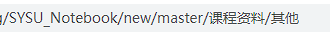
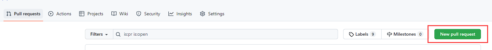
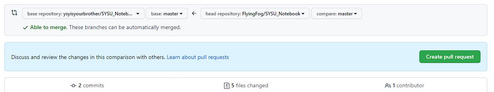

## 贡献方式

推荐使用PR方法提交贡献。也可以通过邮件形式联系管理员，并由仓库管理者帮助上传分享文件后将你添加为contributor。

### 1 fork本仓库

	

Fork后在你自己的仓库列表中可以找到此仓库

### 2 添加文件

**方案一：本地更新后push**

1. 将fork后的仓库（自己的）克隆到本地，可使用git或Github Desktop完成；
2. 根据你的需求添加好对应文件夹和文件；
3. commit and push。

**方案二：在线上传**

	

由于本项目体积很大，完全Clone到本地需要比较长时间。因此可以采取在网页端直接上传的方式：

1. 上传文件到已有文件夹：打开对应文件夹，点击绿色Download按钮旁的upload，上传你的文件。

2. 上传文件到新文件夹：打开任意文件夹，点击绿色Download按钮旁的upload，**把浏览器地址栏中文件夹名称改为你想要新建的文件夹名称，然后回车**，上传你的文件。

   例如：浏览器地址修改为	

### 3 提交Pull Request（PR）

1. 打开自己fork的本仓库；

2. 点击pull request，选择new request；

   	

3. 发起一个PR即可。

   

PR发起后，Github会邮件通知仓库管理者合并你的PR
