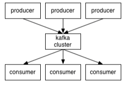
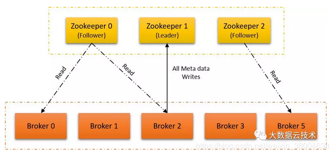
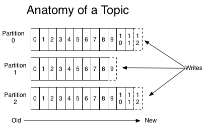
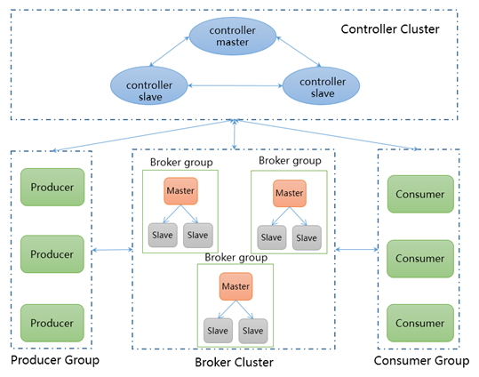

## kafka基本原理初探

### 一、kafka背景

Kafka是最初由Linkedin公司开发，是一个分布式、支持分区的（partition）、多副本的（replica），基于zookeeper协调的分布式消息系统，它的最大的特性就是可以实时的处理大量数据以满足各种需求场景：比如基于hadoop的批处理系统、低延迟的实时系统、storm/Spark流式处理引擎，web/nginx日志、访问日志，消息服务等等，用Scala和Java语言编写，Linkedin于2010年贡献给了Apache基金会并成为顶级开源项目。

### 二、kafka基本原理

#### 1. 基础架构

kafka和传统的MQ一样，由producer，broker和consumer组成：

kafka的核心架构图如下所示：

##### 1.1 ZooKeeper

ZooKeeper是一种用于管理分布式系统的集中式服务。它为其管理的分布式系统提供分层键值存储，配置，同步和名称注册服务。从ZooKeeper节点列表中，其中一个节点被选为leader，其余节点follow领导者。在ZooKeeper节点发生故障的情况下，其中一个follower被选为leader。

一个broker是由ZooKeeper管理的单个Kafka节点，一组brokers组成了Kafka集群。

##### 1.2 topic-part

消息队列的一个核心概念是topic，生产者往topic里写入消息，消费者从topic中读出消息。如果只有单个topic用来读写容易受到性能瓶颈的限制，因此一个topic又划分为多个partition，可以通过增加partition来实现扩容。单个partition是保证消息有序的。

producer端发送的message必须指定是发送到哪个topic，但是不需要指定topic下的哪个partition，因为kafka会把收到的message进行负载均衡，利用哈希函数均匀的分发在不同的partition上。每个Topic是有多个Partition组成的每个Partiton里的位置就是一个Message每个partition在存储层面是append log文件。任何发布到此partition的消息都会被直接追加到log文件的尾部，每条消息在文件中的位置称为offset（偏移量）。消费者消费的时候根据offset去消费，同时消息被消费后并不会立刻消失，需要保留一段预先设定的时间后才会被删除。

每个partition可以在其他的kafka broker节点上存副本，以便某个kafka broker节点宕机不会影响这个kafka集群。存replica副本的方式是按照kafka broker的顺序存。例如有5个kafka broker节点，某个topic有3个partition，每个partition存2个副本，那么partition1存broker1,broker2，partition2存broker2,broker3，以此类推。这样如果某个broker宕机，其实整个kafka内数据依然是完整的，replica副本数越高，系统虽然越稳定，但是回来带资源和性能上的下降；replica副本少的话，也会造成系统丢数据的风险。

##### 1.3 consumerGroup

消费同一个topic的consumer会组成一个group。通常，每个不同group一般对应不同的业务逻辑，同一个服务往往会有多台服务器运行，它们共同组成一个group。

kafka中一个parititon只能被每个Group中的一个consumer线程去消费，也就是说，如果一个partition被group1中的consumer1去消费了那么其中的consumer2就不能去消费。如果你想多个consumer去消费，只能再去开一个group。这是因为每个group下的所有consumer通常处理的是同一份业务逻辑，如果两个consumer同时消费一个partition，就会出现竞争，因为如果重复消费了相同的消息，就会互现业务上的逻辑错误。原本的partition效率很高，是因为他是串行服务的，但是现在出现了竞争就需要加锁，就会导致性能降低。因此kafka只允许同一个consumer group下的一个consumer线程去访问一个partition。如果这时候还觉得效率不高的时候，可以加partition的数量来横向扩展，同时扩展consumer线程的数量。

每个partition只能被一个consumer消费就可能出现三种情况：

- consumer数量与partition数量刚刚好，那么每个consumer线程就会去消费一个partition
- 如果consumer数量小于partition，那么，其中某个/某些 consumer就会去消费多个partition。一个consumer可以消费多个partition，但是一个partition只能被一个consumer消费。
- 第三种情况，consumer数量多于partition数量的时候，会有consumer空闲出来

因此通常来讲，要让他们的数量相同。如果效率不高的话，横向拓展，同时增加partition和consumer的数量。

##### 1.4 consumer

consumerGroup中包含着很多的consumer。它们顺序读取partition中的消息并进行业务逻辑的处理。为了防止它们重复读取相同消息，会有一个offer指针来记录当前读取的位置。offset是存在zookeeper中的，由zk统一管理。Kafka提供了两套consumer api，有high level api，替我们把很多事情都干了，offset，路由啥都替我们干了，用以来很简单。还有simple api，offset啥的都是要我们自己记录。

consumer有个enable.auto.commit的属性，是读自动提交，默认true。还有auto.commit.interval.ms，默认是5s。因为就是说每5秒，使用者将向kafka提交其偏移量，或者每次从指定主题中提取数据时，都将提交最新的偏移量。这里有个问题就是拿到了这个offset的数据，还没来得及消费，然后这个consumer挂了，但是offset已经提交上去了。这时，这个message基本就已经废了，所以如果想避免这种情况，可以直接把enable.auto.commit设置为false，那么就是消费完这个message才会去commit offset。但是，这样的话 consumer响应就会比较慢。

##### 1.5 producer

Producer创建一条记录，记录中一个要指定对应的topic和value，key和partition可选。 先序列化，然后按照topic和partition，放进对应的发送队列中。它有三种发送的方式：

1. 同步发送：等待接收方响应后才去发送下一个
2. 异步发送：不等待接收方响应，直接继续放松。
3. 批量发送：在异步发送模式下，将消息缓存到内存里，然后一次性发送出去。这其中有个非常重要的参数“acks”,这个参数决定了producer要求leader partition 收到确认的副本个数，如果acks设置数量为0，表示producer不会等待broker的响应，所以，producer无法知道消息是否发送成功，这样有可能会导致数据丢失，但同时，acks值为0会得到最大的系统吞吐量。若acks设置为1，表示producer会在leader partition收到消息时得到broker的一个确认，这样会有更好的可靠性，因为客户端会等待直到broker确认收到消息。若设置为all（以前的版本是设置为-1，后来是all），producer会在所有备份的partition收到消息时得到broker的确认，这个设置可以得到最高的可靠性保证。

#### 2. kafka容灾与一致性

##### 2.1 leader选举方式

Kafka容灾主要依赖于Replication机制，Replication可以在server的配置文件中去配置。通常来讲，broker的个数是至少大于Replication的。其实在一个集群中，broker的个数一般是和最大的Replication个数齐平的。

如果leader挂了，需要在followers中选择一个新的leader。但是followers本身是可能有问题的，follower可能“落后”或者follower也挂了，所以必须选择高质量的follower作为leader。必须保证，一旦一个消息被提交了，但是leader挂掉了，新选出的leader必须可以提供这条消息。大部分的分布式系统采用了多数投票法则选择新的leader，对于多数投票法则，就是根据所有副本节点的状况动态的选择最适合的作为leader。但kafka并不用这种方法。

kafka中存在一个东西叫ISR，他是指一组已经和leader进行了同步的副本。kafka维护这一个ISR队列，在这个队列中，follower是和leader保持高度一致的，强同步情况下，任何一条消息必须被这个集合中的每个节点读取并追加到日志中了，才会通知外部这个消息已经被提交了。因此这个集合中的节点是最优先考虑容灾的。想要一个数据都不丢失，acks必须设置为all。ISR中有n+1个节点，就可以允许在n个节点挂掉的情况下不会丢失消息并正常提供服务。

不过这又存在一个问题，虽然概率很小，但假如集群中所有节点全部都宕机了怎么办？一般有以下两种策略：

1. 等待ISR中的任何一个节点恢复并让它成为leader。这种方法可以保证消息不丢失或丢失数量很少，但是不确定ISR的机器什么时候能恢复，集群会比较长时间无法使用。
2. 选择所有节点中（不只是ISR）第一个恢复的节点作为leader。不过如果选中的不是ISR中的节点，就会出现数据丢失较多的问题。

##### 2.2 Leader与副本同步

对于某个分区来说，保存正分区的broker为该分区的leader，保存备份分区的broker为该分区的follower。备份分区会完全复制正分区的消息，包括消息的编号等附加属性值。为了保持正分区和备份分区的内容一致，Kafka采取的方案是在保存备份分区的broker上开启一个消费者进程进行消费，从而使得正分区的内容与备份分区的内容保持一致。注意，生产者，消费者只与保存主分区的leader进行通信。

### 三、腾讯消息队列hippo

#### 1. 系统简介

hippo的系统架构和kafka基本一致。系统架构图如下：

Hippo系统存在四种角色，分别为生产者（producer）、 消费者（consumer）、存储层（broker）、中心控制节点（controller）

##### 1.1 controller

以组的形势存在，三台controller一主两备组成一个组（主备controller存在心跳检测以便在主故障的时候能够自动failover）承担着整个系统节点数据的收集、状态的共享及事件的分发角色。提供控制台界面，根据当前收集到的正常运行的broker节点信息，可以指定给某个特定的broker组下发topic及queue添加事件。

##### 1.2 broker

以组的形势存在，三台broker一主两备组成一个组，由主broker向controller定期汇报心跳以告知controller当前组的存活状态，心跳携带当前组所管理的topic及queue信息。数据在broker以多副本的方式存储。

##### 1.3 producer

轮询发送，向controller发布某个topic的信息，controller返回相应topic所在的所有broker组对应的IP端口及queue信息。producer轮询所获取的broker组信息列表发送消息并保持与controller的心跳，以便在broker组存在变更时，能够通过controller及时获取到最新的broker组信息

##### 1.4 consumer

- **负载均衡：**每个consumer都隶属于一个消费组（group，group的成员可以理解为一个服务的多台机器），向controller订阅某个topic的消息，controller除了返回相应topic对应的所有broker组信息列表之外还会返回与当前消费者处于同一个组的其它消费者信息列表，当前消费者获取到这两部分信息之后会进行排序然后按照固定的算法进行负载均衡以确定每个消费者具体消费哪个队列分区

- **消费确认：**consumer进行消费的过程中对队列分区是以独占的形式存在的，即一个队列在一个消费组中只能被一个消费者占有并消费，因为要用到偏移量，要把偏移量锁起来，避免一个组内的多个机器同时修改偏移量引发错误。为了保证消费的可靠对于每次拉取的数据，都需要consumer端在消费完成之后进行一次确认，否则下次拉取还是从原来的偏移量开始。
- **限时锁定：**为了使某个consumer宕机其占有的队列分区能够顺利的释放并被其他consumer获取到，需要在每个消费者拉取数据与确认回调之间设置一个超时时间，一旦超过这个时间还没确认，那么队列自动解锁，解锁之后的队列最终能够被别的存活消费者占有并消费。

#### 2. 一些个人使用体会

本人实习期间参与的是腾讯看点部分的业务开发。在本人参与的一个新增业务中，用户可以创建一个话题栏目，其他人可以在这栏目上面去投稿，投稿成功后投稿人会收到系统消息，创建者也会收到系统消息。这种系统消息服务的特点是，这些消息下发的请求量很大，但是业务逻辑十分简单。hippo在公司内部应用十分广泛，并不只是用于我们部门这边的系统消息下发部分：

在开发一般的业务服务的时候，我们通常是去开发rpc服务，服务与服务之间连接成链，前端请求后端逻辑层服务，逻辑层服务再去请求下游数据库接入层，以此类推。这种系统消息下发服务如果开发为rpc的微服务就会存在以下特点：

1. 服务请求方和被请求方必须在线，如果任被请求方一方出现宕机（一般会进行异地部署容灾），请求方就没办法继续逻辑服务。但是事实上，系统消息下发对及时性的要求并不高，并不一定要立刻给用户返回系统消息，可以有一定的延迟。
2. 有rpc服务就会有proto文件，就会有协议和接口，但腾讯那么大，如果每个服务都要建立新的api和协议，如果没有很好的统一管理平台，就会出现重复开发相同业务的冗余现象。
3. 存在请求高峰问题，这种消息下发的服务，很有可能在某个时间点或者活动出现爆发式的增长，这时后台的服务往往就会负载过高。但是一般情况下，他们的请求数量相对比较稳定。

对于这种情况，如果使用了消息队列，就能比较好的处理以上问题，并带来一些优势：

1. 消息队列可以让请求方和接收方解藕。防止引入过多的API给系统的稳定性带来风险，减少协议数量方便管理。而且调用方使用不当会给被调用方系统造成压力，被调用方处理不当会降低调用方系统的响应能力。

2. 消息队列有消息堆积的能力，发送方接收方不需同时在线，遇到活动或者特定时间点请求量激增的时候，发送方接收方不需同时扩容，可以起到削峰的效果。hippo中有kafka那样的容灾和一致性的处理逻辑，因此可以保证消息精确不会丢失，只是有些消息可能会稍微慢一些送达用户的消息盒子中。

3. 请求方和接收方不需要对接api，只需要商量hippo中消息的格式即可，减少了联调时间，提高了整体的开发效率。

4. 对于一般的大数据服务，腾讯内部有一个大数据的平台作为接入层存储，但为了提升它的承载能力和高吞吐性，数据会部分驻留内存，存在丢失的风险。

   对于一些价值和敏感度高的数据，对数据的精确度要求比较高，而hippo的高可靠性高性能就可以为这些业务提供支撑，比如腾讯内部的广告计费，交易支付等板块，都依靠hippo进行。

