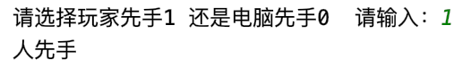
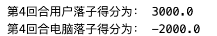
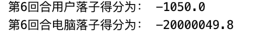

## 人工智能实验 博弈树搜索   

**学号：17341190      专业：计算机科学     姓名：叶盛源**

#### 一、伪代码

博弈树搜索的基础思想是MiniMax的深度优先搜索的策略：

````
DFMiniMax(n,Player)
If n is TERMINAL
	RETURN V(n)
ChildList = n.Successors(Player)
If Player == MIN
	return minimum of DFMiniMax(c,MAX) over c in ChildList
	return maximum of DFMiniMax(c,MIN) over c in ChildList
````

博弈树搜索使用的是alpha-beta剪枝的方法来加快搜索速度。

````
AlphaBeta (n,Player,alpha,beta)
If n is TERMINAL
	retrun V(n)
n.Successprd(Player)
If Player == MAX
	for c in ChildList
		alpha = max(alpha,AlphaBeta(c,Min,alpha,beta))
		If beta<=alpha
			break return alpha
Else If Player == MIN
	for c in ChildList
		If beta<=alpha
			break return beta
````


#### 二、算法实现

##### 评价函数的选择：

对于这种比较专业的棋类运动的评价函数设计，专业性相对比较强，我们需要首先了解一些五子棋常见的进攻和防守的棋形，也就是棋子的摆放方式，最常见的基本棋型大体有以下几种：连五，活四，冲四，活三，眠三，活二，眠二：

**连五**：顾名思义，五颗同色棋子连在一起，


**活四**：有两个连五点（即有两个点可以形成五）


**冲四**：有一个连五点，如下面三图，均为冲四棋型


**活三**：可以形成活四的三


**眠三**：只能够形成冲四的三


 **活二**：能够形成活三的二


**眠二**：能够形成眠三的二


这些大概就是五子棋的一些常见的进攻棋形，下棋过程中，我们更趋向于组成这些形状，而这些形状中，我们更希望能组成活三，活四来赢得比赛，因此不同的棋形对应着当前棋局上的不同得分，我们可以模仿棋形来编写一个评分表：

````python
# 棋型的评估分数
shape_score = [(50, (0, 1, 1, 0, 0)),
               (50, (0, 0, 1, 1, 0)),
               (200, (1, 1, 0, 1, 0)),
               (500, (0, 0, 1, 1, 1)),
               (500, (1, 1, 1, 0, 0)),
               (5000, (0, 1, 1, 1, 0)),
               (5000, (0, 1, 0, 1, 1, 0)),
               (5000, (0, 1, 1, 0, 1, 0)),
               (5000, (1, 1, 1, 0, 1)),
               (5000, (1, 1, 0, 1, 1)),
               (5000, (1, 0, 1, 1, 1)),
               (5000, (1, 1, 1, 1, 0)),
               (5000, (0, 1, 1, 1, 1)),
               (50000, (0, 1, 1, 1, 1, 0)),
               (99999999, (1, 1, 1, 1, 1))]
````

有了评分的函数后，我们就可以编写一个对当前棋局计算得分的函数。我们分别计算玩家得分和AI的得分，因为玩家是极大节点，而AI是极小节点，因此我们最后返回一个玩家得分减去AI得分的值。

**这里有个细节**，我们需要给AI得分乘一个小于1的系数，因为如果博弈是一人一步的，这种统计棋局的方法是统计当前棋局的得分，让AI得分相对较小一些，才能让AI更趋于去防守，否则有可能会出现AI以攻为守的情况出现，但如果下一步是人下，人就取胜了。所以要乘上一个系数，我这里乘了0.1

````
return Man_score - AI_score*0.1
````

之后我们就需要编写计算得分的函数，我们分别遍历用户和电脑的每个棋子，然后再分别遍历他们的4个方向，收集棋子的形状，我们收集的时候要收集包含目标棋子在内的六个棋子，

````python
# 在落子点 左右方向上循环查找得分形状
    for offset in range(-5, 1):
        # offset = -2
        pos = []
        for i in range(0, 6):
            if (m + (i + offset) * x_direct, n + (i + offset) * y_direct) in enemy_list:
                pos.append(2)  # 敌人的标记2
            elif (m + (i + offset) * x_direct, n + (i + offset) * y_direct) in my_list:
                pos.append(1)  # 自己的标记1
            else:
                pos.append(0)  # 空的标记0
        tmp_shap5 = (pos[0], pos[1], pos[2], pos[3], pos[4])
        tmp_shap6 = (pos[0], pos[1], pos[2], pos[3], pos[4], pos[5])
````

同个方向上可能有多个棋形，我们只留下得分最高的棋形，然后我们要把这个棋形保存下来，防止重复计算了这个棋形

````python
for (score, shape) in shape_score:
  if tmp_shap5 == shape or tmp_shap6 == shape:
    if score > max_score_shape[0]:
      max_score_shape = (score, ((m + (0 + offset) * x_direct, n + (0 + offset) * y_direct),
                                 (m + (1 + offset) * x_direct, n + (1 + offset) * y_direct),
                                 (m + (2 + offset) * x_direct, n + (2 + offset) * y_direct),
                                 (m + (3 + offset) * x_direct, n + (3 + offset) * y_direct),
                                 (m + (4 + offset) * x_direct, n + (4 + offset) *y_direct)),
                         				 (x_direct, y_direct))
````

最后，在我们下五子棋的时候，我们会发现，如果我们有一步可以让两个活3形成，这一步的威胁不亚于活4，因此我们需要考虑同时形成多个威胁形状的情况，我们遍历已计算的棋形，如果已有棋形和当前讨论的棋形有重合的点，我们就把已有棋形的得分加在当前讨论电商，相当于得分的翻倍。

````python
# 计算两个形状相交， 如两个3活 相交， 得分增加 一个子的除外
    if max_score_shape[1] is not None:
        for item in score_all_arr: # 查看别的方向上的得分形状
            for pt1 in item[1]:
                for pt2 in max_score_shape[1]:  # 如果存在两个得分形状有点重合
                    if pt1 == pt2 and max_score_shape[0] > 10 and item[0] > 10:
                        add_score += item[0] + max_score_shape[0]  # 将重合的形状得分翻倍

        score_all_arr.append(max_score_shape)
````

最后我们就设计出了我们的评价函数，可以调用来获取当前棋局的评分，在下面的剪枝过程中会被调用。


##### Alpha-beta剪枝的实现：

1. 记录Max节点alpha值的变化和Min节点beta值的变化
2. Max节点如果alpha值大于任何祖先Min节点的beta值，就进行alpha剪枝
3. Min节点如果beta值小于任何祖先Max节点的alpha值，就进行beta剪枝。

假设在计算评分的时候，人属于极大节点，AI属于极小节点。因为极大节点和极小节点是完全相反的，所以在写代码的时候需要分成两部分来写，但他们是刚好对称的。

我们首先需要工具函数来判断当前落子是否取胜，需要从8个方向依次搜索，如果遇到连续5个子是本方的棋子时，就停止搜索并返回True，如果不是本方棋子就break并继续搜索另外方向，直到8个方向搜完都没有返回，则返回False

````python
def game_win(point, is_ai):
    '''
    判断上一步下完后是否有一方取胜
    '''
    dir_list = ([(-1, 0), (1, 0)],[ (0, -1), (0, 1)],[ (-1, 1), (1, -1)], [(1, 1), (-1, -1)])  # 记录八个方向
    if is_ai == True:
        mylist = AI_pos
    else:
        mylist = Man_pos
    for dir_pair in dir_list:
        seq = 1
        for dir in dir_pair:
            cur = point
            while ((cur[0] + dir[0], cur[1] + dir[1]) in mylist) and row > cur[0] and cur[0]>= 0 and col > cur[1] and cur[1]>= 0:
                seq += 1
                if seq >= 5:
                    return True
                cur = (cur[0] + dir[0], cur[1] + dir[1])
    return False
````

我们使用递归的方式来实现剪枝。在函数的开头，我们需要判断当前的棋局是否是有一方获胜，或者是否达到了我们的搜索深度，如果是的话我们就不继续进行这个节点的搜索，而是立刻回溯，并返回当前棋局的评分。

````python
if game_win(last_step, True) or depth == 0:
    return evaluation(), (-1, -1)
````

因为我们需要得到当前结点的minimax后的得分，也需要知道最优情况下是走哪个位置，所以每次我们要同时返回两个值，一个是得分，一个是位置。这里因为是最终结点了，所以位置默认设置为-1。

之后我们需要调用工具函数，来获取所有可以下落棋的位置

````python
def get_available_pos():
    return ChessBoard - All_pos
````

其中ChessBoard是整个棋盘上所有可以落子的位置，而All_pos是当前棋局双方下落的所有位置，求两个集合的差集就可以得到可以落子的位置。

之后我们遍历所有可以落子的位置，为了加快搜索速度，对于周围没有子的的落点都不考虑搜索。这个方法可能没有很好的理论依据，会导致棋子的智能有一定的下降，但对于加快搜索速度来说有很显著的效果。

````python
def has_neighbour(point):
    '''
    判断点四周是否有棋子，如果都没有就不考虑这个点，加快搜索速度
    '''
    for i in [-1, 0, 1]:
        for j in [-1, 0, 1]:
            if i == 0 and j == 0:
                continue
            if (point[0] + i, point[1] + j) in All_pos:
                return True
    return False
````

对每个位置，我们使用深度优先的递归策略来搜索，将他们加入到棋局的队列中，然后递归调用对方的函数，比如如果是AI就调用MiniMax，如果是人就要调用MiniMin。并将子结点的得分和当前的结点的alpha(beta)比较，如果较大（较小）就替换原来的alpha(beta)值。

之后我们可以进行alpha和beta的剪枝，我们有个参数记录了当前结点的所有祖先结点中，alpha(beta)值最大（最小）的，如果满足了当前alpha大于了祖先beta值或者祖先alpha大于当前beta值的条件（对alpha和beta剪枝都适用）就进行剪枝。其中极大节点的alpha剪枝如下实现：

````python
def MiniMax(last_step, depth, max_alpha, min_beta):
    # 极大节点 人走
    if game_win(last_step, True) or depth == 0:
        return evaluation(), (-1, -1)
    cur_max_alpha = float('-inf')  # 设定alpha为无穷小
    cur_best_pos = (-1, -1)
    available_pos = get_available_pos()  # 获取可以走的位置tuple
    for pos in available_pos:
        if not has_neighbour(pos):  # 不考虑周围没有棋子的位置，加快搜索速度
            continue
        Man_pos.add(pos)
        All_pos.add(pos)
        cur_alpha, _ = MiniMin(pos, depth - 1, max_alpha, min_beta)

        if cur_max_alpha < cur_alpha:
            cur_max_alpha = cur_alpha
            cur_best_pos = pos

        Man_pos.remove(pos)
        All_pos.remove(pos)

        if cur_max_alpha > min_beta:  # alpha 剪枝
            return cur_max_alpha, cur_best_pos

        # 如果要继续搜索，查看是否需要更新当前最大的alpha值
        if cur_max_alpha >= max_alpha:
            max_alpha = cur_max_alpha

    return cur_max_alpha, cur_best_pos
````


#### 棋盘绘制和交互：

实现完alpha和beta剪枝之后，就可以运行了，我使用了在网上参考了他人实现的python五子棋游戏的绘图库`graphics`来实现人机交互。

首先这个库可以让我们画出五子棋的网格状棋盘，只需要设定好棋盘的大小：

````
win = GraphWin("gobang game by ysy", GRID_WIDTH * col, GRID_WIDTH * row)
    win.setBackground("grey")
````


绘制好图像之后再绘制棋子，通过circle的函数来绘制一个圈并给他上黑白色：

````python
piece = Circle(Point(GRID_WIDTH * a2, GRID_WIDTH * b2), 16)
piece.setFill('black')
````


下棋时通过点击棋盘上的位置来选择下的位置，选择最靠近的那个可以下的点：

```python
if not ((round((p2.getY()) / GRID_WIDTH), round((p2.getX()) / GRID_WIDTH)) in All_pos):
    a2 = round((p2.getX()) / GRID_WIDTH)
    b2 = round((p2.getY()) / GRID_WIDTH)
```

 

下面展示连续多个回合后的棋局分布和每步落子后的评分：


其中黑色是我，白色是电脑，此时电脑是劣势，所以负分不是特别小，而玩家正分较大。再继续下两步：


此时AI逆转棋局，四颗棋子连在了一起，可以看到此时人处于了劣势状态，得分已经变成了负数，而电脑在下完第八步后分数已经得到了六万多的负分，此时AI已经掌握了胜局。


#### 三、实验结果展示：

实验要求从一个特定的棋局开始展示3个回合内双方的落子和得分：



##### 第一回合：


##### 第二回合：


##### 第三回合


##### 第四回合





##### 第五回合


##### 第六回合





#### 四、实验过程的发现和思考：

##### 关于评价函数的设计：

本次实验要求设计一个五子棋。其实最难的部分并不是剪枝，而是如何设计一个好的评价函数。这其实是涉及了五子棋的比较深入的领域了，并不能简单的设计，在一开始，我自己尝试设计的评价函数大多数统计有多少三子连续四子连接数量来计算总分，但效果并不好，于是上网学习了很多别人的评价函数设计方法，才学会了使用一些不同的棋形来统计分数，当然这种方法也有它的缺陷性，但效果已经比原来自己编写的人工智障效果要好很多，如果可以考虑更多的棋形或者进一步细化得分，可能可以去的更好的效果。

这样可以见的，对于博弈树搜索和A*搜索一样，他们难点并不在于搜索的过程，而是评价函数和启发式函数的设计，这也是这些新的搜索算法能归于人工智能算法的原因。


##### 关于alpha-beta剪枝

在实验过程中，因为有PPT上很详细的讲解和伪代码的分析，所以编写代码并没有遇到很多问题，但是写出来是个智障，在开始的时候还正常，到了快要取胜的时候，AI就会放弃已经连好的3子甚至4子，跑去别的地方落子。这种递归的树特别难找问题，只能一点点输出调试，终于发现了问题：alpha-beta剪枝的时候，如果此时是Min结点，如果探寻结点返回值小于或者等于当前最小beta值时发生替换，就需要alpha值严格大于beta值才剪枝。举个例子说明：


下图中AC是极小节点，而B是极大节点，若A在探寻B前的beta=-20，而B在搜索c后，c返回的值alpha=-20，此时如果因为B(alpha)>=A(beta)就进行剪枝，那么B返回值是-20，则A原来的下一个最优点就会变成B，但其实B的子结点中是有可能存在大于-20的节点值，所以如果探寻完，极大节点B的alpha并不是-20，可能更大，因此B并不是A的下一个最优点，此时就会出现问题。


##### 关于五子棋的debug：

因为出现了上述问题，而一开始对递归和树结构的debug方法并不是很熟练，因此只能输出调试，经常要看很大量的输出。后面发现了一种比较快捷的方法就是输入棋谱的方法，其实就是将出问题的棋局的所有步骤记录下来，将所有棋子除了有问题的添加进棋局的list中，然后从这里开始复盘输出debug，就能加快进度，并不是很特别的方法，只是在实验中发现的小技巧。