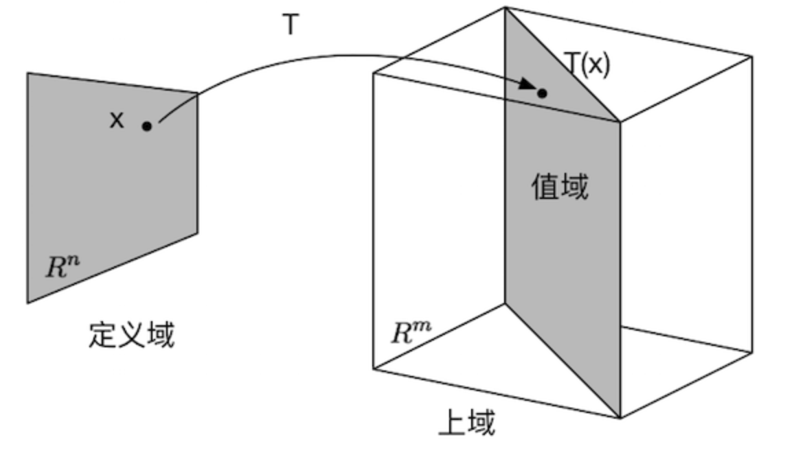

## 线性代数

1. 线性方程组的解：

   无解形式：增广矩阵存在$[0,0,0,...,b]$的形式，方程组无解

   有解：增广矩阵不存在$[0,0,0,...,b]$的形式，方程组有解

   - pivot position是进行行化简后每一行第一个非0的位置，包含pivot postion的列是pivot column

   - pivot position上的变量的是基础变量，其他的是自由变量，基本变量需要通过自由变量表示
   - 当增广矩阵的行最简形式**不存在自由变量**时，方程组有唯一解
   - 当增广矩阵的行最简形式**存在自由变量**时，方程组有无穷多解

   另一种理解：

   方程$Ax=b$有解当且仅当$b$为$A$中各列的线性组合。A中各列组成的线性空间$span\{a_1,a_2,...,\}$，也就是说b是否在这个线性空间中

2. 齐次线性方程组

   形如$AX=0$的线性方程组就是齐次线性方程组，其中$X=0$是平凡解。

   - 化简增广矩阵后，如果没有自由变量，则只有平凡解
   - 若解集中有p个自由变量，则解空间为m维空间中，p个自由变量张成的空间

3. 列空间

   矩阵$A$的各个列向量线性组合组成的集合，就是$A$的列空间$span\{a_1,a_2,...,\}$

   **矩阵的秩说明了这个矩阵的列向量最多能张成多少维**

   **初等行变换不会改变列之间的线性关系**。因此存在自由变量意味着矩阵A的各列是线性相关的，也就是不满秩的

   要找列空间的basis，就取pivot position所在的列即可

4. 零空间

   齐次方程$AX=0$的全部解组成的集合，称为矩阵$A$的零空间，记为$NulA$

   基本变量+自由变量等于变量数  $RankA+dim\ NulA=n$

   当A中的各列线性无关，则说明$AX=0$只有平凡解。

   各列线性相关（多列线性组合组成其中一列），则存在非平凡解。等价于行化简后存在自由变量

5. 线性变换

   把矩阵A看作一个整体，他将向量x进行一个线性变换变成了另外一个向量b。此时A**就相当于一个从一个向量集映射到另一个向量集的函数**

   

6. 可逆矩阵

   首先，并不是所有的方阵都有逆；而如果逆存在，则有$A^{−1}A=I=AA^{−1}$

   初等矩阵=把单位矩阵进行一次行变换，因此所有行操作都可以写成一个初等矩阵$\times A$

   因此$A^{−1}A=I$可以看作很多初等矩阵聚合而成的$A^{-1}$对A进行行操作得到$I$。

   得：**$A$可逆当且仅当A行等价于$I$**

   有可逆矩阵的算法：$[A, I]\rightarrow[I,A^{-1}]$

7. 行列式

   行操作对行列式影响：

   1. 一行加倍后加到另一行上，det不变
   2. 行交换，det变为负数
   3. 某行乘K后，det变为K倍

   因此一个方阵可逆，则行列式不等于0。因为它等价于单位阵，单位阵的det不为0.

8. 特征值和特征向量

   对于特征值$\lambda$，方阵A的特征向量是一个非零的向量x满足$Ax=\lambda x$

   一般解法为：$(A-\lambda)x=0$，要求这个齐次方程组存在非平凡解，也就是特征值为0。因此对矩阵$A-\lambda$进行行化简后，对角线元素要有为0才能满足det=0。

   特征值可以应用于矩阵的对角化，方便矩阵的乘方运算

