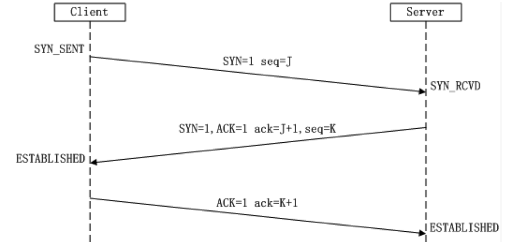
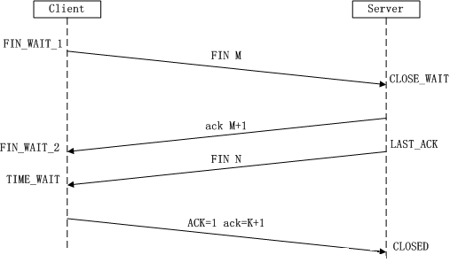

## 计算机网络

1. TCP和UDP区别

   - TCP是可靠的，UDP不可靠
   - TCP面向连接，UDP不需要连接
   - TCP是字节流，UDP是报文

2. 三次握手

   

   - 第一次握手：Client将SYN置1，随机产生一个初始序列号seq发送给Server，进入SYN_SENT状态；
   - 第二次握手：Server收到Client的SYN=1之后，知道客户端请求建立连接，将自己的SYN置1，ACK置1，产生一个acknowledge     number=sequence number+1，并随机产生一个自己的初始序列号，发送给客户端；进入SYN_RCVD状态；
   - 第三次握手：客户端检查acknowledge number是否为序列号+1，ACK是否为1，检查正确之后将自己的ACK置为1，产生一个acknowledge     number=服务器发的序列号+1，发送给服务器；进入ESTABLISHED状态；服务器检查ACK为1和acknowledge     number为序列号+1之后，也进入ESTABLISHED状态；完成三次握手，连接建立。

3. 四次挥手

   

   - 第一次挥手：Client将FIN置为1，发送一个序列号seq给Server；进入FIN_WAIT_1状态；
   - 第二次挥手：Server收到FIN之后，发送一个ACK=1，acknowledge     number=收到的序列号+1；进入CLOSE_WAIT状态。此时客户端已经没有要发送的数据了，但仍可以接受服务器发来的数据。
   - 第三次挥手：Server将FIN置1，发送一个序列号给Client；进入LAST_ACK状态；
   - 第四次挥手：Client收到服务器的FIN后，进入TIME_WAIT状态；接着将ACK置1，发送一个acknowledge     number=序列号+1给服务器；服务器收到后，确认acknowledge     number后，变为CLOSED状态，不再向客户端发送数据。客户端等待2*MSL（报文段最长寿命）时间后，也进入CLOSED状态。完成四次挥手。

   为什么不能把服务器发送的ACK和FIN合并起来，变成三次挥手：

   因为服务器收到客户端断开连接的请求时，可能还有一些数据没有发完，这时先回复ACK，表示接收到了断开连接的请求。等到数据发完之后再发FIN，断开服务器到客户端的数据传送。

4. 什么是滑动窗口协议

   防止发送方发送速率太快，接收方缓存区不够导致溢出。接受窗口的大小是根据自己的资源情况动态调整的，在返回ACK时将接受窗口大小放在TCP报文中的窗口字段告知发送方

   

