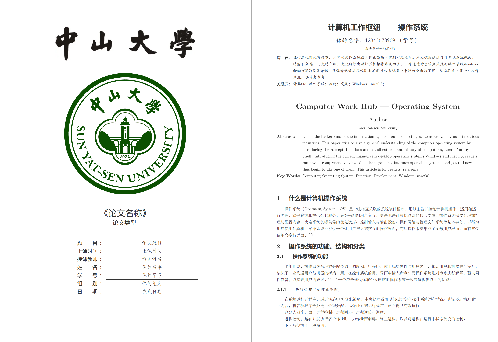

# 中山大学 Typora 伪装 Latex 实验报告模板

本仓库提供的中山大学实验报告模板基于[Keldos-Li](https://github.com/Keldos-Li)/**[typora-latex-theme](https://github.com/Keldos-Li/typora-latex-theme)**，该模板将Typora伪装成LaTeX的中文样式主题。本仓库只是为中山大学的同学们分享该模板及其使用方式，并提供了合适的校徽、校名logo等图片资源。

# 下载与安装

下载和安装方式请参考[模板提供仓库](https://github.com/Keldos-Li/typora-latex-theme)。

# 模板预览

