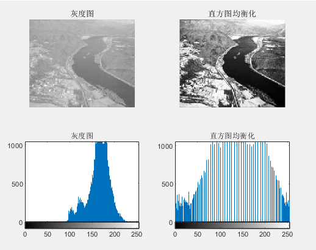
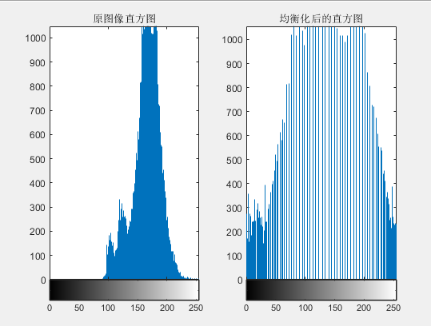
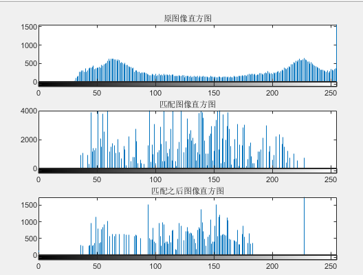

### 数字图像处理作业

17341190   叶盛源   计算机科学专业

#### 问题一

直方图均衡的原理其实就是利用面积相等的原理。要将一个图片进行直方图均衡，先对连续的值积分或对离散的像素累加，令相同的灰度值处到灰度值为0时的积分（累加和）等于到相同位置的均匀分布的积分（累加和），于是可以得到离散的直方图均衡的映射公式：
$$
f(D_A)=\frac{L}{A_0}\sum^{D_A}_{u=0}H_A(u)
$$
下面是算法实现的分析讲解:

首先需要读取灰度图像的灰度值，并先把原图画出来

```matlab
fx = imread('river.jpg');
```


接着统计每个像素出现的次数：

```MATLAB
cum = zeros(1, 256);
for i = 1 : R
    for j = 1 : C
        cum(fx(i, j) + 1) = cum(fx(i, j) + 1) + 1;
    end
end
```


然后计算累积的频次，然后除以总的像素数量乘上灰度数，得到映射的灰度值结果

```matlab
cum = double(cum);
% 求累计概率，得到累计直方图
for i = 2 : 256
    cum(i) = (cum(i - 1) + cum(i));
end
 
for i = 1 : 256
    cum(i) = cum(i)/(R*C) * 255;
end

% 映射
fy = double(fx);
for i = 1 : R
    for j = 1 : C
        fy(i, j) = cum(fy(i, j) + 1);
    end
end
```


最后绘制的图像对比如下：




使用库函数调用后的结果相同：




#### 问题二

第二个作业是直方图的匹配。直方图匹配的方法需要依靠直方图均衡的算法。我们需要先把原图和要匹配的图都进行直方图均衡操作，然后求出匹配图直方图均衡的反函数，用这个反函数作用在原图的直方图上，进行直方图的匹配。
$$
f(D_A)=\frac{L}{A_0}\sum^{D_A}_{u=0}H_A(u)
$$

$$
g(D_C)=\frac{L}{A_0}\sum^{D_C}_{u=0}H_C(u)
$$

$$
D_c=g^{-1}(\frac{L}{A_0}\sum^{D_A}_{u=0}H_A(u))
$$

下面进行代码分析：

首先读取两张图片，并使用cumsum函数进行累加计算

```matlab
% 读取图片并得到灰度图
Origin      = imread('EightAM.png');
Refer   = imread('LENA.png');
histO    = imhist(Origin);          
histRefer = imhist(Refer);

% 使用cumsum函数计算累积和
cum_sum_O     = cumsum(histO) / numel(Origin);
cum_sum_R  = cumsum(histRefer) / numel(Refer);
```


计算映射关系，cum_sum_O就相当于上面公式的第一条，因为L都相同所以省略了。而cum_sum_R相当于公式的第二条，然后遍历256个灰度级，先求出每个灰度级对应的原图均衡化的映射值，然后找到要匹配中的最近那个灰度值进行一个反映射：求出最近的灰度值然后找到下标，下标就是它均衡化映射前的灰度值，如代码所示：

```matlab
% 计算映射关系
map  = zeros(1,256);
for idx = 1 : 256
    % 找到和原图均衡化后的每个灰度级
    a=abs(cum_sum_O(idx) - cum_sum_R); % 找和cdf(idx)最接近的灰度值的下标。
    [b,index] = min(a);
    map(idx)    = index-1;
end
 
% 下标是从1到256 灰度级是0到255，因此要加一，同时提取多列
OMatch = map(uint16(Origin)+1);
```


实验结果如下图：




调库后的结果相同：

