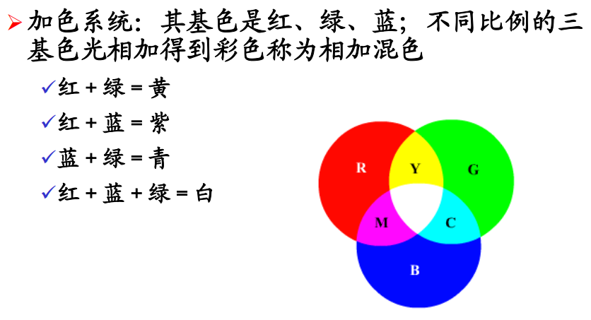
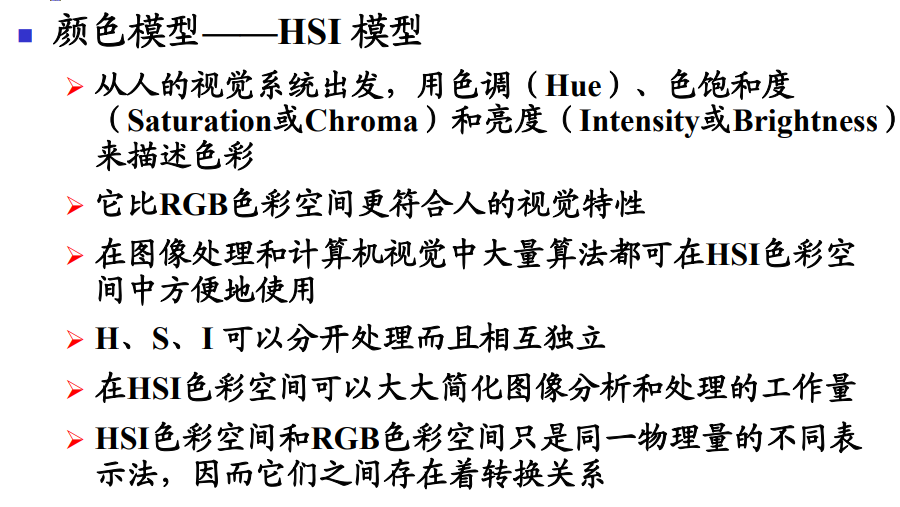
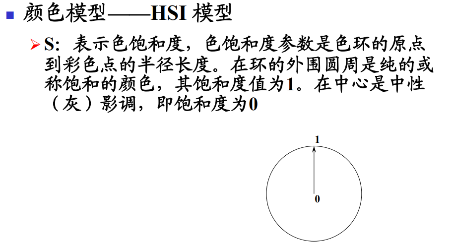
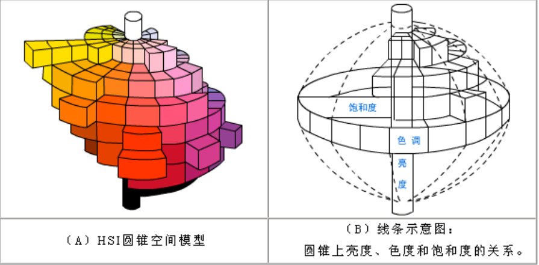
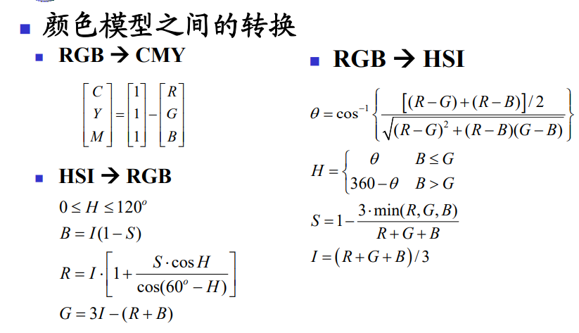
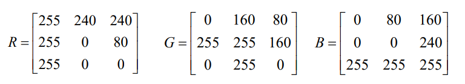
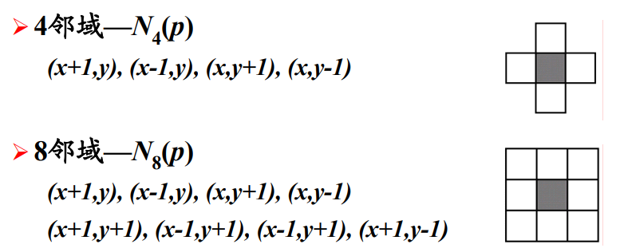
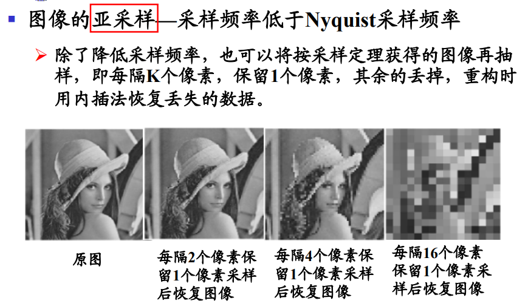
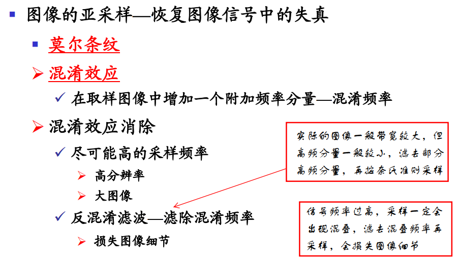

## 第二章

 Author： 中山大学 17数据科学与计算机学院 YSY

 https://github.com/ysyisyourbrother  

## 颜色空间

CMYK和RGB刚好是外圈和内圈对着的交换了位置。

CMYK因为CMY共同混合后产生的黑色不够黑，所以加了一个黑色

**过亮或者过暗的颜色，色饱和度比较低，因此两边是尖的。**

## 图像的表示

### 矩阵表示

### 链表表示

### 像素的邻域

## 图像数字化

### 图像的采样

### 图像亚采样

### 空间分辨率和灰度分辨率

体现显示器区分灰度的能力。灰度分辨率越大，可展现在屏幕上的灰度越多。早期显示器为16色设计，灰度分辨率很低，后来提升到256色，再后来提升到8位、16位和32位，对显示器灰度分辨率要求也越高。由于显示器每种色彩通过红绿蓝通道灰度混合表现，所以显示器区分灰度能力基本决定显示器还原真实色彩的能力。

在数字图像处理教程中，灰度分辨率指的是色阶，色阶是表示图像亮度强弱的指数标准，也就是我们说的色彩指数。灰度分辨率指亮度，和颜色无关，但最亮的只有白色，最不亮的只有黑色。

