# 第十章 图像分割

 Author： 中山大学 17数据科学与计算机学院 YSY

 https://github.com/ysyisyourbrother  

## 间断检测

### 点检测

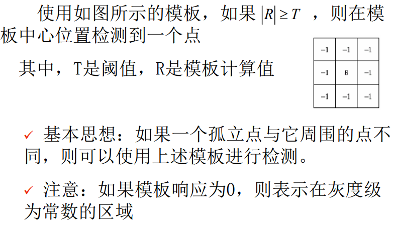

 

### 线检测

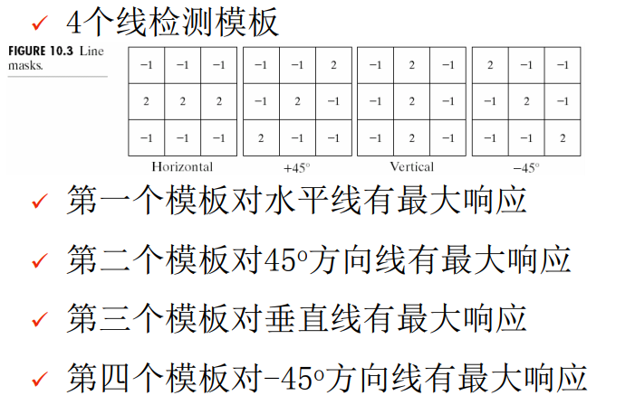

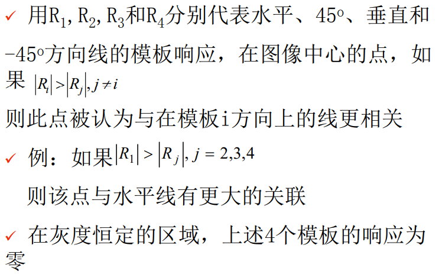

### 边缘检测

#### 一阶算子

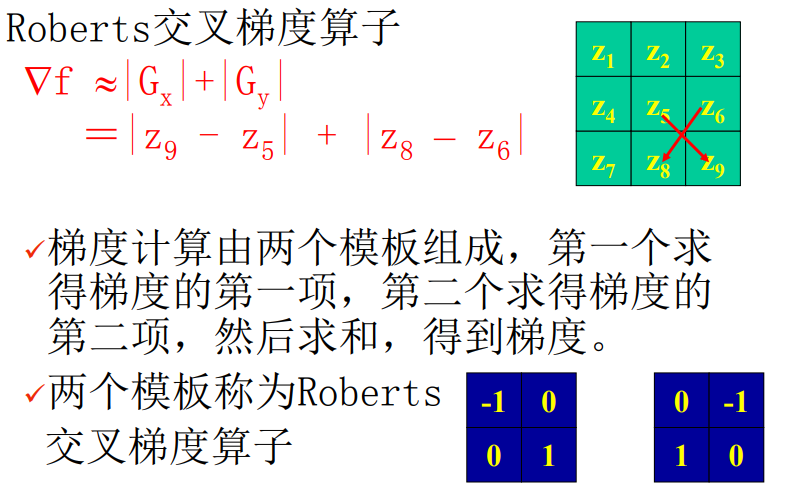

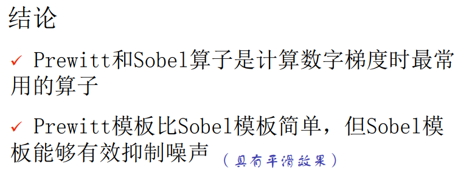

#### 二阶拉普拉斯算子

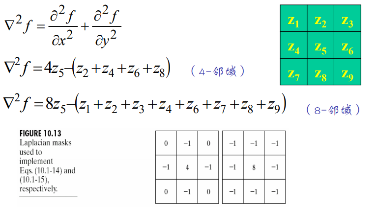

### 高斯拉普拉斯算子 LoG

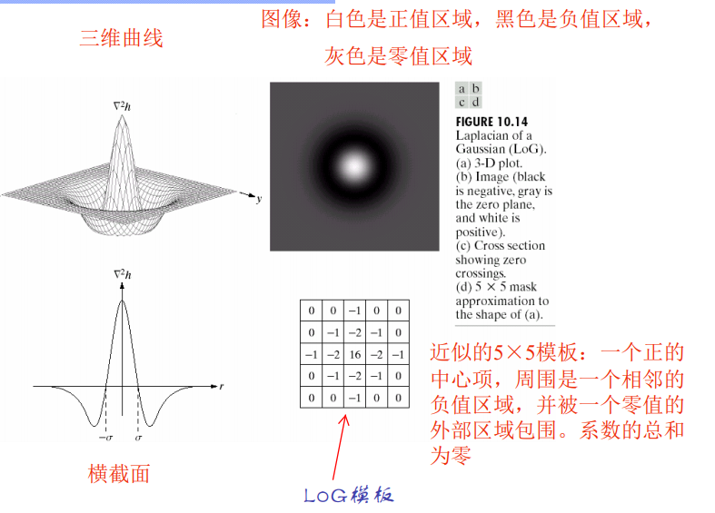

### 霍夫变换 Hough

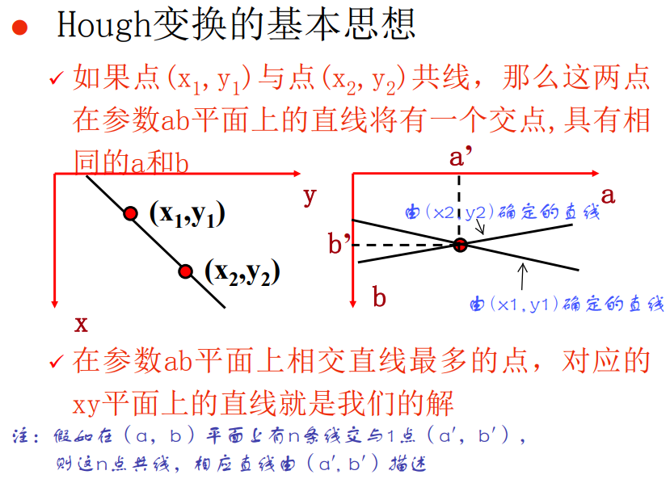

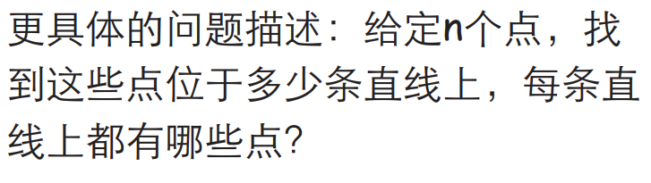

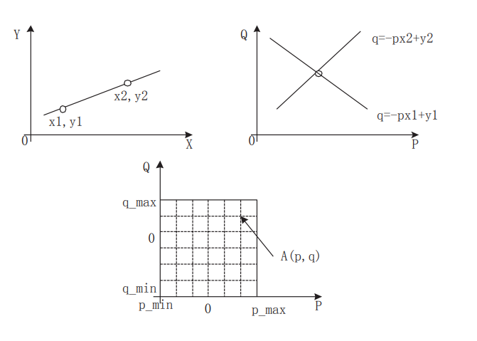

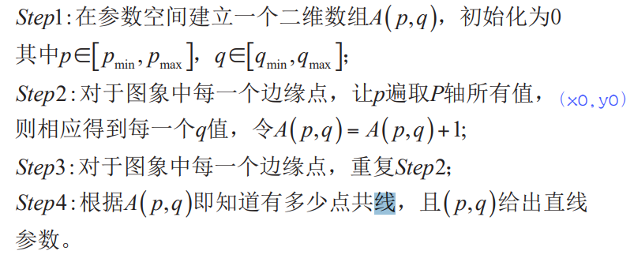

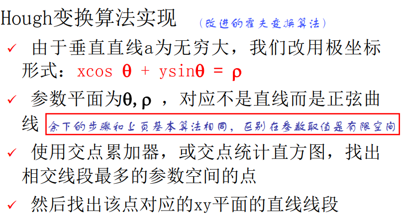

这里用xcos+ysin=p表示固定过某一个点的一条直线，其中角度和p是由这个点的极坐标确定的。

所以过某一个点的所有直线在p和$\theta$的坐标系中是一条直线，然后和上面一样，相交点就是共同的p和$\theta$，就是在同一条直线上。

不过不同于斜率，确定了一个点后，参数p和$\theta$就可以确定了

### 阈值处理

#### 灰度阈值处理基础

全局阈值处理：

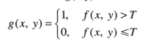

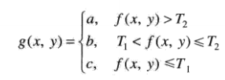

#### 自适应阈值处理

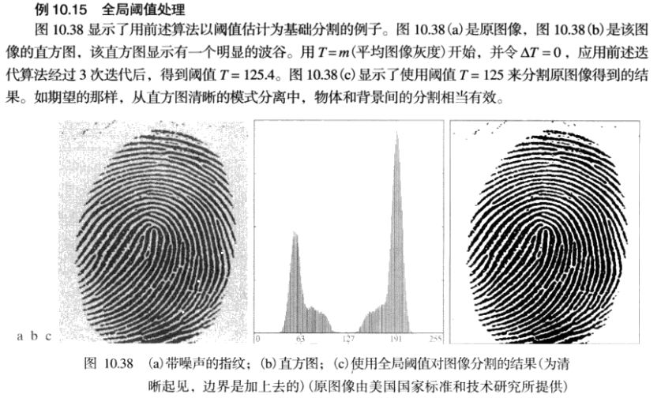 