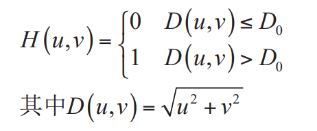
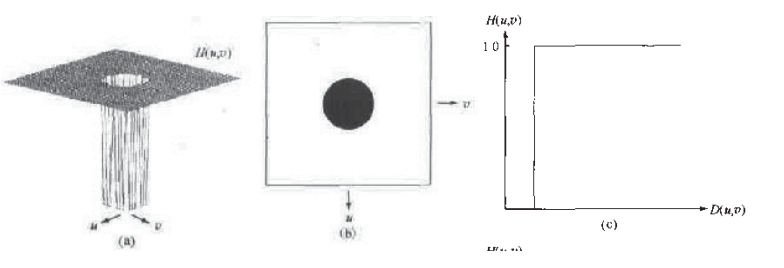
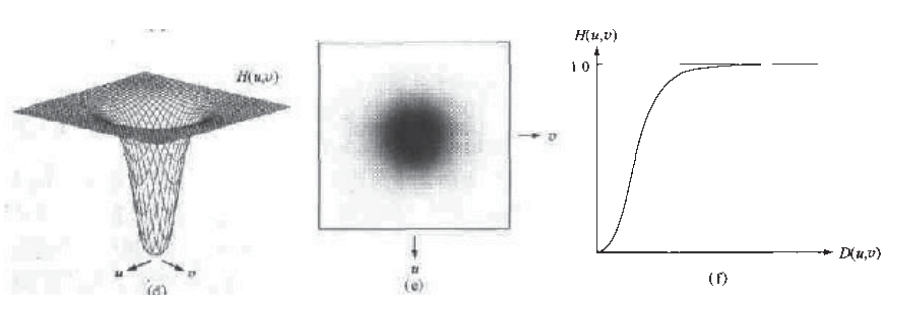
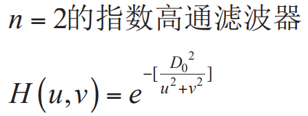
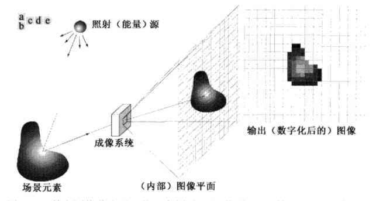
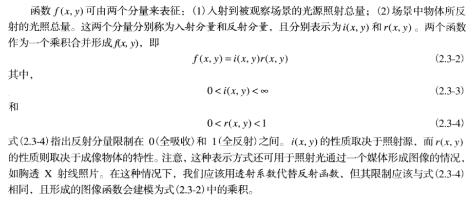
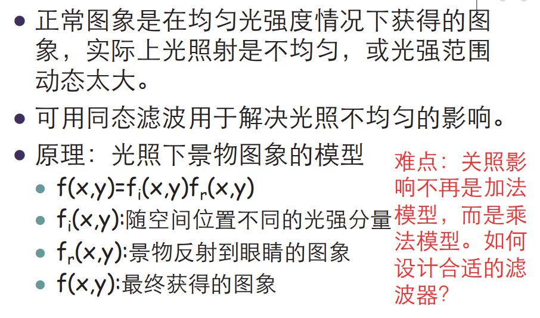
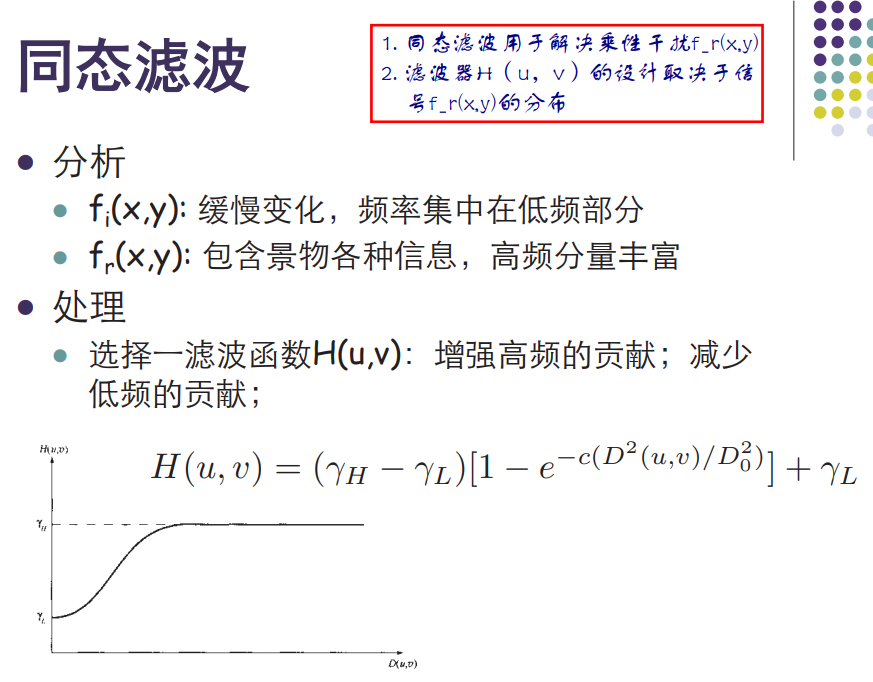

# 第四章 频率域滤波

 Author： 中山大学 17数据科学与计算机学院 YSY

 https://github.com/ysyisyourbrother  

[TOC]

## 低通滤波

## 高通滤波

### 理想高通滤波器IHPF

### 巴特沃斯滤波器BHPF

### 高斯高通滤波器GHPF

彻底解决振铃现象

D0为阈值是一个常数 分母为到中心的距离

## 同态滤波

在图像成像系统中我们看到的图像f(x,y)由两部分组成，一部分是入射光，一部分是反射比例。乘在一起就是最后到达人眼的图像。

入射光线通常变换缓慢，集中在低频，没什么用

反射光线高频分量丰富，表达景物信息，因此可以用高通滤波器

### 应用

