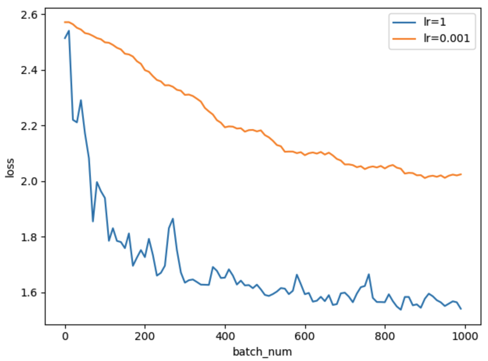
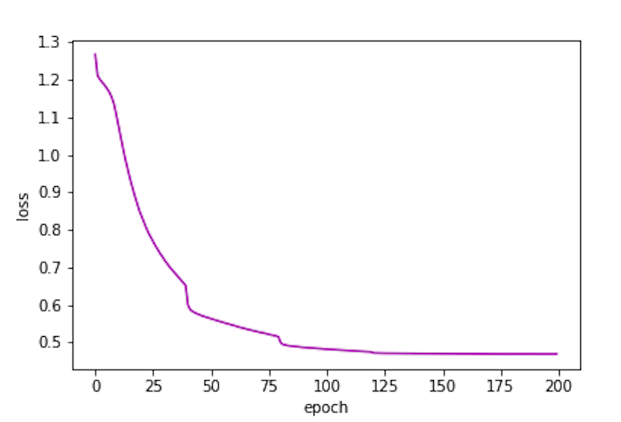
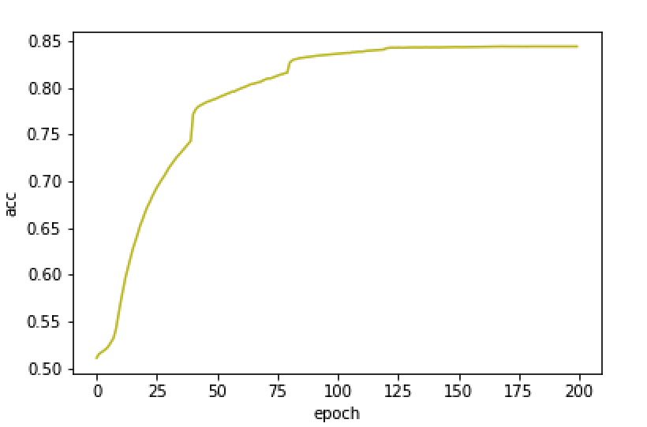

## 智能算法与应用作者报告

<p align="right">———基于LSTM的影评数据情感分类</p>
<center>姓名：叶盛源&emsp; 学号：17341190 &emsp;联系方式：13922191530&emsp;日期：2020-07-12</center>
#### 摘要

本实验完成的是一个情感分类的任务。情感分类顾名思义就是对文章或句子的情感进行分析并将他们分类。评论数据充斥在我们生活中的很多场景，比如外卖的点评，电影的影评等，评论数据会影响着我们对商品的看法和印象，决定我们是否最终购买。评论数据中往往包含着情感，或者是正面或者是负面，利用计算机，我们可以分析大量的评论数据，根据他们的情感分类，对商品的好坏或热门程度作出理性判断。

实验采用基于LSTM神经网络对电影评论进行学习和情感分类。模型由词语嵌入层加上两层的双向LSTM模型组成，使用一层RELU激活层和一层全连接层将数据降维，最后使用softmax和交叉熵进行回归。


#### 一、 导言

情感分析本质上是一个分类问题，但和普通的分类问题相比，它的难度在于如何从文本中对特征进行提取和分析，如何选取出最关键最有意义的特征成为了情感分析发展的关键。本实验采取的LSTM正是对序列输入（如语音、语句等）进行建模分析的模型。它优化了循环神经网络对长序列的梯度消失等问题。对文本、语言等数据有更好的拟合效果。

本实验是在kaggle上的情感分类比赛，原地址为：https://www.kaggle.com/c/sentiment-analysis-on-movie-reviews。题目要求对评论数据进行分析，训练集中每个句子都包含着一个情感标签，分别是：

````
0 - negative
1 - somewhat negative
2 - neutral
3 - somewhat positive
4 - positive
````

测试集是一个只有语料没有情感标签的数据集。我们对训练集训练后，在测试集上进行预测，然后输出到表格中提交到kaggle上打分。

本实验在ipynb上开发测试后再复制到src文件夹中保存文件，可以直接查看ipynb来查看代码和模型.


#### 二、 实验过程

##### 1. 模型选择

###### 1.1 LSTM

本次实验采用的是LSTM神经网络。lstm网络是对循环神经网络的一个改进，最基础的循环神经网络的原理，就是上一步中神经网络隐藏层节点的值会和下一步的输入结合在一起作为下一次的输入，这就相当于允许信息从网络的一个步骤传递到下一个步骤。


 这种链的性质揭示了循环神经网络与序列和列表密切相关。它们是神经网络的自然结构，用来处理这些数据。在RNNs应用到各种问题上取得了令人难以置信的成功:语音识别、语言建模、翻译、图片字幕等等

但是很多时候，我们要推断一个词语，需要再前文很远的地方才能找到线索，比如说：”I lived in France, I worked there for many years, I…, I am now fluent in ___.”这里我们首先可以判断出应该填某种“语言”，但是究竟是哪个语言，就需要再往前找，也许很远很远，才能找到France这个词，这样才能确定答案是French。

面对这样的“长距离依赖”（Long-Term Dependencies），RNN的效果就开始变差了。虽然理论上可以通过仔细调参数在解决，但是在实践中，人们发现这个问题很难克服，即RNN很难学习到长距离的信息。

###### 1.2 多层LSTM

多层的Lstm和单层的原理完全一样，其实就是保存下lstm所有step的隐层状态，然后再将每一步的隐藏层状态作为输入，输入到下一层的Lstm中，然后从最后一层Lstm中得到模型的输出结果，本质上还是一样的，只不过是更多的Lstm层的堆叠，如下图示意：

  

使用了多层Lstm后效果并不明显，经常会导致效果更差，可能是因为模型过于复杂导致收敛速度慢。如果提升迭代的次数，就会出现在训练集上的效果较好，但在验证集上的效果波动很大效果并不好，因为训练慢效果也不是很好，所以没有专门做更一步的对比实验展示。

###### 1.3 双向LSTM

在自然语言处理中，语句中词语序列中的每个词语往往都会和它前面几个词语和后面几个词语有关联，对一些数据可能这样会让输出的预测值更为准确。我们可以看到lstm原论文中的的原理图：


上图的每个节点其实就是上文原理部分介绍的那个Lstm的隐层。输入仍然按照时序输入，不过此时Lstm的隐层变为了两层，分别是前向和后向的Lstm，在后项Lstm中，就相当于将句子倒着输入到模型中


##### 2. 数据预处理

题目给出的训练数据格式如下：

| PhraseId | SentenceId | Phrase                  | Sentiment |
| -------- | ---------- | ----------------------- | --------- |
| 1        | 1          | demonstrating the adage | 2         |

题目已经帮我们完成了分词的工作。因此我们只需要读取Phrase中的句子，并按照空格进行划分词语即可。因为神经网络中的训练是不能直接输入一个字符串或者文本的。因此我们需要将文本数据进行编码。

我们先遍历所有的语料并构建一个词典，并按顺序给词典中的每个词语进行编号。我们维护两个映射关系：分别是词语到编号的映射 `vocab_to_int` 和编号到词语的映射 `int_to_vocab` 结果大致如下：

````python
print(vocab_to_int)
# {"<unk>":0, 'the':1, "a":2, ...}
print(int_to_vocab)
# {0: "<unk>", 1: 'the', 2: "a", ...}
````

我们这里定义了一个`<unk>`的词语，是因为测试集中可能出现不属于训练集中的词语，此时我们将它赋予为未知。

有了这两个映射关系，我们就可以将训练数据进行编码，将原本的文本词语列表，替换为编码后的整数列表。 编码结果存放于 `phrase_to_int` 列表中：

````python
print(phrase_to_int)
# [[6305, 213, 3, 79, 41, 1003], [3, 1439],...]
````

但是LSTM神经网络的输入是矩阵，而我们的预料长短不一，因此我们需要使用 `padding` 的方法对每条句子进行多删少补，让数据格式对齐。在LSTM网络中可以加入mask来让LSTM只学到真实的数据长度，这样就不会学到用来补齐部分的数据了。我们使用padding函数来进行补齐：

````python
print(Pad_sequences(phrase_to_int,5))
# [[6305, 213, 3, 79, 41], [3, 1439, 0, 0, 0],...]
````


##### 3.词嵌入

构建了词典后，我们还需要进行word2vector的工作。传统的模型中，可能会直接利用词语的编号构建 `onehot` 矩阵，比如对于编号为1的单词 `the`：

````python
print(onehot[1])
# [0,1,0,0,0,...]
````

但是在实验中可以发现，这样构造的矩阵维度太大且稀疏，训练速度很慢，而且会占用很多的系统内存。并且这样构建的词向量，虽然区别了每一个词语，但是没有考虑到词语之间词语含义的关系，实验效果不是很好。如果我们构造的向量考虑到了词语的含义，在语义上相近的词语，在语义空间上距离也接近，这样更符合逻辑，且有很好的可解释性。

因此我们采用了glove.100预训练的语言模型进行词嵌入，每个词语对应着一个100维的向量。这样可以构建一个相对低维度语义空间，并且考虑了词语之间的语义相关性：

````
the -0.038194 -0.24487 0.72812 -0.39961 0.083172 0.043953...
````

不过这样做的缺点是，训练数据中可能存在一些影评人特有的语法词语或者表达，他们可能不在预训练的语言模型中，也没有对应的词向量，此时只能使用随机数或者全0的向量代替，不过这部分的数据并不是特别多，大约在所有单词的8%左右，并且出现频率很低。

不过在实验过程中，直接使用pytorch随机生成的100维的词嵌入，最终的实验效果比使用 glove的效果更好，使用glove的词嵌入最后能达到的训练集准确度只有71%左右，但是直接使用词嵌入可以达到84%左右，因此后面的实验是直接使用了的pytorch的词嵌入，而不是glove。


##### 4. 构建神经网络

接着我们构建神经网络，使用的框架是 `pytorch` 。这里定义的模型是一个双向的两层LSTM神经网络，接着一个线形层和一个RELU的激活层，最后使用一个全连接层改变数据的维度进行softmax，我们定义的model如下：

````python
class LSTM(nn.Module):
    def __init__(self,hidden_dim, linear_dim, n_word, n_layers,embed_dim, weight, labels):
        super().__init__()
        self.n_layers = n_layers    # lstm层数
        self.hidden_dim = hidden_dim    # 隐藏层节点数
        self.embedd_dim = embed_dim   # 使用glove的数据
        self.lables = labels # softmax要划分的类别数
        self.linear_dim = linear_dim # 线形层的节点数
        self.n_word = n_word # 词语总数 
        # 定义词嵌入层，使用预训练glove模型来进行
        self.embedding = nn.Embedding.from_pretrained(weight)
        self.embedding.weight.requires_grad = False
        # 定义双层的LSTM层
        self.lstm = nn.LSTM(self.embedd_dim, self.hidden_dim,num_layers = self.n_layers, bidirectional=True)
        # 定义线形层 使用relu激活函数 因为对lstm的输出进行了拼接，因此这里输入维度是hidden_dim*2
        self.linear = nn.Sequential(
            nn.Linear(self.hidden_dim * 2, self.linear_dim),
            nn.ReLU(True),
        )
        # 定义全连接层
        self.fc = nn.Linear(self.linear_dim, self.lables)

    def forward(self, inputs):
        embeddings = self.embedding(inputs)
        # permute [batch_size, seq_len, embedded_size] -> [seq_len, batch_size, embedded_size]
        lstm_out, hidden = self.lstm(embeddings.permute([1, 0, 2]))
        output = self.linear(lstm_out[-1])
        output = self.fc(output)
        return output
````


##### 5. 参数调节

###### 5.1 学习率设置

在神经网络的训练中，学习率是梯度下降过程中的一个重要参数，如果设置的太大，模型的训练速度会提升，但很容易出现无法到达最优点，因为学习率太大，而快到最优点的时候一下子学习过多，跳到另外一侧，然后另一侧又再跳回来，一直无法收敛。如果设置的太小，模型的训练速度和收敛速度就会特别的慢，要花费很多时间来训练而且不能达到比较好的效果，但如果运行足够长的时间理论上是能达到最优点的。



对于以上两种情况，上图展示了当学习率为`LR=1`和`LR=0.01`的不同情况下学习 的过程。其中蓝线是学习率为1的时候，可以看到它一开始就下降的特别快，但到后面就在1.6的附近上下波动，而且幅度比较大，我们就可以判断是出现了学习率过大导致不能收敛的问题。

对于这种问题，我们引入学习率衰减的方法，每隔固定的epoch数量，就将学习率变为原来的0.1倍，这样就可以避免出现上面的问题：


###### 5.2 batch_size设置

在深度学习中又不同的设置batch_size的方法，当数据集不大的时候，最好的方法就是： **全数据集** （ **Full Batch Learning** ） 作为一批的输入，因为它代表着整体下降的梯度，可以最准确的用梯度下降法优化到最优情况，但问题也存在：

1.  随着数据集的海量增长和内存限制，一次性载入所有的数据进来变得越来越不可行 
2.  训练速度太慢，没办法查看更新过程loss下降变化和参数的变化

既然 Full Batch Learning 并不适用大数据集，那每次只训练一个样本不就解决问题了，即 Batch_Size = 1。这就是**在线学习（Online Learning）**。线性神经元在均方误差代价函数的错误面是一个抛物面，横截面是椭圆。对于多层神经元、非线性网络，在局部依然近似是抛物面。使用在线学习，每次修正方向以各自样本的梯度方向修正，横冲直撞各自为政，**难以达到收敛**。

于是 **批梯度下降法（Mini-batches Learning）** 就是两者折中的结果，它有很多的好处：

1.  数据集足够充分，那么用一半（甚至少得多）的数据训练算出来的梯度与用全部数据训练出来的梯度是几乎一样的。 
2.  内存利用率提高了，大矩阵乘法的并行化效率提高 
3.  跑完一次 epoch（全数据集）所需的迭代次数减少，对于相同数据量的处理速度进一步加快。 

经过实验尝试了几组数据后发现当batchsize=128的时候实验效果较好，并且训练速度较快。因此选择了这个参数。


#### 三、结果分析

经过尝试，这一组的参数的设计可以得到一个相对较优的实验结果。使用的数据参数为：

| para       | value |      |
| ---------- | ----- | ---- |
| lr         | 0.1   |      |
| n_epoch    | 200   |      |
| embed_dim  | 100   |      |
| hidden_dim | 128   |      |
| linear_dim | 64    |      |
| last_layer | 2     |      |

损失值的变化情况如下：



可以看到损失值loss在迭代过程中不断的下降，并且在200轮的时候收敛到了0.5左右，并且还有继续收敛下降的趋势，不过后面因为学习率比较低，学习的速度很慢，因此曲线几乎呈现一条横线。

在训练集上的准确度如下：



经过200epoch的训练，模型在训练集上的准确度已经达到了接近0.85的部分。效果还是相对不错的。

最后我们将模型应用在测试集上，并提交到kaggle上进行打分。因为运行200次的epoch运行的时间接近45分钟，因此没有很好的条件进行对比多组实验，也没有做更多的参数调整和尝试，模型最优的情况应该是不止目前测试集上60%的准确度的。


