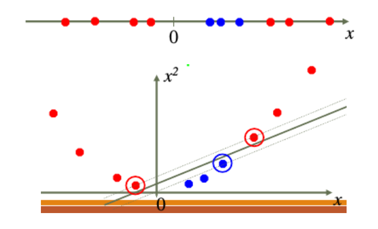

# 《机器学习与数据挖掘》课程项目--SVM

### 一、实验环境

本次实验是在windows10操作系统下进行的。使用的IDE为pycharm。

主要使用的python工具包列举如下：

```
xgboost
sklearn
pandas
numpy
re
```


### 二、实验目的

本次实验使用的是`kaggle`开源数据集 `Myers-Briggs Personality Type Dataset(MBTI)`。这个数据集给了一共8600条8种人格标签和样本的posts文本数据，我们需要尝试用posts的文本内容对4组人格进行分类：

1. Introversion (I) – Extroversion (E)
2. Intuition (N) – Sensing (S)
3. Thinking (T) – Feeling (F)
4. Judging (J) – Perceiving (P)

他们使用字符的组合来表征某一个人格特征的组合，比如`INTJ`表示这个人具备`Introversion, Intuition,Thinking,Judging   `的性格特征

​	

### 三、SVM原理

#### SVM初步

SVM的核心通俗的讲就是要最大化分割超平面和离他最近的一些样本的距离。定义超平面为$w^Tx + b = 0$，这样我们可以得到样本集中的点和超平面的距离为：
$$
d=\frac{||w^Tx_i+b||}{||w||}
$$
假设最近的样本集的点$x'$满足$||w^Tx_i+b||=1$：
$$
d = \frac{1}{||w||},  m = \frac{2}{||w||}
$$
要最大化m，我们可以最小化$||w||$：
$$
\begin{eqnarray}
&minimize &\frac{1}{2}||w||^2\\
&s.t.   &for ~ y_i = +1,  w^Tx_i + b \geq +1 \\
&&for ~ y_i = -1, w^Tx_i + b \leq -1
\end{eqnarray}
$$
我们可以将他们写为一个方程：
$$
y_if(x_i) -1 = y_i(w^Tx_i + b) - 1 \geq 0
$$
这是一个凸二次优化问题，因此一定存在一个全局最优解，我们利用拉格朗日乘子法来求解


#### 拉格朗日乘子法

- 拉格朗日乘子法是用来寻找多元函数在变量受到一个或多个条件约束的时候获取极值的方法。这种方法可以将一个有$n$个变量与$k$个约束条件的最优化问题转化为一个解有$n+k$个变量的方程	组的解的问题。

- 比如，要求$f(x,y)$，在$g(x,y)=c$的时候的最大值，我们可以引入新的变量拉格朗日乘子$\lambda$，这时我们只需要求下列拉格朗日函数的极值：
  $$
  L(x,y,\lambda)=f(x,y)+\lambda(g(x,y)-c)
  $$

- 一般的，对含有$n$个变量和k个约束条的情况，有：
  $$
  L(x_1,...x_n,\lambda_1,..., \lambda_k)=f(x_1,...,x_n)-\sum^{k}_{i-1}\lambda_ig_i(x_1,...,x_n)
  $$


利用拉格朗日乘子法，我们可以对上面的目标方程进行求解：
$$
\begin{eqnarray}
&minimize ~~&L_P(w,b,\alpha) = \frac{1}{2}||w||^2 - \sum_{i=1}^n\alpha_i(y_i(x_i^Tw+b)-1)\\
&s.t.   &a_i \geq 0 \\
& &y_if(x_i) - 1 \geq 0
\end{eqnarray}
$$
对变量求导后我们可以得到
$$
\begin{eqnarray}
\frac{\partial L}{\partial w} &=& 0 \Rightarrow \sum_{i=1}^n\alpha_iy_ix_i = w \\
\frac{\partial L}{\partial b} &=& 0 \Rightarrow \sum_{i=1}^n\alpha_iy_i = 0
\end{eqnarray}
$$
将上面的第一条式子带入目标方程我们可以得到：
$$
\begin{eqnarray}
&maximize ~~&L_D(w,b,\alpha) = \sum_{i=1}^n\alpha_i - \frac{1}{2}\sum_{i=1}^n\sum_{j=1}^n\alpha_i\alpha_jy_iy_jx_i^Tx_j \\
&s.t.  ~~ &a_i \geq 0 \\
& &\sum_{i=1}^n\alpha_iy_i = 0
\end{eqnarray}
$$


#### KKT条件

KKT条件保证了我们目标方程和原始问题拥有相同的最优解。KKT条件为：
$$
\begin{cases}
\text{Primal Lagrange KKT constraint}&\Rightarrow& \alpha_i \geq 0 \\
\text{Primal problem constraint}&\Rightarrow& y_if(x_i) - 1 \geq 0 \\
\text{From derivative of primal problem}&\Rightarrow&  \alpha_i(y_i(w^Tx_i+b)-1) = 0
\end{cases}
$$


#### 核函数

如果不存在一个能正确划分两类样本的超平面时，我们往往会将原始的空间映射到一个更高维度的空间中，使得样本在这个特征空间中线性可分。
$$
\varphi(x) = (x, x^2)
$$


如下图中的例子：



此时，最优化的问题就变成了：
$$
maximize ~~L_D(w,b,\alpha) = \sum_{i=1}^n\alpha_i - \frac{1}{2}\sum_{i=1}^n\sum_{i=1}^n\alpha_i\alpha_jy_iy_j\varphi(x_i)^T\varphi(x_j)
$$
常见的核函数包括：


#### 软间隔

在现实生活中，很难找到一个非常好的核函数让训练样本在特征空间中线性可分。一个线性可分的结果也很难断定是否是过拟合造成的。软间隔的引入就是为了让我们允许支持向量机在一些样本上不满足约束，减少过拟合的问题。

比如加入0-1损失函数后待优化的方程可以这样写：
$$
min_{w,b}\frac{1}{2}||w||^2+C\sum^m_{i=1}l_{0/1}(y_i(w^T\phi(x_i)+b)-1)
$$


### 四、实验过程及结论

#### 1. 数据预处理

我们首先对数据进行观察：每一行是一个样本，第一列是他们的人格分类类型，也就是`INTJ`之类的数据，第二列是他们的posts文本内容，这些文本内容可能有多条，用`|||`的符合间隔开来。同时数据里夹杂了很多链接，这些链接需要被我们去除。

```
'http://www.youtube.com/watch?v=qsXHcwe3krw",|||
  'http://41.media.tumblr.com/tumblr_lfouy03PMA1qa1rooo1_500.jpg',|||
  'enfp and intj moments  https://www.youtube.com/watch?v=iz7lE1g4XM4  sportscenter not top ten plays  https://www.youtube.com/watch?v=uCdfze1etec  pranks',|||
  'What has been the most life-changing experience in your life?',|||
  'http://www.youtube.com/watch?v=vXZeYwwRDw8   http://www.youtube.com/watch?v=u8ejam5DP3E  On repeat for most of today.',|||
  ...
```

同时我们进一步观察数据，会发现里面包含第一列人格类型的关键词，比如这一条posts：

```
Mm, probably INTP now that I have become more familiar with that type.
```

上面的句子中就包含了`INTP`的词语。这些词语对我们的分类肯定存在影响，因为这并不是他们个人的语言表达，而且这个单词和人格标签有很强的绑定关系，会影响我们对文本单词和人格类型潜在的相关性之间的关系，因此我们也需要对这些人格类型数据进行过滤。

```python
def change_personality(personality):
    # transform mbti to binary vector
    b_Pers = {'I': '0', 'E': '1', 'N': '0', 'S': '1', 'F': '0', 'T': '1', 'J': '0', 'P': '1'}
    return [b_Pers[l] for l in personality]

def pre_process_data(data):
    # 获取英文停用词列表
    cachedStopWords = stopwords.words("english")

    # 清除文章内和type相关的数据
    capital_type_list = ['INFJ', 'ENTP', 'INTP', 'INTJ', 'ENTJ', 'ENFJ', 'INFP', 'ENFP',
                        'ISFP', 'ISTP', 'ISFJ', 'ISTJ', 'ESTP', 'ESFP', 'ESTJ', 'ESFJ']
    # 大写和小写数据都进行处理
    lower_type_list = [x.lower() for x in capital_type_list]

    list_personality = []
    list_posts = []
    len_data = len(data)
    i = 0
	
    # 遍历每一行样本数据
    for row in data.iterrows():
        i += 1
        if (i % 500 == 0 or i == 1 or i == len_data):
            print("%s of %s rows" % (i, len_data))

        # 移除链接和无用注释等信息
        posts = row[1].posts
        temp = re.sub('http[s]?://(?:[a-zA-Z]|[0-9]|[$-_@.&+]|(?:%[0-9a-fA-F][0-9a-fA-F]))+', ' ', posts)
        temp = re.sub("[^a-zA-Z]", " ", temp)
        temp = re.sub(' +', ' ', temp).lower()

        # 去除停用词
        temp = " ".join([w for w in temp.split(' ') if w not in cachedStopWords])

        # 去除type相关特征数据
        for index in range(len(capital_type_list)):
            temp = temp.replace(lower_type_list[index], "")

        # 将特征标签提取出来
        type_labelized = change_personality(row[1].type)
        list_personality.append(type_labelized)
        list_posts.append(temp)
```

在对posts的数据进行过滤清洗的过程中，我们把type也同时提取出来。因为题目给的8种人格中，其实是分为4组的，比如`Introversion (I) – Extroversion (E)`他们是反义词的关系，人只会具有其中的一种人格。因此我们可以把他们分别用0和1进行标记，比如一个`ISFP`的人格我们可以用`[0, 1, 0, 1]`来代表它。

我们将预处理数据的结果写入文件中，csv文件的格式如下：

```
0 0 0 0,   moment sportscenter top ten play prank life changing experience life repeat today may perc experience immerse last thing  friend posted facebook committing suicide next day rest peace hello  sorry hear distress natural relationship perfection time...
```


#### 2. 数据观察

我们这里有8种不同的人格，如果直接使用决策树对8中人格划分，如果要考虑不同组人格之间的相关性，一种直接的方法就是将各种不同的组人格组合在一起，这样就得到了16种不同的人格组合。就拿`INTJ`的人格来说，如果数据集中是`INTJ`的就标记为1，否则为0。然后我们就可以使用模型去分类了，不过这样模型的数据绝大多数都是0，少量为1。而且这样划分至少需要15个分类器，效率肯定也不好。

因此我们对4组人格之间的相关性进行了计算，直接用协方差计算即可。我们可以得到他们之间的相关系数如下：

|      | IE    | NS    | TF    | JP    |
| ---- | ----- | ----- | ----- | ----- |
| IE   | 1     | -0.04 | 0.07  | 0.16  |
| NS   | -0.04 | 1     | -0.01 | 0.01  |
| TF   | -0.06 | -0.08 | 1     | -0.01 |
| JP   | 0.16  | 0.01  | -0.01 | 1     |

观察数据可以发现，他们之间的相关性其实是非常低的，也就是I的人格对于它是N还是S，其实几乎是没有很大的关联。因此我们没有必要将他们构成特定的组合然后进行的决策。我们直接构建4个分类器分别对4组人格进行分类即可。


#### 3. 文本向量化

因为我们不可能把文本作为模型的输入，我们在训练模型的时候肯定只能输入一些量化的数值。在去年的自然语言处理课上，我们学到了很多把文本向量化的方法，比如词嵌入，word2vec，已经TFIDF等。我们这里使用的是TFIDF的方法对文本进行向量化。

我们这里使用了` sklearn.feature_extraction.text`库对数据进行TFIDF转化。

我们首先用`sklearn.feature_extraction.text`的`CountVectorizer`对文本的词语频率等信息进行统计

```PYTHON
# 用TFIDF的方法将用户post数据变成向量
def tfidf():
    # 从预处理数据中读取 并组成nparray
    list_posts, list_personality = read_preprocessing()

    # Posts to a matrix of token counts
    cntizer = CountVectorizer(analyzer="word",
                                 max_features=2000,  # 限制词典维度上限
                                 max_df=0.8,  # 在0.7以上的文章出现过的词语可以去除
                                 min_df=0.05) # 在0.05以下的文章出现过的词语可以去除

    # 计算词语频率
    print("CountVectorizer...")
    word_count = cntizer.fit_transform(list_posts)
    print(word_count)


    print("Tf-idf...")
    # 根据词语频率得到tfidf矩阵
    tfizer = TfidfTransformer()
    tfidf =  tfizer.fit_transform(word_count).toarray()
    print(tfidf, len(tfidf),len(tfidf[0]))

    return tfidf, list_personality
```


#### 4. SVM模型

本次实验我们直接使用了sklearn的SVM库来进行：

```PYTHON
def train_models(tfidf, list_personality):
    type_indicators = ["IE: Introversion (I) - Extroversion (E)", "NS: Intuition (N) – Sensing (S)",
                       "FT: Feeling (F) - Thinking (T)", "JP: Judging (J) – Perceiving (P)"]

    X = tfidf
    # kernals = ["poly", "rbf", "sigmoid", "linear"]
    xlabels = ["IE", "NS", "FT", "JP"]
    kernals = ["poly"]
    res = []
    for kernal in kernals:
        tmp = []
        for l in range(len(type_indicators)):
            print("%s ..." % (type_indicators[l]))

            Y = list_personality[:, l]

            seed = 3
            test_size = 0.33
            X_train, X_test, y_train, y_test = train_test_split(X, Y, test_size=test_size, random_state=seed)

            # define SVM model
            model = svm.SVC(decision_function_shape='ovr', kernel=kernal)
            # train the model
            model = model.fit(X_train, y_train)

            # 在测试集上进行预测
            y_pred = model.predict(X_test)
            predictions = [round(value) for value in y_pred]
            # evaluate predictions
            accuracy = accuracy_score(y_test, predictions)
            print("- %s F1: %.2f%%"%f1_score(y_test, predictions, pos_label=1, average='binary'))
            print("- %s Accuracy: %.2f%%" % (type_indicators[l], accuracy * 100.0))
        res.append(tmp)
    draw_res(kernals, res, len(res))
    
def draw_res(kernals, res, n, xlabels):
    x = np.arange(n)
    width = 0.1

    plt.figure(figsize=(10, 6))
    for i, kernal in enumerate(kernals):
        plt.bar(x + i * width, res[i], width=width, label=kernal)
        plt.legend()

    plt.xticks(x + width*1.5, xlabels)
    plt.show()
```

在上次实验中我们也通过调用xgboost和随机森林的算法来计算结果。这里直接将对应的调用替换为SVM即可


#### 5. 实验结果

我们选取了4种不同的核：`"poly", "rbf", "sigmoid", "linear"`来对四组相对人格进行了实验，经过对不同参数调整和对训练集测试集的不同划分，我们得到相对最优的实验结果如下：

|         | IE    | NS    | FT    | JP    |
| ------- | ----- | ----- | ----- | ----- |
| poly    | 0.863 | 0.842 | 0.795 | 0.783 |
| rbf     | 0.861 | 0.850 | 0.810 | 0.799 |
| sigmoid | 0.852 | 0.871 | 0.802 | 0.782 |
| linear  | 0.932 | 0.917 | 0.894 | 0.843 |

将上述的表格转化为图标形式可以得到如下的结果：


rbf是高斯核，linear是线性核，sigmoid是著名的S型曲线，而poly是多项式。在实验过程中，可以发现线性核运行速度最快，并且实验效果相对最好，因此我们可以推测这个数据集在SVM模型中是线性可分的，不需要过多的进行高维的映射，反而可能导致实验效果变差。而poly多项式的情况，可能因为参数过多，运行效率相对是比较慢的。

不过在真实情况下，RBF的适用性更加广泛，不论是大样本还是小样本，高维度还是低维度，它都能发挥用处，因为线性核函数其实也是RBF的一种特例，因此RBF已经涵盖了线性可分的情况。不过之所以在本次实验中，linear的效果会更好，很大的可能是因为，它需要对参数进行细致的选取和调节才能发挥出更大用处。

不过从整体观察，SVM模型的准确对相对还是比较高的。不过事实上，这是经过很多次调节和对训练集和测试集进行划分后的结果，本质上并没有很强的参考意义和实际意义。选取的也是在多次调整和尝试后的最优情况来展示。但也可以看出SVM这种方法对于这种分类问题的有效性和比较强的可解释性。

下面展示了F1指标情况，F1指标综合考虑了召回率和精确度：
$$
F1 = \frac{2\times precision\times recall}{precision + recall}
$$
这里仅仅使用了线性核来进行实验：

|      | IE     | NS     | FT     | JP     |
| ---- | ------ | ------ | ------ | ------ |
| F1   | 81.09% | 75.49% | 75.67% | 74.64% |


最后我们还是使用线性核对整体的准确度和F1指标进行了计算

|        | accuracy | F1     |
| ------ | -------- | ------ |
| linear | 85.13%   | 80.72% |


