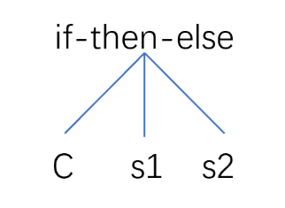

## 词法分析实验报告

### Tiny+语言词法

#### 一、关键词(KEY)

Tiny+中可能出现的关键词包括以下这些

```C++
// 定义语法中所有可能出现的关键词
bool Token::is_KEY(string& str) {
	return str == "true" || str == "false" || str == "or" ||
		str == "and" || str == "not" || str == "int" ||
		str == "bool" || str == "string" || str == "while" ||
		str == "do" || str == "if" || str == "then" ||
		str == "else" || str == "end" || str == "repeat"
		|| str == "until" || str == "read" || str == "write";
}
```


#### 二、特殊符号(SYM)

常见特殊符号包括以下这些，其中注释用大括号包括。

```C++
// 判断是否为特殊符号
bool LexicalAnalysis::is_special_symbol(char c) {
	return c == ':' || c == ',' || c == ';' ||
		c == '<' || c == '>' || c == '=' ||
		c == '+' || c == '-' || c == '*' ||
		c == '/' || c == '(' || c == ')' ||
		c == '{' || c == '}';
}
```

其中单引号包括起来的是字符串，需要特殊考虑。在处理单引号包括的内容时，我们不做任何处理，并维持当前单引号状态


#### 三、标识符(ID)

标识符由非数字开头的字符串，用来代表变量名等。


#### 四、空白(blank)

Tiny中常见空白包括：空格（0x20）、水平制表（0x09）、垂直制表（0x0B）、换页（0x0C）、回车（0x0D）和换行符（0x0A）


### 语法分析实验

#### 一、实验目的

我们需要编写一个语法分析器，它可以对词法分析的tokens序列进行分析，并得到一颗语法树。同时在语法分析的过程中还要能识别简单的语法错误。


#### 二、实验原理

##### 1. 细化token类型

语法分析器的核心就是利用递归去构建语法分析树。在词法分析实验中，我们只是将token简单的划分成了KEY SYM ID NUM STR几个细类。但在语法分析中，我们不仅仅需要知道token是什么类型，我们还需要知道他是if还是while，是true还是or。因此我们需要将tokens序列进一步细化为下面的各种类型：

```C++
enum tokenKind {
	// 细化后的token类型
	TK_TRUE,
	TK_FALSE,
	TK_OR,
	TK_AND,
	TK_NOT,
	TK_INT,
	TK_BOOL,
	... // 以下省略
};
```

所有可能的类型都是从tiny的语法规则和编译器中得到的。


##### 2. 定义语法树

为了构建树，我们需要定义一个树的节点类。节点需要有几个属性：节点类型，节点值类型，对应token，和子节点的指针列表。节点的指针列表第三个一般为空，但如if-then-else的节点就有可能出现三个子节点。

```C++
Type type_;	// 节点类型
ValType val_type_ = VT_UNDEFINED;	//节点值类型 ValType
vector<TreeNode*>child_ = { NULL,NULL,NULL };
Token tk_;
```

节点类型和节点值类型包括以下：

```C++
enum Type {
		PROGRAM,        // 程序（开始符号）节点
		STMT_SEQUENCE,  // 语句列表节点
		IF_STMT,        // 条件语句节点
		...
		GEQ_EXP,        // 大于等于表达式节点
		LSS_EXP,        // 小于表达式节点
		...
		DIV_EXP,        // 除法表达式节点
		FACTOR          // 原子节点
	};

// 定义值的类型
enum ValType {
	VT_INT,         // 整型数类型
	VT_BOOL,        // 布尔类型
	VT_STRING,      // 字符串类型
	VT_UNDEFINED	// 为了初始化TreeNode新增的哑属性
};
```

每个节点都有自己的节点类型。如果是原子节点，他们的值就是他们的value，比如一个int类型的变量a=5，他是一个FACTOR节点，那么他的节点值就是5也就是int类型。而一些比较节点，比如GE（大于等于），他们的节点值就是布尔类型，因为他们返回一个比较的结果。


#### 3. 跳过变量定义

在tiny语言中需要先把所有声明都放在前面，这些不进行语法分析和语法树的构建。不过我们还是需要对他们进行语法正确性的分析：

```C++
// tiny 语法中声明都要放在前面，这些不作为语法分析的内容
void GrammarAnalysis::declaration() {
	// 如果符合int、bool、string 直接跳过
	while (match({ tokenKind::TK_INT, tokenKind::TK_BOOL, tokenKind::TK_STRING })) {
		// Tiny中变量名可以用分号分隔开
		do {
			++token_it_;
			match({ tokenKind::ID }, "类型声明符号后面需要跟变量名");
			token_it_++;
		} while (match({ tokenKind::TK_COMMA })); //逗号
		match({ tokenKind::TK_SEMICOLON }, "变量声明最后应该加';'"); //分号
		++token_it_;
	}
}
```

在变量声明结束后需要定义分号，多个变量也需要用逗号分隔，否则就会抛出异常。


#### 4. 递归构建语法树

构建语法树的核心就是利用递归建树。在TINY语言中，任何句子都是由特地定的token开始的，比如if，while，repeat，ID等。因此我们首先编写一个入口函数来进行判断，并分配到对应的情况：

```C++
TreeNode* GrammarAnalysis::stmt_sequence() {
	TreeNode* t1 = NULL, * t2 = NULL;
	// tiny语言都是有特定的几种符号开始，先匹配上这些，然后继续构建语法树
	KindSet first_statement = { tokenKind::TK_IF, tokenKind::TK_WHILE, tokenKind::TK_REPEAT,tokenKind::ID, tokenKind::TK_READ, tokenKind::TK_WRITE };

	while (match(first_statement)) {
		switch ((*token_it_).GetKind()) {
            case tokenKind::TK_IF:
                t2 = if_stmt();	// 如果当前token为if，调用if的分析函数
                break;
            case tokenKind::TK_WHILE:
                t2 = while_stmt();
                break;
            case tokenKind::TK_REPEAT:
                t2 = repeat_stmt();
                break;
            case tokenKind::ID:
                t2 = assign_stmt();
                break;
            case tokenKind::TK_READ:
                t2 = read_stmt();
                break;
            case tokenKind::TK_WRITE:
                t2 = write_stmt();
                break;
            default:
                break;
		}
		if (t1 == NULL)
			t1 = t2;
		else
			t1 = new TreeNode(TreeNode::Type::STMT_SEQUENCE, t1, t2);
	}
	return t1;
}
```

可以看到，代码根据token的类型，调用对应的语法分析函数，比如如果token是一个if类型，就会调用对应的if语法分析函数if_stmt。然后里面又会递归执行其他语句我们就拿最简单的if-then-else来举一个例子进行分析。

在Tiny语言中，if-then-else的节点是可能出现三个分支的，分别是条件、正分支、错分支。这部分我们可以用这个图来形象的表示：



因此在编写这个部分的分析逻辑时，我们首先定义一个函数：

```c++
// 处理if情况
TreeNode* GrammarAnalysis::if_stmt() {
	match({ tokenKind::TK_IF }, "期望是if关键词");
	++token_it_;	// 进入if的下一个符号，正常情况是一个条件

	// if语句存在三种分支可能，分别为条件、正分支和错分支，需要定义三个树节点
	TreeNode* condition_exp = NULL, * then_stmt = NULL, * else_stmt = NULL;

	// 先计算条件节点的内容
	condition_exp = log_or_exp();

	// 计算正分支的内容
	match({ tokenKind::TK_THEN }, "期望是then关键词");
	++token_it_;
	then_stmt = stmt_sequence();

	// 错分支不是必须的，如果不存在第三个分支为空
	if (match({ tokenKind::TK_ELSE })) {
		++token_it_;
		else_stmt = stmt_sequence();
	}

	match({ tokenKind::TK_END }, "if块缺少end结束符");
	++token_it_;
	// 当前节点是if，它的三个子节点分别为exp、then、else。END token不需要分配节点
	// 若没有else，则第三个孩子为NULL
	return new TreeNode(TreeNode::Type::IF_STMT, condition_exp, then_stmt, else_stmt);
}
```

可以看到代码中，它先对条件部分进行了下一步的分析，也就是调用了log_or_exp函数，接着对正分支的内容进行分析，正分支又可能是一段新的语句，因此重新调用入口函数stmt_sequence。else对应的错分支是可选的，因此如果源程序中没有else，我们就会返回一个null指针。

在这个if情况的入口函数中，也包含了简单的语法规则的检测，比如条件之后，是否有一个then连接，结束的时候是否有end结尾。

不过为什么是调用log_or_exp函数呢，接着我们进一步看一下log_or_exp函数的内容：

```C++
// 逻辑或运算
TreeNode* GrammarAnalysis::log_or_exp() {
	TreeNode* log_and_exp_node = NULL, * log_or_exp_node = NULL;
    // 先去尝试计算逻辑与
	log_and_exp_node = log_and_exp();

	if (match({ tokenKind::TK_OR })) {
		token_it_++;
		// 递归解决多个连续的或运算的情况
		log_or_exp_node = log_or_exp();
	}
	// 若有两个节点，则产生新的或节点，若只有一个，则直接返回这一个节点
	if (log_or_exp_node) {
		TreeNode* tmp = new TreeNode(TreeNode::Type::LOG_OR_EXP, log_and_exp_node, log_or_exp_node);
		tmp->val_type_ = ValType::VT_BOOL;	// 定义返回值类型为布尔值
		return tmp;
	}
	else
		return log_and_exp_node;
}
```

在这里，我们处理逻辑或运算。假设我们现在要分析的情况是E|E，在之前的逆波兰表达式的实现中，我们会考虑运算的优先级问题，因为或运算是最低的运算优先级，所以我们先调用它，把它两侧的E当成一个表达式，在进一步分析。因此我们先对前半部的E进行递归判断是否是与运算，然后再进一步分析后半部分的E，他有可能还是由多个|组成的，因此递归调用他。

本次实验中考虑的运算符优先级为：

```
or < and < comparision < add < mul < factor
```

最后我们就可以得到条件运算的结果，并递归的构建出语法分析树返回


#### 三、实验结果

使用下列的程序进行分析：

```c++
int A,B; {define int}
string C; {define string}
bool D; {define bool}
C:='hello world'; {assign string}
A:=1;
B:=2;
if A<=B and true then
	D:=true;
end
```


最下面就是构建出来的语法树，按照层序遍历打印出来。分析可以看出，和输入的程序符合。