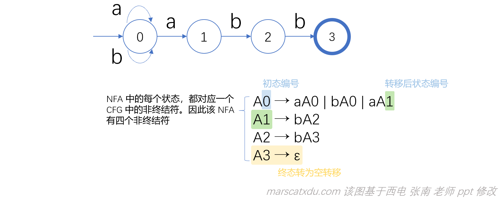
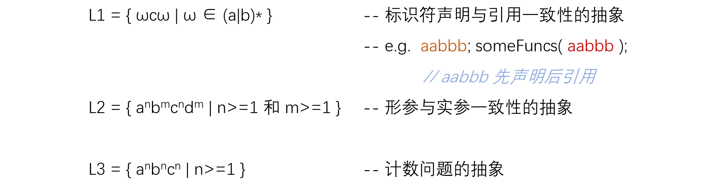
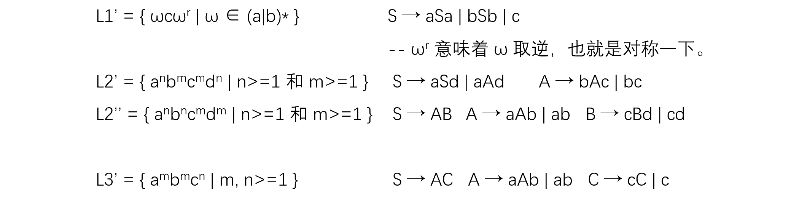

# 编译原理笔记10：语言与文法，正规式转CFG，正规式和CFG，文法、语言与自动机

对语言进行形式化描述的规则叫文法。

词法规则、语法规则都以形式化的方法对语言进行描述，这样的规则就叫文法。在使用 lex 的时候，我们就可以使用文法来简单地定义和修改语言。

前几篇笔记中我们比较细致地研究了正规式，当时我们用正规式来描述词法规则，然后根据正规式构造可以识别由该正规式表示的语言的自动机。

但其实，**CFG 也是可以描述词法的**。*（但为什么不这么做呢？）*

## 正规式，和 CFG

**正规式所描述的语言结构都可以用 CFG 描述，反之不一定。**

**正规式和 CFG 是有关系的！NFA 是可以转化成 CFG 的！！一个 NFA 的状态和状态转移关系就对应一个产生式！！**~~惊不惊喜？意不意外？？？~~至于为啥可以咱们暂且不论，先从这里往下看，后面时机成熟，自会解释。（先咕咕咕）

### 正规式到 CFG 的转换：

1. 构造正规式的 NFA；

2. 若 0 为初态，则 A0 为开始符号；

3. 对于 move(i, a) = j，引入产生式 Ai → aAj；

   【从 i 状态经过标记为 a 的边转移到 j 状态。对于这样的状态转移关系，我们可以为其生成对应的产生式 Ai → aAj 】

   **NFA 中的每个边，即每个状态转移都会生成一个对应的产生式。**我们在这里引入 Ai → aAj（这里的 a 是指经过的边），这样一来，我们就用这种方法将 NFA 中的状态以及状态转移关系变成了 CFG 中的产生式。

4. 对于 move(i, ε) = j，引入产生式 Ai → Aj；

   为空转移生成与之对应的产生式。

5. 若 i 是终态，则引入产生式 Ai → ε（终态，对应的是空产生式）。

NFA 中有状态和状态间的转移，我们就可以把这些变成一个 CFG

【例】以正规式 r = ( a|b )*abb 的 NFA 构造 CFG。



*如果没有最后的 ε，那么无论怎么推导，在推导的下一步总会引入一个新的非终结符，永远得不到一个我们想要的句子。*

通过这种方式转化出来的 CFG 也是一种“正规文法”（后续会讲到）

另外，我们也可以使用经验（脑补）的方法来将正规式转化成 CFG。对于上面的正规式 r，我们不难（？）写出：

```
A → HT
H → ε | Ha | Hb
T → abb
```

过程：

1. 通过观察，我们发现正规式 (a|b)*abb 是可以分为明显的两部分的，即a或b的星闭包连接上abb。第一部分就是星闭包，第二部分就是abb。因此，我们在构造 CFG 的时候，也就可以一上来就把开始符号拆成两部分，即上面第一行的 H 和 T
2. 我们用前面的非终结符 H 来生成正规式中前半部分的星闭包。a或b的星闭包，就是由a或b构成的长度>=0的一个ab串，于是我们就可以通过 H 本身不限次引入 a、b 来构造星闭包，具体就是第二行的产生式。产生式 H->ε 的作用有二，一是为了满足只有空串的情况，因为星闭包可以为空；二是用来结束 H 的产生式，只有有了 ε，我们才能够结束对 H 的构造，否则这个推导会一路无限递归下去。。。
3. T 就是给 abb 准备的

万一，如果 H 是正闭包而不是星闭包，那么就可以改成：H→a|b|Ha|Hb

### 正规式和 CFG 的关系

我们都知道：如果 NFA 能够接受一个串，那就说明在这个 NFA 内部一定存在一条从初态到终态的路径，路径上的链接就是这个串本身。

而，从上面的转化规则和例子，我们可以确定：这样的一个串一定对应CFG里面的一个推导。

也就是说，NFA 中的一个路径一定对应着 CFG 中的一个推导。反过来讲，CFG 中任意一个推导也都对应着 NFA 中的一个路径。

因此，**正规式与 CFG 之间是等价的！！**

任意一个正规式所描述的语言，都可用 CFG 来描述。也就是说对任意一个正规式，我们都可以为他构造出来其相应的、和它描述的语言相同的集合的 CFG。

但反过来，就不一定了——并不是所有用 CFG 描述的语言都可以用正规式来描述


好的，我已经很震撼了：既然凡是正规式能描述的，都能用CFG描述，反之则不行。这就说明 CFG 的语言描述能力更强。

可，为什么还用正规式，而非 CFG 来描述词法呢？？？

### 为毛不用 CFG 描述词法规则

原因很简洁：对人好，对机器也好。

**对人好**：正规式更直观简单，人容易理解。而正规式描述词法恰巧已经够用了（词法无非标识符、关键字、字面量之类，这些都是线性结构，使用正规式就能充分描述）；

**对机器好**：DFA 构造起来比用于 CFG 分析的下推自动机简单，效率更高。且使用两种不同方式来表示词法和语法，便于对两者进行区分，便于编译器前端的模块划分。

### 贯穿词法、语法分析始终的思想

1. 语言的描述和识别，是表示一个语言的两个侧面，二者缺一不可；
2. 一般而言，正规式适用于描述线性结构（标识符、关键字、注释等）；
3. CFG 适用于描述具有嵌套（层次）性质的非线性结构，比如不同结构的句子 if-then-else、while-do 等；
4. 用正规式和 CFG 描述的语言，对应的识别方法（自动机）不同。

## 上下文有关文法 CSG

CFG 很棒，但 CFG 文法本身，无法描述上下文有关的结构。

不能用 CFG 描述的语言：



上述的 L1、L2、L3 均是上下文有关的。

与上述 CSL 类似的 CFL



## 文法、语言与自动机

### 0型文法：

> 若文法 G=(N, T, P, S) 的每个产生式 α→β 中，均有 α∈(N∪T)\*，且至少有一个非终结符，β∈(N∪T)\* , 则称 0 型文法。

产生式两侧的表达式需要含终结符，且是 N、T 元素组成的串。

### 1型文法：

> 在 0 型文法的基础上，要求：对 G 的任何产生式 α→β（S → ε 除外），满足|α|≤|β|。

其实就是在 0 型的要求之上，要求**产生式左侧表达式必须比右侧的短**，也就是说这种语言不会越推越短，一定是越推越长的（毕竟总是要把产生式往产生式里面代入，如果被代入的东西变长了，那么一定就会随着推导的进行整个串都越来越长），而且可以一次性换掉带有终结符的非终结符序列。

### 2型文法：

> 在 0 型文法的基础上，要求：G 的任何产生式都要形如 A→β，有 A∈N，β∈(N∪T)\* 。

这其实就是在说，产生式**左侧必须是一个单独的非终结符**，右侧还是和原来一样随便即可。

### 3型文法：

> 在 0 型文法的基础上，要求：G 的任何产生式都要形如【 A→ a 或 A → aB （或 A→Ba）】，其中A、B∈N，a∈T

注意啊，这里的【 A→ a 或 A → aB （或 A→Ba）】是指在 “A → a” 或 “ A → aB （或 A→Ba）”这俩里面二选一，而不是“A→ a”、“A → aB”、“A→Ba”之间三选一。意思是说，一个串如果想要填字母就只能往一边续。如果用 A → aB，那就是向右侧延伸，越续越长。选 A→Ba 那就是向左侧延伸，越续越长。


- 任何一个1型文法，都是一个0型文法
- 任何一个2型文法，都是一个1型文法，都是一个0型文法
- 任何一个3型文法，都是一个2型文法，都是一个1型文法，都是一个0型文法。

- 所有3型文法的集合，是2型文法集合的子集
- 2型文法的集合，是1型文法集合的子集
- 1型文法的集合，是0型文法集合的子集

### 为什么， CSG 叫 CSG？

CFG，左边只有一个非终结符。

CSG 因为左边可以有终结符（即，可以是一个文法符号序列），所以在对非终结符进行展开时，我们需要考虑这个非终结符的左边是什么、右边是什么，也就是说我们要考虑这个非终结符的（已经存在了的）上下文了，因此，叫做上下文有关。

而 CFG 的非终结符完全可以在任何地方随便展开，只需要考虑他自己单独一个非终结符就行了，所以叫上下文无关！

