# 编译原理笔记11：语法制导翻译

[toc]

## 一、语法制导翻译基础

### 1. 语法制导翻译定义

编译器在做语法分析的过程中，除了回答程序语法是否合法外，还必须完成后续工作，包括：

1. 类型检查
2. 目标代码生成
3. 中间代码生成

语义分析和中间代码生成的过程属于语义翻译的过程。不过这个过程也可以结合在语法分析中进行，此时，语法分析就变成了语法制导翻译。

语法制导翻译使用CFG来引导对语言的翻译，是一种面向文法的翻译技术。

### 2. 基本思想

- 如何表示语义信息？

  - 为CFG中的**文法符号设置语义属性**，用来表示语法成分对应的语义信息。

- 如何计算语义属性？

  - 文法符号的语义属性值是用与文法符号所在**产生式（语法规则）**相关联的**语义规则**计算出来的
  - 对于输入串x，构建x 的语法分析树，并利用于产生式（语法规则）相关联的语义规则来计算分析树中**各个节点的语义属性值**

  

### 3. 语法制导定义SDD

SDD是对CFG的推广

1. 将每个**文法符号**和一个**语义属性集合**相关联

2. 将每个**产生式**和**一组语义规则**相关联，这些规则用于计算该产生式中各文法符号的属性值

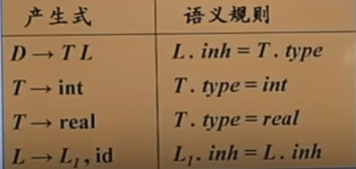

这是一个赋值语句的语法规则定义。第四行是指声明中的标识符序列

- SDD是关于语言翻译的高层次规格说明
- 隐蔽了许多具体实现细节，使用户不必显式地说明翻译发生的顺序

### 4. 语法制导方案SDT

SDT是在产生式的右部嵌入了程序片段的CFG，这些程序片段称为**语义动作**，按照惯例，语义动作放在花括号内：

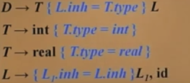

用第二条和第三条式举例，当产生式右部的int和real计算出来后，就可以T的属性值type就可以计算出来。因此一个语义动作在产生式中的位置决定了这个动作的执行时间。

- SDT可以看作是SDD的一种补充，是SDD的具体**实现方案**。

- 显式地指明了语义规则的计算顺序，以便说明某些实现细节。

## 二、语法制导定义SDD

**SDD是对CFG的推广**

1. 将每个**文法符号**和一个**语义属性集合**相关联

2. 将每个**产生式**和**一组语义规则**相关联，这些规则用于计算该产生式中各文法符号的属性值

文法符号的属性分为两种：

1. 综合属性
2. 继承属性

### 1. 综合属性和继承属性

**综合属性定义为：**在分析树节点N上的非终结符A，它的**综合属性只能通过N的子节点或N本身的属性值来定义**。 比如下图中，E的属性val满足上面的规则，因此val是E的一个综合属性

终结符可以具有综合属性，终结符的综合属性是**由词法分析器提供的词法值**，因此在SDD中没有计算终结符属性值的语义规则。

**继承属性定义为**：在分析树节点N上的终结符A的继承属性只能通过N的父节点，N的兄弟节点或N本身的属性值来定义。

**属性文法：**一个没有副作用的SDD有时也称为**属性文法**。属性文法的规则仅通过其他属性值和常量定义一个属性值。

### 2. 在语法分析树节点上对SDD求值

**注释语法分析树**：一个显示了它的各个属性的值的语法分析树

**下图是一个带有综合属性的SDD的例子：**

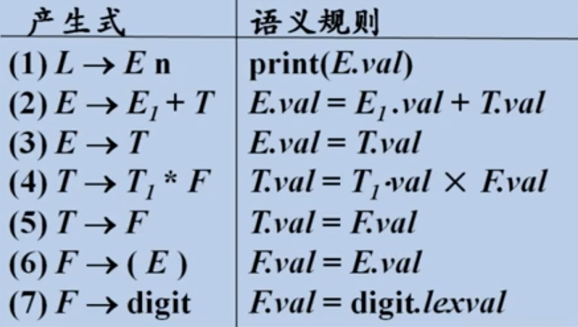

表达式7中给$F.val$赋予了一个digit的值，即由词法分析器返回的词法单元 digit 的数值

第一条式子是一个副作用，因为他用到了L的子节点E的属性值，因此可以看作是第一条产生式的虚综合属性。

下图是它的注释语法分析树：

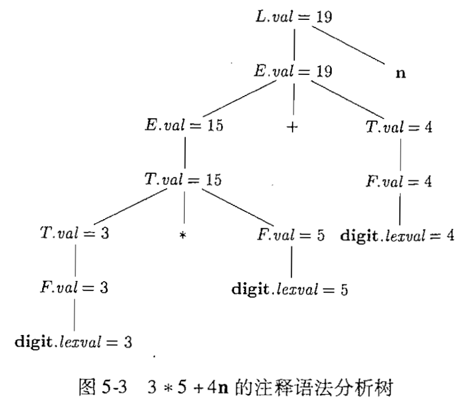

**下图是一个带有继承属性的SDD的例子：**

非终结符号T和F各自有一个综合属性val，终结符号digit有一个综合属性lexval。非终结符号$T'$具有两个属性：继承属性inh和综合属性syn：

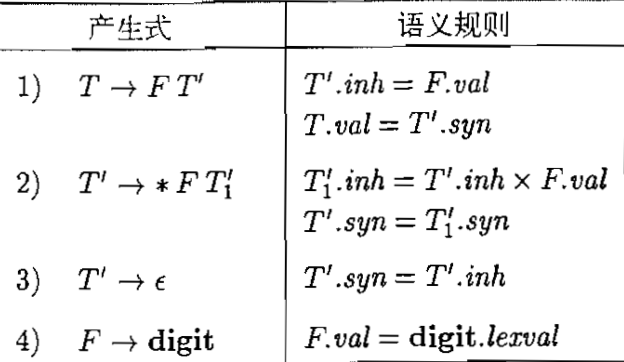

这个文法结局的是类似于$x*y*z$这样的项。继承的能力用于：给定一个项$x*y*z$，对应于$*y*z$的子树的根结点继承了x的值。对应于$*z$的子树的根结点继承了$x*y$的值。

这里的执行顺序在后面L-SDD中会提到原因。

### 3. SDD的求值顺序

语义规则建立了属性之间的依赖关系，在对语法分析树节点的一个属性求值之前，必须首先求出这个属性值所依赖的所有属性值。

#### 3.1 依赖图

- 依赖图是一个描述了分析树中结点属性间依赖关系的有向图
- 分析树中每个标号为X的结点的**每个属性a都对应着依赖图中的一个结点**
- 如果属性$X.a$的值依赖于属性$Y.b$的值，则依赖图中有一条从$Y.b$结点指向$X.a$的结点的**有向边**。

我们惯例把语法分析树的边显示为虚线，而依赖图的边显示为实线。

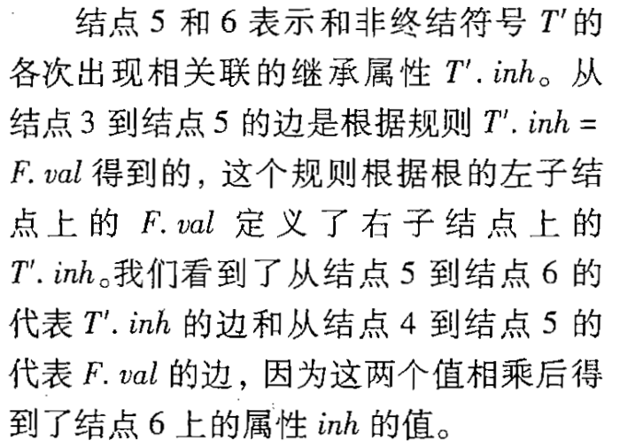

#### 3.2 属性求值顺序

可行的求值序列是满足下列条件的序列$N_1,N_2,...,N_k$

1. 如果依赖图中有一条从结点$N_i$到$N_j$的边，那么序列中$N_i$要在$N_j$前面
2. 这样的排序将有向图变成了线形的拓扑排序关系

上面依赖图没有环，它的拓扑排序之一为：1、2、3、4、5、6、7、8、9

- 对于只具有综合属性的SDD，可以按照任何自底向上的顺序计算它们的值
- 对于同时具有继承属性和综合属性的SDD，不能保证存在一个顺序来对各个结点上的属性进行求值。

比如下图就出现了循环依赖关系：

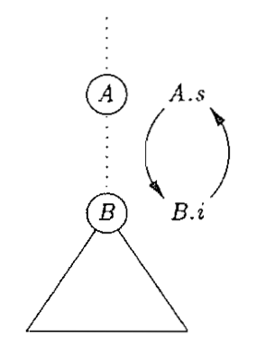

存在一个SDD的有用子类，它们能够保证对每棵语法分析树都存在一个求值顺序，因为它们不允许产生带有环的依赖图。

#### 3.3 S属性定义

**仅仅使用综合属性**的SDD称为S属性定义。

如果一个SDD是S属性的，我们可以按照语法分析树任何结点的自底向上顺序来计算它的各个属性值。

S属性定义可以在自底向上语法分析的过程中实现，因为一个自底向上的语法分析过程对应于一次后序遍历。而且后序顺序精确的对应于一个LR分析器将一个产生式体归约成为它的头的过程

#### 3.4 L属性定义

第二种SDD称为L属性定义。这类SDD的思想是在一个产生式体所关联的各个属性之间，依赖图的边总是从左到右，而不能从右到左。更准确的讲，每个属性必须要么是：

1. 一个**综合属性**，要么是

2. 一个**继承属性**，但是它的规则具有如下限制。假设存在一个产生式$A\rightarrow X_1X_2...X_n$，并且有一个通过这个产生式所关联的规则计算得到的继承属性$X_i.a$，那么这个规则只能使用

   - 依赖于产生式头A的继承属性

     这是因为父节点A的综合属性有可能依赖于子节点的属性，如果子节点又依赖于父节点的综合属性，有可能造成循环依赖：

   - 位于$X_i$左边的文法符号$X_1,X_2,...,X_{i-1}$相关的继承属性或综合属性。

   - 和这个 $X_i$ 的实例**本身相关**的继承属性或综合属性，但是在由这个$X_i$的全部属性组成的依赖图中**不存在环**

举例说明：

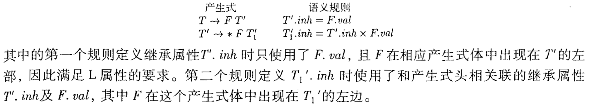

从语法分析树的角度看，当这些规则被应用于某个节点的时候，它使用的信息“来自上边或左边”的语法树节点。

**非L属性的 SDD：**

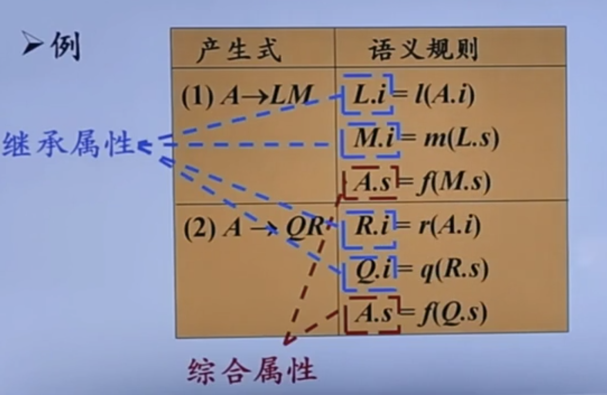

Q的继承属性依赖了右边兄弟的R的属性，因此不是L-SDD

## 三、语法制导翻译的应用

### 1. 抽象语法树的构建

语法制导翻译一个很重要的应用就是**抽象语法树**的构建

- 如果节点是叶子，那么对象将有一个附加的域来存放它的值。构造函数Leaf(op, val)创建一个叶子对象。
- 如果结点是内部结点，构造函数Node(op, c1, c2, ..., ck)，k等于语法树的子节点个数。

下面为简单的表达式构造语法树：

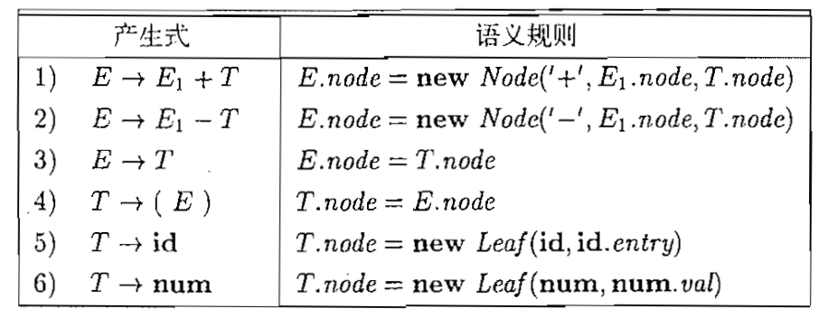

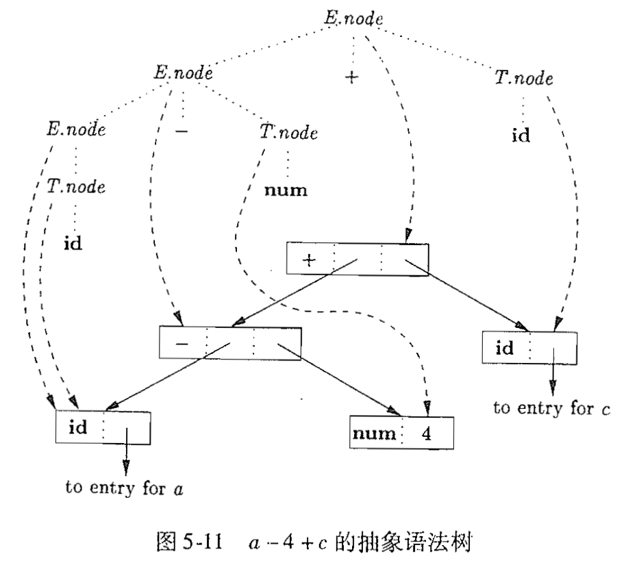

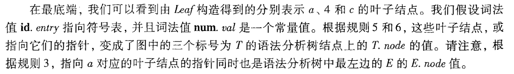

这个语法分析树的构造步骤如下：

如果这些规则是在对语法分析树的**后序遍历**过程中求值的，或者是在自底向上的分析过程中和归约动作一起求值的，那么一系列步骤结束后，$p_5$指向构造得到的抽象语法树的根结点。

### 2. 构建DAG

图中标红的部分，叶子结点都是已经被创建过的，因此不会重新创建新的结点，会用一个指针指向过去。

上述DAG构造步骤是经过以下几步得到：

1. 根据产生式和语义规则构造语法分析树
2. 根据语法分析树后根遍历执行规则
3. 会得到上图的构造步骤，同时构造出一DAG

## 四、语法制导翻译方案SDT

语法制导翻译方案是在产生式右部中嵌入了程序片段（语义动作）的CFG。

SDT可以看作是SDD的具体实施方案。有两种情况，SDT可以在语法分析过程中实现：

1. 基本文法可以使用LR分析技术，且SDD是S属性的
2. 基本文法可以使用LL分析技术，且SDD是L属性的

### 1. 将S-SDD转换为SDT

#### 1.1 转换规则

S-SDD都是综合属性，因此只有当所有的子节点都计算完毕后，才能计算父节点的综合属性。在这种情况下，我们可以构造出一个SDT，其中每个动作都放在产生式最后，并且在按照这个产生式将产生式体归约为产生式头的时候执行这个动作。这种SDT成为：**后缀翻译方案。**

因此将S-SDD转换为SDT的规则为：

- 将每个语义动作都放在产生式的最后

例如下面这个S-SDD我们可以得到它的SDT：

#### 1.2 后缀SDT的语法分析栈实现

假如有三个文法符号XYZ位于栈的顶部，它们可以按照产生式$A\rightarrow XYZ$进行归约，此时XYZ都已经入栈，因此它们的属性值都已经计算，因此在归约的时候，同时计算A的属性值。归约动作结束后，此时A和A的属性在栈顶位置。如下图所示：

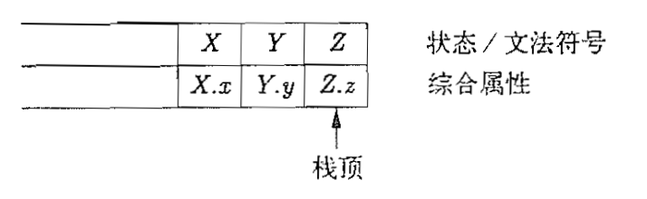

举个具体的例子：

我们定义top为指向栈顶的游标，假设每个记录都有一个被称为val的字段，该字段存放着这个记录所代表的文法符号的属性值。则完整的SDT如下图：

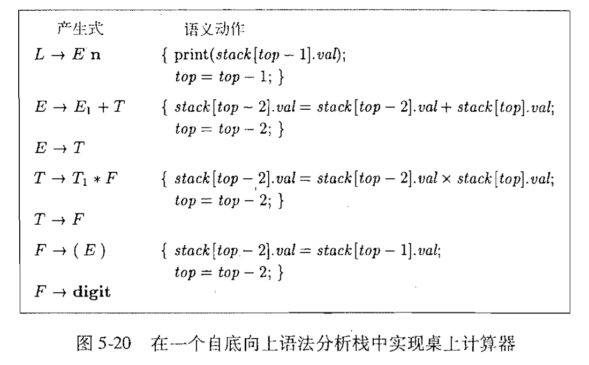

一个推导的过程如下：

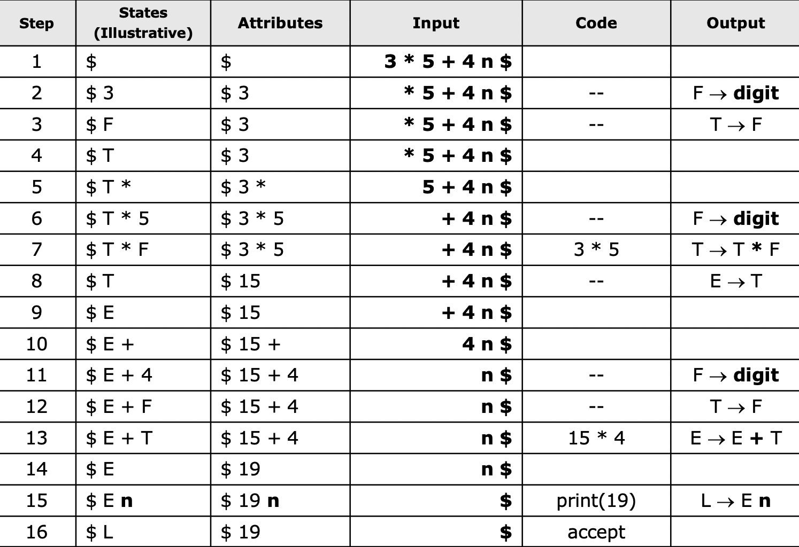

### 2.将L-SDD转换为SDT

#### 2.1 转换规则

现在我们考虑更加一般化的情况，即L属性的SDD。我们**将一个L属性定义的SDD转换成一个SDT的规则**如下：

1. 将计算某个非终结符号A的**继承属性**的动作插入到产生式右部中**紧靠A的本次出现之前**的位置上。
2. 将计算一个产生式左部符号的综合属性的动作放置在这个产生式右部的最右端。

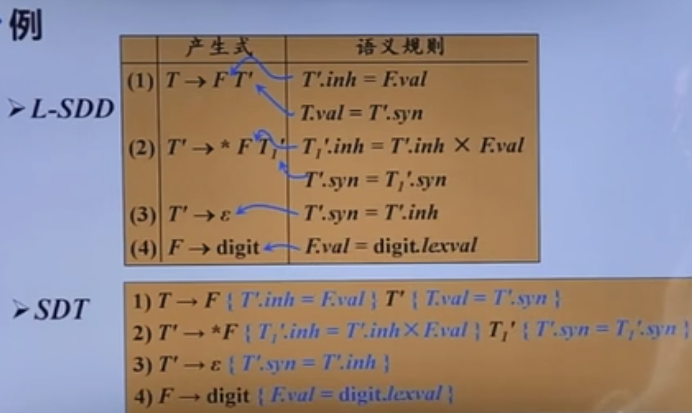

如果一个L-SDD的基本文法可以使用LL分析技术，那么它的SDT可以在LL或LR语法分析过程中实现。他又分为以下三种：

1. 在非递归的预测分析过程中进行语义翻译
2. 在递归的预测分析过程中进行语义翻译
3. 在LR分析过程中进行语义翻译

