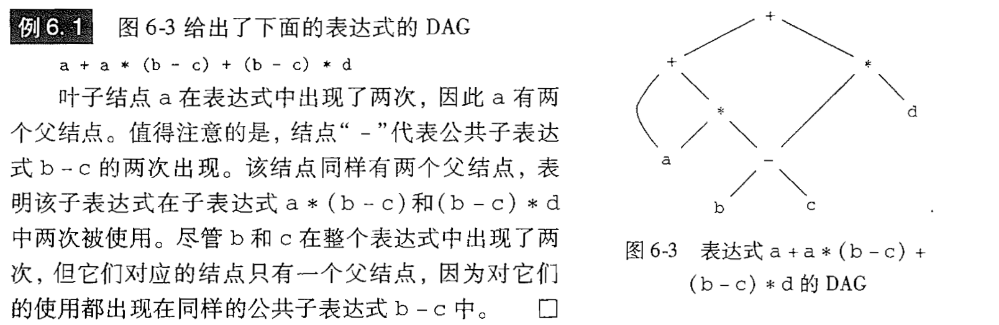
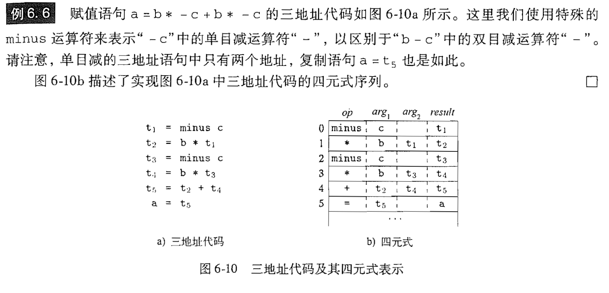
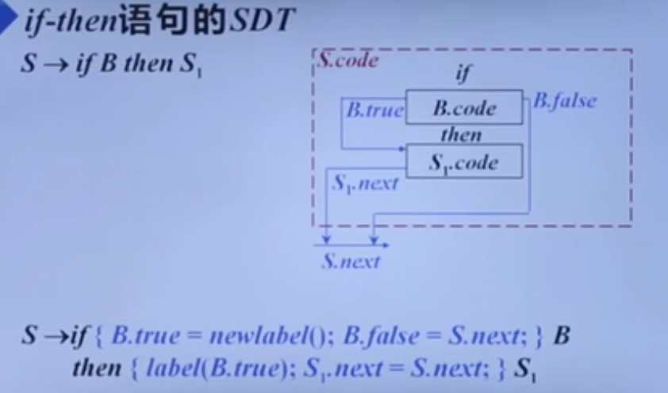

# 编译原理笔记12：中间代码生成

[toc]

## 一、DAG

和表达式的语法树类似，一个DAG的叶子结点对应于原子运算分量，而内部结点对应于运算符。与语法树不同的是，如果DAG中的一个结点N表示一个公共子表达式，则N可能有多个父结点。在语法树中，公共子表达式出现一次，就要创建一个新的结点，但是**DAG共用了结点**，因此更简洁的表示了表达式。

和构造语法树不同的是，它遇到已经构建过的结点，就不会去New一个新的结点，而是像2、8、9、10一样直接用已有的结点。例如在构造一个新结点Node(op, left, right)之前，先检查是否存在这样的结点，标号为op且子结点为left 和right。

## 二、三地址代码

在三地址代码中，**一条指令的右侧最多有一个运算符**：
$$
t_1 = y * z\\
t_2 = x + t_1
$$
其中 t 为编译器临时产生的名字。三地址代码拆分了多运算表达式以及控制流语句的嵌套结构，所有适用于目标代码的生成和优化。

### 1. 四元式表示

一个四元式(quadruple)有四个字段，分别称为：$op, arg_1, arg_2,result$。

1. 在形如$x = -y$的单目运算符指令和赋值指令中，不使用$arg_2$
2. 条件或非条件转移指令将目标标号放进result中

### 2. 三元式表示

一个三元式(triples)有三个字段，分别称为：$op, arg_1, arg_2$。使用三元式的时候，我们将用运算x op y 的**位置**来表示它的结果，**而不是一个显式的临时名字**表示。

## 三、各种语句的翻译

### 1. 类型表达式

- **基本类型是类型表达式**：int， float，double等

- 将类型构造符(type constructor)作用于类型表达式可以构成新的类型表达式

1. 数组构造符array

   若T是类型表达式，则$array(I, T)$是类型表达式

   

2. 指针构造符pointer

   若T是一个类型表达式，则pointer(T)是一个指向类型T的表达式

3. 笛卡尔乘积构造符$\times$

   若$T_1$和$T_2$是类型表达式，则笛卡尔乘积$T_1\times T_2$也是类型表达式

4. 函数构造符$\rightarrow$

   若$T_1,T_2...,T_n$和R是类型表达式，则$T_1\times T_2 \times ... \times T_n \rightarrow R$是类型表达式。T为函数参数类型，R表示返回值类型

5. 记录构造符record

   若有标志符$N_1,N_2,...,N_n$，则它们的数据类型为$T_1, T_2,...,T_n$，$record((N_1\times T_1)\times (N_2 \times T_2)\times ... \times(N_n \times T_n))$是一个类型表达表达式

### 2. 声明语句的翻译

#### 2.1 局部变量的存储

对于声明语句，语义分析的主要任务就是收集标识符的类型等属性信息，并为每一个名字分配一个相对地址

- 从类型表达式可以知道该类型在运行时刻所需的存储单元数量，称为**类型的宽度**。
- 在**编译时刻**，可以使用类型的宽度为每一个名字分配一个**相对地址**

名字的**类型**和**相对地址**信息保存在相应的**符号表**记录中。

#### 2.2 声明语句的SDT

### 3.控制流语句及其SDT

常见的控制流语句包括以下三种：

B表示一个布尔表达式，S表示一个语句。B和S具有综合属性code，给出了翻译得到的三地址指令。

控制流语句代码的结构如下：

将语句S和继承属性S.next相关联，这个属性表示紧跟在S代码之后的指令的标号。

下图给出它们的语法制导定义进行三地址代码的翻译：

下面为三者的SDT：

### 

