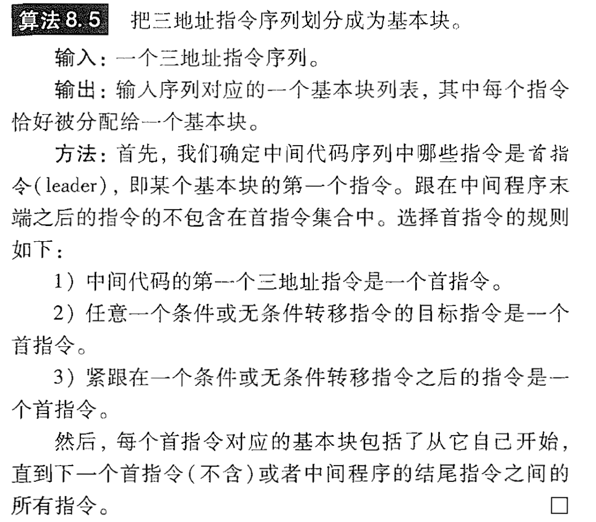
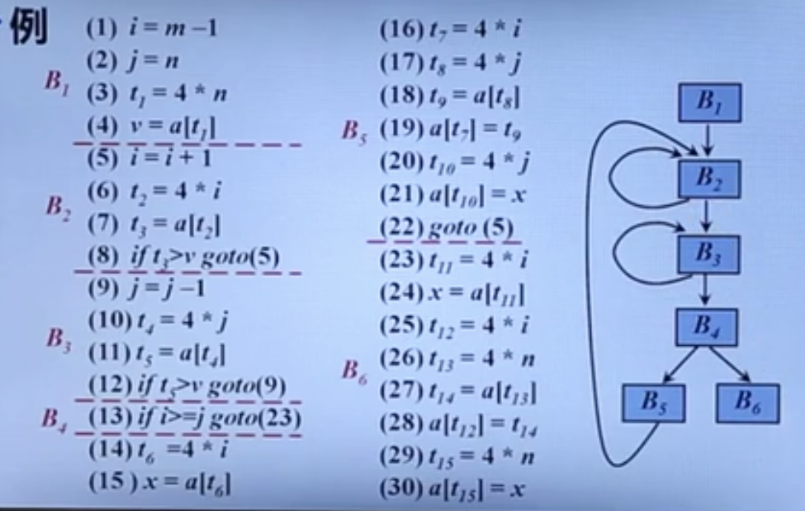
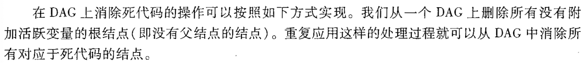
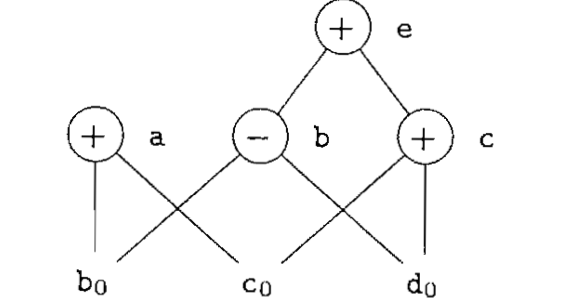
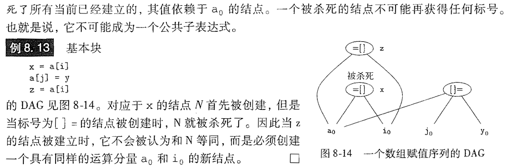
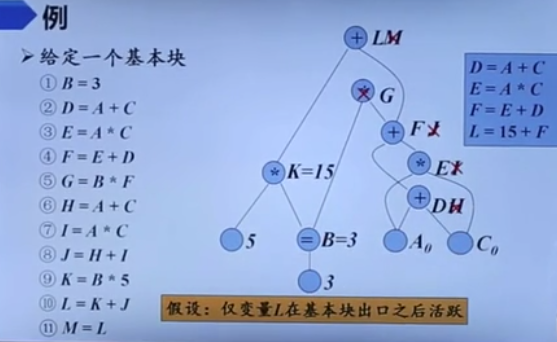

# 编译原理笔记13：代码生成

[toc]

## 一、流图

### 1. 基本块

基本块是满足下列条件的最大的连续三地址指令序列：

- 控制流只能从基本块的**第一个指令**进入该块。也就是说，没有跳转到基本块中间或末尾指令的转移指令
- 除了基本块的最后一个指令，控制流在离开基本块之前不会跳转或停机

基本块形成了流图的结点，而流图的边指明了哪些基本块可能紧跟一个基本块之后运行。

### 2. 基本块划分算法

举例说明：

划分的核心方法就是先找到所有的首指令，然后再进行划分。

### 3. 流图

流图的结点使一些基本块。从基本块B到基本块C之间有一条边当且仅当基本块C的第一个指令可能紧跟在B的最后一条指令之后执行。

称B是C的前驱，C是B的后继。有两种方法可以确认这样的边：

1. 有一个**从B的结尾跳转到C的开头**的条件或无条件跳转语句
2. 按照原来三地址语句序列中的**顺序**，C紧跟在B之后，且B的结尾不存在**无条件跳转**语句

举例说明：

## 二、基本块的优化

### 1. 基本块的DAG表示

- 基本块中的每个语句 s 都对应着一个**内部结点N**，结点中的标号是 s 中的运算符
  - 同时还有一个**定值变量表**被关联到N，表示 s 是在此基本块内**最晚**对表中变量进行定值的语句
  - N的子节点是基本块中在 s 之前、最后一个对 s 所使用的某个运算分量进行定值的语句对应的结点。如果 s 的某个运算分量在基本块内没有在 s 之前被定值，则这个运算分量对应的子节点就是代表**该运算分量初始值的叶结点**（叶结点的定值变量表中的变量加上下脚标0）
  - 对于已经有的公共子表达式，不往DAG中添加公共结点，而是在已经存在的结点附加定值变量 x

### 2. 寻找局部公共子表达式

检查公共子表达式：当一个新的结点M被加入DAG中时，我们检查是否存在一个结点N，他和M具有相同的op和子节点，且子节点顺序相同。

### 3. 消除死代码

死代码：即计算得到的值不会被使用的指令

活跃变量：值可能会在以后被使用的变量

举例说明：

在上图中，假设a和b是活跃变量，而e和c不是活跃变量。图中a和e是根结点，说明他们在基本块中没有被引用，而e不是活跃变量，因此在以后也不会被使用，因此把它删去，接着递归的，c 也满足上述条件可以删去。

### 4. 数组元素赋值指令的表示

在上图中，如果把a[i]作为一个公共的子表达式是不合理的，因为j=i是可能出现的。在DAG中，表示数组访问的正确方法如下：

**举例说明：**

对于下图左侧的基本块，我们可以构造出它的DAG如右图：

接着我们需要根据DAG重新生成基本块从而完成局部代码优化：

1. 首先删除没有活跃变量的根结点，如G
2. 对于局部公共子表达式，我们只需要生成一条三地址指令即可，因此我们可以删除M、J、I、H（我们倾向于将结果赋值给活跃变量）
3. 根据新的DAG图，重新生成基本块代码

当有常量的时候，我们可以直接用常量代替变量。因此第一条三地址表达式也不需要。在第九条表达式的时候，K也可以直接用15来代替，可以直接删除。

