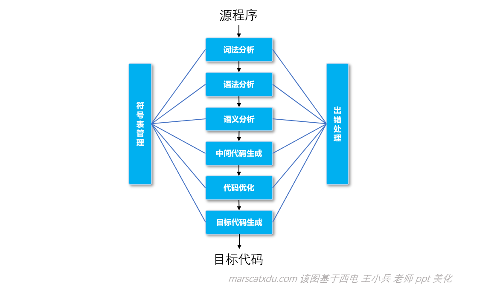
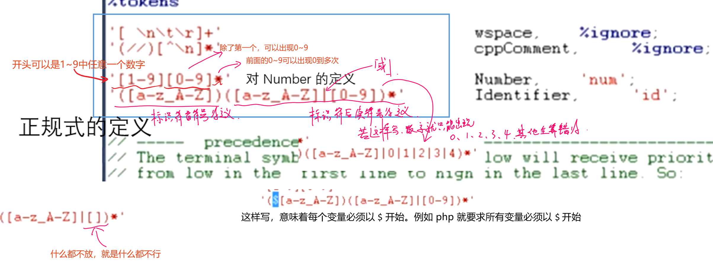
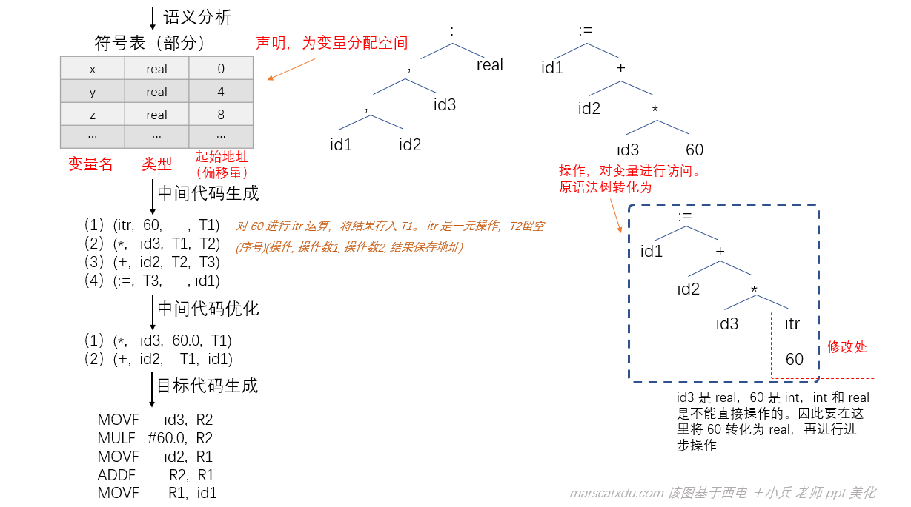
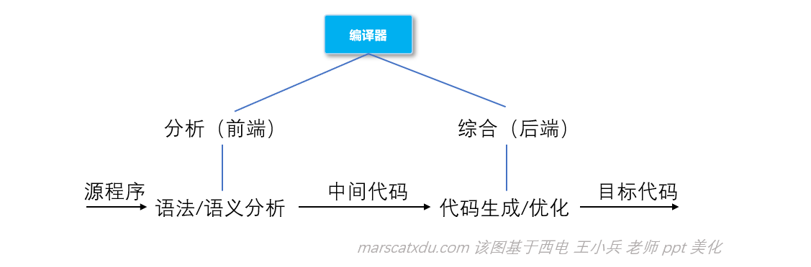

# 编译原理笔记1：概述编译相关的基本知识

## 编译器的工作步骤

在开始说任何东西之前，我们先来大致看一下编译器是怎么工作的——从代码到程序，大概要经过下面这样的步骤——这里用粗浅的语言进行解释，先有个印象即可，后面还会提到



- 词法分析：编程语言的语句，由一堆堆的单词组成——比如变量类型名、变量名、函数名、值、符号等。既然我们要让机器来分析源程序然后编译，那么就需要首先让计算机能够明白我们写的语句是什么意思，而理解语句的第一步就是理解每个词。所谓语法分析，进行的工作就是让计算机识别单词；
- 语法分析：完成词法分析，就要通过语法分析来识别**语句的结构**；
- 语义分析：该步骤的目标，就是确定“某一条语句是什么意思”，检查一下说的有没有不合法的地方；
- 符号表管理：相当于字典。符号表用于各个阶段查找、填写；
- 出错处理：在出现错误时的处理。种类可分词法错误、语法错误、静态/动态语义错误；
- 中间代码（可选）可以为**优化**提供支持。中间代码接近于目标语言，却又与具体硬件对应的机器指令无关，便于优化和代码生成。中间代码优化是对指令进行等价变化，提高运行效率；
- 中间代码经过优化，就可以生成目标代码了。比如**二进制程序的机器码**，或者各种 VM 用的字节码。


## 词法分析器 Lex 和词法分析器 Yacc：

Lex（Lexical Analyzar） 是词法分析器， Yacc（Yet Another Compiler Compiler） 是语法分析器。

虽然从名字上看，这两个东西就已经是“分析器”了，然而实际上并不是，他们是用来生成“分析器”的工具。Lex 是用来生成词法分析器的工具，Yacc 是用来生成语法分析器的工具。

这两个工具可以根据我们输入的词法 / 语法规则，自动**生成相应的语法分析器、词法分析器**，然后这些分析器就可以帮助我们简单地完成对源代码的词法、语法分析。

因这两样工具的存在，开发编译器、解释器的词语法分析器的难度被极大降低。在现代编译器、解释器的开发中，真正有难度的地方在于**语义分析和后期优化**。

#### Lex正规式示例：

在 Lex 中，我们可以使用一种被称为“正规式”的字符串，来简单地定义“某种符号应该长成什么样子”。
我们先直接体验一下。
比如下面这个实际定义 Number 和 Identifier 的例子：




#### Yacc 的产生式示例：

Yacc 用如下这种形式来**定义“一个表达式应该长成什么样子**”：
`E : E '+' E | E '*' E | id`
这段代码说明，一个表达式 E 可以有三种情况组成：最简单的情况就是 id 。一个变量 x ，他自己就是一个表达式，两个表达式相加是一个表达式，两个表达式相乘还是一个表达式。

对于这个产生式，如果我们写`x-y`就是不合法的——因为我们并没有定义两个表达式可以被 ‘-‘ 连接


例：对于 Yacc 而言，-x–y也是合法的。对于表达式“-2–3”，**这里的减号有一元操作也有二元操作**，实际计算的情况是这样的：(-2)-(-3 )


## 语言之间的翻译


**高级语言之间可以实现跨语言的翻译**。

预编译的例子：sql、c 混合编程。
sql、c 混合编程，实际上的运行方式是先把 sql 变成 c 语言，再对由 sql 转换来的 c 和本来就是 c 的部分进行整体编译。**把 sql 转成 c 的过程就叫“预编译”**，Lex、Yacc 就是这样的。

在 UltraGram 中，就可以把我们写的 Lex、Yacc 变成合法的 C 代码。我们就可以把这两份代码和我们自己写的 C 代码一起编译，实现开发自己的解释器/编译器。（lex yacc 就是开发解释器编译器这种东西的工具，将曾需要手工实现的词法语法分析自动化实现）。

对于反汇编，编译器为了防止反汇编会在编译时加入一些无效代码。


## 编译器与解释器

### 语言翻译

语言翻译分为两种，**分别是先翻译后执行和边翻译边执行**。二者基本功能相同。且在翻译的角度来看，两种方式涉及的原理、方法、技术都是类似的

#### 先翻译后执行

比如 C 这种**需要编译的语言**。特点是效率高、省空间。但交互性、动态性差，可移植性也差。。多数语言都是这种。


#### 边翻译边执行

比如 py、js、java 这种使用解释器工作的语言。跟上面的基本相反。

**生成字节码然后运行**。从**高级语言到字节码实际上是翻译**，在运行时再从字节码转化成机器码执行。


## 编译器的工作原理和基本组成

### 通用程序设计语言的主要成分

语言都由声明、操作两大部分组成，声明+操作=语言的完整定义。

#### 例：过程式语言：

过程式语言有**两种语句**：声明性语句和操作性语句。前者提供操作对象的性质（比如数据类型、数据值、对象的作用域）。后者则描述各个操作（比如赋值）的次序，进行实际操作。

编译器对上述两种语句使用不同的方式进行处理。对于声明性的，就是给被声明的对象**分配一块空间**（称为“环境”）。操作则是**生成针对环境的可执行代码序列**，比如从某个被声明的空间中取值，进行某些运算后将结果放到某个空间中。

因此，“先声明后引用”的规则，能够方便编译器对语言进行处理，也能提升执行效率。

例如，一些语言支持如下操作：

```js
i=10;           // 在没有对 i 进行声明的情况下直接赋整数值
i="abcdefg";    // 直接重新赋字符串值
```

虽然看起来是两行代码，但是在实际执行中，执行过程是：为整型分配空间->写入整数值10->重新分配空间->写入字符串值。将导致效率的降低。

### 以阶段划分编译器

编译器的工作过程可以大致划分为四步：词法分析、语法分析、语义分析、目标代码生成。

这个图要背下来。。。。


其中，中间代码生成及其之前的步骤，编译器和解释器可以是一致的。

- 词法分析：相当于识别每个词代表什么。进行的工作就是识别单词。单词至少分为：关键字、标识符、字面量、特殊符号；
- 语法分析：识别语句的结构。通常以**树的形式表示**；
- 语义分析：前两者正确的情况下，语义未必正确。确保“什么语句是什么意思”——**检查结构正确的句子是否语义合法**，也可以修改语法树的结构；
- 符号表管理：相当于字典。符号表用于各个阶段查找、填写；
- 出错处理：在出现错误时的处理。种类可分词法错误、语法错误、静态/动态语义错误；
- 中间代码（可选）可以为优化提供支持。中间代码接近于目标语言，却又与具体硬件对应的机器指令无关，便于优化和代码生成。中间代码优化是对指令进行等价变化，提高运行效率。

#### 例：编译器各阶段工作：


- 词法分析：将源程序转化为**记号流**（记号流是线性结构的），源代码中的变量名在记号流中被替换为id1、id2这样的标识符。若我们只写一个 `real x`，在词法分析执行完后仍然是正确的——词法分析只看代码中的单词是否符合规则，而不关心结构。但在语法分析中就过不了了；
- 语法分析：该步骤，我们**将记号流分析为两个语法树**。因为句子是有层次关系的，树又可以用于描述层次关系，因此我们使用语法树来描述句子的语法结构。右下角语法树的意思是：对 id3 和 60 使用 * 进行运算，再将结果和 id2 使用 + 进行操作…… 最后赋值给 id1；


- 语义分析：对语法分析生成的两个语法树进行分析。



语义分析这一步，要看语法结构正确的语法树的含义是否正确——这一步也可以做些附加的操作，比如这里对60的转换，这就是编译器为了简化语言而自动进行的附加工作——对类型进行了自动转换。另又如C语言中，我们可以写 `1+2.0` 这样的式子，与此同理，也是编译器自动在语义分析时进行了类型转换。

- 中间代码优化：将4条语句转为了两条；
- 目标代码生成，解决汇编、可重定位、内存形式（Load-and-Go）问题

### 编译器的分析/综合模式

编译器可分为前后端，前端进行语言结构和意义的分析，后端进行语言意义的处理。

中间代码是前后端的分界。编译器的基础架构就分为前端、源代码的中间表示和后端。



### 编译器扫描遍数

在编译原理中有个术语，叫做“扫描”，“一遍扫描”是指：在编译的每个阶段中，编译程序将程序代码完整分析一遍的工作模式。

比如：

1. 词法分析阶段，把整个程序转化为**记号流**，这叫一遍；
2. 语法分析，对记号流（记号流本身就是一种程序的变体）分析得到**语法树**，这又叫一遍；
3. 语义分析，对语法树（语法树是记号流的变体，也就是程序的变体）进行修改，分析得到中间代码，这又叫一遍；

扫描遍数的影响因素：

1. 软硬件条件：如内存太小或者要做全局优化。想要做比较好的优化就需要全面了解程序，扫描的遍数就要增加；

2. 语言结构：如果先声明后引用，就只需要扫描一遍；**但如果先引用后声明，处理起来就比较复杂，需要多扫描一遍**；

3. 编译技术，比如拉链-回填

   ```
   goto lab1;
   ...
   goto lab2;
   ...
   lab1:...
   ```

   拉链-回填实际上也是先引用后声明，但只需要扫描一遍——当第一次读到引用时，先把后面的目标位置填个问号，读到多次也都填上问号——因为引用了相同的东西，所以这个问号可以“拉成一条链”。当我们确定了lab1的具体标号位置时，就回头把那一串的内容都填上。这并不是第二次扫描，叫做“拉链-回填”

### 编译器的编写

1. 直接用语言写；
2. 使用编译器编写工具：包括语法/词法分析工具、语法制导翻译、代码生成、数据流分析等；
3. 基于编译器基础架构的编译器构造系统。也就是开放式编译器，比如LLVM、GCC、SUIF等。这样开发，就是自己用工具搞定词法分析、语法分析，再用这玩意做后端，就能开发出来自己的编译器了