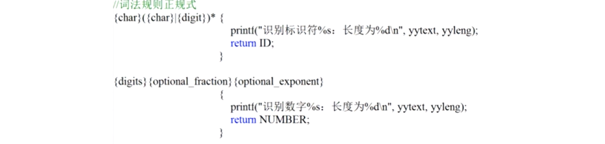

# 编译原理笔记2：词法分析基础与模式的形式化描述

词法分析，是词法分析器将源程序转化为线性记号流的过程。该过程中会对各种符号进行分类，比如将变量名换为标识符。

### 词法分析的含义：

1. 规定词形成的规则，定义什么词是合法的；
2. 根据规则识别输入的序列（词法分析），识别合法单词、指出非法的输入序列。

## 词法分析

### 模式、记号、单词

- 模式（Pattern）： 产生和识别元素的规则。也就是**定义的词法规则**；
- 记号（Token）： 按照某个模式（即，规则）识别出的（一组）元素。进行词法分析时，词法分析器将程序代码中的各个部分转为一个个记号的过程，就是根据规则得到一个记号流的过程；
- 单词（lexeme）： 被识别出的元素自身的值（一个），也称为词值。可以理解为源程序中一个个的字符串。

上面三个词放一起理解：源程序里面是一个个单词，我们使用“模式”这个规则，对单词进行识别、分类，把它们放到相应的记号里面去。记号是一堆单词，Pascal 语言的记号举例如下：

| 单词举例            | 记号的类别     | 模式的非形式化描述   |
| ------------------- | -------------- | -------------------- |
| const               | const（01）    | const                |
| if                  | if（03）       | if                   |
| <, <=, =, <>, >, >= | relation（81） | <, <=, =, ...        |
| pi, count, D2       | id（82）       | 字母打头的字母数字串 |
| 3.1416, 0, 6.02E23  | num（83）      | 任何数值常数         |
| "core dumped"       | literal（84）  | 双引号间的任意字符串 |
| { x is an integer } | comment        | 花括号间的任意字符串 |

- id: 标识符记号。这里“字母”需要进行严格的形式化描述；
- literal：字面量；
- comment：注释

#### 单词的基本分类

- 关键字  kw（keyword， reserved word）
- 标识符  id （identifier）
- 字面量  literal
- 特殊符号 ks （key symbol， special symbol）

例：


#### 记号

记号 = 记号的类别 + 记号的属性

例如，mycount > 25，由三个记号组成。类别就是上表中对应的类别编号


### 词法分析器的作用与工作方式

编译器中只有该部分直接接触源代码，其他的部分都是通过使用之前的工作成果来间接接触源代码。词法分析器要进行的工作包括：

1. 去掉注释、空格一类的无用部分；
2. 处理和平台有关的输入，比如文件结束符的不同表示；
3. **根据模式识别记号，交给语法分析器；**（主要功能）
4. 调用符号表管理器/出错处理器，进行相关处理。

工作方式：

1. 词法分析器单独进行扫描，生成记号流。再将整个记号流交给语法分析器；
2. 词法分析器作为语法分析器的子程序进行工作，**语法分析器调用词法分析器去读源程序，得到词法分析器返回的记号就拿来构造语法树**。然后用掉了这个记号就再去调用词法分析器读新的记号，如此重复；
3. 词法、语法分析器并行工作。两者有一个共享的记号流，前者不停读程序、把记号放入记号流，后者不停取记号流来构造语法树。

## 模式的形式化描述

### 字符串与语言

从词法分析角度来看，语言是记号的集合。

**语言 L 是**有限字母表 Σ 上有限长度**字符串的集合**，**字母表是字符的集合**。

字母表中的字符能够组成字符串。

例：字母表 Σ={ a, b, c }，则其上的语言 L = { ε, a, b, c, aa, ab, ac, ba, bb, bc, ... }  （ε为空串，长度为0）

#### 字符串的基本概念

| 术语          | 示例                                                         |
| ------------- | ------------------------------------------------------------ |
| \|S\|         | \|abc\| = 3                                                  |
| ε             | \|ε\| = 0                                                    |
| S1S2          | abc def = abcdef                                             |
| S<sup>n</sup> | (abc)<sup>3</sup> = abcabcabc                                |
| S 的前缀 X    | abc 的前缀有：ε, a, ab, abc                                  |
| S 的后缀 X    | abc 的后缀有：ε, c, bc, abc                                  |
| S 的子串 X    | abc 的子串有：ε, a, b, c, ...                                |
| S 的真前缀    | abc 的真前缀有：a, ab（去掉空和全）                          |
| S 的真后缀    | （去掉空和全）                                               |
| S 的真子串    | （去掉空和全）                                               |
| S 的子序列 X  | abdf 是 abcdef 的一个子序列（和原序列顺序相同，可去掉一些字母） |

| 术语      | 意义                                                         |
| --------- | ------------------------------------------------------------ |
| Φ         | 空集合                                                       |
| { ε }     | 空串是唯一元素                                               |
| X = L ∪ M | 并： X = { s\| s∈L or S ∈M }                                 |
| X = L ∩ M | 交：X = { s \| s∈L and S ∈M }                                |
| X = LM    | 连接： X = { st\|s∈L and t ∈ M }                             |
| X = L*    | (星)闭包：X= L<sup>0</sup>∪L<sup>1</sup>∪L<sup>2</sup>∪...   |
| X = L+    | 正闭包：X= L<sup>1</sup>∪L<sup>2</sup>∪L<sup>3</sup>∪...   等于LL* |

若 L = {a, b}, M = {c, d}, 则 LM = {ac, bc, ad, bd}, L∪M = Φ

L* = { ε, a, b, aa, bb, ab, ba, aaa, ... }

L+ = { a, b, aa, bb, ab, ba, aaa, ... }


### 正规式与正规集

**正规式是用来描述**词法规则的，也就是描述：**记号该长成什么样子、数字该长成什么样子**之类。

正规式（Regular Expression，也叫正则表达式）是在字母表之上的集合——正规式表示集合。

**正规式表示的集合叫做正规集，而正规集是语言，因此正规式表示语言。**

比如有个正规式是字母 a，那么正规式 a 表示集合 {a}，集合 {a} 就是语言 L(a)。


正规式表示正规集，正规集是与正规式对应的语言。

这两个概念是词法分析的基础。

#### 正规式和正规集的递归定义

Σ 是有限字母表，则其上的正规式及其表示的集合（即正规集）递归定义如下：

1. ε 是正规式，其表示集合（正规集） L(ε) = {ε} 
2. 若 a 是 Σ 上的字符，则 a 是正规式，它表示集合 L(a)={a}
3. 若正规式 r 和 s 分别表示集合 L(r) 和 L(s)，则
   1. r|s 是正规式，表示集合 L(r) ∪ L(s)（**“|”在正规式中表示“或”**，也可以写作  r + s ）
   2. rs 是正规式，表示集合 L(r)L(s)（直接将两个语言拼接起来，也可以写作 r·s）
   3. r* （正规式是一个星闭包）也是正规式，表示集合(L(r))*（L(r)这个语言进行星闭包）
   4. (r) 是正规式，表示的集合仍然是 L(r)（也就是说正规式 r 外面括上括号得到的 (r) 仍然是正规式，加括号可以用来改变运算次序）

语言是字母表上字符串的集合，而正规式是语言，因此**正规式是字母表上字符串的集合**。

可以用正规式描述的语言，就是正规语言或正规集

##### 定义的扩展说明

1. 运算有优先级和结合性

   - 三种运算都有左结合的性质（左结合的意思是，**当多个同优先级符号连写时是从左往右算**。如果**从右往左算就叫右结合**）
   - 优先级从高到低：闭包、连接、或

   正规式中不必要的括号（去掉了也不影响运算顺序）是可以省略的。

   例：正规式： a|b*c 表示的语言有以下两种情况：

   1. 表示一个串：a
   2. 表示另一个串：以 0 到多个 b 开头，以 c 结尾

2. 正规式的等价

   **长得不同的正规式可以表示同一个正规集**（就像加法中的1+3、2+2都可以表示4一样），即，同一个正规集可以对应多个正规式。

#### 正规式等价

定义：若正规式 P、Q 表示了同一个正规集，则称 P、Q 是等价的，记为 P = Q。

【例】： 设字母表 Σ={a, b, c}， 则 Σ 上有：

| 正规式     | 正规集                                                   |
| ---------- | -------------------------------------------------------- |
| a, b, c    | {a}, {b}, {c}                                            |
| a\|b, b\|a | {a}∪{b} = {a, b}                                         |
| a(a\|b)*   | {a, aa, ab, aba, abb, aab, ...}，以 a 为首的 ab (星)闭包 |
| Σ*         | {ε, a, b, c, aa, ab, ac, ba, bb, bc, ...}                |

【例】：令 L(x) = {a, b}, L(y) = {c, d}

&nbsp;&nbsp;&nbsp;&nbsp; 则 L(x|y) = {a, b, c, d}

&nbsp;&nbsp;&nbsp;&nbsp;&nbsp;&nbsp;&nbsp;&nbsp;&nbsp;&nbsp;L(y, x)  = {a, b, c, d}

**判断等价性**，可以根据定义，证明两个正规式是否能表达同一个集合；也可以使用正规式的代数性质进行运算比较：

| 公理                                | 公理                 |
| ----------------------------------- | -------------------- |
| r\|s = s\|r                         | ( r s ) t = r( s t ) |
| r\|( s\|t )  = ( r\|s )\|t   交换律 | ε r = r ，   r ε = r |
| r ( s\|t ) = r s \| r t   分配律    | r* = ( r+ \| ε )     |
| ( s\|t ) r = s r \| t r             | r\*\* = r\*          |

简言之，就是：

- |可交换、可结合；
- · 对 | 可分配； 
- · 可结合；
- 幂等


### 记号的说明

先复读一遍模式、记号的概念：

- 模式（Pattern）： 产生和识别元素的规则，就是定义的词法规则；
- 记号（Token）： 按照某个模式（或规则）识别出的元素（一组）。进行词法分析时，将程序转为一个个的记号，就是根据规则得到一个记号流；

**正规式可以用于严格地规定记号的模式**。用正规式说明记号的公式：

**记号=正规式**   读作“记号定义为正规式” / “记号是正规式”。不引起混淆的情况下，可以直接把说明记号的公式叫做正规式/规则

e.g. id = a ( a | b )* 读作：“id定义为a(a|b)\*”（这里的 id 就是一个标识符了。定义为a开头的ab串）

【例】记号 relation、id、num 分别是 Pascal 的关系运算符、标识符和无符号数，它们的正规式表示如下：

```c
relation = < | <= | <> | > | >= | =
    
id = (a|b|c|d|e|f|g|h|i|j|k|l|m|n|o|p|q|r|s|t|u|v|w|x|y|z|A|B|C|D|E|F|G|H|I|J|K|L|M|N|O|P|Q|R|S|T|U|V|W|X|Y|Z)
(a|b|c|d|e|f|g|h|i|j|k|l|m|n|o|p|q|r|s|t|u|v|w|x|y|z|A|B|C|D|E|F|G|H|I|J|K|L|M|N|O|P|Q|R|S|T|U|V|W|X|Y|Z|0|1|2|3|4|5|6|7|8|9)*
    
num = (0|1|2|3|4|5|6|7|8|9)(0|1|2|3|4|5|6|7|8|9)*	// 整数部分
      (ε|.(0|1|2|3|4|5|6|7|8|9)(0|1|2|3|4|5|6|7|8|9)*)	// 小数部分
      (ε|E(+|-|ε)(0|1|2|3|4|5|6|7|8|9)(0|1|2|3|4|5|6|7|8|9)*)	// 指数部分
```

其中，一些东西可以进行简化描述

#### 简化描述

1. **正闭包**：r 表示 L(r) 的正规式，那么 r+ 就表示 (L(r))+的正规式。**正闭包要求 r 出现一次以上**。

   即：**r+  = rr* = r\*r,  r* = r+|ε**

   比如：(0|1...|9)(0|1...|9)* 可以化简为 (0|1...|9)+

2. **可缺省**：r? 表示 L(r)∪{ε} 的正规式。

   即：**r? = r|ε**

   比如： E(+|-|ε) 可改写为：E(+|-)?

上面这些运算中的 +、? 、* 的结合性、优先级相同。

3. **字符组**。字符组是正规式的一种形式：**对于只由 | 构成的正规表达式 r，可以改写为[r']**：
   - r' 可以枚举：正规式 r = a|b|c 等价于 [abc]
   - r' 可以分段：[0123456789abcdefghijklmnopqrstuvwxyz]等价于[0-9a-z]

4. 非字符组。这里的“非”指的是非运算。也就是去掉某部分：

   若 [r] 是字符组形式的正规式，则 \[^r] 表示 Σ -L(r) 的正规式，例如：

   若 Σ={a, b, c, d,  e, f, g}，则 L(^abc)={d, e, f, g}

5. 辅助定义。就是给已有的正规式起个名字，以后可以直接用这个名字指代。

   

   （如果 digits 不加花括号，那 digits 就是“ digittttt.... ”）

   optional_fraction：可选的小数位。小数点如果不加双引号，在这里表示任意一个字符。

   optional_exponent：可选指数



上面的是 id，下面的是 num


