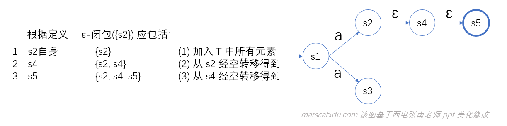
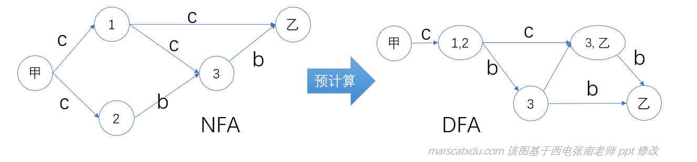
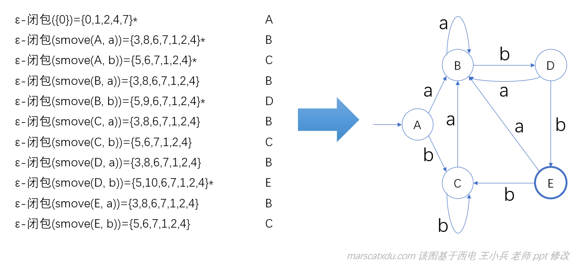
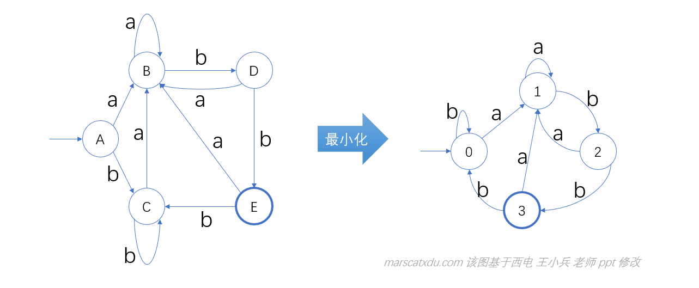

# 编译原理笔记5：从正规式到词法分析器（2）：NFA 记号识别、确定化、并行算法、子集法构造DFA

## NFA 识别记号的并行方法

之前的文章中写过的 “用一个输入字符串在一个 NFA 中逐个尝试各种路径、最终找到一条从初态到终态” 的方法被称为“NFA识别记号的串行方法”，然而这种方法效率着实不高——一条路走不通，要退回去重新走（也就是回溯），从而产生大量的无效计算。

为了解决效率问题，我们可以改变思路，实现记号的并行识别——这种方式可以防止由于反复试探产生的回溯。

具体思路是：从起点开始，用同一个输入字符同时去尝试到下一步的所有可行的路径。这样立足于当前，把所有可能的下一步全都跳完一次，再把这些结果收集起来，就可以获得一个”从当前起点开始所有可达的下一点的集合“。
此时我们虽然不知道这个集合中哪一个才是能够满足后续需求的（也就是能最终走向终态的），但至少这个集合中该有哪些元素，已经是确定的了。
接下来，再从上一步得到的集合中的所有点同时出发，每一个状态都按照上面相同的方式去尝试所有可达的下一状态，然后将所有收集到的可达状态再放入一个新的集合——这样我们就获得了从第二个状态出发的可达状态集合……如此往复，走遍所有的状态，最后的终态节点就在最后一个可达状态的集合中。

因为我们在每一步都考虑了下一步所有可能的转移，因此收集到的状态集合，就都是“确定”的了。
我们把一个个**不确定下一步**收集起来变成一个**下一步集合**，这样就实现了**将不确定的下一状态确定化**


## NFA 上识别记号的确定化方法

NFA 的不确定性，是由于：1. 从一个状态通过同样的字符可以达到不同的下一状态；2. 允许出现 ε 状态转移。

因此，为了消除这种不确定性就需要以下两个步骤：

1. 消除多于一个的下一状态转移： smove(S, a)，S 是状态集合，a 是字母表里的一个字符（不能是 ε ）；
2. 消除 ε 状态转移：使用函数 ε-闭包(T)，状态集 T 的 ε 闭包

- smove(S, a)：从状态集 S 中的每个状态出发，经过标记为 a 的边，**直接到达**的下一状态的全体；
- ε-闭包(T)：从状态集 T 中的每个状态出发，**经过若干次 ε 转移，到达的**状态全体。（经过任意有限次 ε 的都算）

### 状态集 T 的 ε-闭包(T) 

定义：状态集 T 的 ε-闭包(T) 是一个状态集，其满足：

1. T中所有的状态属于 ε-闭包(T)；
   （经过若干次 ε 转移嘛，当然 0 次也是算的，零次转移所能达到的当然就是所有的自身状态）
2. 如果 t 属于 ε-闭包(T) 且 move(t, ε)=u，则 u 属于 ε-闭包(T)；
   （比如 t 是之前的 T 的元素经过 n 次空转移到的状态，这里的 u 就是经过 n+1 次空转移到的）
3. 除此之外没有其他状态属于 ε-闭包(T)



所有经过 ε 跳转后抵达的状态都是结果集中的一个元素。


### ε-闭包算法

闭包U：是一个集合，其存储闭包计算的结果；

栈：栈中的元素，就是当前还没有考虑的状态节点（需要我们去考虑从该处沿空边出发的节点），没有考虑空边的状态都要入栈，需要考虑更多空边的时候，就从栈里面往出取节点就行了。

```pascal
function ε-闭包(T) is
begin
	for T中的每个状态t	// T 是要计算闭包的集合
	loop 
		将t加入U;// 先加入所有初状态，它们也算闭包运算结果元素
		push(t);// t是新加入的，当然没有考虑过它连接的空边，入栈
	end loop;
	
	while 栈非空 // 考虑经所有的状态引出的空边，能到达哪些状态
	loop 		// 对每一个状态，找空边所能到的所有下一状态
		pop(t);	// 栈顶的拿出来，考虑从该状态出发的空边转移情况
		for 每个u=move(t, ε)	//若存在u，可以从t经过空边跳到
		loop
			if u不在U中 then //新跳到的这个 u 并没有被加入 U
				将u加入U;
				push(u);//因为是新来的，故也没考虑过它的空边
			end if;
		end loop;
	end loop;
	
	return U;
end ε-闭包
```

例：


图中的 U 代表我们最终返回的的结果集合，其元素是在整个算法运行的过程中被逐渐添加的；Stack 是上面伪代码中提到的“栈”，用来存储运行时临时保存的待考虑状态（也就是还没被检查所有下一状态的状态）。


## NFA 并行算法 

输入：NFA N, x(EOF)， s0（NFA的初态），F（NFA的终态集）
输出：若 N 接受 x，打印“yes”，否则"no" 
方法：用下面的过程对 x 进行识别，其中 S 是一个状态的集合


与前面的 模拟DFA 相比，有如下区别：

|              | 模拟DFA                     | 模拟NFA           |
| ------------ | --------------------------- | ----------------- |
| 开始         | 初态只有一个（s0）          | 初态是个集合（S） |
| 下一状态转移 | 得到下一个单一状态          | 得到下一状态集合  |
| 结束         | s is in F，即终态在终态集中 | S∩F ≠ Ø           |

但模拟 DFA 与模拟 NFA 也有一个共同点，就是【算法与模式无关】：DFA 和 NFA 都是作为数据（参数）交给算法的，算法的运行与具体的自动机无关。

[DFA 算法]: http://www.marscatxdu.com/wordpress/index.php/2020/04/06/compile_principle_course_note_3/#DFA

#### NFA 并行算法例：识别 abb 和 abab

所用的 NFA 如下图所示


- 识别 abb：

  1. 计算初态集： ε-闭包( {0} ) = {0, 1, 2, 4, 7}		记作集合A

     该步骤创建初始状态集

  2. 读取到输入字符 a，计算从 A 出发经过 a 到达的状态集：ε-闭包( smove(A, a) ) = {8, 3, 6, 7, 1, 2, 4} 记作集合B，B 的详细计算过程如下，写的比较细，懂的可以直接略过。。

     因想要的是从状态集合 A 出发进行经过 a 的状态转移再求个空闭包，因此我们需要对于集合 A 中的每个状态，都进行一次 a 状态转移，再将转移后的结果放入一个新的集合，最后对这个集合整体求一次空闭包。这一步骤，我们一步步来，首先我们建立一个临时集合 T，用于存放 A 集合中经过 a 了转移，却还没有进行闭包运算的状态。

     1. 对集合 A 中的状态 0，没有从 0 开始的 a 转移，无事发生，不需要填入集合 T；
     2. 对集合 A 中的状态 1，没有从 1 开始的 a 转移，同样不需要填入集合 T；
     3. 对集合 A 中的状态 2，其经过一次 a 转移，到达状态 3，将 3 加入 T，现在 T = {3}；
     4. 对集合 A 中的状态 4，没有从该状态开始的 a 转移，不填入 T 集合；
     5. 对集合 A 中的状态 7，其经过一次 a 转移，到达状态 8，将 8 加入 T，现在 T = {3, 8}；

     至此， ε-闭包( smove(A, a) ) 中的 smove(A, a) 计算完成，其结果是 smove(A, a) = T  = {3, 8}；

     接下来，对 T 进行闭包运算：

     1. 3 经过一次空转移，得到 6；
     2. 3 向右侧进行一次空转移，得到 7；
     3. 3 向左侧进行一次空转移，得到 1，再从这个 1 出发，进行空转移，得到 2、4；
     4. 没有从 8 开始的空转移。

     至此，ε-闭包( T )，也即 ε-闭包( smove(A, a) ) 计算完成，结果是{3, 8, 6, 7, 1, 2, 4}

  3. 读取到输入字符 b，计算从 B 出发经过 b 到达的状态集：ε-闭包( smove(B, b) )={9, 5, 6, 7, 1 , 2, 4}，记为集合 C（计算方法与上一步完全相同）；

  4. 读取到输入字符 b，计算从 C 出发经过 b 到达的状态集：ε-闭包( smove(C, c) )={10, 5, 6, 7, 1, 2, 4}，记为集合 D （计算方法与前两步完全相同）；

  5. 结束。计算 D∩{10} = {10}，终态集与结果集交际非空，接受。识别的路径为 A<u>a</u>B<u>b</u>CbD

  因此，我们可以确定， 初态和终态之间存在一条为 abb 的路径。

  但实际上，对abb的识别也可以认为是：

  0 <u>ε*</u> A <u>aε*</u> B <u>bε*</u> C <u>bε*</u> D，即，通过一个输入字符进行直接转移后，再经过若干次的空转移，转移到了下一下一状态集。路径上的标记是 ε\*aε\*bε\*bε\*，去掉空转移就是 abb 了，即 ε\*aε\*bε\*bε\* = abb。 

- 识别 abab

  1. 初态集： ε-闭包( {0} ) = {0, 1, 2, 4, 7}  记作 A
  2. 从 A 出发经 a 到达：ε-闭包( smove(A, a) ) = {8, 3, 6, 7, 1, 2, 4} ，记作 B
  3. 从 B 出发经 b 到达：ε-闭包( smove(B, b) ) = {5, 9, 6, 7, 1, 2, 4} ，记作 C
  4. 从 C 出发经 a 到达：ε-闭包( smove(C, a) ) = {8, 3, 6, 7, 1, 2, 4} ，**等于 B**
  5. 从 B 出发经 b 到达：ε-闭包( smove(B, b) ) = {5, 9, 6, 7, 1, 2, 4} ，**等于 C**

  识别路径为：A <u>a</u> B <u>b</u> C <u>a</u> B <u>b</u> C，由于 C ∩ {10} =  Ø，所以不接受。

观察上面的两个识别过程可以发现，当我们使用同一个 NFA 去识别两个字串时，产生了大量的重复计算（两个例子的前三步是完全相同的，第二个例子中的 3、5 也进行了完全相同的转移却又重新进行了计算）。

既然会出现对于相同输入的、重复条件下的重复计算，那么我们就可以在这里偷懒了——我们可以在正式使用一个 NFA 之前，对这个 NFA 进行预先的分析和计算，把在各种状态集情况下进行的各种转移情况计算出来，存储在一张表中。这样当我们真正分析输入序列时，就可以根据当前的状态和要进行的转移去查表、得到结果了！

这就是子集法构造 DFA 的思路——子集法构造 DFA，实际上就是对 NFA 并行识别记号方法的提前计算并记录的过程！

**将 NFA 上的全部路径确定化并记录下来，就能够造出与该 NFA 等价的 DFA**

下面举个例子来说明 NFA 到 DFA 的转化

这个例子假设了一个人要从甲地出发到达乙地，如下图左侧部分所示。中间 1、2、3 是途中经过的地点，转移的 c 指汽车，b 指自行车，我们要找出从甲到乙的交通方式的组合。



这个问题的模型实际上是个 NFA，就像图上画的那样。对于该 NFA，我们可以通过预计算的方式，建立一个经过状态转移到达到达状态集的 DFA（DFA 中的每个状态都是一个状态集——以原来的 NFA 中的某些状态为元素组成的集合）。该 DFA 与原 NFA 等效，能够识别 cc、ccb、cbb

识别 cc：甲 <u>\_c\_</u> {1, 2} <u>\_c\_</u>{3, 乙}，接受
识别 cbc：甲 <u>\_c\_</u> {1, 2} <u>\_b\_</u>{3} <u>\_c\_</u> ? ，不接受

DFA的优点：

1. 消除了不确定性（将 NFA 的下一状态集合，合并为一个状态）
2. 无需动态计算状态集合（相对于模拟 NFA 算法）

对于有 k 个状态的 NFA，与之等价的 DFA 最多有 2<sup>k</sup> 个状态（因为 DFA 中的每个状态都是 NFA 所有状态的一个子集，所以 DFA 的最大状态数量就是 NFA 的子集数量）


## 从 NFA 到 DFA（子集法构造 DFA ）

该算法将从 NFA 的初态开始，生成可达状态机状态之间的转移关系。

输入： NFA N
输出： 等价于 N 的 DFA D。初态 ε-闭包( {s0} )（这个东西的运算结果，就是 NFA 的初态集），终态是含有 NFA 终态的状态集合。
该算法中要用到两个数据结构：Dstates（状态，用于存储生成的 DFA 状态）、Dtran（用于计算 DFA 状态之间的状态转移）
方法：用下述过程构造 DFA：


我们要将字母表中所有的字符都考虑一遍之后，才能说考虑完一个状态和与之相关的状态转移。然后再去考虑其他没有被标记的状态（也就是Dstates中的其他元素），即回到最外层的while，开始新的一轮循环——再去考虑在这个状态下，经过字母表中所有字符能够达到的状态。

最后当 Dstates 中没有剩余元素时，DFA就完全生成了。最终得到的 Dstates 和 Dtran 就是我们最终生成的 DFA （即，我们得到了一个确定的状态转移表）

**例：用上述算法构造(a|b)*abb**


根据这些运算的结果，我们就可以构造出来如下图所示的自动机：



嗯，这样就完成了我们的 DFA 了。

DFA 可真是个好东西，一旦有了 DFA，我们就可以根据它来简单地识别输入序列了！不用再进行那种粗野的蛮力计算了。

但，我们当前的 DFA 就已经是最优了吗？当然不，还能优化的！

再观察我们上面画出来的 DFA，不难发现（老师说不难发现，我还真就没看出来。。。），从 A 开始经过a、b能够到达的下一状态，和从 C 开始经过a、b能够到达的下一状态是相同的！（A经过a到达B、A经过b到达C；C经过a到达B、C经过b到达C）

这种情况，我们就说 A、C 是等价的：分别以这两个为初始状态，在经过不同的输入序列转移后达到的效果完全相同。

这样，我们就可以把A、C合并，改写成下面的形式——从A、C出发的都改为从0出发，修改后就能得到新的DFA，减少了一个状态。这就叫最小化 DFA



具体的最小化，下篇博客再说，这个已经太长了。。。。。。

