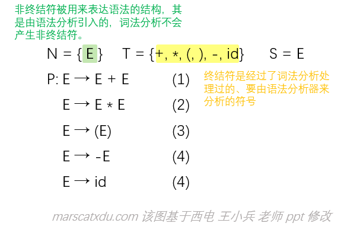
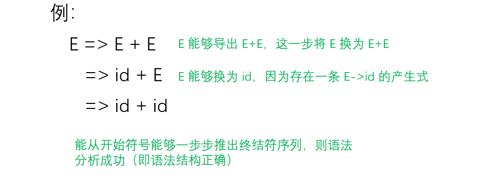

# 编译原理笔记8：语法分析（2）上下文无关文法 CFG

写在前面：

前几篇博客中说到的词法分析，做的是从 【x+y → id+id】 的工作，也就是要将源代码变成一个记号流。语法分析，就是要通过为这个记号流序列（在“龙书”中，该序列被称为“词法单元序列”）构造一棵语法分析树，构造该树的方式就是“推导”（事实上，分析树其实是推导的图形化表示）。

若能够进行这样的推导： E=>E+E=>id+E=>id+id，即由 E 推出了 id+id，与从词法分析器那里得到的 id+id 相同，则说明语法结构正确。

## CFG 概述及其四元组表示

CFG 是什么？**CFG 是描述语言语法的工具，CFG 通过推导的方式产生语言。**我们使用这个工具来对定义我们的语法，然后可以使用一些算法来基于它构造我们想要的词法分析器！这个分析器能够将我们的记号流构造为合法的语法树。

&emsp;类似于我们在这里学过的很多其他东西，CFG 也一样可以使用四元组表示：

&emsp;CFG G=(N, T, P, S)

&emsp;该四元组中的 N、T、P 都是集合，分别是 **非终结符（Nonterminals）、终结符（Terminals）、产生式（Productions）** 的集合。S（Start Symbol） 是文法的开始符号，是一个特殊的非终结符。

其中：

- N 和 T 没有交集；
- P 的形式是 A→a，A∈N，a∈(N∪T)*（终结符或非终结符组成的一个串），箭头左侧的被称为左部，右侧的被称为右部

<div style="box-shadow: 0 1px 4px 0 rgba(0,0,0,0.2);
            transition: 0.2s;
            border-radius:5px;
            padding:15px;
            color: gray;
            argin:3px 5px 8px 5px">
	与 CFG 相对的，还有一种文法叫做“上下文有关文法”即 CSG（Context Sensitive Grammar），
    <div style="border-style: dashed; 
            border-radius:5px; 
            padding:15px; 
            margin:3px 5px 8px 5px; 
            border-width: 1px; 
            border-color: grey">
        int i;<br>
        i = 10;	// 这就叫CSG，下面 i 的值要和上面声明的相关<br><br>
        下面这种就是 CFG：<br>
        int i;<br>
        i = "abc";
    </div>
    然而，CFG 也可以使用符号表来处理上下文有关的情况。例如，当我们读到 "int i;" 时，就将 i 放入符号表中存储下来，当我们后面遇到 "i=10;" 时，就要到符号表中查找是否有已经声明过的 i 存在。注意，这种处理上下文有关的方式不属于语法分析的方法。
</div>


例子：简单的算术表达式的 CFG 表示：

<div style="padding:0px 20% 0px 20%;
            margin:3px 5px 8px 5px">
	
</div>

产生式中的  “ → ”  读作“定义为” / “导出为”，例如 “ E→E+E ” 读作 “E 导出为 E+E”，其表示 “算术表达式定义为两个算术表达式相加”。

注意，CFG 一旦定义完成，语法也随之定义完成了。因此，**对于一个句子的合法性检查，就要根据我们定义的 CFG 来做**。比如，如果按照上面这个例子的语法定义来看，“- - - - - id” 就是一个合法的句子，而 “ id - id ” 却不合法。若想要其合法，我们需要在产生式中追加 “ E→ E - E ” 。 


## 产生式集合表示 CFG

然而，用四元组来表示 CFG 还是太麻烦，因此大佬们提出了这样一个简化的表达方式——只写产生式集合，然后其他的部分我们可以通过一些预先约定好的规定来通过产生式集合求出来。这样一来，我们就可以省略很多东西了，就像下面这个：

```
P:	E → E + E	(1)
	E → E * E	(2)
	E → (E)		(3)
	E → -E		(4)
	E → id		(4)
```

使用该表示方法的前提是文法本身没有错误（似乎是废话？）。我们做预先约定好的规定如下：

1. **CFG 的开始符号 S ，是第一个产生式的左部**——这就把四元组的最后一项 S 定义出来了；

2. **N 是可以出现在产生式左边符号的集合**——这就把四元组的第一项 N（非终结符） 定义出来了；

3. **T 是绝不出现在产生式左边的符号集合**——这就把四元组第二项 P 定义出来了。
   注意，是**只在右面出现**的。像下面这种情况：

   ```
   E -> ID
   ID -> ab
   ```

   尽管上面的 ID 在第一行出现在了右边，到第二行却出现在左边，因此 ID 也是非终结符。在且仅在产生式右面的符号，才能叫作终结符。

因此，只要我们写出来 P ，整个四元组就都定义出来了——因为四元组中的其他三元都可以根据定义来从 P 中分类找出来

其实也可以写得更简单——就是用 | （或）符号来连接各个产生式，以省略多余的 E

比如：

```
E → E+E
	|E*E
	|(E)
	|-E
	|id
或
E → E+E|E*E|(E)|-E|id
```

这种产生式表示也被称为“巴克斯范式”（BNF, Backus Naur Form），其中 → 用 ::= 表示。

这种书写方法中，**每个右部的权利是相同的**，因为当我们说 “ a 或 b ” 时，并没有同时表达出来 “ a 重要还是 b 重要 ”的意思，我们也不能简单地因为 a 在 b 的前面而推断 a 比 b 更重要。这里的“权利”与文法的二义性有关。

终结符与非终结符还可以用下面的不同写法进行区分：

1. 大小写区分：	E → id
2. 用双引号区分：E → "id"   E → E "+" E
3. 用尖括号区分：E → \<E> + \<E>

## CFG，用推导，产生语言

推导，实际上就是得到 CFG 所定义的语言的过程。

回忆正规式——写正规式的时候，就已经有“产生”的含义在里面了

在正规式的定义中，我们可以说

> a|b是一个正规式，它表示的正规集是：a表示的语言和b表示的语言取并集

——注意看这句话——正规式表示正规集，正规集是两个语言的并集，那么也就是说正规式表示语言的集合。我们已经在定义正规式的时候把语言定义出来了！

正规式定义的时候，正规集这个语言就已经随之定义完了；但是在定义 CFG 的时候，我们可没有说“CFG产生的语言”这类的话，也就是说在我们写下 CFG 时，这个语言并没有被随 CFG 定义出来。

因此，我们要单独考虑怎么定义语言——语言，可以由 CFG 通过推导产生，我们通过推导得到 CFG 所定义的语言。

> 通俗地讲，产生式产生语言的过程，就是从 S 开始，对产生式左部的非终结符反复地使用产生式：将产生式左部的非终结符替换为右部的文法序列（用 => 表示展开产生式），直到得到一个终结符序列。




利用产生式产生句子。**左侧是产生式**，产生式定义语法。**右侧是根据左侧的规则进行的几步推导过程**。右边这几行式子的每一行推导符号右侧的符号序列就叫做“文法符号序列”。

### 直接推导

推导，就是把非终结符按照产生式一步步换成终结符的过程。

> 利用产生式产生句子的过程中，将产生式 A → γ 的右部代替文法符号序列 αAβ 中的 A 得到 αγβ 的过程，称 αAβ **直接推导**出 αγβ ，记作 αAβ => αγβ 
>
> 若对于任意文法符号序列 α1, α2, ...αn，均有 α1=>α2=>...=>αn，则称此过程为零步或多步推导，记为 α1=*>αn，当 α1=αn 时称为零步推导。
>
> 若α1≠αn，即推导过程中至少使用一次产生式，则称此过程为 **至少一步推导**，记作  α1=<sup>+</sup>>αn

说白了。。根据产生式所描述的规则进行代入替换，这里分清楚两种箭头就行了：→描述推导可以使用的规则，=>描述推导的过程。

推导有自反性（对任意的 α，都有 α=\*>α）和传递性（若 α=\*>β， β=\*>γ， 则 α=\*>γ）。

<div>
    <div style="border-style: dashed; 
        border-radius:5px; 
        padding:15px; 
        margin:3px 5px 8px 5px; 
        border-width: 1px; 
        border-color: grey">
        推导，是一种二元关系<br>
        一个元素如果和它自己满足该二元关系，那么它就是自反的<br>
        即 aRa
        </div>
</div>

### 由 CFG 产生语言

由 CFG G 产生的语言 L(G) 定义为：

- L(G) = {ω | S=+> ω and ω∈ T* }

  其中：

  - S=+>ω：开始符号 S 经过至少一步推导，能够推出 ω
  - ω∈ T*：ω 是由终结符组成的一个串

  上面这两条合在一起，就可以保证我们能基于这套规则来从开始符号推出词法分析器给我们的那个终结符串。基于此推出来的集合，就是语法规则所描述的语言。

该 L(G) 被称为 **上下文无关语言**（Context Free Language，CFL），ω 被称为**句子**。

- 若 S=+>α ，α∈(N∪T)*，则称 α 为 G 的一个句型

  其中：

  - α∈(N∪T)*：推导过程中的 α 时终结符和非终结符组成的一个串。
  - 句型可含终结符、非终结符。而句子只能包含终结符，句子是句型的特例。

  （句型，是句子的模型，有句子的结构和特征，是句子的半成品）

在推导的过程中，若每次直接推导均替换句型中最左边的非终结符，则称为最左推导。由最左推导产生的句型被称为左句型。

右句型与之对称，最右推导也被称为**规范推导**

例如：E => E+E => E+id	// 规范推导

#### 在？为啥从右往左叫规范？凭什么歧视左？

其实这个和语法分析的方式有关。有两种语法分析方式，分别是**最左推导的自上而下**方式和**最右推导的自下而上**方式。前者虽然与人的思考方式类似，但其实际的语法分析能力是比较差的，因此实际应用中主要从下向上构造语法树。

下图是自下而上构造分析树，推导方式是自下而上。


### 总结一下这些奇奇怪怪的东西

推导，就是得到 CFG 所定义的语言的过程。语言是一个集合，集合中的任何一个元素都是一个句子。推导过程中得到的串叫做句型，句型可以包含终结符和非终结符。

- 语言，是以【从开始符号进行至少一步推导得到的】终结符串为元素的集合；
- 推导，是 CFG 推导得到语言的过程，CFG 中的核心就是产生式；
- 产生式，是用于描述非终结符替换规则的式子；
- 分析语法，需要构造语法分析树；
- “自上而下”、“自下而上” 都是语法分析的方式；