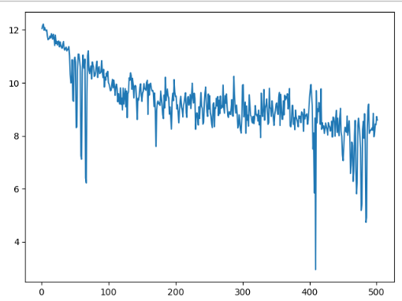
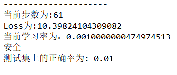

## 自然语言处理期中大作业 实验报告

17341190 叶盛源 数据科学与计算机学院

### 数据爬取

本次实验需要自己从新闻网站的科技版爬取1000条新闻的正文内容，我这里选择了腾讯新闻科技板块的数据` https://new.qq.com/ch/tech/ `，如下图所示：


本次爬虫我使用的是一个分布式的爬虫框架scrapy，首先我们需要解析出主页的每个新闻的的链接，通过分析网页的html源代码，可以解析出使用`xpath`可以得到网页的链接：

````python
xpath('/html/body/div/div[3]/div[2]/div/div/ul/li/a/@href')
````

我们在parse函数中进一步请求这个url，并设置下一级的回调函数为parse_next

````PYTHON
	def parse(self,response):
		newsurl_list = response.xpath('/html/body/div/div[3]/div[2]/div/div/ul/li/a/@href').extract()
		for U in newsurl_list:
			url = 'http'+U[5:]# 改成http://
			yield scrapy.Request(url = url,callback = self.parse_next,dont_filter=True)
````

然后进入网页内部，我们进一步解析正文部分的xpath：

```python
xpath('/html/body/div[3]/div[1]/div[1]/div[2]/p//text()')
```


通过分析页面发现，热点精选部分的数据是实时更新的，并且一直下拉刷新，就可以一直刷新出新的数据，这样就可以一次性爬出来目标数量的文章。这里遇到一个问题就是，下拉刷新是一个动态的网页变化，而不是请求一个新的url进入新的页面，因此我这里采用了一个动态的爬取方式：使用`selenium`库，这个库可以模拟网页浏览器操作网页，这就可以触发下拉刷新的过程，这个方法的缺点是爬取速度相对较慢，但反爬效果好，稳定。

```python
		if request.url=='http://new.qq.com/ch/tech/':
			headers = {'User-	def process_request(self, request, spider):
		'''
			不断下拉刷新获取动态页面
		'''
		if request.url=='http://new.qq.com/ch/tech/':
			headers = {'User-Agent':'Mozilla/5.0 (Windows NT 10.0; WOW64) AppleWebKit/537.36 (KHTML, like Gecko) Chrome/55.0.2883.87 Safari/537.36'}
			url=request.url

			chromeOptions = webdriver.ChromeOptions()
			self.browser = webdriver.Chrome(chrome_options=chromeOptions)
			self.browser.get(url)

			for i in range(10):
				js = "document.documentElement.scrollTop = document.documentElement.scrollHeight * %f" % 20
				self.browser.execute_script(js)
				time.sleep(0.5)

			html = self.browser.page_source
			#self.browser.quit()
			return scrapy.http.HtmlResponse(url=request.url, body=html.encode('utf-8'), encoding='utf-8',
											request=request)
		else:
			return NoneAgent':'Mozilla/5.0 (Windows NT 10.0; WOW64) AppleWebKit/537.36 (KHTML, like Gecko) Chrome/55.0.2883.87 Safari/537.36'}
			url=request.url

			chromeOptions = webdriver.ChromeOptions()
			self.browser = webdriver.Chrome(chrome_options=chromeOptions)
			self.browser.get(url)

			for i in range(10):
				js = "document.documentElement.scrollTop = document.documentElement.scrollHeight * %f" % 20
				self.browser.execute_script(js)
				time.sleep(0.5)

			html = self.browser.page_source
			#self.browser.quit()
			return scrapy.http.HtmlResponse(url=request.url, body=html.encode('utf-8'), encoding='utf-8',
											request=request)
		else:
			return None
```

我们用谷歌浏览器模拟人一直向下拉浏览器刷新，然后获取当前的html界面，最后返回给parse函数解析出链接数据。最后通过pipeline将数据写到文件夹内。


### 数据预处理

下一步要对爬取到的数据进行一个预处理。因为这次的任务主要是一个英文填词的任务，所以所有的非中文符号是全部可以去除的：

```python
punctuation = ", ：:＃＄％＆＇（）＊＋，－：；＜＝＞＠［＼］＾＿｀｛｜｝～｟｠｢｣､、〃《》「」『』【】〔〕〖〗〘〙〚〛〜〝〞–—‘’‛“”„‟…‧﹏ '"
article = re.sub(r'[{}]+'.format(punctuation), '', article)
```

```python
sentence = re.sub('[^\u4e00-\u9fa5]', '', sentence)
```

接着我们需要进行分词，我们使用jieba的库进行分词。jieba分词可以让用户自己添加自己的词表进入词典中提高分词准确度，但因为这边科技相关词分类一般都比较准确，所以不需要过于细致的加入词语。

```python
result = jieba.lcut(sentence)
```

接着需要去除停用词，可以提升训练模型的速度和准确度，因为停用词经常不能提供语义的信息，但它们又有可能被当作序列的组成部分被输入到模型中，所以一般需要专门去掉停用词的信息。

```PYTHON
word_dict= []
for word in word_dict:
    if word not in stop_words:
        word_dict.append(word)
```

去除停用词后我们就可以统计词语的信息，加上标号，统计词语出现的频率等，并写入文件中。


### n-gram模型

第一个要编写的模型是n-gram模型，用n-gram来预测词语，就是考虑要预测词语的前n-1个词语对当前词语的贡献。计算中最重要的就是考虑当这个词语为什么的时候$p(w_i|w^{i-1}_{i-n+1})$能取到最大值，其实就是一个最大似然估计的过程:
$$
p(w_i|w^{i-1}_{i-n+1})=f(w_i|w^{i-1}_{i-n+1})=\frac{c(w_{i-n+1}^{i})}{\sum_{w_i}c(w_{i-n+1}^i)}
$$
这次实验我选择了使用3-gram模型来进行预测词语。根据上述公式，句子的概率公式为：
$$
p(s)=p(w_1)\times p(w_2|w_1)\times p(w_3|w_1w_2)\times...\times p(w_m|w_{m-1}w_{m-2})
$$

#### 算法说明

**假如目标预测的句子是：苹果公司上市[mask]耳机下个月出新款的平板电脑，这里假如我们的答案是新款。**

要预测mask的值，其实就相当于找到一个词，当它放在句子的这个位置的时候，可以让句子出现的可能性最大化。简单考虑，假如我们这里是2-gram，应用上式可知，其中大部分的项对于不同的mask取值都是一样的，需要考虑的是上市对[mask]和[mask]对耳机的概率贡献，其实就是计算这些词对共现的条件概率，取概率最高的一个词语填到mask中。

#### 数据平滑

这里还要考虑一个问题就是，在使用3gram的时候可能出现目标词的前两个词语共现的次数是0，因为我们测试集的词语并不一定出现在训练预料库中，引起这个的原因可能是数据匮乏。因此我们需要采用一个**数据平滑**的方法，给概率为0的地方使用加一法。
$$
p(w_i|w_{i-1})=\frac{1+c(w_{i-1}w_i)}{\sum_{w_i}[1+c(w_{i-1}w_i)]}=\frac{1+c(w_{i-1}w_i)}{|V| + \sum_{w_i}[c(w_{i-1}w_i)}
$$
其中，V是被考虑语料的词汇量（全部可能的基元数）

#### 算法实现

为了充分利用到第一个词语和最后一个词语，我们需要在开头和结尾补上`<BOS>`和`<EOS>`：

```PYTHON
words.insert(0,  "<BOS>")
words.append("<EOS>")
```

因为我们要计算词语共现的概率，在3-gram中我们需要统计所有三元组出现的概率和二元组出现的概率，于是我们遍历我们的数据，将他们用字典装起来，这样我们在计算的时候就可以很快的索引到需要的数据了。

```PYTHON
for i in range(len(words)-1):
    key = (words[i], words[i+1])
    dict_2[key] = dict_2.get(key, 0) + 1

for j in range(len(words)-2):
    key = (words[j], words[j+1], words[j+2])
    dict_3[key] = dict_3.get(key, 0) + 1
```


最后我们就是直接计算句子的概率，因为有很多项是不必要算的因为对于任意目标词，他们的概率都一样，对概率的大小比较没有贡献，因此不计算，只考虑目标词语左右相邻的4个词语即可。

最后对100个句子进行了测试并和标准答案进行了比较，正确率约为2%，预测对了下列两个句子：

```
安徽合肥是目前国家批准建设的三大综合性国家科学[MASK]之一，拥有全球首个全超导托卡马克EAST核聚变实验装置，以及认知智能国家重点实验室、类脑智能技术及应用国家工程实验室等重点科研机构。
answer: 中心 

苏宁金服相关负责人在接受[MASK]采访时表示，《办法》出台后，公司也将积极配合监管机构开展相关工作。
answer: 媒体 
```

但听说别的同学可以到百分之10多的正确率，于是我借一个同学的数据集运行，争取率达到了9%，可见这个n-gram的实验结果受到数据集的影响很大，如果训练集和测试集更相关，则正确率往往更高。

n-gram是一个简单的统计模型，在现在的大数据时代可能不能充分利用到信息，但在数据量少的情况下，效果应该要比深度学习模型要好很多，可见统计学习模型也并不是一无是处，在特定的环境下也有其独有的功能。


### LSTM模型

本次实验采用了lstm网络的方法来训练句向量。

lstm网络是对循环神经网络的一个改进，最基础的循环神经网络的原理，就是上一步中神经网络隐藏层节点的值会和下一步的输入结合在一起作为下一次的输入，这就相当于允许信息从网络的一个步骤传递到下一个步骤。

  

 这种链的性质揭示了循环神经网络与序列和列表密切相关。它们是神经网络的自然结构，用来处理这些数据。在RNNs应用到各种问题上取得了令人难以置信的成功:语音识别、语言建模、翻译、图片字幕等等

但是很多时候，我们要推断一个词语，需要再前文很远的地方才能找到线索，比如说：”I lived in France, I worked there for many years, I…, I am now fluent in ___.”这里我们首先可以判断出应该填某种“语言”，但是究竟是哪个语言，就需要再往前找，也许很远很远，才能找到France这个词，这样才能确定答案是French。

面对这样的“长距离依赖”（Long-Term Dependencies），RNN的效果就开始变差了。虽然理论上可以通过仔细调参数在解决，但是在实践中，人们发现这个问题很难克服，即RNN很难学习到长距离的信息。	


 其实LSTM最主要的改进之处，就是把神经网络层中对信息的处理变得更加复杂、精细了 ，可以看到LSTM的内部结构如下：

  


---

**下面就一步步地分解上面的结构，逐层的理解：**  

####  遗忘门

 LSTM的第一步是决定从细胞状态中丢弃什么信息。这个决定是由一个称为“忘记门”（遗忘门）层的sigmoid层做出的。它通过将ht-1和xt合在一起，并通过sigmoid函数并为细胞状态Ct-1中的每个数字输出一个介于0和1之间的数字。1表示完全保留这个,0表示完全去掉这个 ，中间值则表示保留的程度。这个方法为神经网络提供了一种学习的方法，就是忘记很长时间的或者相关度不高的状态，去学习到当前的状态。

    

#### 输入门 

上一个输出加上这一次的输入后经过tanh层，将信息转化为一个新的候选值，tanh的作用就是相当于把数据规范化到-1和1之间，这些就是需要更新的值。他们还要再统一经过σ层，这一步就相当于一个“扫描仪”，检测每个要更新的值是否需要更新，或者需要更新多少，然后将扫描的结果得到0到1的值对应乘到tanh层后的结果，就是cell state中需要更新的值了 。  

#### Cell state（单元状态流）

单元状态流就是下面这个水平直线，它用于“记忆”当前的状态，上面包含记忆的删除、更新。它通过三个门传过来信息，来更新单元的状态。

 

 上面的两个门，“遗忘门”和“输入门”已经决定好了什么要遗忘，什么要更新保留了，现在就可以在cell state上执行了： 

  


#### 输出门

还是和上面一样， σ层识别哪一部分信息要输出，乘以当前的状态Ct(经过tanh处理过了)，就得到了我们的输出 。

  

---

#### 建模思路

因为lstm是一个rnn的升级版本，所以本质还是一个序列的神经网络，比如说我们的目标句子是`我爱你中国`我们lstm只能通过输入`我`、`爱`、`你`然后将lstm的输出结果展开成词表大小的词向量，然后使用softmax和交叉熵最大化`中国`在词向量中对应位置的概率值。

但如果将每个句子都拆解成一个个这样的短句输入来预测他们下一个词的话速度就太慢了，这就相当于将原来的一个句子拆开成一个个短句，数据量就很大，训练会更慢。

在训练lstm的过程中，我们上述的方法其实只用到了最后一个状态的输出，但当`我`输入后，其实也有输出，我们可以用这个输出来预测`爱`，`爱`输入后也有输出，我们可以用这个输出来预测`你`,以此类推。每个step其实都有一个输出，我们可以把他们给利用起来，有很多就可以不会重复计算了，所以我们将`我爱你`作为输入，`你爱中国`作为输出，输入和输出都是3个词语，一一对应计算交叉熵并使用反向传播算法最大化，就可以很大的提高计算效率，而且充分利用不同长度短句来进行的预测。

因此其实就是一个简单lstm模型，我们只需要将长度为N的每句话的前N-1个词语作为输入，后N-1个词语作为输出即可，然后写一个next_batch一次次取出数据然后输入到我们的模型中计算。

```python
self.inputdata.append(sen[: -1])  # 句子的前l-1个词为输入
self.outputdata.append(sen[1: ])  # 句子的后l-1个词为输出
```

处理好输入数据后，我们还需要处理输出的数据，将MASK加入分词词表进行分词，因为lstm只能序列预测，所以我们只能使用到lstm前面的词语作为输入，然后取出lstm输出的最后一个状态的值找到其中概率最大一个输出出来，作为我们的最终结果。

lstm的网络就是一个很简单的单向单层的lstm，在前后用全连接层来改变输出矩阵的维度：

```PYTHON
######### 全连接层 权重矩阵和偏置
        self.w = tf.Variable(tf.truncated_normal([nhidden, self.vocab_size]), dtype=tf.float32)
        self.b = tf.Variable(tf.zeros([self.vocab_size]))

        ########### 生成变量进行词嵌入
        self.embedding_mat = tf.Variable(tf.random_uniform([self.vocab_size, Embedding_Size], -1, 1))
        self.inputs = tf.nn.embedding_lookup(self.embedding_mat, self.x)
        self.dinputs = tf.nn.dropout(self.inputs, keep_prob=self.keep_prob)

        ############ lstm
        self.lstm_cell = rnn.BasicLSTMCell(nhidden, forget_bias=1.0, state_is_tuple=True)
        self.lstm = rnn.DropoutWrapper(self.lstm_cell, output_keep_prob=self.keep_prob)
        self.initial_state = self.lstm.zero_state(Batch_Size, dtype=tf.float32)
        ############ 每个step的状态都要用到 因此直接用了lstm的output
        self.output, _ = tf.nn.dynamic_rnn(self.lstm, self.dinputs, initial_state=self.initial_state, dtype=tf.float32,time_major=False)

        self.lstm_out = tf.reshape(self.output, [Batch_Size*seq_len, nhidden])

        ########## 全连接层
        self.prob = tf.reshape(tf.matmul(self.lstm_out, self.w) + self.b,[Batch_Size, seq_len, self.vocab_size])
```


#### 损失函数

损失函数我们这里使用的是一个二维的交叉熵函数`sequence_loss`这个函数在自然语言处理中很常用，它和普通的一维交叉熵一样，都是为了最大化目标的概率，但因为每个句子对应的lstm的输出是一个二维的向量，也就是step*vocab_size，我们需要从vocab_size中选出对应要最大化概率的词语的下标，其他的则是需要最小化概率的词语，然后一样使用交叉熵，就可以得出结果。

调用的代码如下：

```python
self.loss = tf.reduce_mean(tf.contrib.seq2seq.sequence_loss(self.prob,
                                             self.y,
                                             self.mask,
                                             average_across_timesteps=False,               											  average_across_batch=True))
          
```


#### 实验结果分析

因为模型比较简单，所以并没有很多的指标。下面绘制了数据集运行了500次batch后，模型的loss变化曲线。



因为测试集的数量太少，偶然性太大，所以loss可能会出现一些剧烈的抖动，但我们总体可以看到loss是一个一直在下降的过程，而在过程中也是预测争取的词语越来越多。因为计算机的运算速度限制，所以没有继续运行，不过看上去模型的loss还在收敛，如果继续下去可能会有更好的效果。





最后模型训练完后对测试集进行一个预测，有个正确，输出的全部词表在prediction.txt文件内。

在调参过程中最优的情况1000次迭代后，正确率能达到7%左右。

### 总结和分析

本次实验两个模型表现都不好，正确率都只有个位数左右，但比起人工从词表中随机挑选词语来填的正确率还是高了很多，可见用计算机训练模型来进行一些工作，确实是有一定的效果。但在深度学习的时代，这个表现和很多顶级的论文期刊的模型实验效果相比很差。并且准确度如果这么低，也没有什么实际的使用价值。

模型表现差其实有很多的原因，从数据获取和处理的角度看，我们数据是自己爬取的，每个人的数据都不一样，很可能测试集上的数据恰好训练集中根本没有出现过，更不可能可以预测出结果，所以准确度低也是可以理解的。还有就是训练和测试的数据都太少了，反应不了模型的表现。在深度学习的大数据时代，这种模型往往需要更大量更好的数据集来支撑训练过程因此1000条其实远远不够，而且测试集只有100条，偶然性很大。其次在和同学讨论的时候发现停用词表太大，甚至有的要预测词包含在了停用词中，如果这些词语被去除了，更别说要预测。

经过借用不同的同学的数据集运行代码发现，在本次实验中概率模型的效果普遍比lstm要好，而且有的数据集在lstm中运行正确率竟然为0，分析了一下，对于小量的数据集而言，n-gram统计模型的效果可能会比深度学习模型的效果更好，因为统计模型是从概率角度考虑，而词共现概率对这种短句的词语预测效果是比较好的，因为不用联系到比较远的上下文内容，而且n-gram可以利用到当前词语前后窗口内的词语，而lstm只能用到它作为最后一个词的序列的前面的词语，因此效果n-gram更好。因此在小数据集上的运算统计模型可能比神经网络有更好的效果。这可能也解释了为什么统计学习模型在以前计算能力不强，数据量不多的时代如此的火热。而lstm运算就非常的慢，训练收敛的效果也不是特别的好，最终预测的正确率也不高。

本次实验收获很多，也是体验了一把自己动手搭建一个神经网络模型的感觉，学到了很多知识，将课堂上听的RNN相关的内容运用于实践之中。感谢老师和助教的帮助，期待下一个实验！