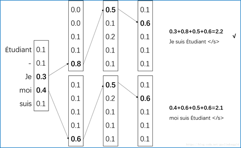
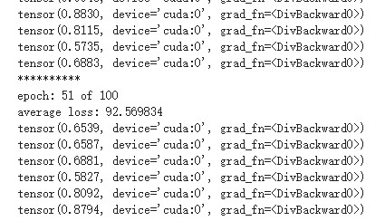

## 自然语言处理 期末大作业

数据科学与计算机学院

17341190 叶盛源

---

### 实验环境

本次实验是在windows10操作系统下进行的。使用的IDE为pycharm

我使用的神经网络框架搭配为`pytorch+python3.6`。

其他需要安装的包在代码包requirement.txt中包含，可以直接导入。在这里列出生关键的一些依赖包的名称和版本号：

```python
jieba==0.39
matplotlib==3.1.1
nltk==3.4.5
numpy==1.17.4
torch==1.3.1
torchvision==0.4.2
```


### 实验原理

本次实验的目标是用编码器和解码器实现一个中文到英文的神经网络的翻译模型。

编码器使用LSTM的序列神经网络，将我们的目标句子通过时间序列输入，最终将一个中文的文本句子编码成一个特定维数的向量。我们这里使用的是双向的LSTM模型，最后将前向和后向的隐藏层输出值对应位置求和。


接着我们要构建一个解码器模型，解码器我们使用了一个单向的LSTM网络，我们将编码器最后一个时刻输出的结果，也就是中文句子的编码结果作为解码器的初始状态，从这个状态开始进行翻译。我们每次只翻译一个词语，所以时间步数为1。

我们可以选择标准的答案或者上一个时刻翻译出来的结果作为输入：

- Teacher Forcing:直接使用训练数据的标准答案(ground truth)的对应上一项作为当前时间步的输入；
- Curriculum Learning:使用一个概率p,随机决定选择使用ground truth还是前一个时间步模型生成的预测，来作为当前时间步的输入。

之后我们还可以加入一个注意力机制（Attention）来加强解码器翻译的能力，我们将编码器的每个输出保存下来，将他们和当前解码的词语进行一个评分计算注意力权值，然后将编码器的每个时间片的输出结果加权求和，得到一个context_vector 这个vector和原来的解码器的向量做一个拼接，这样就更多的使用到了源语言的语义，可以取得比之前更好的实验效果。如下图：


最后我们将拼接得到的输出向量用一个线性映射到和词语数量相同的维度，然后用softmax给每个词语一个概率值，用交叉熵作为误差函数，反向传播正确的词语优化翻译结果。

最后我们可以得到一个编码器和解码器构成的简单神经网络翻译模型：


### 数据预处理

首先我们需要将文本的文档做一个预处理，因为文本是一个训练集，所以处理过程比较简单。我们读取文件之后，遍历每一个句子，先分别对中英文的数据进行分词，然后把分词的结果加入到词典中。然后把文本对应的词语换成数字替代，这样可以在后续的实验中比较方便的读取数据。

```python
def process_train(filename,lag):
    word_dic = {'<BOS>': 0, '<EOS>': 1, '<UKN>': 2, '<PAD>': 3}
    with open('./dataset_10000/'+filename, 'r', encoding='utf-8') as dataset:
        with open('./preprocessing/' + filename, 'w', encoding='utf-8') as data_encoded:
            n = 4
            for line in dataset.readlines():
                if lag == 0:
                    sentence = jieba.lcut(line.strip())
                elif lag == 1:
                    sentence = jieba.lcut(line.strip().lower())  # 如果是英文的话就要都改成小写
                sentence = '<BOS> ' + " ".join(sentence) + ' <EOS>'
                sentence = sentence.split()
                # 构建训练集上的字典
                for word in sentence:
                    if word not in word_dic:
                        word_dic[word] = n
                        n += 1
                    data_encoded.write(str(word_dic[word])+' ')
                data_encoded.write('\n')
    with open('./preprocessing/word_dic_' + filename, 'w', encoding='utf-8') as num2word_file:
        for word in word_dic:
            num2word_file.write(str(word_dic[word]) + ' ' + word + '\n')
    return word_dic
```

之后我们还要处理测试数据，我们测试数据的词典必须要用从训练数据中得到的词典，要不训练集不管怎么训练都无法预测到不存在的词语。

在分词之后我们还需要对数据添加一些特殊的符号：

1.  其中`<pad>`加在较短序列后，直到同一batch内每个样本序列等长。  
2. 每个句子的开头要是`     <bos>  `
3. 每个句子的结尾是` <eos> `
4. 不存在的词语用`<UNK>`表示

因为我们定义了词典来给每个词语编号，所以我们需要给每个词语一个下标，因此我们从上到下依次定义为0，1，2，3加入到我们的词典中。

padding的时候我们需要找到最长的句子长度作为max_length，然后以这个为参照进行句子的padding：

```PYTHON
def padding(batch_data, pad):
    #在词表中默认<PAD> 为3 <EOS> 为1
    padding_data = list()
    # 统计最长的句子长度
    max_length = 0
    for data in batch_data:
        max_length = len(data) if len(data) > max_length else max_length
    for data in batch_data:
        # 如果没到最长的长度，就进行padding
        if len(data) < max_length:
            data = data + (max_length-len(data))*[pad]
        padding_data.append(data)
    return np.array(padding_data, dtype='int64'),max_length
```

经过上述两个函数，我们就对数据处理完毕了，我们将预处理好的文本和词典用文件形式保存下来，在模型的训练和测试中会使用到


### 定义模型

我们使用这里使用的深度学习框架是pytorch，我们需要先定义一个model.py文件来存放我们的模型。模型分两部分，分别是编码器和解码器，而解码器中，注意力机制需要一个线性层，并且有一些矩阵的乘法运算，因此我将Attention层提出为单独一个模块。

#### 编码器

首先定义编码器，编码器我们使用一个双向的LSTM模型，我们首先使用一个词嵌入的方法，将词语嵌入到一个特定维度的向量空间中，我这里设置是600维的词语空间。

```python
self.embedding = nn.Embedding(self.vocb_size, self.vocb_dim)   # 对中文词嵌入
```

接着我们定义一个lstm层，设置为双向，隐藏层的节点数为300，然后与用线性投影到词语的数量，这样输出的结果就可以直接返回使用，后面也不需要再加全连接层来改变输出维度：

```PYTHON
self.lstm = nn.LSTM(self.vocb_dim, self.hidden_dim, bidirectional=True)
```

定义好网络后，我们就需要将每层的网络连接起来。为了方便查看，**我直接在代码中对每个输入和输出的维度大小做了详细的注释**，可以直接看着下面的代码。我们先用正态分布初始化LSTM的初始状态，然后对输入x做一个词语的嵌入。对于双向的LSTM输出结果，我们用求和的方法把他们连到一起，最后返回结果。

```PYTHON
    def forward(self, x):
        seq_len, batch_size = x.size()
        # h0 = x.data.new(2, batch_size, self.hidden_dim).fill_(0).float()
        # c0 = x.data.new(2, batch_size, self.hidden_dim).fill_(0).float()
        # 用正态分布初始化lstm状态 双向单层的lstm需要大小为 2*batch*hidden_dim 的h和c
        h0=torch.normal(0,0.01,[2,batch_size, self.hidden_dim]).cuda()
        c0=torch.normal(0,0.01,[2,batch_size, self.hidden_dim]).cuda()
        input_word = self.embedding(x) # 获取embedding后的句子 embedding需要是long类型的tensor
        # 双向lstm输入数据格式为input(seq_len, batch, input_size)
        # 输出数据格式为output(seq_len, batch, hidden_dim*2) hidden是最后个time_step的输出结果 hidden(batch, hidden_dim*2)
        output, hidden = self.lstm(input_word, (h0, c0))
        # 将前向和后向的输出加在一起输出
        h_n=hidden[0][0]+hidden[0][1]
        c_n=hidden[1][0]+hidden[1][1]
        output = output[:, :, :self.hidden_dim] + output[:, :, self.hidden_dim:] # 将前向和后向的hidden_dim加起来,方便作为输入放入解码器中
        return output, (h_n,c_n) # 返回所有的输出output 和最后一个隐藏层的输出
```


#### 解码器

解码器和编码器类似，都是LSTM，我们是输入一个词语，预测下一个词语，所以我们LSTM是单向的只有一个隐藏节点的网络，我们这里还需要把编码器的输出结果传进来，因为注意力机制的计算需要使用到。最后我们将context和我们的解码器输出结果做一个concat，最后使用全连接层变回和词语数量相同的维度，然后用softmax转换成概率值输出结果。

**下面的代码有详细的注释**，关于输入和输出的tensor维度和用法，可以直接看代码。

```PYTHON
    def forward(self, x, init_state, encoder_output):
        ### decoder每次将上一次输出的词语，在作为输入到下一次
        ### decoder 的输入x是(1*batchsize)  1为输入词语的下标
        ### 因此lstm每次只有一个时间片，并且h初始化为上一次输出结果的h
        input_word = self.embedding(x)
        # output_lstm size: (1, batch_size, hidden_dim)
        output_lstm, hidden = self.lstm(input_word, init_state)

        # attention_weight size: (batch_size, 1, seq_len)
        attention_weight = self.attention(output_lstm, encoder_output)
        # 将batch转到开头(seq_len, batch_size, hidden_dim) -> (batch_size, seq_len, hidden_dim)
        encoder_output = encoder_output.transpose(0, 1)

        # 进行带batch的矩阵乘法
        # (batch_size, 1, seq_len) * (batch_size, seq_len, hidden_dim) = (batch_size, 1, hidden_dim)
        context = torch.bmm(attention_weight, encoder_output)

        # 因为是batchsize不是优先的，所以昨晚乘法有要再把batchsize转回去
        # (batch_size, 1, hidden_dim) -> (1, batch_size, hidden_dim)
        context = context.transpose(0, 1)

        # 将attention的context和decoder输出向量拼接
        # (1, batch_size, hidden_dim) + (1, batch_size, hidden_dim) = (1, batch_size, 2*hidden_dim)
        context = torch.cat((context, output_lstm), 2)

        # 用一个全连接层将attention的和decoder输出结合的向量投影到和词语数量维度匹配的
        # (1, batch_size, 2*hidden_dim) -> (1, batch_size, hidden_dim)
        # # 最后将结果做一个softmax映射到0-1的概率上去
        context = self.wc(context)
        ht = F.torch.tanh(context)
        output = self.sm(self.out(ht))
        return output, hidden
```


#### 注意力机制

我们这里还使用了注意力机制。 注意力机制的一种非正式的说法是,神经注意力机制可以使得神经网络具备专注于其输入(或特征)子集的能力。使用了注意力机制可以让我们的模型更准确，更有机会的收敛到一个较优的地方，但不好的地方是可能影响模型的运算速度。

我们首先需要计算当前解码器的输出结果和每个编码器的一个注意力权值，这个权值我们可以通过这两条式子来得到：


我们在score函数中，选择了第一条式子来计算score。计算score后，我们相当于使用了一个softmax进行转换，将score转换成0到1的一个概率值，我们在代码中这样实现：

```PYTHON
ht = ht.transpose(0, 1) # 转成(batch, 1, hidden_dim)
hs = hs.transpose(0, 1) # 转成 (batch, seq_len, hidden_dim)
Whs = self.attention_layer(hs).transpose(1, 2) # (batch seq_len, hidden_dim) -> (batch, hidden_dim, seq_len)
score = torch.bmm(ht, Whs)  # bmm是带了batch的，对后两维度做矩阵乘法(batch, 1, hidden_dim) * (batch, hidden_dim, seq_len) = (batch, 1, seq_len)
weight = F.softmax(score, dim=2) # 0-batch  2-score 对第二维进行softmax
```

有了权重之后，我们就在解码器中计算编码器的context向量：

```PYTHON
# 进行带batch的矩阵乘法
# (batch_size, 1, seq_len) * (batch_size, seq_len, hidden_dim) = (batch_size, 1, hidden_dim)
context = torch.bmm(attention_weight, encoder_output)
```

然后和我们的解码器输出结果做一个拼接，就得到了真正的解码器输出结果：

```PYTHON
# 将attention的context和decoder输出向量拼接
# (1, batch_size, hidden_dim) + (1, batch_size, hidden_dim) = (1, batch_size, 2*hidden_dim)
context = torch.cat((context, output_lstm), 2)
```

这样我们就定义好了我们的模型


### 训练模型

有了模型之后我们就需要导入数据训练模型的参数。我们首先需要编写一个next_batch函数，从刚刚处理好的数据中分batch喂数据给模型训练：

```PYTHON
def next_batch(batch_num,training_data,batch_size,training_label):
    # 分批喂数据
    i = batch_num % (math.ceil(len(training_data) / batch_size))
    if (i + 1) * batch_size >= len(training_data):
        train_data = training_data[i * batch_size:]+training_data[:((i+1)*batch_size)-len(training_data)]
        train_label = training_label[i * batch_size:]+training_label[:((i+1)*batch_size)-len(training_data)]
        flag = False
    else:
        train_data = training_data[i * batch_size:(i + 1) * batch_size]
        train_label = training_label[i * batch_size:(i + 1) * batch_size]
        flag = True
    return train_data,train_label,flag
```

每次往后取一个batch，如果遇到了最后一个部分不够一个batch数据，就从开头拿一些补全。并用flag告诉主程序已经结束了一个epoch，可以开始下一个了。

我们首先用上面的提到过的padding函数将我们的数据padding到一样的长度作为输入。我们先把数据输入到encoder得到编码的结果：

```PYTHON
encoder_out, (h_n, h_c) = encoder(train_data) 
```

然后把编码的结果第二项作为解码器的初始状态，而第一个输出结果则做为参数传到解码器中，在注意力机制中运算

解码器中，我们首先需要输入`<BOS>`，因为所有的句子都是从这个开始，然后结合初始的状态，我们就可以开始解码。我们可以选择上一次解码出来的词语作为输入，或者标准答案label中对应下标的词语作为输入，我们用一个概率来确定，这里设置了0.5

```PYTHON
### 使用Curriculum Learning的学习方法 一定概率输入ground truth 或前一步的decoder输出
if Curriculum_Learning:
    ground_truth = train_label[step].unsqueeze(0) # 选出正确答案中的词语的index
    decoder_output, decoder_hc = decoder(ground_truth, decoder_hc, encoder_out)
    else:
        _, last_word = torch.max(decoder_output, 2)  # 选出概率最高的一个词语的下标作为解码器的输入
        decoder_output, decoder_hc = decoder(last_word, decoder_hc, encoder_out)
```

接着我们使用交叉熵，给定正确的词语的下标，然后和解码器的输出结果，也就是每个词语的概率进行交叉熵运算，目标是最大化正确词语的概率，我们统计每个时间片loss的和：

```PYTHON
criterion = nn.CrossEntropyLoss(reduce=True)
# 对解码器每一个输出求loss
loss += criterion(decoder_output.squeeze(), train_label[step])
```

有了损失函数，我们就可以使用反向传播的方法更新参数，这里使用Adam的优化器：

```python
# 反向传播更新公式
encoder_optimizer.zero_grad()  # 清楚梯度累积
decoder_optimizer.zero_grad()
loss.backward(retain_graph=True) # 反向传播计算梯度
encoder_optimizer.step()  # 应用优化器更新参数
decoder_optimizer.step()
epoch_loss += loss.item() # 计算每一次epoch平均的loss
```


### 测试模型

测试模型和训练模型的代码结构类似，不过测试的时候我们就不需要一个batch一个batch的输入，我们可以选择一个句子一个句子的输入预测结果。

在选择最佳的预测序列时，我使用了一个叫做beam_search的方法来搜索。就是在输入了bos后，我们不直接用贪心算法取概率最高的一项，而是取概率前几的，然后分别各自贪心搜索下去，最后取总概率最高的。



这样可以防止出现第一个词语预测不准，或者训练的还不够到位导致概率不是很高，而错过了这个正确的词语，如果第一个词语翻译错误，因为是一个序列，后面的自然会受到很大的影响，实现如下：

```PYTHON
		# 第一步先输入bos <1 bs >
        first_input = torch.full(size=[1,1],fill_value=BOS).long().cuda()
        decoder_out, decoder_hidden = decoder(first_input, decoder_init, encoder_out)
        # 计算第一步beam输出
        values, word_index = torch.topk(decoder_out, beam_value)  # 取出beam个最大值
        # 遍历每个beam 保存搜索结果
        for k in range(beam_value):
            output_list[k].append(word_index[0][0][k].item())
            probability_list[k].append(values[0][0][k].item())

        decoder_out_beam = [[] for _ in range(beam_value)]
        decoder_hidden_beam = [[] for _ in range(beam_value)]
        for k in range(beam_value):
            word_input = torch.tensor([[output_list[k][-1]]]).long().cuda()
            decoder_out_beam[k], decoder_hidden_beam[k] = decoder(word_input, decoder_hidden, encoder_out)


        for k in range(beam_value):
            for step in range(2,max_length):
                # 后面的用贪心算法，最后选概率最高的
                values, word_index = torch.max(decoder_out_beam[k], 2)
                output_list[k].append(word_index[0][0].item())
                probability_list[k].append(values[0][0].item())
                decoder_out_beam[k], decoder_hidden_beam[k] = decoder(word_index, decoder_hidden_beam[k], encoder_out)
```

我们第一步还是先输入BOS，接着我们考虑beam_value的值，也就是想要考虑前几排名的词语，然后我们取出对应的词语，分别对每个词语进行贪心，加入到列表中。最后我们选择概率最高的一个作为我们的best_sentence。

在评价模型的翻译结果的时候，我们使用bleu的评价方法，我们从nltk库中直接调用进行评价，BLEU是一种对生成语句进行评估的指标。完美匹配的得分为1.0，而完全不匹配则得分为0.0 ，可以用来计算待评价译文和一个或多个参考译文间的距离。

```python
# write in to a file
f.write("正确的句子为："+' '.join(target_sentence))
f.write('预测出的句子为 '+' '.join(best_output))
f.write('BLEU-4 评分为:'+str(sentence_bleu(target_sentence, best_output))+'\n\n')
```


### 实验结果

这个模型定义起来看似不是很复杂，但实际上十分的庞大， 用我们自己的电脑运行速度还是比较缓慢的。因为条件约束，参数并不能设置的很大，比如batch_size，如果设置了大于500，经常就会出现显存溢出的问题。所以因为条件约束我们并不能很好的训练出一个翻译准确度很高的神经网络模型。我这里使用了参数如下表

| 参数                      | 值         |
| ------------------------- | ---------- |
| batch_size                | 400        |
| word_dim   词向量维度     | 600        |
| LSTM隐藏层数量            | 300        |
| 解码器lr                  | 1e-5       |
| 编码器lr                  | 1e-5       |
| beam_value                | 3          |
| Curriculum_Learning_ratio | 0.5        |
| epochs                    | 100        |
| 优化器                    | SGD \ Adam |

还有一部分参数就不在这里列出，可以在代码中查到。

我首先尝试使用了SGD的方法进行梯度下降优化参数，因为资源限制，我这里只跑了100个epoch，每个epoch都会跑完整个数据集一次。我们可以看到它的loss的图像如下图：




可以看到上图中已经训练了50个epoch了，loss还是比较大， 而且收敛速度非常的慢训练到100个epoch还有50多的loss，而且越到后面速度越来越慢，可见SGD的效果并不好。在和同学们在群里交流讨论后，我们发现如果使用Adam的优化器，可以有明显的loss下降过程，训练100个epoch后的loss值也比SGD的要好。如下图：


这里的loss是统计每个epoch的loss之和，可以看到loss下降到一定程度后开始波动，然后下降速度也大幅度降低，这可能是因为学习率设置的比较大的缘故，而且loss仍然是一个比较高的水平。不过loss至少还是呈现一个下降的状态。

之后，我使用测试的代码加载训练出来的模型进行测试，发现实验效果很差，能预测输出词语，但输出的结果很奇怪，很多重复的词语，并且也没有强的语义关联性：

```TXT
正确的句子为：<BOS> but , for the next few years , the priorities of fiscal policy should be jobs , investment , and growth . <EOS>
预测出的句子为 <BOS> why why ，term interest interest <EOS>
BLEU-4 评分为:6.091662401187491e-232
```

比如上面就是其中一个预测的结果，预测的bleu得分也几乎为0，后面输出的都是一些无意义的词语，和句子完全不相关。

**更多的翻译结果保存在了test_output.txt文件中**

之后我尝试了改变teacher ratio的指数进行训练，因为计算资源有限，所以只训练了少量的次数观察实验结果

| teacher_ratio | average_loss |
| ------------- | ------------ |
| 0.7           | 19.254       |
| 0.5           | 17.14        |

虽然最终的loss有一定区别。但本质并不能分析出什么，最后翻译的结果还是类似的，都是一些重复的词语比如全是the这样的。

### 实验心得

本次实验是做一个神经的翻译网络。不过因为计算资源有限，总体的表现还是一般般，并没有提现出很好的实验效果，不过上课学习到的关于神经翻译网络的知识实践一遍后，对这些知识点有了更深刻的认识和体会。而且也明白了整个神经翻译网络的大概流程，编码器解码器的原理。这个模型虽然简单，但方法都有一定强的可解释性。

不过这个模型和谷歌百度那些大型公司使用的神经网络翻译模型比起来还是有很大的差距，不管是从模型的复杂度还是计算速度等等，所以我们也不可能指望这样一个比较小的训练集就能取得一个比较好的实验效果。

而且这次实验提供的数据集，都是一些比较长度，复杂的，有各种单词的句子，有很多单词从头到尾就出现一次，而且很少基本的句型，都是比较高级的语法，这给机器学习这些语言之间的关系增加了很大的难度，这也是loss一直维持在一个比较高的水平降不下去的原因。如果能给一些比如`Do you like me`这种简单基本的句型开始训练，然后用一些类似的基础句型的问句来测试，可能会取得比较好的效果。

我也看了keras官方的神经翻译模型，那个模型比要求搭建的上课学的模型要更复杂，而且他使用的数据集都是精心挑选过的，去除掉了无用的标点符号和一些无意义的词语。训练和测试的句型都是简单语法规则的语句，比如Do开头的简单问句，因此它取得了一定的实验效果。

总而言之，这次实验收获很多，了解和实践了神经网络翻译的模型，也体验了一下每天都在使用的翻译软件背后的实验原理。虽然实验效果不好，但还是很有体会和收获。感谢老师和助教一个学期的辛苦付出！