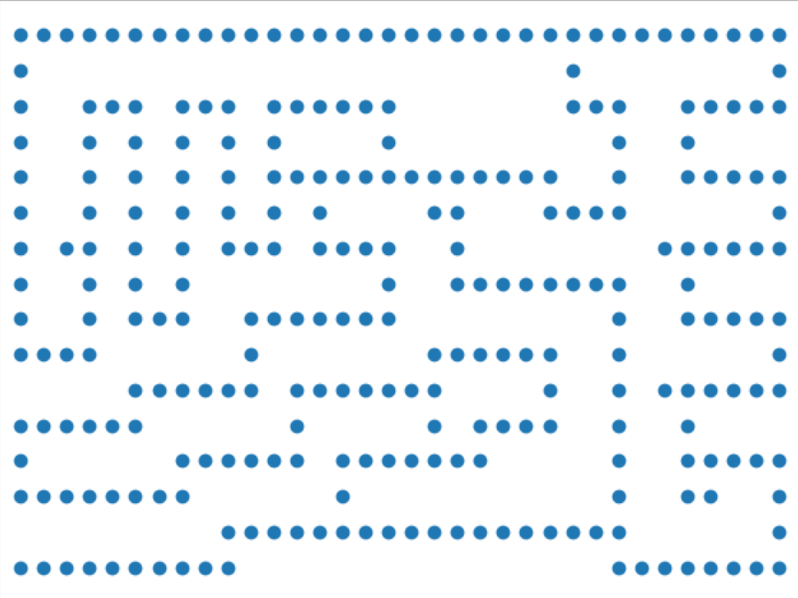
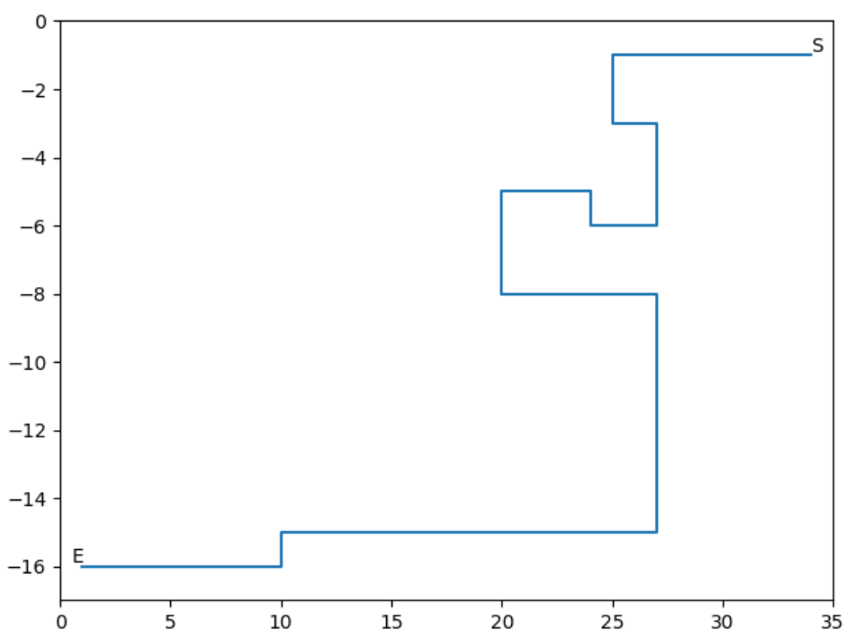

## 人工智能实验九 

17341190 叶盛源 数据科学与计算机学院

### 无信息搜索

#### 一、算法原理

无信息搜索这里选择的是一致代价搜索（Uniform-cost search ），它的本质其实就是一个广度优先的搜索，但再广搜上进行了改进，在等待被拓展的边界队列上，bfs是从里面无规则的挑选队内元素来进行拓展。但UCS是先对边界队列进行一个排序，挑选从起点到边界队列中的点距离最小的点优先访问。

不过在这次的迷宫问题中，因为每一步的代价都是相同的，因此一致代价搜索在这个问题上其实退化成了BFS。


#### 二、算法性能分析

| 完备性     | 时间复杂度         | 空间复杂度         | 最优性 |
| ---------- | ------------------ | ------------------ | ------ |
| 具有完备性 | $O(b^{1+[C^*/e]})$ | $O(b^{1+[C^*/e]})$ | 是     |

**完备性：**假设每个路径的成本s都大于0，由于一致代价搜索是BFS的改进，如果存在路径到达目标点，它一定能搜索出一条路径到达。

**最优性：**普通的BFS并不一定具有最优性，因为它是从边界队列中随便选点进行拓展。但UCS不一样，假设每条路径之间的成本s是大于0的，而对任意一个点作为目标点，UCS都能保证第一次探索到目标点的时候是最小的路径，否则当前边界就会先选择探索另外一个点而不是目标点。

**时空复杂度：**BFS和UCS的时空复杂度都是一样的，假设$C^*$是起点到目标点最优情况下总代价，而e是整个图中所有路径最小的代价。则从起点到终点至多要走$[C^*/e]+1$次，也就是搜索树的深度最差情况下是这么深，b为每个点的分叉数量。在这次的问题，因为是相当于一个BFS，而每个点最多只能向四个方向拓展，也就是分支数最多为4，则时空复杂度为$O(4^{d+1})$d为到终点的最优解需要的步数


#### 三、伪代码

````
procedure USC(maze) return True or failure
S:=StartNode, E:=EndNode
frontier:=a priority queue by cost
explored:= empty set
frontier.append(S)
moves =[[-1,0],[1,0],[0,1],[0,-1]]
while True:
	if empty(frontier) return failure
	curNode:=frontier.pop() 
	if curNode=E return True
	for move in moves:
		newNode:=curNode+move
		if !explored(newNode) and maze(newNode)=0:
			if newNode in frontier and newNode.cost< frontier_node.cost:
				replace frontier_node with newNode
			else:
				frontied:=forntied.append(newNode)
````


#### 四、代码实现

定义一个结点的类，记录每个点的坐标，到这个点的最小花费，最优路径时这个点的上一个点，然后定义一个比较符号，使得class可以被根据cost来比较大小

````python
class Node:
    def __init__(self,location,cost=0,ancestor=None):
        self.location=location
        self.cost=cost # 到达这个点的最小花费
        self.ancestor = ancestor
    def show_data(self):
        print(self.location,self.ancestor,self.cost)

    def __lt__(self, other):
        # 重新定义小于符号
        return self.cost < other.cost
````

对于frontier，因为每次添加新的结点都需要排序，因此这里使用了小顶堆来实现：

````python
import heapq
heapq.heappush(frontier,S)
curNode=heapq.heappop(frontier)
heapq.heapify(frontier)
````

用到的方法如上。第一个函数是将结点加入到堆队列中，并将cost最小的放到堆顶。这里要注意的是，heappop这个函数相当于调用了pop掉队首元素，然后再用heapify将列表变成小顶堆，因此在用之前需要使用heapify将队列变成一个小顶堆。

主要代码：

````python
def search():
    ### 进行一致代价搜索 0可以走1不可以走 代价都为1
    maze,S,E = readfile()
    row,col = len(maze),len(maze[0])
    frontier = []  # 加入小顶堆  heapq.heappush(heap, num)
    explored = [[0] * col for _ in range(row)] # 0表示没有访问，1表示已经访问过了
    heapq.heappush(frontier,S)
    X,Y=[],[]
    while True:
        if len(frontier)==0:
            return None
        curNode = heapq.heappop(frontier) # 获取当前要搜索的节点
        if curNode.location == E.location:# 如果找到了目标的节点
            plt.xlim(0, 35)
            plt.ylim(-17, 0)
            plt.scatter(X, Y)
            plt.show()
            return curNode
        explored[curNode.location[0]][curNode.location[1]] = 1 # 将visit标记为 1

        X.append(curNode.location[1])
        Y.append(-curNode.location[0])

        for move in moves:
            new_location = [x + y for x, y in zip(curNode.location, move)]
            if explored[new_location[0]][new_location[1]]==0 and maze[new_location[0]][new_location[1]]=='0' or maze[new_location[0]][new_location[1]]=='E': # 如果这个点没被探索过
                flag=1
                for node in frontier:# 检查节点是否在边界队列中
                    if node.location==new_location and node.cost>curNode.cost+1:# 如果在边界就更新cost
                        node.cost = curNode.cost+1
                        node.ancestor = curNode
                        heapq.heapify(frontier)
                        flag=0
                        break
                if flag: # 如果不在边界队列中 就要加入到边界队列中去
                    new_node=Node(new_location,curNode.cost+1,curNode)
                    heapq.heappush(frontier, new_node)
````


#### 五、结果展示

将这个算法经过的遍历过的所有点记录下来并绘制散点图如下：


将地图上所有可以走的点标记出来和上图对比：



观察可以发现只有倒数第四行有几个点没有遍历到几乎所有的点都遍历了，所以效率并没有很大的提升。

最优的路线如下：


以探索一次记录一次为标准衡量时间复杂度，则可以计算出时间复杂度为：276


### 启发式搜索

#### 一、算法原理

启发式搜索又叫有信息的搜索，它利用问题所拥有的启发信息来引导搜索，达到减少搜索范围，降低问题复杂度的目的。无信息的搜索对未来是未知的，就是在任意一个点上并不知道到终点还有多远。UCS也只是利用了起点到当前点的距离做一个排序，但这个排序并不一定是正确的，因为起点到当前点距离近并不代表它是最优的点，后面的路程距离都是未知的。而A*搜索算法提出了启发式函数h(x)来估计到终点的距离。估价函数为：
$$
f (x)=h(x)+ g(x)
$$
启发式搜索的关键就是如何设计自己的启发式函数：

启发式函数必须包含两个特性，一个是可采纳性：
$$
h(n) \le h^*(n)
$$
这个特性保证了估计值要小于真实值，可采纳性也就意味着最优性。

如果启发式函数是可采纳的，但在进行了环检测之后就不一定能保持最优性。因此还需要保证单调性：
$$
h(n_1)\le c(n_1\rightarrow n_2)+h(n_2)
$$
可以理解就是$h(n_i)$随着i的增加要和$h^*(n_i)$越来越接近。只要启发式函数具有一致性，就能在进行环检测之后仍然保持最优性。

启发式搜索的关键在于构建启发式函数，这里使用了曼哈顿距离和直线距离两种距离来衡量，这两种距离都满足一致性，这种松弛的做法当h(n)的值越大，拓展的点理论上就会越小，因为h(n)越接近真实的距离，包含更多有用的信息，所以曼哈顿距离要比直线距离要更好。


#### 二、算法性能分析

$A*$搜索的性能和具体的启发式函数设计有关。当h(n)=0的时候，对于任何n这个启发式函数都是单调的，此时$A*$搜索就变成了一致代价搜索。

因此一致代价搜索的时间复杂度也适用于$A*$搜索。因此它仍可能是指数的时空复杂度，除非能找到特别好的启发式函数h。

同时如果启发式函数设计满足了一致性，那么它具有完备性和最优性。


#### 三、伪代码

````
procedure USC(maze) return True or failure
S:=StartNode, E:=EndNode
frontier:=a priority queue by cost+h(n)
explored:= empty set
frontier.append(S)
moves =[[-1,0],[1,0],[0,1],[0,-1]]
while True:
	if empty(frontier) return failure
	curNode:=frontier.pop() 
	if curNode=E return True
	for move in moves:
		newNode:=curNode+move
		if !explored(newNode) and maze(newNode)=0:
			if newNode in frontier and newNode.cost+h(newNode)< frontier_node.cost+h(frontier_node):
				replace frontier_node with newNode
			else:
				frontied:=forntied.append(newNode)
````

伪代码和原来几乎没有改动，只有在排序比较的时候将cost之间的大小比较变成了cost+h(x)的大小比较，也就是加上了当前结点的启发式函数值的结果。


#### 四、代码实现

代码大部分都和一致代价搜索相同，但是有个地方不同的是在编写比较函数的时候，需要用当前成本加上启发式函数的值：

````python
class Node:
    def __init__(self,location,estimate=0,cost=0,ancestor=None):
        self.location=location
        self.cost=cost # 到达这个点实际花费
        self.estimate = estimate # 启发的估计路程hx
        self.ancestor = ancestor
    def show_data(self):
        print(self.location,self.ancestor,self.cost)

    def __lt__(self, other):
        # 重新定义小于符号
        return self.cost+self.estimate < other.cost+other.estimate
      	return self.cost+math.sqrt((self.location[0]^2+self.location[1]^2)) < other.cost+math.sqrt((other.location[0]^2+other.location[1]^2))
````

这里写的是街区距离的方法，但也可以修改成其他的计算启发式函数的方法。


#### 五、结果展示

使用两种启发式函数得到的路线图结果一样，和无信息搜索的结果也是一样的：



使用曼哈顿距离会拓展的点如下图所示：


使用直线距离会拓展的点如下图所示：


对比三种方法的时间复杂度：

|                | UCS  | $A^*$曼哈顿距离 | $A^*$直线距离 |
| -------------- | ---- | --------------- | ------------- |
| **时间复杂度** | 276  | 223             | 279           |

可以看到如果启发式函数取的不好，可能效果比一般的无信息搜索效率还要低下，因此启发式函数不仅要满足可采纳性和一致性，还需要让它尽可能不要过于松弛。


用边界队列的长度来衡量空间复杂度：

|                | UCS  | $A^*$曼哈顿距离 | $A^*$直线距离 |
| -------------- | ---- | --------------- | ------------- |
| **空间复杂度** | 9    | 8               | 8             |

可见使用了启发式函数后确实降低了空间复杂度，不过因为搜索的深度并不是很多，每个点的可选分支数也不是很多，因此差距没有体现的很大。

### 思考题

Q ：这些策略的优缺点是什么?它们分别适用于怎样的场景? 

**一致代价搜索：**这个本质上是bfs的一点改进，能确保到搜索第一次到某一个点是沿着最优的路径搜索到的，确保了最优性。但它和bfs一样需要边界队列经常要保存指数级的节点数量， 这导致它需要消耗很多的空间，但因为是bfs，一层层搜索，对于离终点深度小的情况下比较快。适合解决最短或最少问题。

**$A*$搜索：**这个搜索方法本质上也是bfs的进一步改进，加入了启发式函数对边界进行排序，它的适用场景和一致代价搜索一样，都比较适合解决最短路径之类的问题。它还融入了启发式函数对终点的已知信息，因此在对终点位置有已知有效的信息的时候，能将信息用在搜索上，加快搜索进程。但如果启发式的函数值都为0，其实就相当于没有有效的信息，或者启发式函数设置不好，也就是信息无用甚至误导搜索，这有可能让搜索效率降低。

**迭代加深搜索：**迭代加深搜索本质上是一个深度优先搜索，深度优先搜索的好处就是空间复杂度小，它不需要边界队列来保存所有的节点，对于对空间复杂度要求较高的环境适用。dfs的缺点就是如果深度很大的时候，搜索效率很低，因为它有可能“一条错路走到底”，如果恰好进入了一条很深的路，走到尽头再回溯就浪费了很多时间。迭代加深搜索是对dfs这个缺点的一个改进，它可以限制搜索深度，搜索到一定深度后就不再往更深的地方去搜索，但这个方法的缺点是这个深度不好自己去设置，可能需要在实验过程中一步步加深，会导致已经访问的点被反复重复访问，在搜索深度不高，指数级不大的时候效率会显得很慢。而且dfs不能找到最优解，没有最优性。

**$IDA*$搜索：**这个搜索本质上是对迭代加深搜索的再进一步改进，融入了启发式函数对终点的已知信息，因此在对终点位置有已知有效的信息的时候，能将信息用在搜索上，加快搜索进程。它的优缺点和迭代加深搜索都一样。再已知了终点有效信息的时候，启发式搜索比一般的无信息搜索效果更好

**双向搜索：**双向搜索适用于已经知道了起点和终点位置状态的情况，从起点和终点两个方向同时开始搜索，可以极大的提高单个bfs的搜索效率，因为搜索深度变成了d/2层，而搜索深度和层数的关系是指数级的关系。如果使用双向的bfs，如果成本不都为1还可以使用双向的一致代价搜索，这能保证最优性。缺点是，如果是双向bfs，因为要维护两个边界队列，所以空间复杂度也比较高，而且必须要知道终点位置才能使用。

下面两个图分别是单向bfs和双向bfs的搜索空间，可以看到双向bfs确实降低了时间复杂度。


