# CS4032-Distributed-File-System 

# Sysu 陈鹏飞 分布式文件系统

**January 13, 2020**

## 一、开发环境

- OS：windows10
- IDE：pycharm + python 3.7
- 通信方式：gRPC


## 二、系统概述

### 项目基本介绍

本次项目实现的是一个client-server架构的分布式文件系统。文件系统模仿了linux操作系统的sftp命令交互方式，通过远程访问服务器，输入指令操作服务器上传下载等方法。具体实现的功能包括：打开访问文件、上传下载文件、关闭访问文件、删除文件、切换服务器目录、创建目录等。具体的介绍在后面功能部分列出。

除了基本的文件系统，本系统是支持分布式的部署，可以同时开启多台文件服务器(FileServer)，多个文件服务器存储内容相同，实现了副本机制(replica)。当用户登录时，他可以从服务器列表中选择一个合适的服务器进行连接交互。当更新或删除其中一个节点的文件时，这个服务器会作为**主服务器**将更新或者删除等操作同步到每一个副本服务器上，这个操作类似一个**本地写过程**。一致性使用了**瞬时一致性**，也就是当用户修改文件后，会立刻同步到每个副本上。

除了客户端和文件服务器，还有一个目录服务器(DirectoryServer)用来记录所有在线服务器，当服务器上线的时候会更新目录服务器中的目录内容。客户通过访问目录服务器获取可供选择的文件服务器。而文件服务器通过访问目录服务器或许需要同步数据的服务器列表

同时，文件系统还支持多个客户端(client)同时进行读写操作，有专门的锁服务器(lockServer)进行冲突管理。当客户端请求某一个文件的时候，会向锁服务器申请一个文件锁，如果这个文件没有被锁，锁服务器就会把这个文件锁给客户端，并允许客户端对这个文件进行操作，否则客户端会被拒绝操作文件。本次实验只有一种简单的互斥锁，日后可以升级出共享锁等更复杂的文件锁，提高多用户访问效率。

本系统使用Google封装的gRPC进行服务器之间的通信，每个服务器都有自己的proto文件定义消息和提供的服务，用来和客户端或其他的文件进行交互。

项目内包含多个文件夹，其中Client为客户端的代码。包含服务器的部分如下，分为三种服务器，每个服务器包含proto文件及编译出的python文件，编译proto可以使用指令：

```CMD
python -m grpc_tools.protoc --python_out=. --grpc_python_out=. -I. FileServer.proto
```


`serverData`和`clientData`分别作为本次项目中模拟客户端和各个服务器的存储根目录，里面包含多个子文件夹代表多个不同的服务器和客户端，他们之间传输交互的文件包含在内：

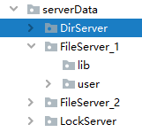


### 系统架构

本次服务可以同时运行一个目录服务器，一个锁服务器和多个客户端及文件服务器，简单绘制系统结构图如下：

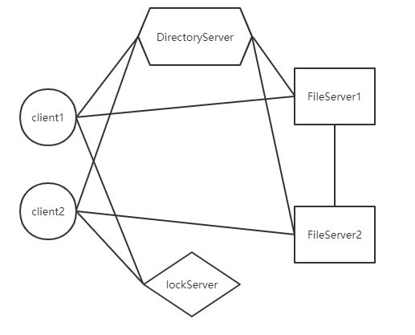

假设client1连接了FileServer1，而client2连接了FileServer2。客户端会和目录和锁服务器交互，而文件服务器也会和目录服务器进行交互。文件服务器自身之间也会进行交互，用来同步更新。


### 客户端功能介绍

客户端如下表列出：

| 指令          | 功能                             |
| ------------- | -------------------------------- |
| help          | show available commands          |
| ls            | list file directories            |
| lsc           | list user local file directories |
| upload or u   | upload files                     |
| download or d | download files                   |
| pwd           | current access server path       |
| delete        | delete files                     |
| mkdir         | create folder                    |
| cd            | change current path              |
| cd..          | back to previous path            |
| lso           | list open files                  |
| open          | open files                       |
| close         | close files                      |


### 运行方法

直接使用python指令运行4个服务器和客户端即可

建议先开启目录服务器和锁服务器避免文件服务器连接超时。

目录服务器默认架设在本地8000端口

锁服务器默认架设在本地7999端口

可以在setting文件中进行修改上述默认地址

客户端和文件服务器可以在对应文件夹内的server.py文件内修改对应地址和端口号。


## 三、系统实现

下面根据文件系统的各个功能介绍系统的实现方法。最基本的文件服务器功能就不会在此赘述，如果需要知道具体的实现，可以参考源代码。

### 目录服务

目录服务器是这个系统的核心，他负责记录所有登录在线的文件服务器。文件服务器上线的时候需要和目录服务器发送登录消息，目录服务器会把文件服务器加入到自己的目录表中：


当客户端登录的时候，可以自己选择合适的服务器连接，因为都是在本机上跑，系统无法根据地理位置或者性能等评估并选择，因此给与了客户端自由选择的机会。

在客户端连接目录服务器后，会先进入选择文件服务器阶段。目录服务器发送所有文件服务器的信息，包括ip地址和端口号，客户端选择后就会直接和对应的文件服务器相连：

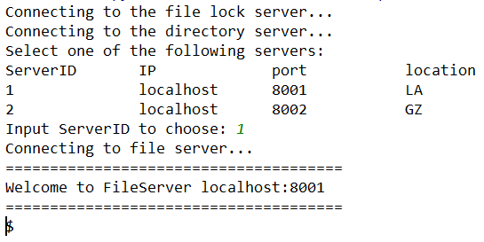

如上图所示，当客户端选择了1号文件服务器后，就会自动连接服务器，如果目标文件服务器发生了crash或者端口被意外关闭，则会出现连接超时的问题：


为了方便，目录服务器将目录信息用txt的形式存储在本地磁盘中。当然最后是可以存储在数据库如sqllite或者mysql中，会加快增删改查目标服务器记录的速度。


### 锁服务

锁服务器提供文件锁服务，当客户端想要访问某一个文件的时候，他需要先和锁服务器申请文件锁才能操作文件。如果这个文件已经被别的客户端申请了文件锁，客户端就会被告知这个文件正在被人编辑或修改，无法打开。

客户端在上传、下载和打开文件的时候都会对文件上锁，客户端实现了上锁和解锁的两个函数：

```PYTHON
def lockfile(self, filepath,filename):
    response = self.lockstub.lockfile(LS_pb2.lockfileinfo(file_path=filepath, filenamefilename, client_id = self.id))
    return response.success

def unlockfile(self,filepath,filename):
    response = self.lockstub.unlockfile(LS_pb2.unlockfileinfo(file_path=filepath,filename = filename))
    return response.success
```

这两个函数和锁服务器发送请求信息。

锁服务器会根据接收信息中目标文件的路径和文件名判断这个文件是否已经被其他客户端上锁，如果上锁了就会返回success=1，也就是失败。否则就会在锁记录文件中加上一条记录，并返回success=0成功信号。

在客户端上传了文件时，先会对文件上锁，然后文件服务器收到上传文件后，不会立刻发送成功信息，而是将这个操作扩散到全部服务器上，才会释放对这个文件的锁，这样可以防止在同步过程中又被打开修改了。

如下为客户端打开又关闭文件后对文件加锁解锁过程：

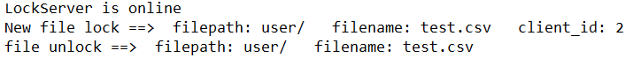

更详细的读客户端并行写冲突在后文系统功能展示中包含。


### 文件服务

#### 相对服务器地址

文件服务主要由文件服务器提供。文件服务器允许分布式的部署在不同的机器上，文件服务器对客户端是隐藏绝对地址的，也就是服务器的根目录对客户隐藏，比如在本机，我的服务器存储文件的根目录地址为：

```
C:\Users\YSY\Desktop\DFS\serverData\FileServer_1\
```

但服务器只会告诉客户端看到最后一个斜杠后的服务器相对地址，一般是user/开头：

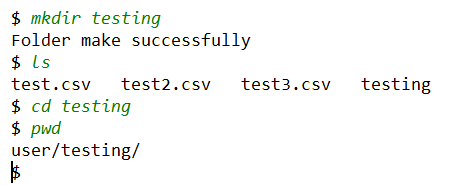


这种实现方法可以方便我们在多个不同的文件服务器之间传递同步消息，也方便对不同机器上的相同文件上锁。


#### 基本文件操作

文件服务器给客户端提供了基本的服务比如上传下载、创建文件夹等各种基本的服务。在服务器这边使用了python的os库间接完成了对文件的操作。比如用户如果要求列出当前目录下的文件：

```PYTHON
def list(self, request, context):
	all_files = '   '.join(os.listdir(self.root_path + request.cur_path))
    return FS_pb2.List_Reply(list=all_files)
```

文件服务器会调用os库的函数获取当前目录下的所有文件名称，并打包返回前台展示，于是前台就可以用ls指令查看。

在上传服务中，客户端会将本地的文件读取，然后做成一个**生成器**的形式发送给服务器，每一次只读取固定大小块的数据，这样可以避免同时传输一个非常大的文件。在python端我们使用：

```PYTHON
self.CHUNK_SIZE = 1024 * 1024 # 每次可以发1mb的信息
def get_file_chunks(self,source,target):
    with open(source, 'rb') as f:
        while True:
            piece = f.read(self.CHUNK_SIZE)
            if len(piece) == 0:
                return
            yield FileServer_pb2.Upload_Request(buffer=piece,target_path = target)
```

上面的方法可以让我们生成一个生成器，在服务器端可以用next()或者用for循环的方式读取。不过如果要用生成器的方法传输，我们的proto必须要定义成一个字节流的形式，否则会出现错误：

```protobuf
service FileServer {
	rpc upload(stream Upload_Request) returns (Reply) {}
}
message Upload_Request{
    string target_path = 1;
    bytes buffer = 2;
}
message Reply {
    int32 success = 1;
}
```


#### 同步

文件服务器还负责将用户上传的文件同步到所有的副本服务器上，当用户调用当前操作的主服务器的upload服务时，主服务器会同时调用一个同步函数：

```PYTHON
def synchronize_upload(self,target_path):
	source = self.root_path+target_path  # 上传文件的原地址
	target = target_path  # 上传文件的目标地址  注意这里返回的地址是相对地址
	# 这里不需要在对被更新文件上锁了，客户端已经对文件上锁
	if not os.path.exists(source):
		print("files does not exist")
		return

	# 获取所有副本服务器地址
	while True:
		try:
			response = self.dirstub.getfileserver(DS_pb2.Dir_Empty(empty=0))
			break
		except:
			print("Directory server connection timed out!")
	# 遍历所有服务器，除了自己都发一次
	for server in response.server_list:
		if server.Server_ID == self.id:
		continue

		# 建立和其他服务器的关联
		tmpchannel = grpc.insecure_channel(server.ip + ':' + server.port)
		tmpstub = FS_pb2_grpc.FileServerStub(tmpchannel)

		# 读取本地文件  注意这里返回的地址是对方的同步地址！！！
		chunks_generator = self.get_file_chunks(source, target)
		try:
			response = tmpstub.upload_without_syn(chunks_generator)
		except:
			print("Server {} connection timed out!".format(server.ip+":"+server.port))
			continue
	print("File sync completed {}".format(target_path))
```

主文件服务器首先从目录服务器中获取所有在线的副本服务器，然后和客户端的上传操作类似，它将上传操作重复发送给所有在线的副本服务器，如果副本服务器连接超时就会跳过并报告目录服务器。如果在线，就在目标副本服务器上执行上传操作。

这里要注意一个问题，**就是需要告诉副本服务器这个上传操作是否还需要传播**，否则副本服务器上传后可能又去通知其他服务器上传，最后可能出现一个死循环。

同样对删除操作也同样设计。详细展示见下面上传和删除同步


### 客户端

客户端的基本功能在上面已经有列出，操作模式和传统的文件系统类似，下面主要介绍open和close的操作逻辑。

#### 打开文件

打开文件是想实现一个类似网盘等在线编辑的功能，但因为条件有限，不可能实现一个可以在线查看的软件，也很难把linux下的vim移植。因此这里只是模拟了一个打开文件的过程，相当于用户把目标文件下载到本地，然后为文件加上了文件锁，这个锁不会自动释放，当用户去编辑完文件后保存退出，输入close指令后才会释放。

这个过程就大概模拟了用户在云盘上打开文件并编辑的过程，只是不能自动为用户打开文件并感应用户关闭文件后自动执行close操作，需要用户自己记得编辑完文件后关闭。

客户端会维护一个打开文件的队列，可以通过指令`lso`查看所有当前打开的文件。

```PYTHON
    def open(self,filename):
        target_filelist = self.list()  # 获取远程服务器当前目录的文件，判断是否有目标文件
        if not filename in target_filelist:  # 如果不存在就退出
            print("Target file does not exist")
            return

        source = self.current_path + filename  # 远程服务器文件路径
        target = self.root_path + filename  # 下载到本地的路径
        source_filelist = self.list()  # 获取远程服务器当前目录的文件，判断是否有目标文件
        if not filename in source_filelist:  # 如果不存在就退出
            print("Target file does not exist")
            return

        if self.lockfile(self.current_path, filename) != 0:  # 对文件申请加锁
            print("The file is being edited by someone else")
            return

        response = self.stub.download(FileServer_pb2.Download_Request(download_path=source))

        if os.path.exists(target):
            print("Warning: Local file with the same name is overwritten!")
        self.save_chunks_to_file(response, target)
        print("File open successfully")

        # 打开文件成功后将文件加入到已打开文件队列中去
        self.openfile_list.append((self.current_path,filename))
```


#### 关闭文件

当用户编辑完文件后，用户需要输入指令`close`手动关闭文件。在关闭文件前，需要输入`lso`查看所有正在运行的文件：


之后可以根据`processID`关闭对应的文件。

在关闭文件后，**客户端会自动帮忙将文件同步到远程服务器上**，这是区别与普通的下载和上传操作的最根本地方。文件服务器也会将这个更新操作传播到所有的副本服务器上，整个过程就类似一个在线查看关闭的过程。下载只是一个缓存操作。

```PYTHON
    def close(self,id):
        try:
            id = int(id)
            filepath,filename = self.openfile_list[id-1]  # id从1开始
            self.openfile_list.pop(id - 1)  # 将文件从打开列表中取出
            # self.unlockfile(filepath,filename)  # 对加锁文件解锁
            print("File closed successfully.")

            ## 将目标文件更新到远程服务器上
            source = self.root_path + filename  # 上传文件的原地址
            target = filepath + filename  # 上传文件的目标地址 （服务器的地址）

            # if self.lockfile(filepath, filename) != 0:  # 对文件申请加锁
            #     print("The file is being edited by someone else")
            #     return

            if not os.path.exists(source):
                print("files does not exist")
                return
            chunks_generator = self.get_file_chunks(source, target)
            response = self.stub.upload(chunks_generator)

            self.unlockfile(filepath, filename)  # 解锁文件

            if response.success == 0:
                print("File update successfully!")
                return
            else:
                print("File update failed!")
                return

        except Exception as e:
            print(e)
            print("File closed failed.")
```

详细的开关文件在下面的系统功能展示中包含。


## 四、系统部分功能展示

以下是部分功能的截图展示。以下功能都会通过录屏重新展示！可以结合录屏观看

### 指令列表


### 基本操作

操作依次为列出目录文件、创建文件夹，进入文件夹，输出当前路径，返回上一级，输出当前路径，输出客户端本地文件列表。


### 上传和删除同步

初始的时候文件服务器1和文件服务器2的文件如下：

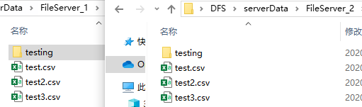

接着使用客户端1连接文件服务器1后先上传一个`zyzy.csv`的文件，之后将`test3.csv`从服务器中删除，查看文件服务器2是否发生了对应更改：

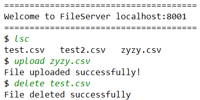

查看更改后的两个文件服务器文件：

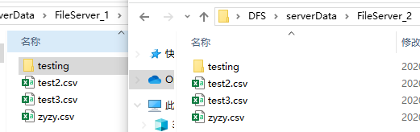


### 打开关闭文件

客户1连接了文件服务器1后，打开文件`test3.py`，使用`lso`列出打开的文件列表：

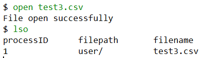

接着查看锁服务器的锁记录文件，发现增加了一条锁的记录：


接着用户去关闭目标文件，打开文件消失，锁文件记录也变成了空的

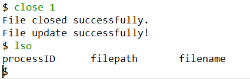

查看文件服务器，可以看到文件服务器将`test3.csv`上传后进行了一个同步操作

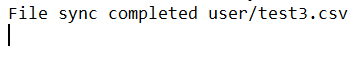

初始的时候，`test3.csv`的数据为空，我们在里面编辑了一些内容关闭后，服务2号的`test3.csv`文件也增加了这些内容：

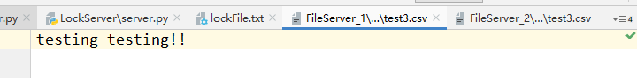

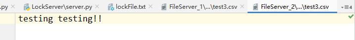


### 并行写冲突

当用户1登录了1号文件服务器，并打开当前目录下的`test.csv`文件。在用户1关闭文件之前，用户2连接了2号服务器，他同样想要打开这个文件，但被提醒冲突，然后用户1关闭了这个文件，用户2再去查看这个文件时就成功打开了。

用户1过程如下：


用户2过程如下：


