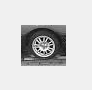

### 数字图像处理作业

17341190   叶盛源   计算机科学专业

#### 问题一

给定图像car.png和模版图像wheel.png，利用相关检测实现对car图像中的wheel检测，具有最大相关值的位置可以解释为所检测到的wheel位置

算法是利用相关匹配公式，但是原来的公式有一些问题，如果车轮匹配到一个各像素灰度值都较大的区域，可能会有较大的相应输出，得到错误结果。

因此我们对原来的相关公式进行改进，加入了一个归一化的方法。
$$
G(i,j)=\frac{\sum^k_{u=-k}\sum^{l}_{v=-l}H(u,v)F(i+u,j+v)}{\sum^k_{u=-k}\sum^{l}_{v=-l}F^2(i-u.j-v)}
$$
代码展示如下：

因为图像读取的时候默认是uint8的类型，但卷积操作一般结果不止这么大，所以需要将读取的图像数据类型转化成double类型，免得溢出。

```matlab
% 转变成double类型的
image = double(imread('car.png'));
filter = double(imread('wheel.png'));
```


接着记录一些长宽和基础的信息，并对原图做padding

```MATLAB
%获取图像的长度和宽度
M = size(image,1);
N = size(image,2);

%获取匹配模版的长度和宽度
m=size(filter,1);
n=size(filter,2);
row_middle=(m-1)/2+1;
col_middle=(n-1)/2+1;

%定义一个全0的矩阵和原来的图像大小一致
%为了让卷积操作结束后图像大小一致，因此需要先拓展图片。
Corr_image = zeros([M,N]);
pad_image = padarray(image, [(m-1)/2, (n-1)/2]);
```


然后计算累积的频次，然后除以总的像素数量乘上灰度数，得到映射的灰度值结果

```matlab
cum = double(cum);
% 求累计概率，得到累计直方图
for i = 2 : 256
    cum(i) = (cum(i - 1) + cum(i));
end
 
for i = 1 : 256
    cum(i) = cum(i)/(R*C) * 255;
end

% 映射
fy = double(fx);
for i = 1 : R
    for j = 1 : C
        fy(i, j) = cum(fy(i, j) + 1);
    end
end
```


最后进行卷积操作。***这里本来可以使用矩阵乘法的方法来求卷积，效率会更高。但这里因为想感受一下自己实现一遍卷积公式的过程，所以用了循环嵌套的方法。经过测试，效率比用矩阵乘法的要慢，但结果相同***。代码如下：

```matlab
%卷积操作
for i = (1+(m-1)/2):(M+(m-1)/2)
    for j = (1+(n-1)/2):(N+(n-1)/2)
        % 计算一个filter中的卷积和  此部分也可以换成矩阵的点乘形式
        corr_sum=0;normal_sum=0;
        for x = -(m-1)/2:(m-1)/2
           for y = -(n-1)/2:(n-1)/2
               corr_sum=corr_sum+pad_image(i+x,j+y)*filter(row_middle+x,col_middle+y); % 计算公式中的分子部分 卷积和
               normal_sum=normal_sum+pad_image(i+x,j+y); % 计算公式中的分母部分 归一化的和
           end
        end
        Corr_image(i-(m-1)/2,j-(n-1)/2)=corr_sum/normal_sum;
    end
end
```


在卷积运算后，我们需要对图像进行归一化，因为数值比较大，而且不好设定阈值，所以我们先找到最大值然后令每个元素除以最大值做到归一化的处理。

接着我们设定一个阈值，来选取和轮子相关性最大的点。这里经过测试当阈值为0.85左右的时候，可以检测出4个轮子，如果达到0.95左右只能检测两个轮子，0.98就只能检测出一个轮子，其中第三个轮子的相关值为1，是最大的，因为它和kernal模版完全相同。代码如下：

```matlab
% 归一化矩阵 并找出阈值大于一定的点
Corr_image=Corr_image./max(max(Corr_image));
res=[];
for i =1+(m-1)/2:M-(m-1)/2
    for j = 1+(n-1)/2:N-(n-1)/2
        if Corr_image(i,j) >0.86
            % 对指向相同轮子的点进行去重
            flag=1;a=size(res,1);
            for index=1:a
               if sqrt((res(index,1)-i)^2+(res(index,2)-j)^2)<10
                   flag=0;break;
               end
            end
            if flag==1
                res=[res;i,j];
            end
            wheel=image(i-(m-1):i+(m-1),j-(n-1):j+(n-1)); % 截取出轮子部分的图像
            imshow(wheel./max(max(wheel)));
        end
    end
end
```

下面展示相关值矩阵的结果部分截图：

引文完整矩阵大小比较大，所以没有一起发送。如果想要完整的文本，在代码中最下面有写文件的一段代码可以取消注释后运行。


最后检测出的四个轮子坐标如下：

轮子坐标：(116,150)



轮子坐标：(118,194)


轮子坐标：(119,106)


轮子坐标：(121,63)


#### 问题二

 第二个问题是：产生椒盐噪声图像，实现采用中值滤波。

产生椒盐噪声的方法如下：


中值滤波就是用3*3的核在原图上做操作，取出核上9个元素的中值作为这个位置的值，起到平滑图像的效果。中值滤波比起均值滤波的在平滑图像上去除噪声的效果经常会更好。


下面进行代码分析：

用上面的公式生成椒盐噪声

```matlab
% 生成椒盐噪声的图像
noise_image = image;
for i = 1:M
    for j = 1:N
        if image(i,j) > t1(i,j)
            noise_image(i,j) = 255;
        elseif image(i,j) < t2(i,j)
            noise_image(i,j) = 0;
        else
            noise_image(i,j)=image(i,j);
        end
        
    end
end
```


使用遍历的方法进行中值滤波，每次遍历一个位置，然后用kernal选取9个格子的范围。一维化后进行排序，选取第五个元素作为中值的结果赋值给结果图像对应位置。

```matlab
% 进行中值滤波操作
pad_image = padarray(noise_image, [(m-1)/2, (n-1)/2]);% 先对原来的图像进行padding
median_image = uint8(zeros([M,N]));
for i = 1:M
    for j = 1:N
        tmp=pad_image(i:i+m-1, j:j+n-1);
        tmp = sort(tmp(:));
        median_image(i,j) = tmp(5);
    end
end
```

最后调用库函数检测是否正确并绘图：

```MATLAB
% 用toolbox的medfilt2函数
median_lib = medfilt2(noise_image, [3,3]);

% 绘制图像
figure
subplot(2,2,1), imshow(image);
title("原图像");
subplot(2,2,2), imshow(noise_image);
title("椒盐噪声图像");
subplot(2,2,3), imshow(median_image);
title("中值滤波图像");
subplot(2,2,4), imshow(median_lib);
title("matlab结果图像");
```


实验结果如下图：


原图像加上椒盐噪声后，背景变成了很多白色和黑色高亮或黑色的斑点。

经过中值滤波和调库的中值滤波后的结果大致相符合，可能是因为padding或者别的原因导致有一些细微的差别。则实验获得了成功，代码编写正确。