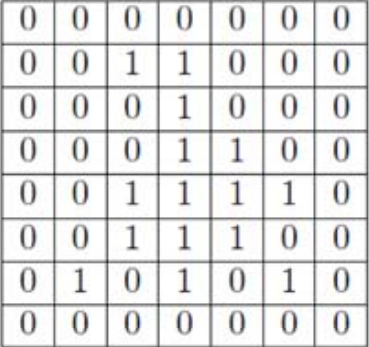
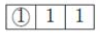
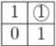

## 数字图像处理实验报告 hw5

17341190 叶盛源 数据科学与计算机学院

#### 第一题

用给定的模版对下图进行腐蚀、扩充和开闭变换



(a) 使用模版进行扩充：

因为模版为1*3，到最右边的两列点没办法使用模版，因此我们需要先padding图像：

```matlab
padding_I = zeros(m, n+2);
padding_I(:, 3:n+2) = I;
```

接着我们对图像进行扩充，我们以模版第一个1为中心类似卷积操作遍历图像每一个点，检查对应覆盖区域是否也有1。如果有，这个点就在扩充后的图中对应位置为1，如果无就为0。

注意：这里需要先将模版180度旋转！

在实现的时候我采用了异或的方法，对矩阵中的元素对应异或，然后取最小值，也就是看是否存在一样的，如果有就为1。实现如下：

```MATLAB
R(i,j) = 1-min(xor(kernal,padding_I(i,j:j+2)));
```


(b) 使用模版进行腐蚀：

模版还是1*3，因此一样需要【】padding

然后我们对图像进行腐蚀，我们以模版第一个1为中心类似卷积操作遍历图像每一个点，检查对应覆盖区域是否也有0。如果有，这个点就在扩充后的图中对应位置为0，如果无就为1。

在实现的时候还是采用异或的方法，相当于存在一个异或结果为1的，就为0，可以用xor加min的方法：

```matlab
R(i,j) = 1 - max(xor(kernal,padding_I(i,j:j+2)));
```


(c) 使用模版进行扩充

先进行padding，因为是2*2的模版，中心在右上角，所以行列各padding一列

```MATLAB
padding_I = zeros(m+1, n+1);
padding_I(2:m+1, 1:n) = I;
```

注意：这里需要先将模版180度旋转！然后采用类似卷积的操作

因为存在0，0不会被考虑进去，不需要对应位置为0，所以原来xor的方法就不能用了，改用矩阵的对应位置乘求和，如果结果大于0，就为1。否则就是一个都没匹配，就为0

```MATLAB
R(i, j) = sign(sum(dot(kernal,padding_I(i:i+1,j:j+1))));
```


(d) 使用模版进行扩充

同样先进行padding，然后用矩阵的对应位置乘求和，如果结果等于3，就说明完全匹配，否则就有不匹配的

```matlab
if  sum(dot(kernal,padding_I(i:i+1,j:j+1)))==3
		R(i, j) = 1;
else
		R(i, j) = 0;
end
```

最后前4题结果如下：


(e) 对上面两种方法进行开变换

开变换就是先腐蚀在拓展，依次调用上面的方法即可

(f)对上面两种方法进行闭变换

先拓展再腐蚀，依次调用方法即可。

结果如下图


#### 第二题

第二题是要找一个全局的阈值来将图片二值分割。我们使用书本上自动找全局最优阈值的方法。首先随便取一个阈值，然后用它来分成两部分，分别取平均值后再取两者的均值作为新的阈值，如果新的阈值和老的阈值的差大于一个自己设定的数，就继续迭代求更新的阈值，知道最后迭代停止，得到的就是我们的目标阈值。算法实现如下：

```matlab
function R = segmentation(I)
    [m, n] = size(I);
    E = 0.001;
    old_T = 256.0;
    new_T = mean(mean(I));

    while abs(old_T - new_T) > E
        sum1 = 0;
        sum2 = 0;
        count=0;
        for i=1:m
            for j = 1:n
                if I(i,j) <= new_T
                    sum1 = sum1+I(i,j);
                    count=count+1;
                else
                    sum2 = sum2+I(i,j);
                end
            end
        end
        old_T = new_T;
        new_T = (sum1/count + sum2/(m*n-count)) / 2;
    end
   
    R = zeros(m, n);
    for i = 1:m
        for j = 1:n
            if I(i, j) > new_T
                R(i, j) = 1;
            else
                R(i, j) = 0;
            end
        end
    end
end
```

我们使用这种方法分别对图一进行处理：


发现图1处理的效果很好，很明显的分隔除了目标，不过图二在右上角还好，到了左下角阈值和目标图像比较结晶的区域，结果就不是很好了，这是因为图二是不均匀的光照，如果直接用这个方法右上角灰度值显然比左下角要更高，如果要找一个阈值把他们分到一起，比较困难。

于是我采用了分块的方法，也就是把原图分成多块再用这个算法分割图像，效果如下：


四幅图依次是行和列分割为2、4、6、8个的结果，可以看到前三个都还有一些地方不是很清晰，不过到了分成8块后几乎就都分割出来了。

可见对于这种不均匀背景的分割，需要分块处理才能取得更好的效果

