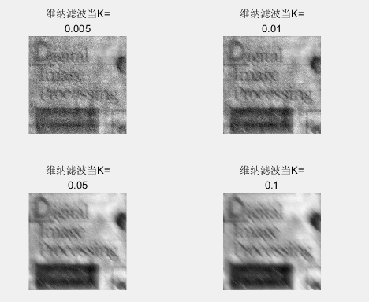

## 数字图像处理 作业4

17341190 叶盛源 数据科学与计算机学院

#### 问题一

在讨论图像恢复部分时候，需要先估计退化函数。课本上给出了一对运动图像的一个退化模型，我们可以利用这个模型，来对我们的图像进行运动模糊的处理，参考课本上的公式：


于是我们在matlab上编写代码构建运动模糊的滤波器：

```MATLAB
a = 0.1;
b = 0.1;
T = 1;
for u = 1:m
    for v = 1:n
        x = pi * ((u-m/2)*a + (v-n/2)*b); % 因为做了中心化，原点被平移到了m/2 n/2
        if (x == 0)
            H(u,v) = T;
        else
            H(u,v) = (T / x) * sin(x) * exp(-1i*x);
        end
    end
end
```

这里要注意的是我们做了中心化所以要减[m/2,n/2]


#### 问题二

第二个问题让我们在刚刚生成的模糊图像上加一个方差为500均值为0的高斯噪声，我们用matlab函数即可生成一个标准正态分布的随机变量，然后做一个线性变换。

```MATLAB
stand_normal_noise = randn(m,n); % randn用来生成一个随机的标准正态分布矩阵
normal_noise = stand_normal_noise*sqrt(500)+0;% 对标准正态分布进行一个线性变换得到目标正态分布
res2 = res1 + uint8(normal_noise);
```


#### 问题三

问题三要我们进行逆滤波， 若已知退化函数，则可以很简单地通过图像退化的逆过程来恢复图像。对退化图像傅里叶变换，在频域中除以退化函数的频域滤波器，再对进行傅里叶反变换，这样就得到恢复之后的空域的图像。 


这里因为是一个点除，可能会出现除以0的问题，所以在实现的时候，要加上一个数，但这个数不能太小，如果太小比如加0.1，生成的图像就会有一些地方很黑，我这里经过尝试后，选择了加1.

```MATLAB
res3_1 = real(ifft2(ifftshift(F3_1 ./ (H+1)))); 
res3_2 = real(ifft2(ifftshift(F3_2 ./ (H+1))));
```


#### 问题四

第四个问题让我们进行一个维纳滤波来复原图像， 目标是找到未污染图像的一个估计𝑓，使他们之间的误差最小。定义误差度量为： 


通过求解上述的表达式，我们可以得到误差最小值在频率域上的表达式：


上述表达式是综合了退化函数和噪声统计特征进行复原处理的方法， 其中𝑆𝜂(𝑢, 𝑣)为噪声的功率谱，𝑆𝑓(𝑢, 𝑣)为未退化图像的功率谱。

因为处理的是白噪声，所以谱𝑆𝜂(𝑢, 𝑣)是一个常数；而𝑆𝑓(𝑢, 𝑣)一般是很难知道的，所以才把两项的商整体作为K值。我们可以得到下面的表达式：

  

我们会发现，当K为0的时候，维纳滤波就退化成了一般的逆滤波，可见维纳滤波比逆滤波更多考虑了一些关于噪声的问题，所以能取得更好的效果，如何选取参数K也是一个需要尝试和研究的任务。

于是我们可以利用这个表达式来进行滤波，通过调整不同的k值观察不同的实验效果。

```matlab
figure
for i =1:kn
    K = K_list(i);
    Wiener = (1./H).*(abs(H).^2) ./ (abs(H).^2 + K);
    F4 = fftshift(fft2(res2)); % 将blurry图像傅里叶变换
    res4 = real(ifft2(ifftshift(F4 .* Wiener)));
    range = max(res4(:)) - min(res4(:));
    res4_1 = uint8((res4 - min(res4(:))) .* 255 ./ range);
    res4(:,:,i)=res4_1;
    subplot(2,2,i), imshow(uint8(res4(:,:,i))), title(["维纳滤波当K=",num2str(K)]);
end
```


#### 实验效果展示：

首先是是前三个实验


可以看到很明显的实验效果，经过滤波处理后，运动模糊图像明显不那么模糊了。

对第三个实验，分别尝试了 参数K为0.005 0.01 0.05和0.1四种不同的情况，滤波效果如下图：



对比上图中的最后一幅图和逆滤波的结果，我们可以发现，明显的逆滤波中有很多的高斯噪声没有被处理，而维纳滤波比较好的考虑了高斯噪声的问题并进行了处理。