# 数字图像处理基本运算

 Author： 中山大学 17数据科学与计算机学院 YSY

 https://github.com/ysyisyourbrother  

[toc]

## 图像的像素运算

### 点运算

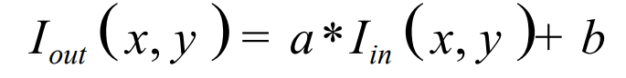

输入的I是HSI模型中的亮度

a>1的时候相当于原本的亮度差值越来越大，也就是对比度上升了

点运算就是

1.  算针对图像中的每一个像素灰度，独立地进行灰 度值的改变 
2.  输出图像中每个像素点的灰度值，仅取决于相应输入 像素点的值  
3.  点运算不改变图像内的空间关系 

可以增强对比度，拉伸对比度，进行灰度变换

### 代数运算

去除叠加性噪声，对叠加的噪音图像求均值。

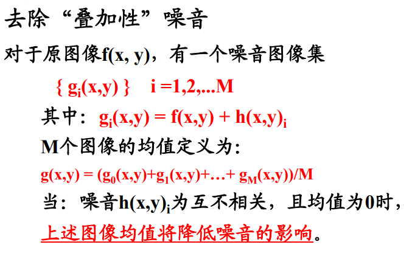

二次曝光

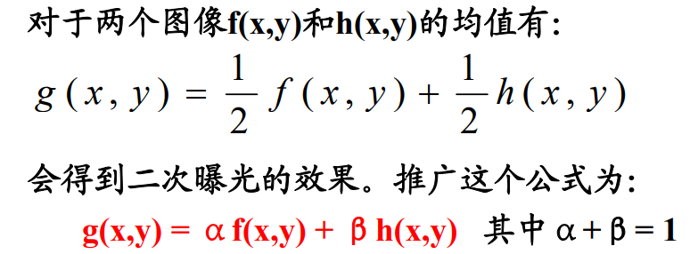

乘法的定义是：逐点相乘

### 逻辑运算

#### 求反

 g(x,y) = R - f(x,y) R为f(x, y)的灰度级，对于8bit灰度图，R=255。 

#### 异或

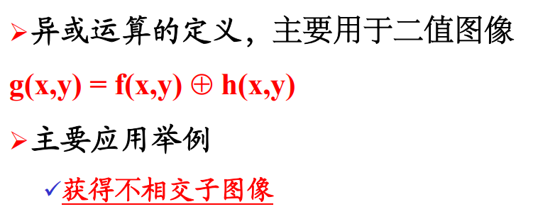

#### 与

## 非几何变换

### 对数变换

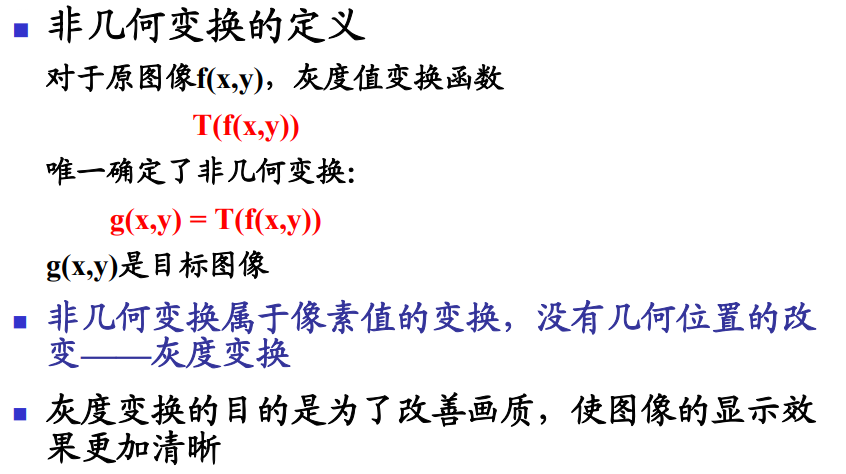

对于对数变换：将输入中范围较窄的低灰度值映射为范围较宽的灰度值。用这种方法拓展低灰度值，同时压缩更高灰度的值。**对于大部分都是低灰度值的图像来说，起到对比度拉升的作用**

### gamma变换

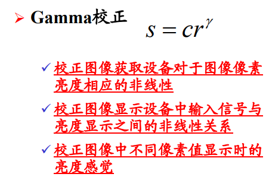

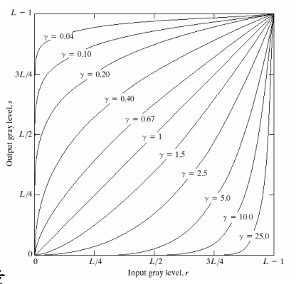

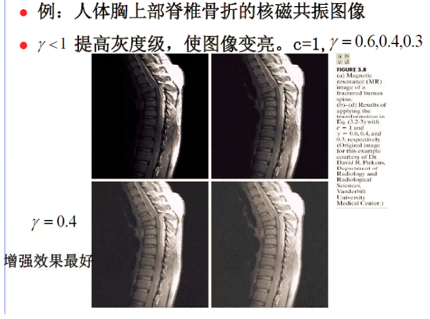

### 图像求反

### 分段线性变换

#### **对比度拉伸**

#### 灰度级分层

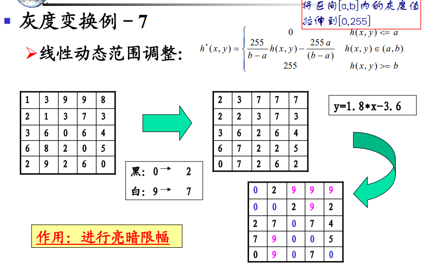

相当于构建了一条映射的直线，过(2,0)(7,9)点

或者用minmax公式也可以构建

## 几何变换

不改变灰度值，但会改变坐标的位置

1. 坐标空间变换
2. 灰度内插，对变换后的像素灰度赋值

### 顺时针旋转

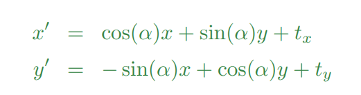

### 仿射变换affine

一般形式

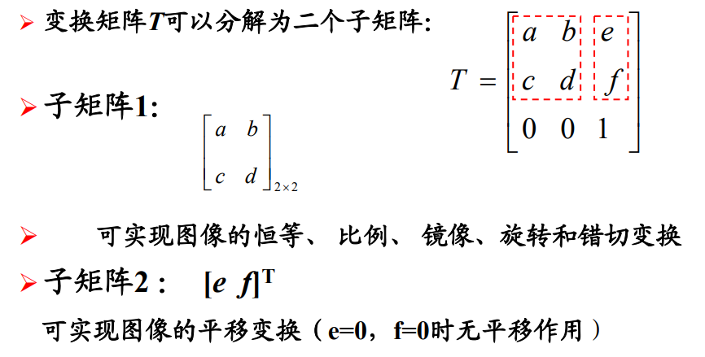

一般具有性质：

- 变换前图形上的每一点，在变换后的图形上都有一确定的对应 点，如原来直线上的中点变换为新直线的中点 
- 平行直线变换后仍保持平行，相交直线变换后仍相交 
- 变换前直线上的线段比等于变换后对应的线段比 

##### 一些变换矩阵的实例

平移：

对称

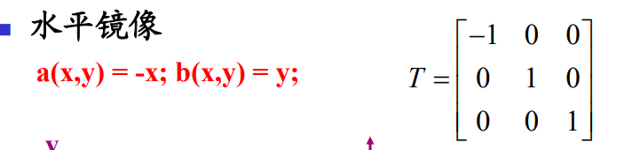

垂直镜像：

缩放
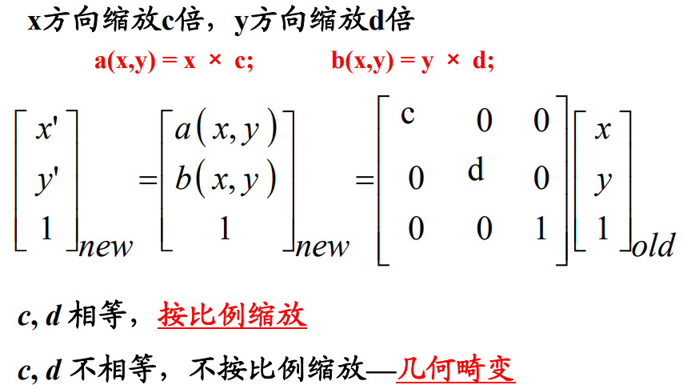

旋转

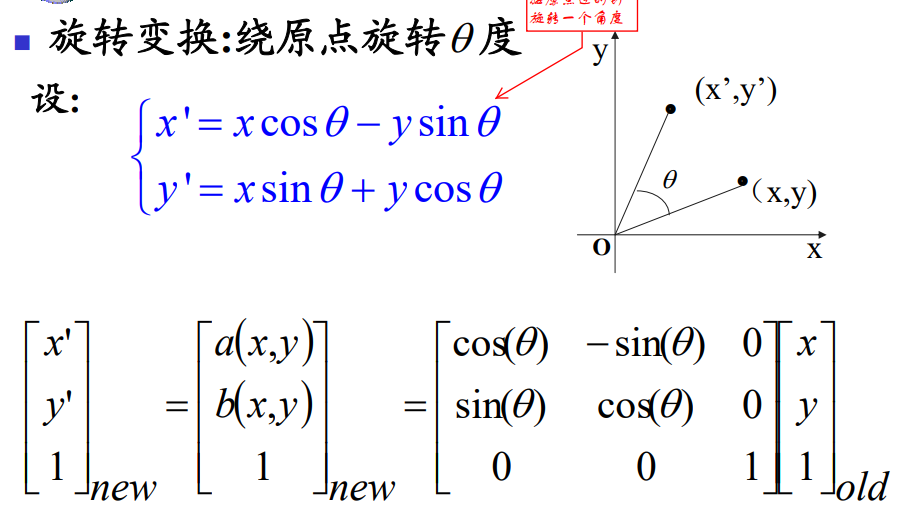

错切变换

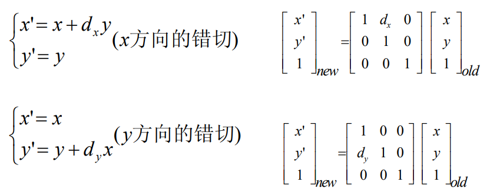

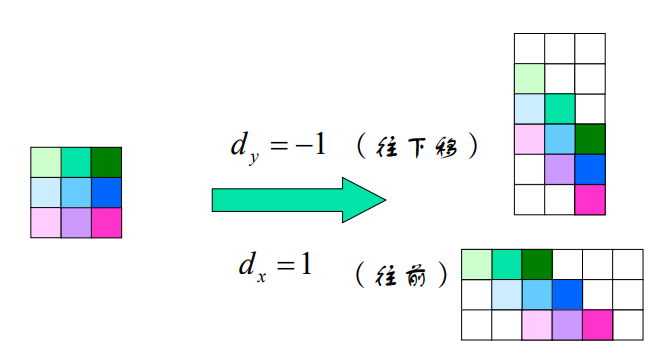

### 映射 projective

#### 非线性集合变换

### 插值

前向映射后可能输出网格上有些点没有被映射，用插值的方法填补

如果有些输出网格点附近没有映射过来的像素，就会形成空洞

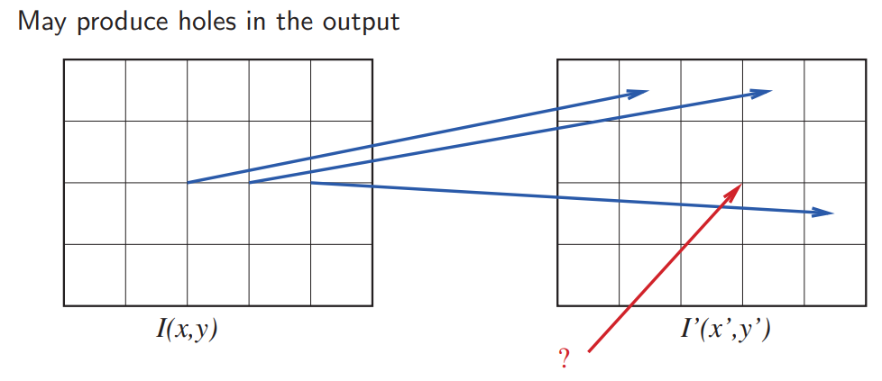

可以用向后映射来计算变换后输出网格点的值。对输出网格点做向后映射，映射完后在原图像插值，然后作为变换后对应网格点的值

### 

#### 最近邻：

#### 双线性：

用当前点周围的最近的四个点来一起估计它的值，用距离加权求和的方法：

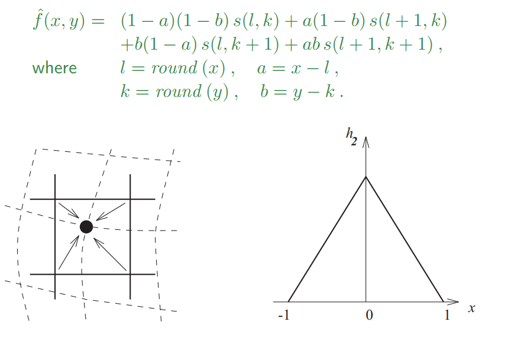

 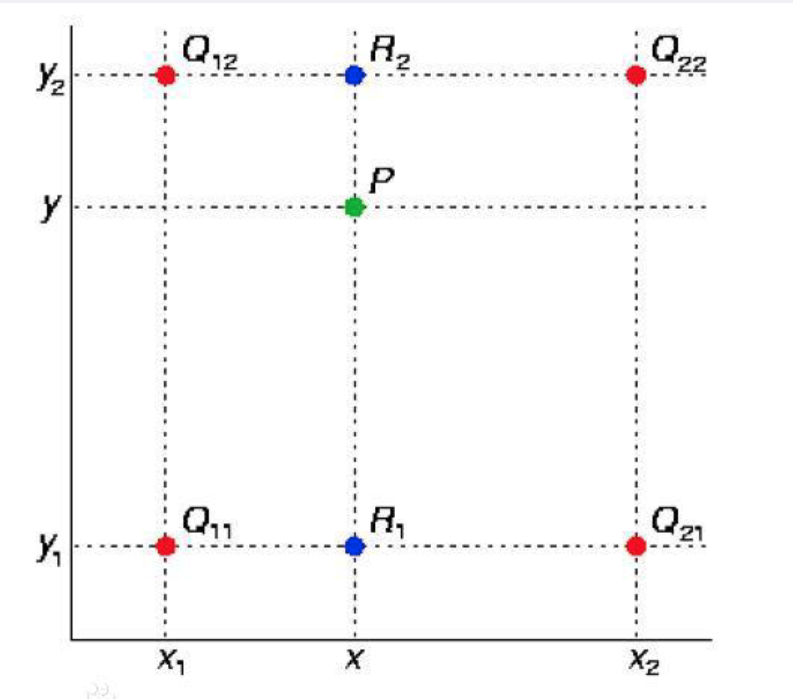 

 双线性内插法的计算比最邻近点法复杂，计算量较大但没有灰度不连续的缺点，结果基本[令人满意](https://www.baidu.com/s?wd=令人满意&tn=24004469_oem_dg&rsv_dl=gh_pl_sl_csd)。它具有低通滤波性质，使高频分量受损，图像轮廓可能会有一点模糊。 

##### 双三次：

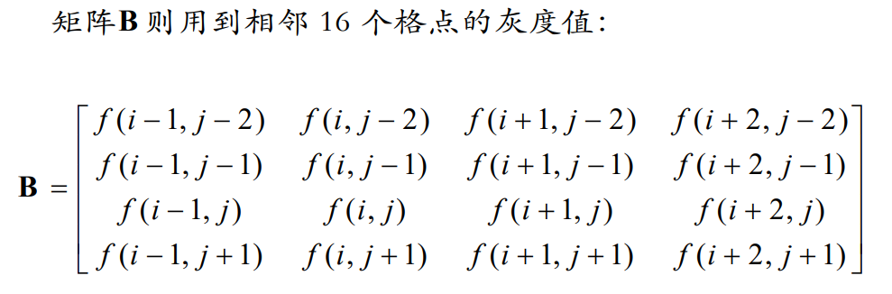

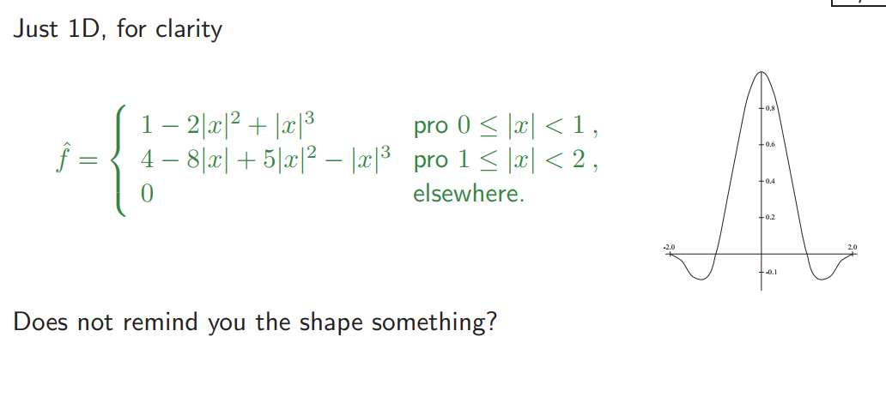

 

  对待插值的像素点(x,y)（x和y可以为浮点数），取其附近的4x4邻域点(xi,yj), i,j = 0,1,2,3。按如下公式进行插值计算： 

  

**其实就相当于一个卷积的操作**

$$
Sinc(x)=\frac{sin(\pi x)}{\pi x}
$$
我们在还原信号的时候，只需要在频谱上做一个低通滤波，把那些延展出来的频率过滤掉，得到的就是原始的信号 

 而根据傅立叶变换的性质，在频域上乘积，等价于在时域上的卷积。而低通滤波器，可以近似看为一个矩形函数。矩形函数的傅立叶变换（或者逆变换），则是Sinc函数 

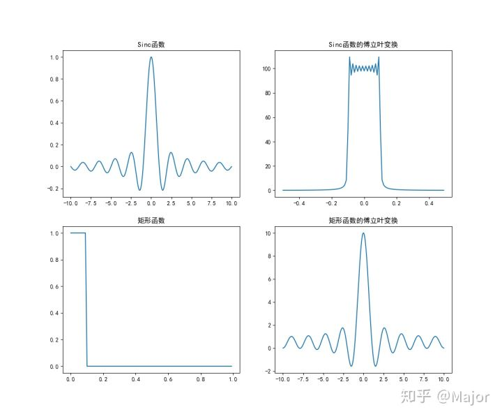  所以，低通滤波的操作，又相当于把采样点和Sinc函数进行了卷积。 

#### 不同插值方法的使用场景：

1.  当纹理信息为主要信息时，最近邻采样将严重 改变原图像的纹理信息 
2.  但灰度信息为主要信息时，双线性内插及三次 卷积内插将减少图像异质性，增加图像同质 性，其中，双线性内插方法使这种变化更为明 显 

