# 第四章 灰度空间与空间滤波

 Author： 中山大学 17数据科学与计算机学院 YSY

 https://github.com/ysyisyourbrother  

[TOC]

## 直方图处理

### 灰度直方图

图像中每种灰度级的像素个数。横坐标是灰度级，纵坐标是该灰度级出现频率

这里要注意纵坐标是频率还是次数

图片不同直方图又不同的感受：

### 统计灰度直方图

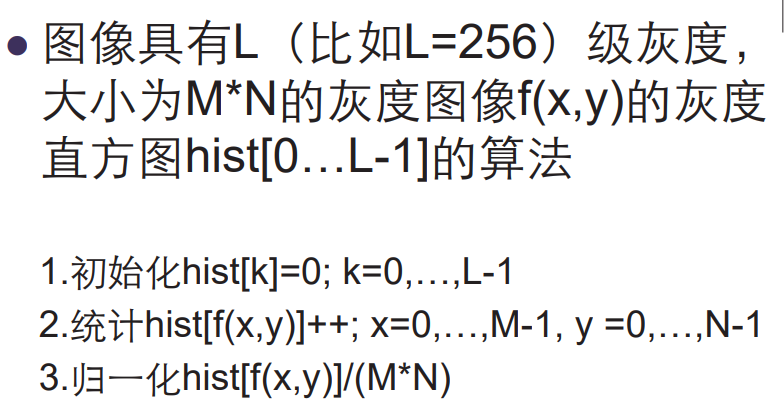

### 应用

1. 判断图像是否合理利用了所有灰度级范围

2. 分割前景背景

   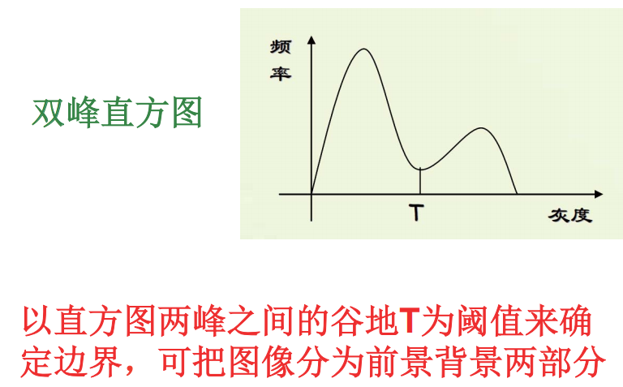

3. 计算面积

   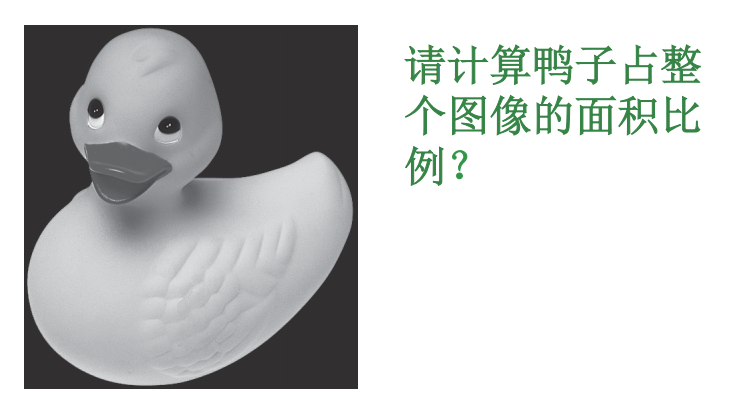

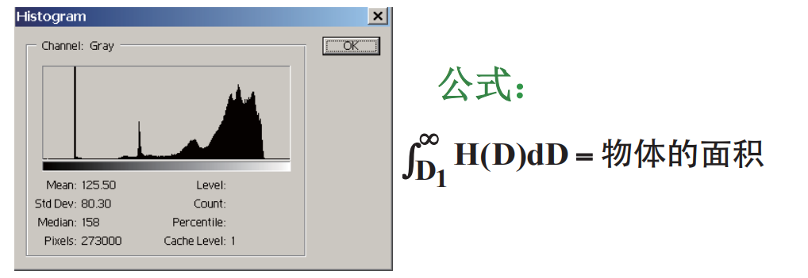

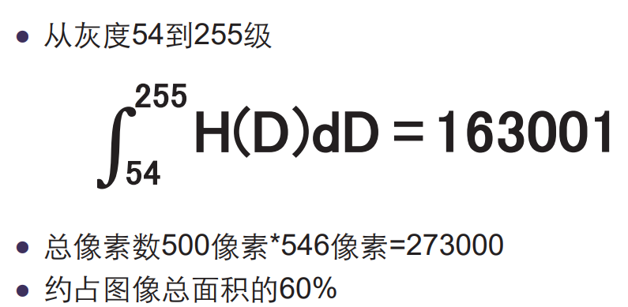

### 连续图像的直方图计算

连续的图像的灰度值计算比较麻烦，要用到积分的方法。

连续图像的灰度概率分布为：

- H(D)是连续图像的灰度概率直方图

  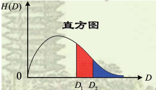

- A(D)是连续图像的具有灰度级D以上的阈值面积函数：

  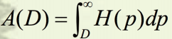

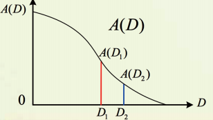

- 概率密度函数是归一化到单位面积的直方图H(D)：

  

- 累计分布函数CDF是：对PDF进行积分的阈值面积函数：

  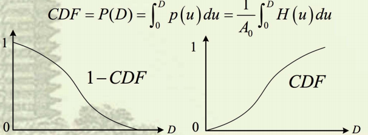

- H(D)积分得到A(D)；A(D)求导得到H(D)

  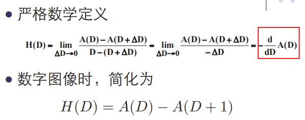

#### 例题：

1. 计算灰度值为D的地方x为多少$D=e^{-x^2}$解出$X=\sqrt{-ln(D)}$，然后因为横坐标是对称的，所以大于灰度D的面积为2x

   

2. 应用上面的公式计算直方图：

   

### 直方图均衡化

#### 灰度变换函数

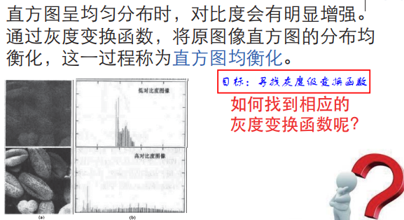

#### 原理推导

找到一个灰度变换函数T，满足单调递增，并且存在反函数

面积相同因为原图像的像素点数量不能变。

这里的目标是从HA(D)经过灰度变换函数进行坐标映射后，生成HB(D)的值

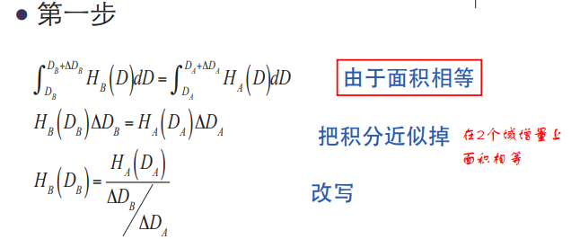

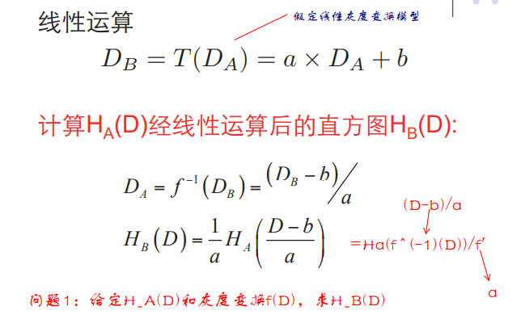

#### 直方图均衡化

下面的问题是如何找到一个灰度变换函数让直方图均匀分布

我们要让映射后的点DB均匀分布：

因此可以推理出我们要的灰度变换函数为：

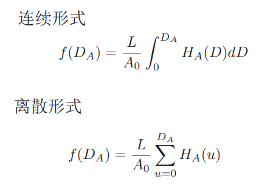

#### 直方图均衡的缺点

 直方图使灰度级分布具有均匀概率密度，扩展了像素取值的动态范围但减少了灰度级 。因为它不能把同一个灰度级的像素映射到不同灰度级上，但有可能原图多个灰度级因为四舍五入进入了同一个灰度级。

如果原图中灰度级突然很大，就可能导致映射后的图中有一部分空缺，灰度为0。因为虽然是单值函数，但因为四舍五入的原因，可能会多个映射到一个。

### 直方图匹配

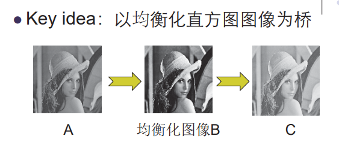

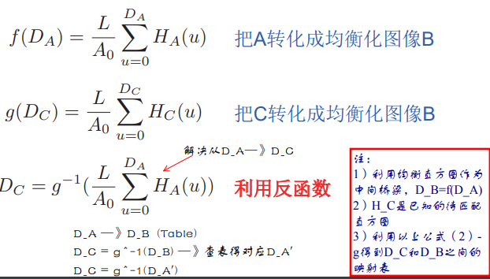

## 算数/逻辑操作增强

### 图像加法

#### 削弱随机噪声

### 减法处理：

减法操作之后可以用minmax规范到0到255之间

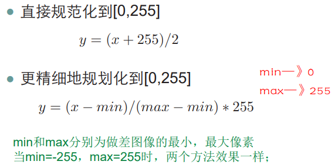

#### 找出图片细微的差别

#### 指纹抽取

### 图像乘法和除法

使用比较少

## 空域滤波

### 空间滤波机理

滤波器响应是滤波器系数与由该滤波器包围的图像像素乘积之和

可以表示为：

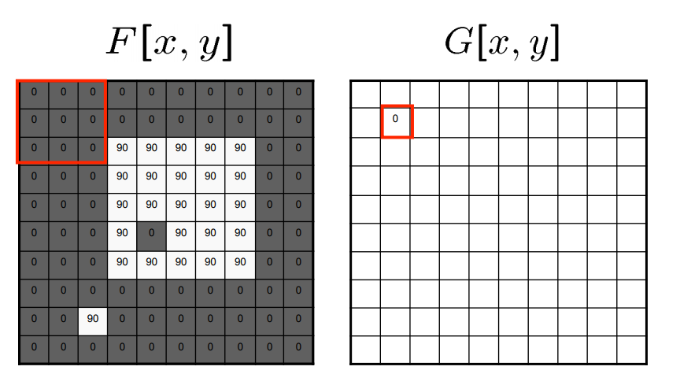

### 相关和卷积

- 相关就是滤波器模版移过图像并计算每个位置乘积之和。

  

- 卷积类似，但开始前滤波器要旋转180

  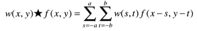

一个函数和一个冲激的卷积得到原来函数

一个函数和一个冲激动相关得到180度旋转后的函数

在二维图像上为：

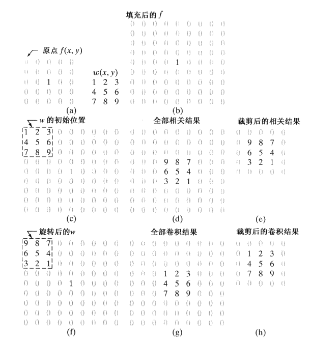

#### 卷积padding

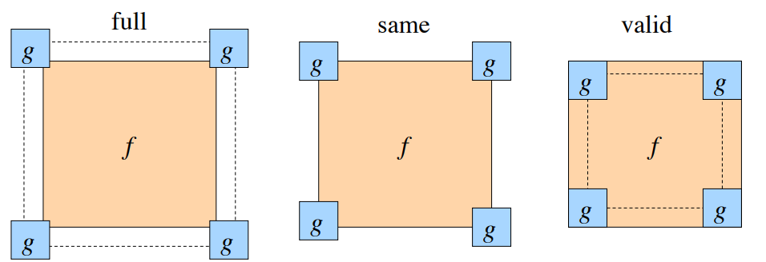

### 相关和卷积应用

注意相关值计算图片之间的关联

卷积是一种滤波操作

#### 相关应用

检测图片上是否有该模版图像

如下图找出图像中的车轮位置。但不能直接使用下面的公式

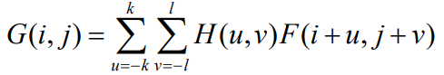

因为如果车轮匹配到一个各像素值都比较大的区域，也有可能输出较大的结果，因此我们需要进行归一化：

用原图对应区域的像素平方和作为归一化的方法

### 平滑空间滤波器

左边这个是均值滤波右边是高斯平滑滤波

blur 模糊不清

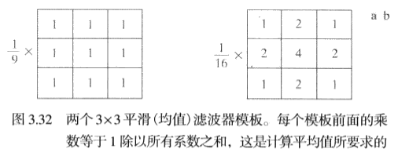

二维的高斯滤波器为：

滤波器越大，模糊程度更大。当目标位置的灰度和相邻位置的灰度比较接近时，会导致目标模糊混合。可以将较小物体如噪音融合到背景中。

### 统计排序滤波器

**统计排序滤波器**：将滤波器包围的图像区域中像素排序，并用排序结果决定的值代替中心像素的值。

**中值滤波器：**最知名的统计排序滤波器，用像素领域内灰度的中值代替该像素的值。中值滤波对一定类型的随机噪声效果很好，相比同尺寸平滑滤波模糊程度要低。尤其是**椒盐噪声**

**椒盐噪声：**也称脉冲噪声，是一种随机出现的白点或黑点，灰度值比较极端。如果用平滑滤波因为它灰度值过大或小可能效果不好。

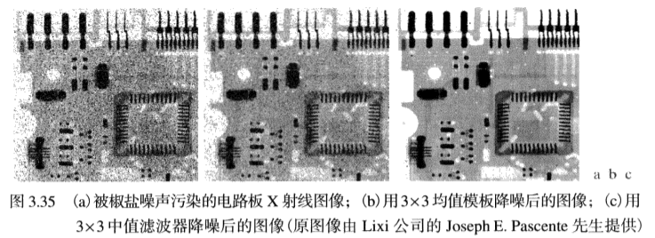

### 锐化空间滤波器

#### 基础

一阶微分如下：

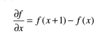

二阶微分如下：

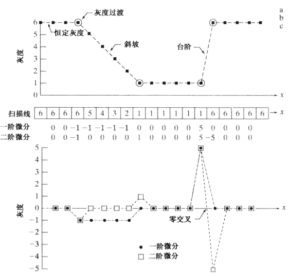

1. 数字图像中的边缘在灰度上通常类似于斜坡过度，沿斜坡一阶微分非0
2. 对于台阶，二阶微分产生由0分开的一个像素宽的双边缘（在零交叉两侧，如果是斜坡也一样不过宽度更大）。二阶微分在增强细节上比一阶微分好得多，是一个适合锐化图像的理想特性。

#### 拉普拉斯算子

一个二维图像的拉普拉斯算子定义为：

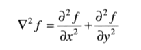

拉普拉斯对原图像增强的基本方法为：

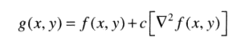

直接用拉普拉斯锐化可以进行边界的检测，拉普拉斯平滑可能有正有负，可以整体平移到灰度范围内（**标定**），也可以把负值当作0

#### 非锐化掩蔽和高提升滤波

**非锐化掩蔽：**另外一种锐化的方法是，从原图中减去一副非锐化的（平滑过的）版本。

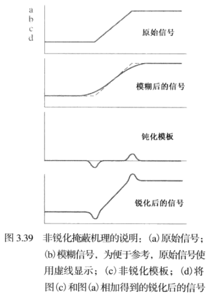

首先我们得到模版：

然后在原图像上加上该模版的一个权重：

当k=1的时候是**非锐化掩蔽**

当k>1的时候是**高提升滤波**

### 使用一阶微分锐化

定义梯度

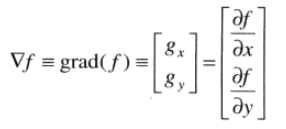

可以用绝对值来计算：

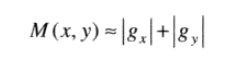

#### 罗伯特交叉梯度算子

可以使用交叉微分计算：

平方：

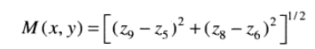

或者绝对值：

#### Sobel算子

在z5为中心的3*3的模版中我们可以使用：

中心系数为2是为了突出中心点的作用。

可以得到：

