# 第五章 图像复原与重建

 Author： 中山大学 17数据科学与计算机学院 YSY

 https://github.com/ysyisyourbrother  

[TOC]

## 噪声模型

### 白噪声

1. 白噪声的傅里叶频谱为常数
2. 白噪声与空间坐标系相互独立
3. 与像素值相互独立

z表示灰度值。图像上每个像素点都计算这一个噪声值，每个点都是独立同分布的，然后加在图像上。

#### 高斯噪声

#### 瑞利噪声

#### Gamma噪声

#### 均匀噪声

### 脉冲噪声

在图像中引起黑白点状随机噪声

#### 椒盐噪声

有pa的概率生成灰度值为a的，有pb的概率生成灰度值为b的，其他都不可能生成

b在图像上显示一个亮点（盐），a显示一个暗点（椒）。也称为脉冲噪声

### 参数估计

核心是计算均值和方差

脉冲噪声可以直接通过直方图获得：

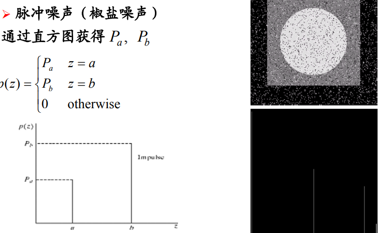

## 图像退化与复原模型

### 基本原理

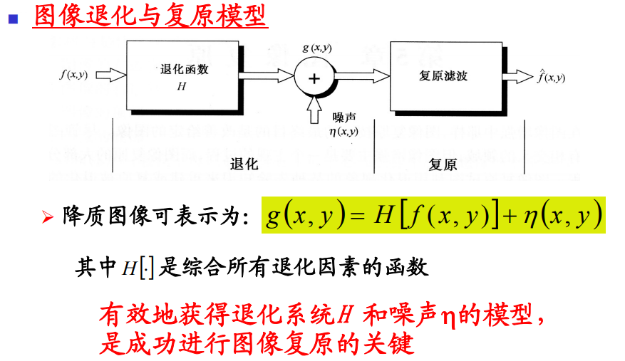

1. 根据退化原因建立数学模型
2. 实际复原过程相当于设计一个滤波器，使其能从损坏图像g计算得到真实图像的估计$\hat f$.
3. 图像复原是一个求逆过程，经常存在非唯一解，甚至误解，需要有先验知识约束。
4. **引起图像退化的原因往往是非线性的**，不过非线性的技术很困难而且可能无解。用线性系统近似可以方便求解，并且基本满意
5. 从线性系统角度，图像退化可以看做原始图像和退化函数的卷积。线性复原则可以看做**去卷积操作**，采用的滤波器是去卷积滤波器

### 噪声单独干扰

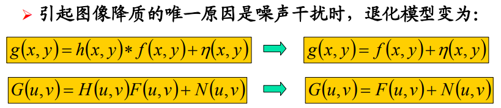

#### 空间滤波器的设计

假设m和n都是奇整数

##### 算数均值滤波器

##### 几何均值滤波器

效果和算数均值差不多而且丢失细节少。

##### 谐波均值滤波器

因为胡椒噪声灰度值是0，分母不能为0

##### 逆谐波均值滤波器

不能同时消除椒盐噪声。

##### 中值滤波

##### 最大值滤波

##### 最小值滤波

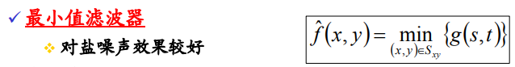

##### 中点滤波器

同时结合了计算滤波和非计算滤波的原理

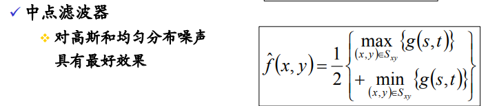

中点滤波器最适合用来**处理随机分布的噪声**，因为对称，可能求均值后就消除噪声了

##### 修正阿尔法均值滤波器

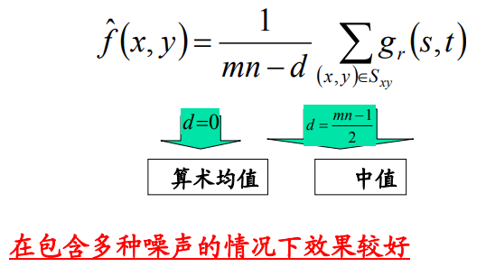

适用于**同时包含多种噪声情况**

#### 自适应空间滤波器

结合图像局部特性自动修改滤波器参数或滤波策略

##### 局部噪声自适应滤波器

##### 自适应中值滤波器

注意滤波器输出的是单个数值，代替(X,Y)处的像素值。

算法流程：

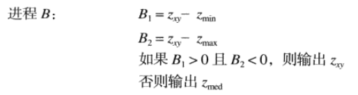

通俗的说就是：先找到一个合适的窗口，让这个窗口内的中值不是椒盐噪声（不是极端值），接着判断当前值是不是椒盐噪声，如果不是就不改变。否则就用中值取代它。

这个算法防止了中值也是椒盐噪声导致不准确。

#### 周期性噪声频域滤波器设计

##### 理想带阻滤波器

相当于把离中心D0距离的频率的部分去掉了。也就是把频率为D0的周期性噪声去掉了。

##### 巴特沃斯带阻滤波器

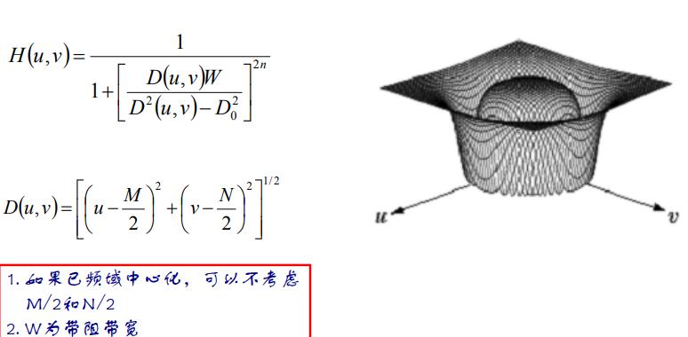

当D和D0很接近的时候，函数值H接近0，而W可以控制H的分母大小，如果W大的话，D相对于D0远一些，H也一样接近0。所以W可以控制带阻的宽度。

##### 高斯带阻滤波器

##### 应用

根据频谱判断噪音的频率，然后用带阻滤波器过滤。

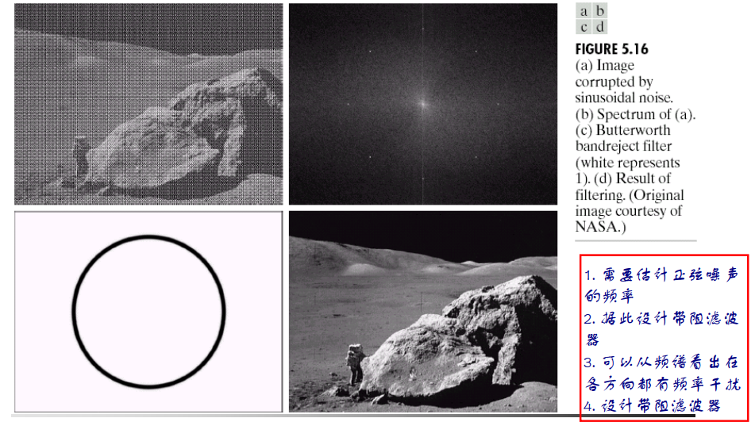

##### 理想陷波滤波器

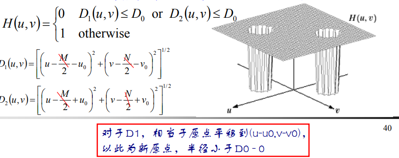

##### 巴特沃斯陷波滤波器

##### 高斯陷波滤波器

### 系统退化复原原理

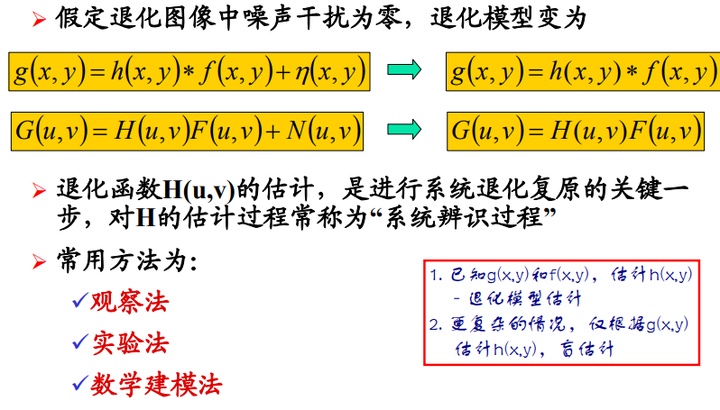

#### 线性位置不变退化

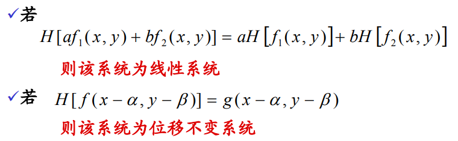

### 线性系统退化函数估计

假如我们有一个图像，但没有关于退化函数H的任何知识。我们可以从图像本身来收集信息。

如果图像已经模糊，通过观察图像中包含样本结构的一个小矩形区域。**接着用一些手工的方法或者锐化滤波器对这个子图像进行锐化处理得到处理过的子图像**，它相当于原图像f的估计值$\hat f$。

在g为退化后的图像，$\hat f$为退化前的图像的估计值，H为退化函数

根据这个函数特性，我们基于位置不变的假设可以还原出完整的退化函数H(u, v)。

#### 试验估计

如果有让图像退化的设备，就通过试验调整设备的参数，让这个设备模拟出退化的效果，然后让这个设备对一个冲激使用（在空域上使用，因为冲激和图像卷积得到的就是原图像），得到的就是一个能在空域上将图像退化的模版。

冲激的傅里叶变换通常为一个常数

得到退化系统的估计退化函数为：

#### 模型估计法

从引起图像退化的基本原理推导建立数学模型

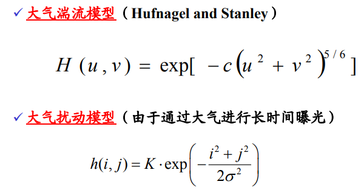

### 逆滤波复原方法

如果估计出了模型的退化函数，可以直接用逆来计算原来的图像

如果退化函数接近0，可能会导致F无穷大，所以要增加一个限制。

### 最小均方误差（维纳滤波）

**综合退化函数和噪声统计特征**进行复原

假设图像和噪声都是随机变量，互相不干扰。

目标是：

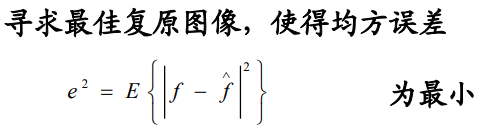

如果噪声消失，维纳滤波简化为逆滤波，也就是下式中，Sn为0。

在实际使用中。噪声的功率谱、未退化图像的功率谱很难获取。

在白噪声中，噪声的功率谱通常为一个常数，我们可以把他们打包假设为k，然后可以**通过调节k的大小来得到最佳答案**：

#### 约束最小二乘方误差

