# 第九章 形态学图像处理

 Author： 中山大学 17数据科学与计算机学院 YSY

 https://github.com/ysyisyourbrother  

[TOC]

## 基本操作

### 击中击不中 hit or miss

### 平移

### 扩张运算 dilation

一般模版的中心默认为(0,0)，扩张就是用模版的中心去压每个原图中为1的点，然后把模版覆盖的地方都改成1，也就相当于对原图点的平移。

这个方法和把模版180度旋转后对每个点进行卷积操作的结果是一样的。

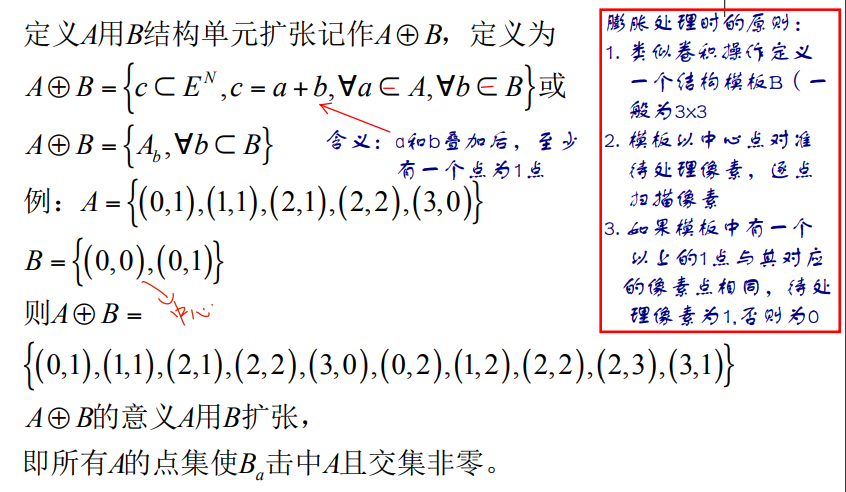

如果模版某个位置为0，原图中是0或者1都没关系。

**扩张就是直接把结构原点往原图1上压然后把覆盖的地方用模版代替即可。**

### 腐蚀运算 erosion

腐蚀让图像缩小，相当于用模版遍历图上每一个点，如果模版覆盖的范围内模版为1的地方原图有一个地方不为1，就将这个地方设置为0，否则为1。**腐蚀运算的模版不需要翻转180**

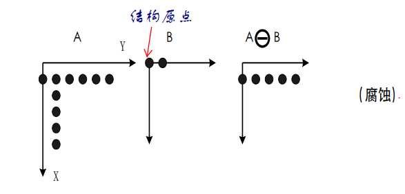

**如果结构原点为1，则腐蚀的结果一定包含于原图。**

但如果腐蚀的结构原点为0，在扫图的时候就可能出现对应位置为0，但腐蚀结果为1。因为结构原点为0的时候是不约束原图的对应位置的值的。

### 扩张和腐蚀的性质

**注意腐蚀要把并变交**

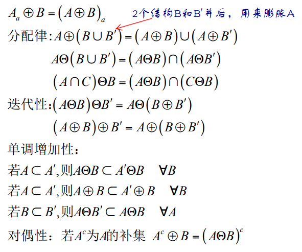

## 形态学变换

### 开变换

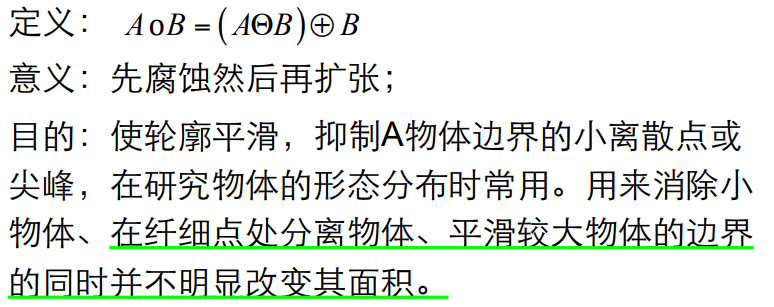

### 闭变换

### 交替序列滤波器  AFS

#### 开运算对并噪声的滤波

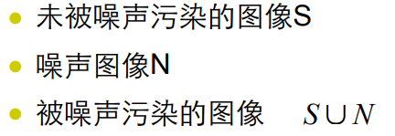

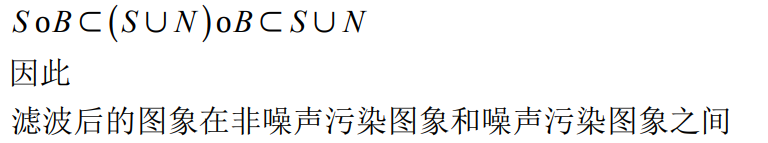

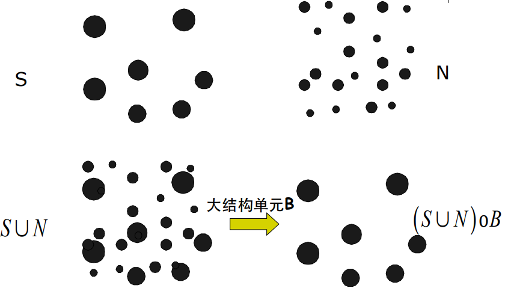

具体步骤为：

1. 大结构单元B将小的噪点腐蚀
2. 通过膨胀恢复原图像
3. 图像面积没有被明显改变，并且去除了小的噪声

#### 闭运算对差噪声的滤波作用

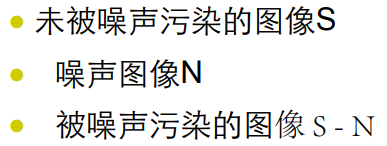

#### 交替序列滤波器

1. 在AFS中 开-闭（或者闭-开）序列交替执行
2. 开始时候，采用较小的结构单元，逐步增加尺寸
3. 到达某个上线尺寸就要终止

#### AFS 应用

将指纹变得更清晰

### 击中击不中变换

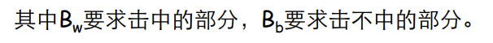

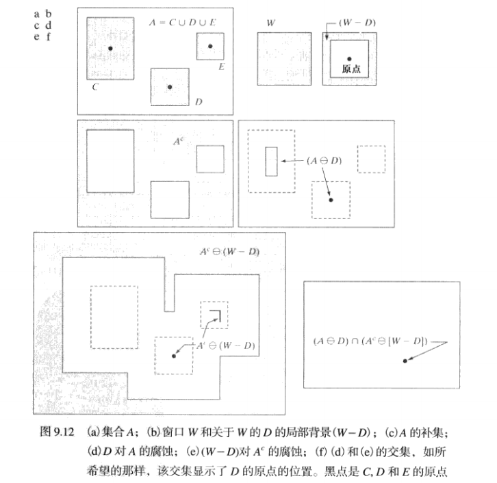

1. 先用D腐蚀A，得到图中所有可能为D的原点的集合。这些结果就是**击中**
2. D的外围一圈（W-D）对A的补集腐蚀，这样就可以把原图中C被击中的点去掉
3. 然后两者取交集得到D在图中对应位置的原点。

### 形态学变换的应用

#### 边缘提取

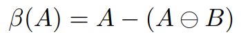

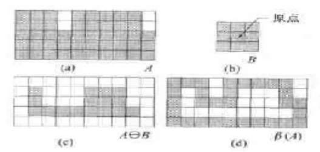

通俗的说就是：先用腐蚀将图像的内部找出来，然后和原来做差得到边缘。

#### 区域填充

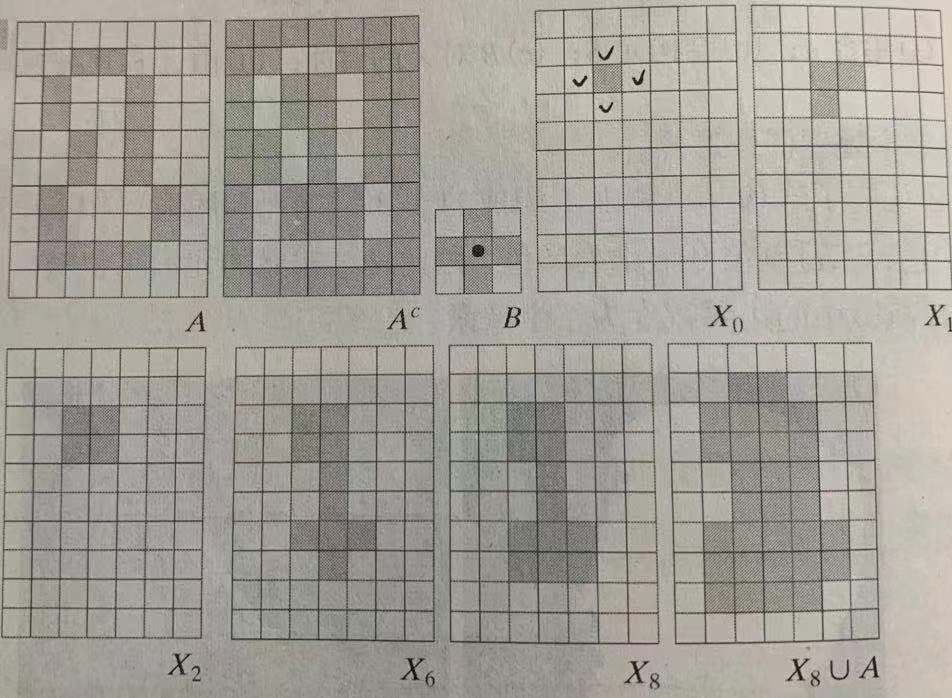

从内部取一个点开始，用模版B开始扩充，并且要限制不能扩充到边界外面去了。

#### 连通分量提取

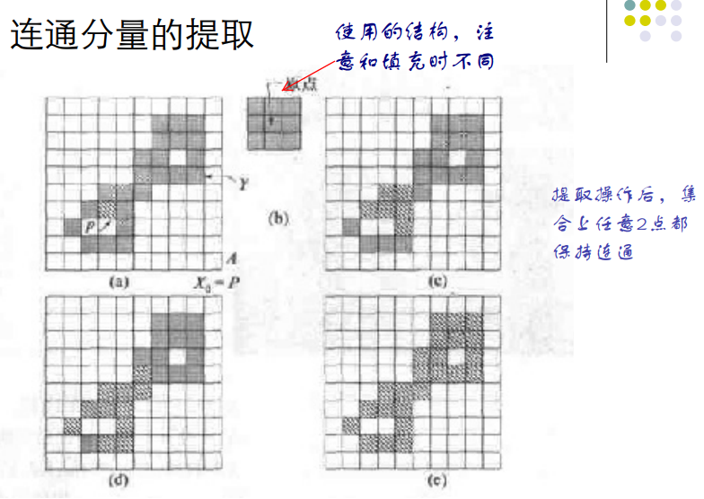

因为连通定义在8个方向上，所以这里要用这种模版。不断迭代，直到找到整个连通分量。

#### 图像细化

保持连通性和连通长度的条件下，消去不是端点的点

通俗的理解就是：

1. 细化的核心是把模版在原图上做击中击不中变换。将origin对准即可！！
2. 这里要记住！！！**是不带背景的击中击不中变换**，就是只要模版范围内完全符合即可
3. 做完击中击不中变换后，击中的就去掉，没击中的就留下来

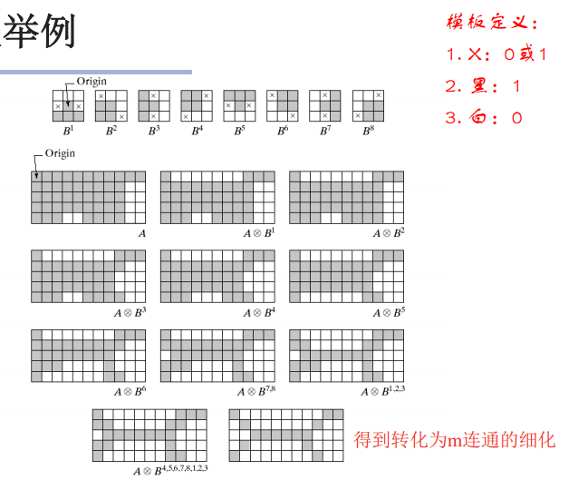

- 第一个点因为在模版B1中对应的左下角的点不存在，所以没有击中，于是保留

- 第二个点因为模版B1中对应位置击中，所以去掉这个点。
- 反复用8个方向不断对图像进行击中击不中然后去掉，最后得到细化的结果

#### 粗化

粗化就是对背景细化

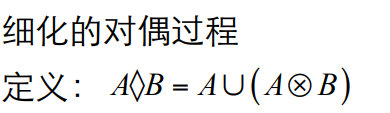

求出背景的细化后再求补集

#### 骨架