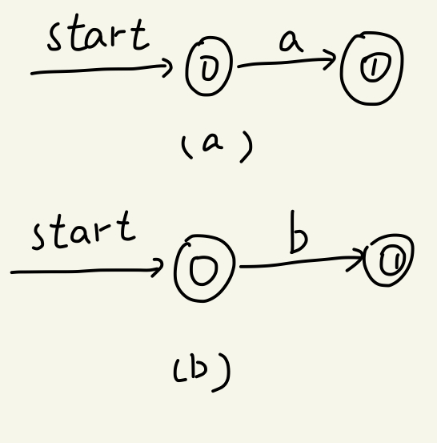
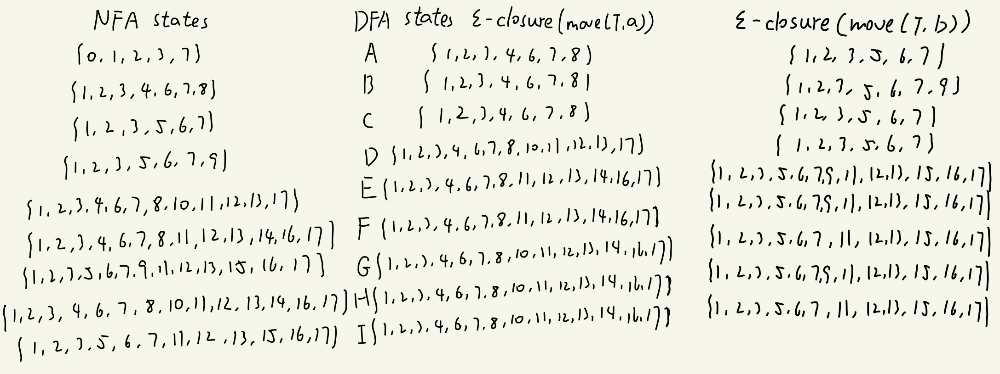
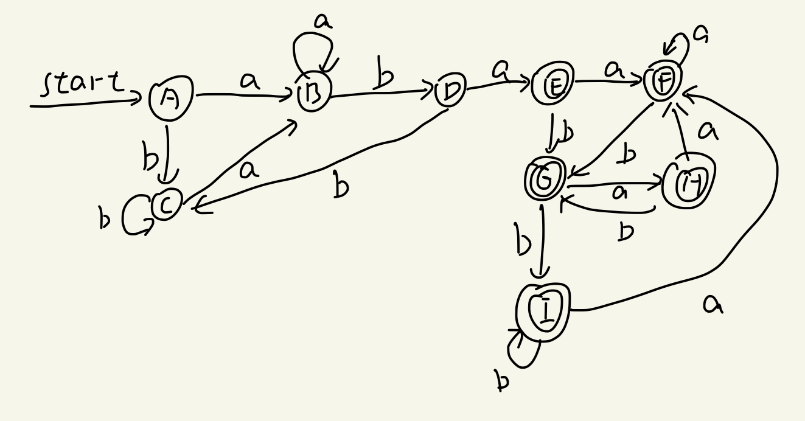
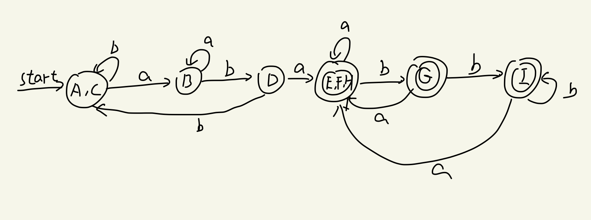

## 理论作业一

#### 问题：

Convert the regular expression to NFA, then to DFA, then minimizing the DFA:(a|b)\*aba(a|b)\*

#### 答案：

正则表达式a的NFA和b的NFA分别为下图a和b：

所以a｜b的NFA为：

因此，上式的NFA为：

然后我们把NFA转化为DFA，步骤如下：

最后把DFA转化为minDFA

把DFA中的所有状态分为两个集合：

{A,B,C,D}和{E,F,G,H,I}

再分割两个集合：

{A,C},{B},{D}.{E,F,H},{G},{I}

于是我们可以得到minDFA：

