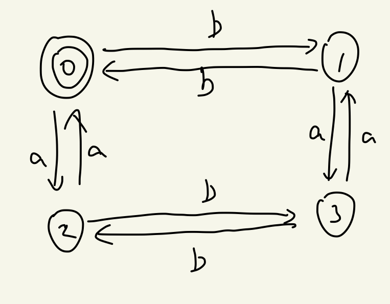
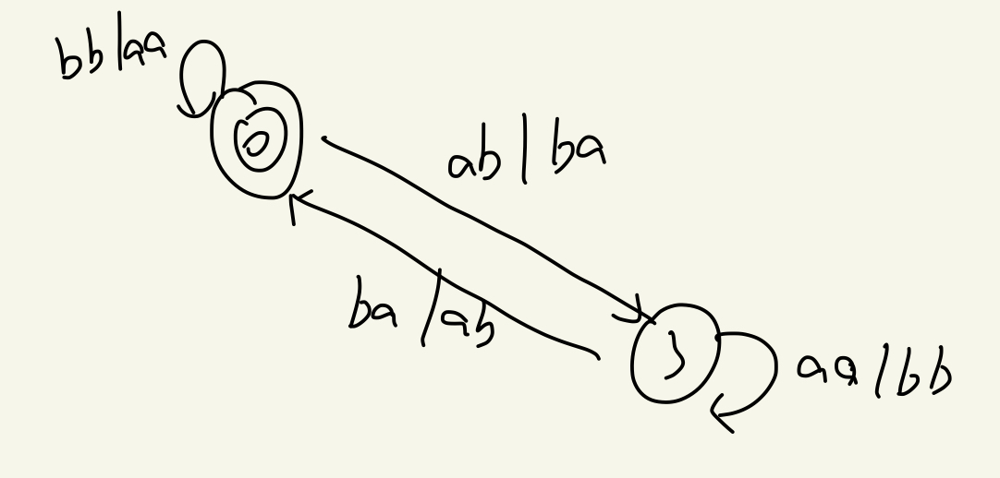
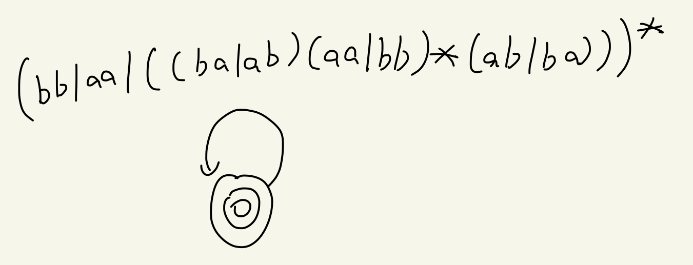

## 理论作业二

### 问题：

偶数个a偶数个b的ab串构成的语言L，写出L的正则表达式，正则文法和DFA

### 回答：

ab组成字符串只有以下四种情况：

- 偶数个a，奇数个b
- 偶数个a，偶数个b
- 奇数个a，奇数个b
- 奇数个a，偶数个b

他们的状态转换图为：

将状态q删除，得到新的状态转换图为：

继续把状态2删去，得到新的状态转换图为：

最后把状态3删去，得到最后的状态转换图和正则表达式：

正则文法：

最后可以得到DFA为：

