# 编译原理笔记3：有限自动机

[toc]

编译，是把人能看懂的代码翻译成机器能看懂的指令（即，机器语言）的过程，说白了核心任务其实就是搞个翻译，把一堆字符串搞成二进制流罢了。想要翻译，就要先搞懂语言的含义，这就需要进行【词法分析、语法分析、语义分析】这三步。词法分析器要干的，就是这第一步的词法分析——读取并识别我们写下的源代码（其实就是一堆字符串）中各个子串或字符，然后把整个源代码转化为一个记号流，以交给后面的语法分析器进行语法分析。

再复读回忆一下这么几个听起来挺怪的词。。

- 模式（Pattern）： 产生和识别元素的规则。也就是定义的词法规则；
- 记号（Token）： 按照某个模式（即，规则）识别出的（**一组**）元素。进行词法分析时，词法分析器将程序代码中的各个部分转为一个个记号的过程，就是根据规则得到一个记号流的过程；
- 单词（lexeme）： 被识别出的元素自身的值（**一个**），也称为词值。可以理解为源程序中一个个的字符串。

源程序由一个个单词组成，词法分析就是要使用“模式”这个规则，对单词进行识别、分类，把它们放到相应的记号里面去。

而，有限自动机，就是词法分析器中用于把单词识别成记号的玩意。

有限自动机分为：不确定有限自动机、确定有限自动机

自动机也叫 FA（Finite Automation），FSA（Finite State Automation）

## 一、不确定有限自动机（NFA）

### NFA的定义

NFA 是个五元组：M=(S, Σ, move, s0, F)。(M：machine）

1. S 是有限个 state 的集合；

2. Σ 是有限个输入字符的集合（包括 ε，也就是字母表）；

3. move 是状态转移函数 move(si, ch) = sj：**当前状态 si 下若遇到输入字符 ch 则转移到状态sj**；

   注意：实际上，这个严格来讲不应该叫函数。因为即使我们的 si、ch 都是确定的，执行该过程也未必会得到相同的 sj ！确定的输入得到确定的输出才能叫函数。

4. s0 是唯一的**初态**（开始状态）；

5. F 是**终态集合**（也叫做接受状态集），其为 S 的子集，包含了所有的终态。

NFA 还可以使用状态转移图、状态转换矩阵来表示。

#### 状态转移图和状态转移矩阵

- 状态转换图

  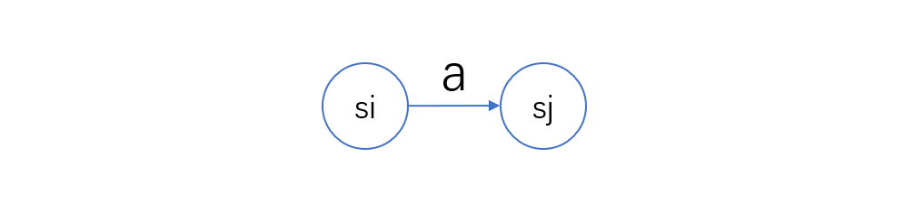

  - NFA 中的每个状态，对应转换图中的一个节点；
  - NFA 中每个 move(si, a) = sj，对应转换图中的一条有向边，表示从节点 si 出发进入节点 sj。字符 a（或 ε）是边上的标记。

- 状态转换矩阵（图例见下图）

  - 每个矩阵元素 M[si, a] 中的内容，是从状态 si 出发，经过字符 a（或 ε）所到达的下一状态 sj；
  - 一般以矩阵第一行所对应的状态为初态，而终态需要单独指出。


转移图的**初态用一个单独的箭头表示**，**终态可以用粗线条的圆圈也可以用两层圆圈**

图的关系可以使用矩阵表示。因此我们可以构造这样一个状态转移矩阵。在这个矩阵中： i 状态接受 b 能跳到 j 状态。


#### 出错：“串不被 NFA 接受”

如果在 1 这里接收到了 a ，那就说明出错了，需要到出错处理。**也可以专门为错误的跳转增加一个“死状态”（如下图）。**如果一个输入的串尝试了所有可能的路径，最后的结果是朝着未定义的方向跳过去了，那就叫做“这个串不被NFA接受”

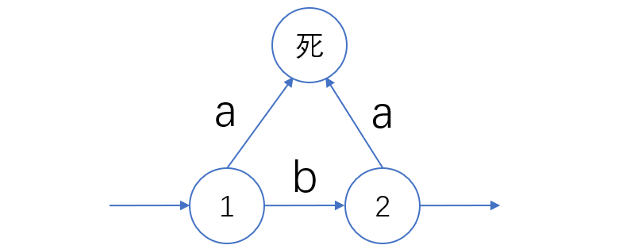


### NFA对记号的识别

#### 一般方法（串行）：

**【反复试探所有路径，直到到达终态，或者到达不了终态】**

简单地说，就是：从初态开始，每接受一个字符跳一下，一条路径跳不到终态就尝试另一个。只要能跳到终态，就说明一个字符串是合法的单词，就把这个记号归入到一个记号里面了。如果无论如何都跳不到终态，那就是这个字符串不合法。

以 (a|b)*abb 的 NFA 为例：


不过，这里存在一个问题：从 0 开始跳，可以跳到 0 和 1 这两个下一状态呀，那么在 0 状态时，接收到 a 是跳 0 还是跳 1 呢？嗯，就是这样的，确实是哪个都有可能——跳哪个完全是随机的。这就是**不确定性**，即从同一状态出发，对同一个字符可以跳到多个下一状态。

在这个例子中，万一我们第一步没有从 0 跳到 1 而是从 0 到 0（更极端一些，abb都是从 0 跳到 0。。），那就会导致即使把 abb 都跳完了也跳不到终态。如果把所有输入序列都走完了却还没有到达终态，那么 NFA 就不接受这个路径，就要去尝试下一个路径——也就是说，如果选错了走不下去就要后退去换条路重新走，和走迷宫差不多。最后，需要把所有的岔路都走完了才能确定对于这组输入是否能够到达终态。

每次匹配使用的是**最长匹配**，这种方式被称为【最长识别原则】：如果没有跳完所有的输入字符，即使中途到达了一个终态集中的状态，也不能就此完事。而应该在此之上继续根据连续的输入字符接着往下跳。

【例】：识别下表中 relation、id、num 的转移图

| 记号的类别     | 单词举例            | 模式的非形式化描述   |
| -------------- | ------------------- | -------------------- |
| relation（81） | <, <=, =, <>, >, >= | <, <=, =, ...        |
| id（82）       | pi, count, D2       | 字母打头的字母数字串 |
| num（83）      | 3.1416, 0, 6.02E23  | 任何数值常数         |

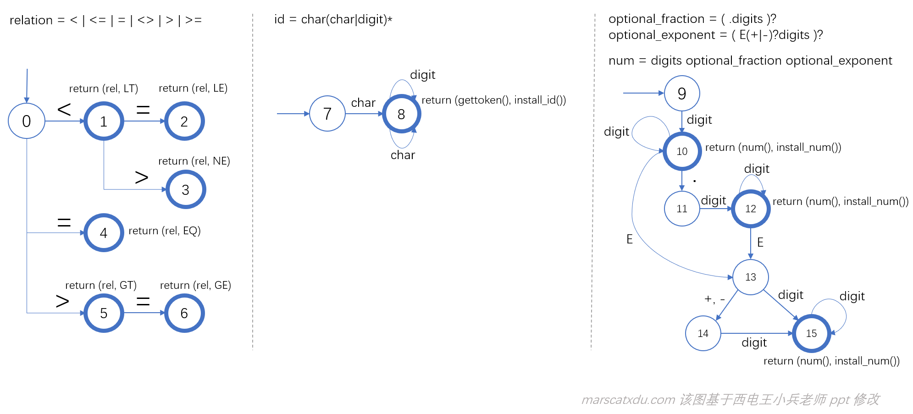


#### NFA 的 ε 转移也有不确定性

因为任何字符串在中间的任何位置插入一个 ε 后的值仍和原来相等（即，一个字串任何位置插入一个空字串后并不会发生改变。。听起来像废话），因此，我们对于一个可以通过 ε 跳转的边，我们可以选择在任意的时候通过这条边跳走。例如：

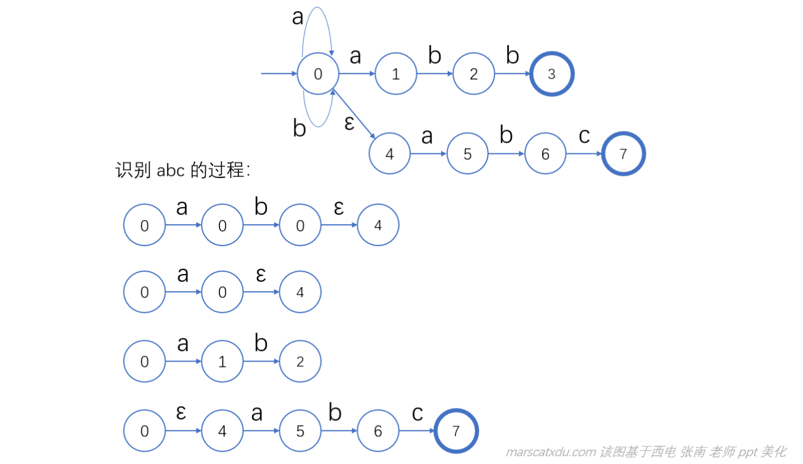

如图，我们可以在多个位置选择跳转 ε

### NFA 存在严重的问题

1. 需要尝试全部的路径才能确定输入的串是否能被接受；
2. 因为**要进行大量回溯，所以复杂度会提升**。

因此，有了 **有限状态机**

## 二、确定有限自动机（DFA）

DFA 也是一种 NFA，但 DFA 要求**不能有 ε 状态转移**，且对每个状态 s 和每个字符 a **最多有一个下一状态**。

**DFA 中不存在回溯**，无论接受还是不接受一个串，都只会扫描一遍。只需要扫描一次，就能确实是否接受。


对于不同的 DFA，实际使用的识别方法是相同的——无论使用什么样的 DFA 和输入序列，都是一样的要从初态开始随着输入序列去一步步转移，直到输入序列扫描完，判断到没到终态即可。

也就是说，这种识别的运行方式，与具体的 正规式（正规式决定了DFA是什么样子） 和输入序列无关，那么这种运行方式就可以被独立出来，和不同的 DFA 直接一起工作。

这种运行方式可以写成算法，这个算法就叫做”模拟器“（模拟 DFA 的行为）或”驱动器“（用 DFA 驱动的数据驱动分析动作）。**算法和 DFA 放在一起，就是词法分析器的核心了**，可以识别记号。这里只有 DFA 和模式是有关的，算法和模式没有任何关系。

我们在使用的时候，词法规则是要作为数据输入给算法的。

关于模式、记号、单词、词法分析器，再复读一遍。。

- 模式（Pattern）： 产生和识别元素的规则，就是定义的词法规则；
- 记号（Token）： 按照某个模式（或规则）识别出的元素（一组）。进行词法分析时，将程序转为一个个的记号，就是根据规则得到一个记号流；
- 单词（lexeme）： 被识别出的元素自身的值（一个），也称为词值。可以理解为源程序中一个个的字符串；
- 记号是一堆单词，其基本可分为：关键字、标识符、字面量、特殊符号这些。一个记号由记号的类别和记号的属性组成。比如程序中有一个变量名 myCount ，它的类别是 id，它的属性就是”myCount“；
- 语法分析器：相当于识别每个词代表什么。进行的工作就是识别单词；

源程序里面是一个个的单词，我们使用“模式”这个规则，对单词进行识别、分类，把它们放到相应的记号里面去。

### 算法：模拟 DFA

- 输入： DFA D 和输入字符串 x(eof)。 D 的初态为 s0，终态集为 F

- 输出：若 D 接受 x，回答“yes”，否则回答 “no”。

- 方法：用下述过程识别 x：

  ```
  s:=s0;					-- 设置初值
  ch:= nextchar;			-- 设置初值
  while ch!=eof loop 		-- 循环
  	s:=move(s, ch);
  	ch:=nextchar;
  end loop;
  if s in F			    -- 返回结果
  	then return "yes";
  	else return "no";
  endif;
  ```


对于没有下一状态转移的情况，我们可以给这个没有转移的字符增加一个死状态（就是下图的 d ），然后在死状态无论进行什么跳转都会跳回到死状态自身。

如下图， 若 1 状态出发没有标记为 a 的边，我们就可以给 a 引向一个死状态


### 有限自动机的等价

如果两个 FA 能识别同一个正规集，那么就说这两个 FA 等价。

正规式、FA 都能表示正规集——正规式能够描述正规集，而 FA 能够识别正规集。

因此，正规式和 FA 能够表示相同的正规集，这时，该正规式和 FA 就是等价的。

可能存在的等价关系：


1. 两个描述相同正规集的正规式等价；
2. 两个识别同一个正规集的NFA等价；
3. NFA、DFA 同上；
4. 其他都差不多是一个意思——两样东西能表示同一个正规集，那这两个东西就是等价的。  


## 三、构建NFA和DFA

### 正则表达式构建NFA

1. 假设$r=s|t$，r的NFA构建为：

   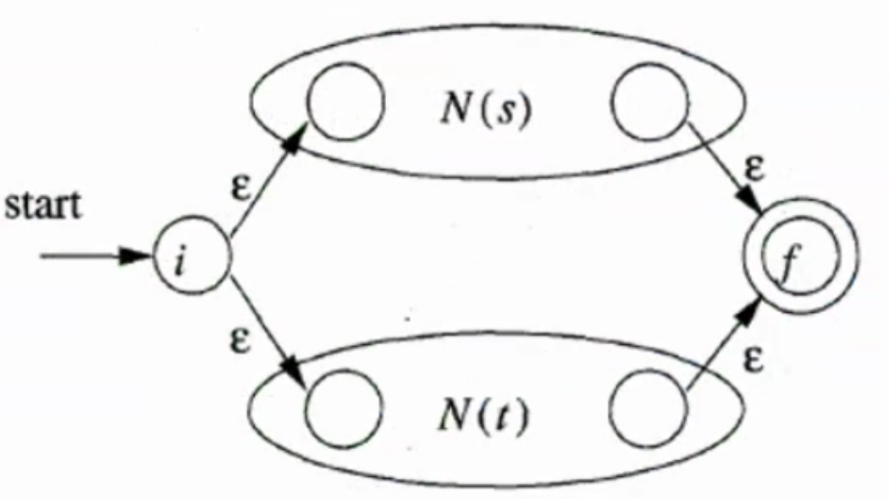

2. 假设$r=st$：

   

3. 假设$r=s^*$

   

举例说明如何构造一个正则表达式$(a|b)^*abb$的全过程：


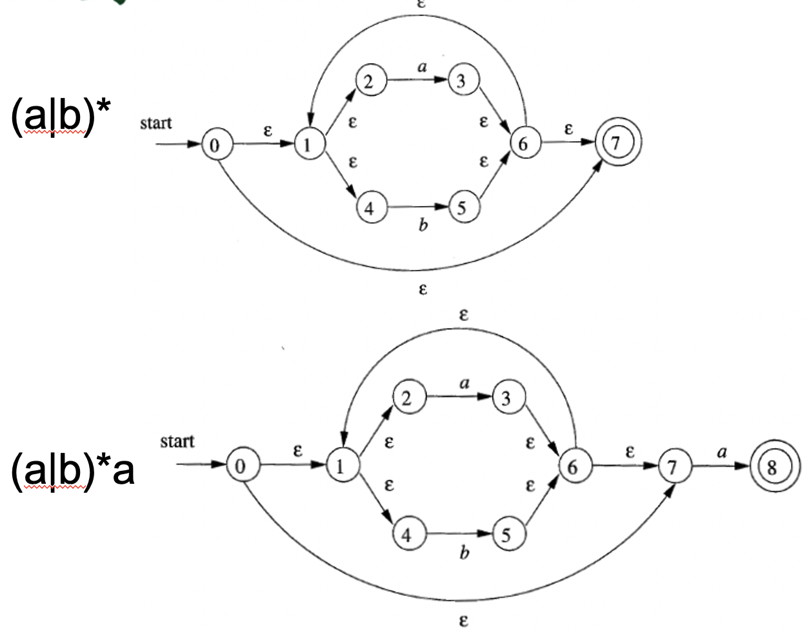

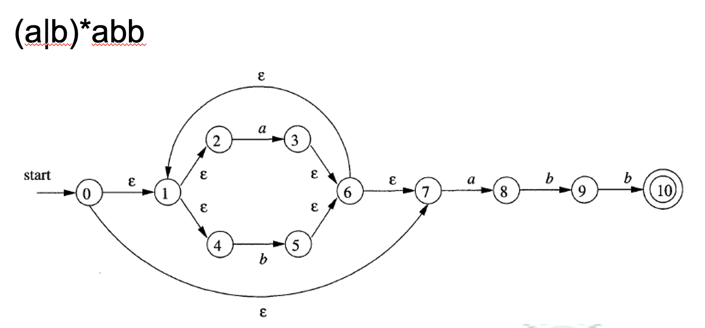


### NFA构建DFA（确定化）

- 定义$\epsilon-closure(s)$：状态s通过$\epsilon$转移可以到达的所有状态（若s为状态集合，则为s中每个元素的闭包的并集）
- move(T, a)：状态T经过输入a能到达的状态的集合。

#### 转换算法：

输入为：NFA

输出为：一个DFA状态转移矩阵Dtran。因为DFA中不允许出现空转移，因此**DFA中的每个状态都可能对应多个NFA的状态**

```
//initial:将 e-closure(s0) 加入到Dstates中，且为unmarked状态
while(Dstates中仍有unmarked状态的T){
	mark T;	// 标记T
	for(each input symbol a){	// 遍历字母表中所有可能输入
		U = e-closure(move(T,a));
		if (U is not in Dstates)
			add U as an unmarked state to Dstates;
		Dtran[T,a] = U; // 更新转移矩阵
	}
}
```

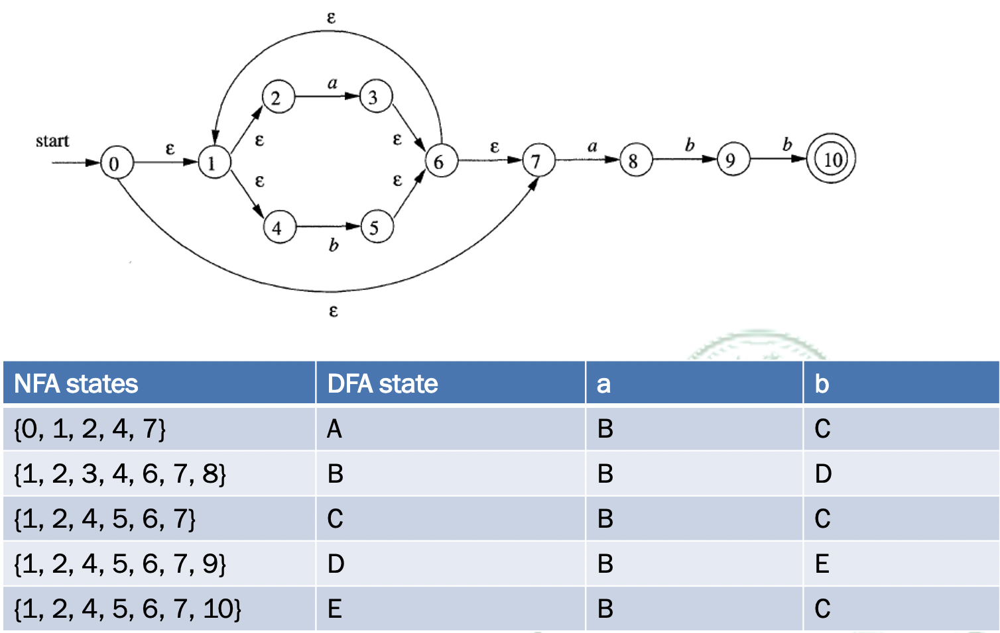


如何利用$\epsilon-closure(s)$判断串是否被NFA接受：

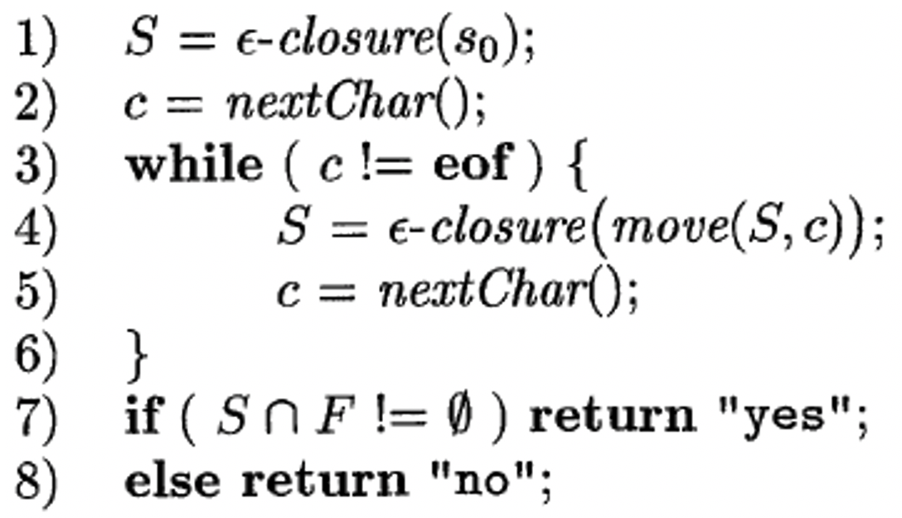


### DFA最小化

定义字符串x可以区分状态s和状态t为：x从状态s或t开始输入，只有一者最终能被接受。只要存在某一个串可以区分s或t，则s或t为可区分的。

#### 最小化DFA算法

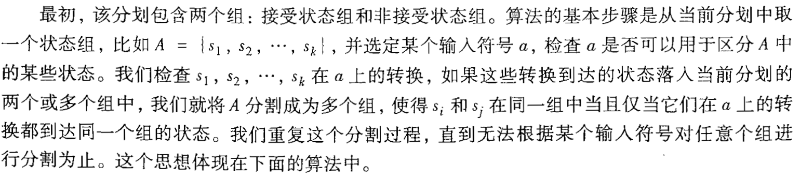


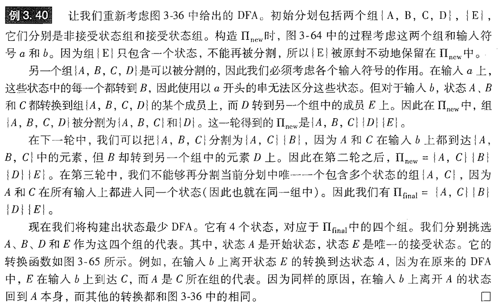

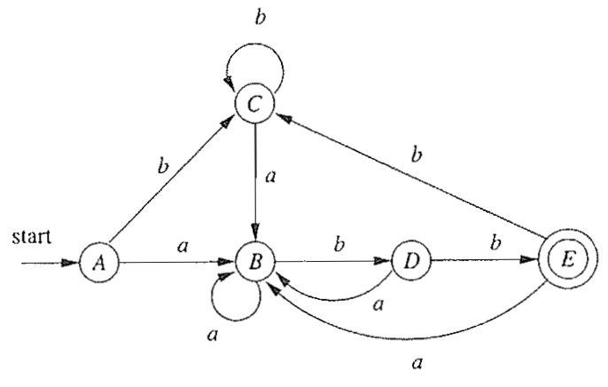


### 正则表达式转DFA

首先我们用正则表达式的符号位置来表示状态：


使用`#`来表示正则表达式的结束，并构造正则表达式的语法树

1. nullable(n)：n表示树的节点。当这个节点对应的子树可以为$\epsilon$，则为true：

   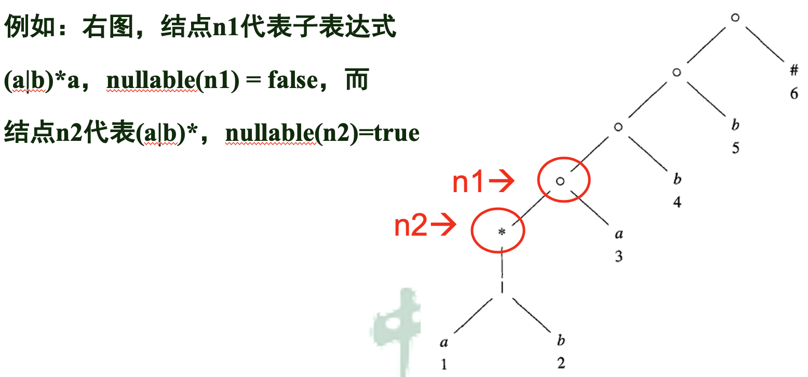

2. firstpos(n)：n节点的子树对应子表达式**第一个位置符号**的所有可能集合：

   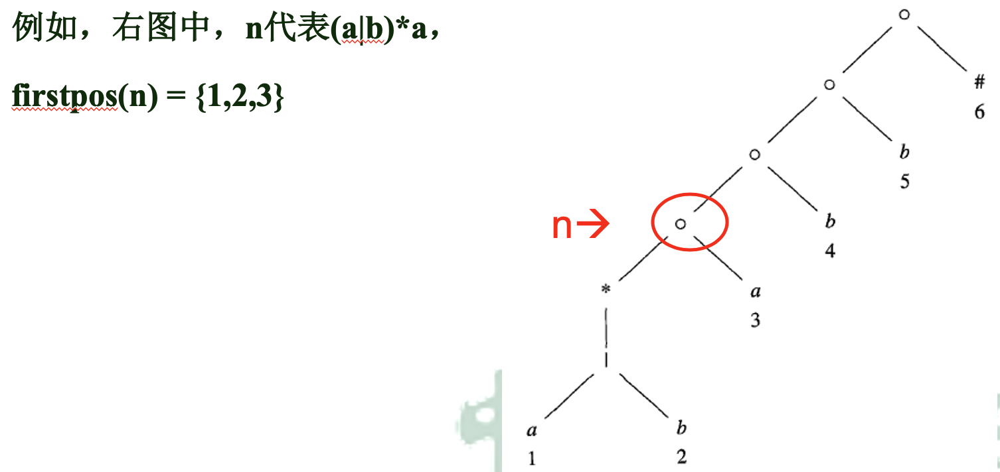

3. lastpos(n)：n节点的子树对应子表达式**最后一个位置符号**的所有可能集合：

   

4. followpos(p)：当前位置下一个可能符号的位置的集合：

   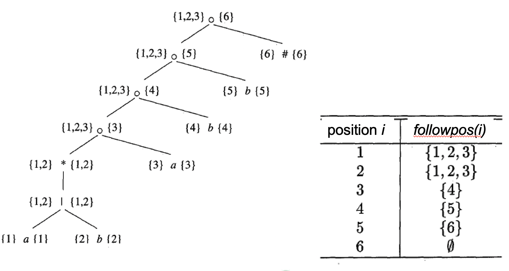

   用有向图表示followpos函数：

   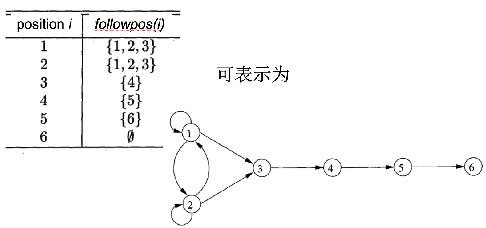

函数计算规则：


正则表达式转DFA例子：

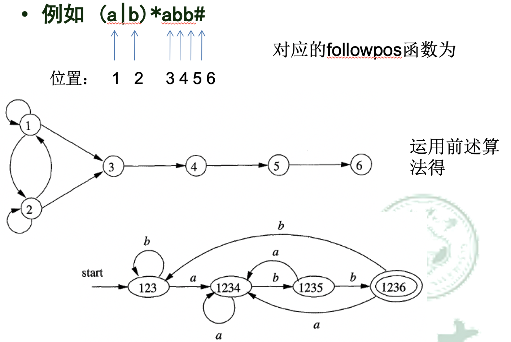

注意，这样的转换结果不一定是最小的情况，还需要使用DFA最小化算法


正则表达构造DFA的简单方法：

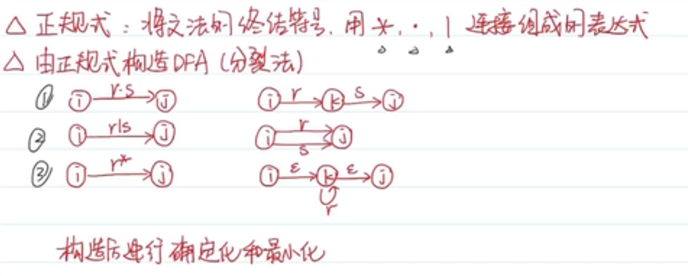

