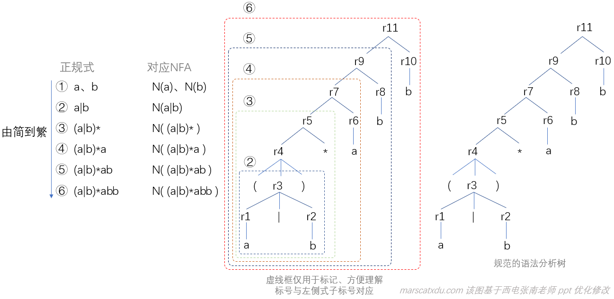

# 编译原理笔记4：从正规式到词法分析器（1）：构造词法分析器的一般步骤、从正规式到 NFA

## 一般方法和步骤

1. 用正规式描述模式（描述词法规则）；
2. 为每个正规式构造一个 NFA ，这个 NFA 识别正规式表示的正规集（即，将正规式转成 NFA。正规式和NFA在这里就描述同一个正规集了，他们两个是等价的）；
3. 将上一步得到的 NFA 转换成与之等价的 DFA ，这一步叫做”**确定化**“；
4. 优化上一步得到的 DFA，使其状态数最少，这一步叫做 ”**最小化**“；
5. 从 上一步 得到的 DFA 来构造词法分析器。

在上面的步骤中，我们通过 NFA 构造 DFA 而非直接构造 DFA ，是因为有专门的算法工具来一步步完成从正规式->NFA->DFA->分析器的工作。这样我们就可以省略中间的手工劳动步骤。

虚线框内部的，就是 Lex 的工作内容和原理。

我们使用的时候，直接从正规式使用工具转化为词法分析器就可以了。接下来我们从正规式开始一步步搞懂词法生成器是怎么一回事。

## 从正规式到NFA

先复读一下正规式：**正规式是用来描述**词法规则的，也就是描述：**记号该长成什么样子、数字该长成什么样子**之类。

### Thompson 算法

它的任务，是将正规式转化为与其等价的 NFA。

也就是说，它可以将任意的字母表 Σ 上的正规式 r ，转化为一个能够接受 L(r) 的 NFA N。

想要构造一个正规式，我们需要从最简单的正规式（也就是 ε 和一个个字母）开始，通过一步步添加运算，逐步把它构造成我们想要的目标正规式。最简单的正规式就是 ε 和字母表上的一个个字符。

NFA 的构造步骤和正规式的构造步骤是相同的，构造两种东西的每一步都可以对应起来。因此，NFA 也要从最开始的小 NFA 开始构造。

每一种 NFA 都能和一个正规式相对应，如下图所示

回忆NFA，再观察上图中的正规式和NFA 3~6 可以发现这样的一个问题：

Q：我们知道自动机可以有多个终态，可是 3-6 的这几个自动机直接使用已有的自动机作为自己的一部分，怎么可以假设这些被包含的自动机只有一个终态呢？

A：这是因为图中的 NFA 都是递归构造出来的——也就是说，我们认为上面3-6自动机中的 N(P)、N(Q) 自动机也都是用 Thompson 构造算法构造的，而只要是该算法构造出的 NFA，就一定都是只有一个终态的。

而且，其实对于任意的多终态 NFA，我们都可以把它转化一个单终态NFA——方法非常简单，只需要将它的所有终态引出一条 ε 边，指向一个唯一的新终态即可。

### 例：用 Thompson 算法构造正规式 r=(a|b)*abb 的 NFA N(r)

先从最小的正规式对应的 NFA 开始构造，再把得到的 NFA 进行组合，得到最终的 NFA 。

注意：

- 该算法中，NFA 的构造与正规式的构造步骤是一一对应的；
- 构造一个新的 NFA ，最多会增加两个状态（始、终），对于连接运算，则会减少状态。