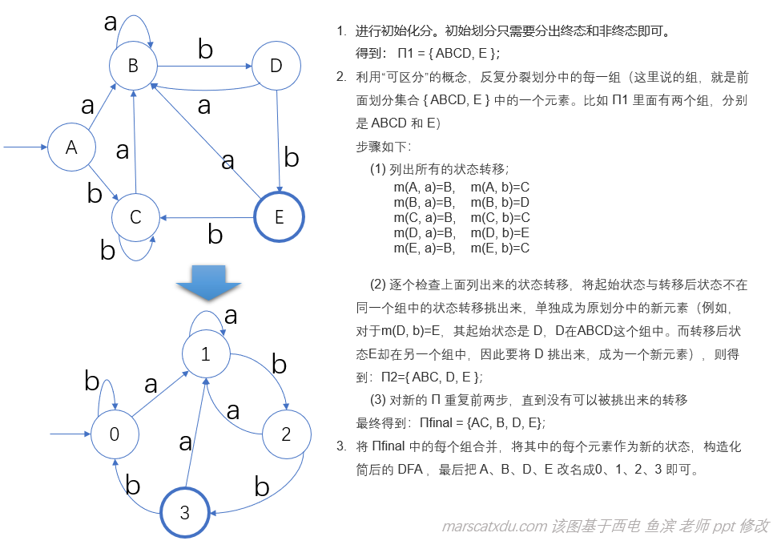

# 编译原理笔记6：从正规式到词法分析器（3）：DFA最小化、词法分析器的构造、Lex 使用示例

## 从 DFA 到最小 DFA

关于星闭包的补充：一个语言被认为是所有可能字的子集。所有可能字的集合可以被认为是所有可能的字符串串接的集合。

DFA 最小化的过程，就是通过某些等效转换减少原 DFA 状态数的过程——这里的“等效转换”，就是对多余的状态进行合并。

那，什么叫多余？这里的多余，指的是对于同样的输入会得到同样的结果——比如在上面NFA转DFA的例子中，我们观察得到的DFA，发现其中的A、C状态对于字母表中任意的输入，都会给出相同的结果。那么这个A和C对任意输入而言就是等效的，它们两个就可以互相替代，我们也就可以把它们合并成一个状态。

将DFA最小化需要去除多余状态，所以如何最小化DFA的问题就转化为了如何找出“多余状态”的问题。我们需要一个方法来帮助我们判断某个状态是否是多余的。这里引入“等价”、“可区分”、“划分”的概念。

### 等价

定义：设 p、q ∈ S，对于任一输入序列 w∈Σ\*，有 move(p, w)∈F 且 move(q, w)∈F，则称状态 p 和 q 等价。否则称 p、q 是可区分的，也就是存在 x∈Σ\*，使得move(p, x) 和 move(q, x) 不能同时进入终态。

### 可区分

对于DFA中的任意两个状态t、s，若从其中一个状态出发能够接受输入字符串 ω，而从另一个状态出发却不能接受 ω，则称 **ω区分状态t和s**。如果存在某个能够区分状态 t 和 s 的串，那么状态 t 和 s 就是可区分的。

因此，如果我们找到这样一对 t 和 s ，对于从它们两个状态分别出发的任何的输入序列 ω，都能够最终到达相同的结果，那么 t 和 s 就可以合并成一个状态。

因此，最小化 DFA 的本质，就是将 DFA 中的状态分成不同的组，使得同一个组中的状态之间不可区分（也就是等价的），而不同组的状态之间可区分（也就是不等价）。当我们把每个组内的状态都合并成为一个状态后，我们就能够得到一个最小 DFA 了

（其实就是把DFA中的各个状态划分成几个等价类，然后把等价类内的状态进行合并。这样最终得到的最小DFA的状态数就是之前我们划分的等价类数。每一个等价类对应最小DFA中的一个状态）

### 划分

给定一个DFA，我们可以确定：

- DFA 的终态和非终态是可区分的；（使用 ε 即可区分终态和非终态。因为 DFA 中不存在 ε 转移。DFA 中的任意状态经过 ε 都不会发生改变）
- 若分别从 s 和 t 出发，沿着标记为 x 的路径到达的两个状态p、q是可区分的，那么 s 和 t 也是可区分的。
  这里的 p、q 是我们已知可区分的——因为对于 p、q，如果有相同的输入序列 y 使得他们分别到达终态和非终态，那么 p、q 就是可区分的了。一旦 p、q 可区分，则 s、t 经过输入序列 xy 就能够分别到达 f、g ，也就随之满足可区分的定义了

### 算法：最小化 DFA 的状态数（DFA化简）

输入：DFA D = {S, Σ, move, s0, F }

输出：等价的 D' = {S', Σ, move', s0', F' }（D' 的状态数最少）

主要步骤：

1. 进行初始化分，获得终态和非终态；
2. 利用“可区分”的概念，反复分裂划分中的组 Gi，直到不可再分裂；
3. 由最终划分构造 D'，关键是用等价的概念对一些状态进行合并，选出新的代表状态并修改状态转移；
4. 消除可能的死状态的不可达状态。

化简的基本思路，其实就是把原来的状态集按照等价关系进行划分（划分后的子集互不相交），同一子集内元素等价，不同子集元素可区分。将每一个子集中的状态合并成一个状态，就可以得到一个新的状态集 Snew，原初态s0所在子集就成为化简后状态机 Dnew 的新初态 s0new ，原终态所在子集就成为化简后的 Dnew 的一个新终态。

下面用这个算法来化简我们前面的 DFA

每个DFA都能够最小化，这里有个定理：

对于一个 DFA D = {S, Σ, mvoe, s0, F}, 存在唯一一个最小状态（就状态数而言）DFA D' = {S', Σ, move', s0, F'} 与 D 等价。

### 手写 DFA

建出来了 DFA 的状态转移图，我们就可以通过直接编码的方式来为我们的 DFA 手写词法分析器了。由于操作复杂，故实际应用中不会使用这种方法构造词法分析器，而是会使用 Lex 进行该工作。

此处先略，日后再补。。。（坑）

## 词法分析器的构造

实际应用中，我们使用工具来生成词法分析器。因为从正规式到词法分析器这个过程中的每一步都有对应的算法来实现。我们构造自己的词法分析器，只需要使用 Lex 就可以了。

## Lex 使用示例

点击 Lex 中的 编译按钮 ，将会生成一个 .c 和一个 .h 文件

对于词法解析错误的输入，lex 编译出的程序将会直接把错误的输入回显