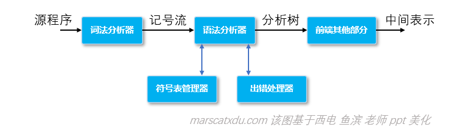

# 编译原理笔记7：语法分析（1）语法分析器的任务、语法错误的处理

### 语法分析器是编译器前端的核心



语法分析器的两项主要任务，分别：

1. 是根据词法分析器提供的记号流，为语法正确的输入**构造分析树**（或语法树）；
2. **检查输入中的语法 / 词法错误**，并调用出错处理程序进行相应的处理。

### 语法错误的处理

源程序中的错误可以分为词法/语法错误、语义错误两类。前者主要形式是命名不合法、关键字书写错误、语法结构有问题（比如缺分号、该配对的东西不配对）等；后者则可分为静态/动态两种，静态例如类型使用错误、参数使用错误等，动态语义错误则是无穷递归这类逻辑性的问题。

##### 语法错误的处理目标

1. 不多不漏地报告所有错误出现的准确位置；
2. 发现一个错误后能够继续分析，做到一次分析完整个程序，再一次性指出所有错误；
3. 尽量小地降低分析速度（分析速度和扫描遍数有关）。

##### 语法错误的基本恢复策略

1. 紧急恢复：**抛弃掉一些输入**，直到遇到同步记号；
2. 短语级恢复：对错误进行串替换，**纠正错误**；
3. 出错产生式：用出错产生式捕捉（预测）错误；
4. 全局纠正：找到和错误输入序列 x 最相近的序列 y，然后用 y 替换掉 x 。

例如：

```
 x = a+b
 y = c+d;
```

紧急恢复：x = a+b+d;  // 丢弃掉 b 后的记号，直到遇到 +

短语级恢复： x = a+b; // 加入分号


在写程序时，要养成减少错误的好习惯：每次用变量、参数时，要在使用之前进行初始化，并在直接使用之前检查一下是否出现值为空等问题，防止出现不可预知的错误