# 编译原理笔记9：语法分析、设计文法、自顶向下、自底向上

[toc]

**语法分析树和语法树不是一种东西**。习惯上，我们把前者叫做“具体语法树”，其能够体现推导的过程；后者叫做“抽象语法树”，其不体现过程，只关心最后的结果。

## 一、语法分析树

语法分析树是语言推导过程的图形化表示方法。这种表示方法反映了语言的实质以及语言的推导过程。

定义：对于 CFG G 的句型，分析树被定义为具有下述性质的一棵树：

1. 根由开始符号所标记；

2. 每个叶子由一个终结符、非终结符或 ε 标记；

3. 每个内部节点都是非终结符；

4. 若 A 是某节点的内部标记，且 X1、X2...Xn 是该节点从左到右的所有孩子的标记。则：A→X1X2...Xn 是一个产生式。若 A→ε，则标记为 A 的节点可以仅有一个标记为 ε 的孩子。

   以 E => -E => -(E) => -(E+E) => -(id+E) => -(id+id) 为例

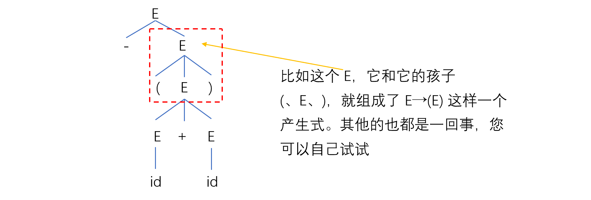

### 分析树与语言和文法的关系

- 每一直接推导（每个产生式），对应一颗仅有父子关系的子树，即产生式左部非终结符“长出”右部的孩子；
- 分析树的叶子，从左到右构成 CFG G 的一个句型（T、N两掺的串）。若叶子仅由终结符标记（+ 、- 、* 之类的运算符号也算是终结符），则构成一个句子。

推导，有最左推导和最右推导，这两种推导方式在推导过程中的分析树可能不同，但因最终得到的句子是相同的，所以最终的分析树是一样的。

分析树能反映句型的推导过程，也能反映句型的结构。然而实际上，我们往往不关心推导的过程，而只关心推导的结果。因此，我们要对**分析树**进行改造，得到**语法树**。语法树中全是终结符，没有非终结符。而且语法树中没有括号

## 二、语法树

定义：

> 对 CFG G 的句型，表达式的语法树被定义为具有下述性质的一棵树：
>
> 1. 根与内部节点由表达式中的操作符标记；
> 2. 叶子由表达式中的操作数标记；
> 3. 用于改变运算优先级和结合性的括号，被隐含在语法树的结构中。

说白了，语法树这玩意，就一句话：**叶子全是操作数，内部全是操作符**，树里没有非终结符也不能有括号。

语法树要表达的东西，是操作符（运算）作用于操作数（运算对象）

举俩例子吧：

【例】： -(id+id) 的语法树：


【例】：-id+id 的语法树：


显然，我们从上面这两个语法树中，直接就能观察出来它们的运算顺序。

【例】：句型 if C then s1 else s2


if-then-else 是个终结符，其是一整个操作符。该操作符有三个操作数：条件 C、真分支 s1、假分支 s2

## 三、设计文法

### 1. 二义性问题

**二义性问题：一个句子可能对应多于一棵语法树。**

【例】： 设文法 G： E → E+E | E*E | (E) | -E | id

则，句子 id+id*id、id+id+id 可能的分析树有：

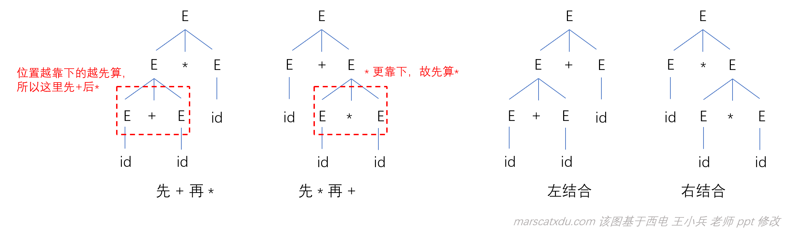

在该例中，虽然 id+id+id 的 “+” 的结合性无论左右都不会影响结果。但万一，万一“+”的含义变成了“减法”，那么左结合和右结合就会引起很大的问题了。

我们在这里讲的“二义性”的“义”并非语义——我们现在在学习的内容是“语法分析器”，尚未到需要研究语言背后含义的阶段。

- “语法”分析的任务，是确定 “E+E” 这么写是否合法；
- “语义”分析的任务，是确定 “+” 这个符号到底蕴含着什么信息，即，该怎么解释这个符号。

我们现在讲的“二义性”指的是一个句子对应多种分析树。

#### 1.1 优先级、结合性：引起二义性的根本原因

二义性的体现，是文法对同一句子有不止一棵分析树。这种问题由【句子产生过程中的某些推导有多于一种选择】引起。悬空 else 问题就可以很好地体现这种【超过一种选择】带来的二义性问题，示例如下。

#### 1.2【悬空（dangling）else】 问题

看下面这么个例子。。


（其实，我感觉这个其实比较像是“说话大喘气”带来的理解歧义问题。。。）上面的产生式中并没体现出来该咋算分一块，所以两种完全不同的句子结构都是合法的。

#### 1.3 二义性的消除

二义性问题是有救的，大概有以下这三种办法：

1. 将二义文法改成非二义文法；
2. 规定二义文法中符号的**优先级和结合性**；
3. 改变语言的结构或书写方式。

这些办法的核心，其实都是将优先级和结合性说明白。

##### 1.3.1 改写二义文法为非二义文法

**核心：把优先级和结合性说明白**

既然要说明白，那就不能让一个非终结符可以直接在当次推导中能推出会带来优先级和结合性歧义的东西。（对分析树的一个内部节点，不会有出现在其下面的分支是相同的非终结符的情况。如果有得选，那就有得歧义了。没得选才能确定地一路走到黑）

改写为非二义文法的二义文法大概有下面这几个特点：

- 需要引入新的终结符，且新引入的非终结符，能够限制每一步推导都只有唯一的选择；
- 引入新的非终结符后，推到步骤会增多（分析树增高）；
- 越接近 S 的文法符号优先级越低（重要！！）；
- 对于 A → αAβ，若 A 在终结符左侧出现（即终结符在 β 中），则 A 产生式具有左结合性；
- 在语法树中，**越在分析树底下的运算符号越先被计算**（即，离开始符号越远的越先算）。

**改写的关键步骤：**

1. 引入新的非终结符，增加一个子结构并提高一级优先级；
2. 若要运算有左结合性，需要让递归非终结符在终结符左边。相对的，递归非终结符在右边则会让运算右结合。

【例】改写下面的二义文法为非二义文法。图右侧是要达成的优先级和结合性

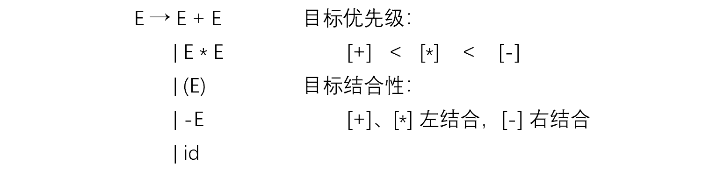

改写的核心其实就两句话：

1. 要引入新的优先级，就需要引入新的非终结符，且距离 S 越近的文法符号优先级越低；
2. 递归非终结符在终结符左边，运算就左结合，反之亦。

所以能够得到非终结符与运算的对应关系（因为不同的运算有不同的优先级，我们想要引入多个优先级就要引入多个新的非终结符。这样每个非终结符就可以负责一个优先级的运算符号，也就是说新的非终结符是与运算有关系的了。因此这里搞出来了“对应关系”四个字）如下：


优先级由低到高分别是 +、\*、-，而距离开始符号越近，优先级越低。因此在这里的排序也可以+\*-顺序。每个符号对应一层的非终结符。根据所需要的结合性，则可确定是左递归还是右递归，以确定新的产生式长什么样子


【例】：规定优先级和结合性，写出改写的非二义文法

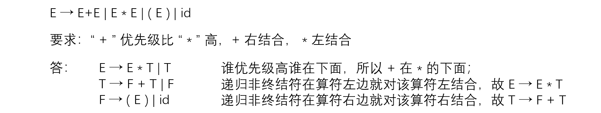

##### 1.3.2 让我们来搞【悬空 else 】罢！

我们已经掌握了一种叫做【改写】的工具，能让我们消除二义性。接下来我们就要用这个工具来尝试搞搞悬空 else 问题！

悬空 else 问题出现的原因是 then 数量多于 else，让 else 有多个可以结合的 then。在二义文法中，由于选哪两个 then、else 配对都可以，故会引起出现二义的情况。在这里，我们规定 else 右结合，即与左边最靠近的 then 结合。

为改写此文法，可以将 S 分为完全匹配（MS）和不完全匹配（UMS）两类。在 MS 中体现 then、else 个数相等即匹配且右结合；在UMS 中 then、else 不匹配，体现 else 右结合。


例：用改写后的文法写一个条件语句


经过检查，无法再根据文法写出其他分析树，故已经消除了二义性

##### 1.3.3 规定优先级和结合性

虽然二义文法会导致二义性，但是其并非一无是处。其有两个显著的优点：

1. 比非二义文法容易理解；
2. 分析效率高（分析树高度低，直接推导的步骤少）。

在 Yacc 中，我们可以直接指定优先级、结合性而无需自己重写文法。

```yacc
  %left '+'
  %left '*'
  %right '-'
```

left 表示左结合，right 表示右结合。越往下的算符优先级越高。

嗯就这么简单。。。

##### 1.3.4 修改语言的语法

我们其实可以把语言本身定义成没有优先级和结合性的。。然后所有的优先、结合都交由括号进行控制，哪个先算就加括号。把一个过程的结束用明确的标志标记出来。

比如在 Ada 中：

```Ada
if x<3 then 
	if x>0 then 
		x:= 5; 
	end if;
	else x:= -5;
end if;
```

在 Pascal 中，给表达式加括号：

```pascal
(a+b)>(c*d)
```


### 2. 消除左递归

如果一个文法中有一个非终结符号A使得对某个串$\alpha$存在一个推导$A \rightarrow A\alpha$那么这个文法就是左递归的，自顶向下分析方法不能处理左递归的文法，因此需要消除。

算法如下：


举例说明用法，消除下列文法左递归：


对于下面通用的**直接左递归**文法：
$$
A \rightarrow A\alpha|\beta 
$$
消除直接左递归的通用方法是：
$$
A \rightarrow \beta A'\\
A' \rightarrow \alpha A'|\epsilon
$$
对于下面**间接左递归**文法：
$$
S\rightarrow Aa|b\\
A\rightarrow Ac | Sd|\epsilon
$$
我们采用代入的方法，将S定义代入A的产生式右部得到：
$$
S\rightarrow Ac| Aad|bd|\epsilon
$$
这样我们就可以用直接左递归的消除方法消除它：
$$
A\rightarrow bdA'|A'\\
A' \rightarrow cA'|adA'|\epsilon
$$


### 3. 提取左公因子

当不清楚应该在两个A产生式中如何选择时，我们可以通过改写产生式来推后这个决定，避免决策错误回溯浪费时间。等我们读入了足够的输入，获得足够信息后再作出正确决定。


算法如下：


## 四、自顶向下语法分析

- 最左推导：每步推导都替换最左边的非终端符号
- 最右推导：每步推导都替换最右边的非终端符号

最左推导和最右推导都是唯一的。

在自底向上的分析中，总是采用最左归约的方式，因此将最左归约称为规范归约，而最右推导相应的称为**规范推导**。

在自顶向下的语法分析中，总是采用最左推导的方式：

1. 总是选择每个句型的最左非终结符进行替换
2. 根据输入流中的下一个终结符，选择最左非终结符的一个候选式
3. 自顶向下分析总是从文法的开始符号开始推导

并不是所有的文法都适合使用自顶向下分析的方法，此时我们就需要一些文法的转换，比如**消除二义性、消除左递归、提取左公因子**。这些在上一章已经提到过了。

### 1. 递归下降语法分析

一个递归下降语法分析程序由一组过程组成，每隔非终结符有一个对应的过程。算法的伪代码如下：

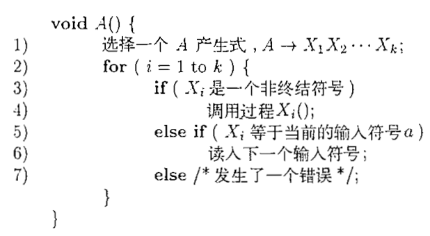

考虑文法：
$$
S \rightarrow c A d\\
A\rightarrow a b | a
$$
在自顶向下的构造输入串$w=cad$的语法分析树。


### 2. FIRST和FOLLOW

#### 2.1 FIRST

$FIRST(\alpha)$被定义为可以从$\alpha$推导得到的串的首符号集合。

算法如下：


通俗的做法如下：


**FIRST中是包含$\epsilon$符号的 **


#### 2.2 FOLLOW


**FOLLOW集合中不包含$\epsilon$符号，但包含结束符$**


 举例说明二者的计算方法：

| 产生式                          | First          | Follow        |
| ------------------------------- | -------------- | ------------- |
| $E\rightarrow TE'$              | ( , id         | ) , $         |
| $E'\rightarrow +TE' | \epsilon$ | + , $\epsilon$ | ) , $         |
| $T\rightarrow FT'$              | ( , id         | + , ) , $     |
| $T'\rightarrow *FT' | \epsilon$ | * , $\epsilon$ | + , ) , $     |
| $F \rightarrow ( E ) | id$      | ( , id         | + , ) , $ , * |


#### 2.3 SELECT

产生式的可选集是指可以选用该产生式进行推导的对应的输入符号的集合。记为$SELECT(A\rightarrow \beta)$ ，它的组成规则为：

1. $SELECT(A\rightarrow a\beta)=\{a\}$
2. $SELECT(A\rightarrow \epsilon =FOLLOW(A))$
3. $SELECT(A\rightarrow A\beta = FIRST(A\beta))$

因此对于具有相同左部的产生式，如果它们的select集不相交，则不会发生冲突，这也是LL(1)文法的判断标准的来源。

其实这就是预测分析表的构造方法。


### 3. 构造预测分析表

构造算法如下：

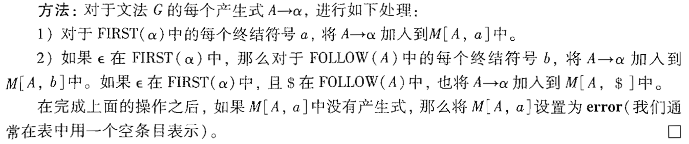

这里要注意，算法是对每个产生式进行的，用 $|$ 分隔的多个产生式也要分开进行。不能在表中同一个空出现 $|$ 分隔的推导，否则就发生了冲突。

**举例说明：**

对上面表中的数据进行构造预测分析表：

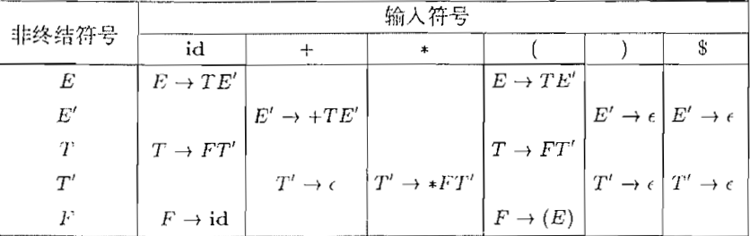


### 4. LL(1)文法

第一个L表示从左向右扫描输入，第二个L表示产生最左推导，而"1"则表示在每一步中只需要向前看一个输入符号来决定语法分析动作。

一个文法G是LL(1)的，当且仅当G的任意两个不同的产生式$A\rightarrow \alpha|\beta$ 满足下面的条件：

1. 不存在终结符号$a$使得$\alpha$和$\beta$都能够推导推导出以a开头的串
2. $\alpha$和$\beta$中最多只有一个可以推导出空串
3. 如果$\beta-*\rightarrow\epsilon$，那么$\alpha$不能推导出任何以FOLLOW(A)中某个终结符号开头的串，反之亦然。

当预测分析表每个空只有唯一的产生式，则满足为LL(1)的文法。对于下面的文法，我们计算得到它的first和follow表：

| 产生式                       | First         | Follow |
| ---------------------------- | ------------- | ------ |
| $S \rightarrow iEtSS'|a$     | i, a          | $, e   |
| $S' \rightarrow eS|\epsilon$ | e, $\epsilon$ | $, e   |
| $E \rightarrow b$            | b             | t      |

构造对应的预测分析表可得：

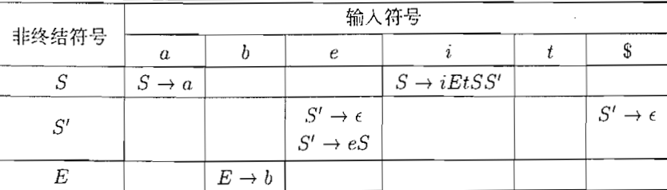

这个文法时二义性的。当输入e(else)的时候，解决使用哪个产生式的问题就会显露这个文法的二义性。


**判断LL(1)文法的方法：**

1. 已化简且无左递归
2. 对G中每个产生式$A\rightarrow \alpha|\beta|...|\gamma$ 都满足
   - $FIRST(\alpha) \cap FIRST(\beta)=\Phi$（相交为空集）
   - 若有候选式存在$\epsilon$，则其余候选式 $FIRST(\alpha) \cap FOLLOW(A)=\Phi$（交集为空）


### 4. 预测分析器实现

#### 4.1 递归实现

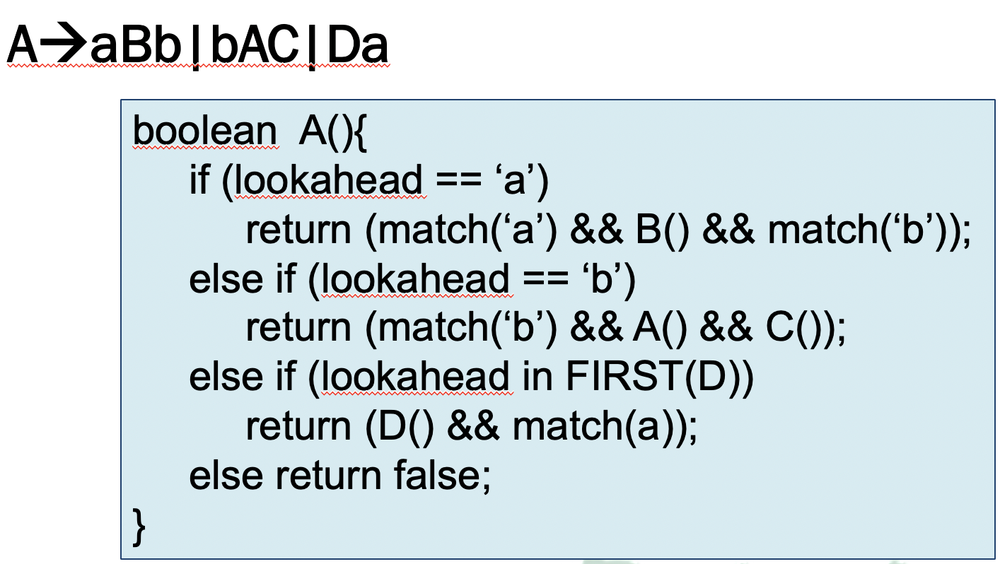

注意这里的表达式是经过消除二义性、左递归、公因子操作得到的。也就是说不能存在一个产生式满足：$D\rightarrow \epsilon$


#### 4.2 非递归实现（表驱动的预测分析器）

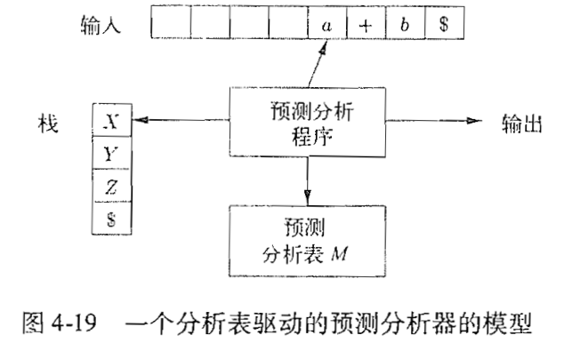

预测分析器包含：

1. 预测分析表M

2. 显式维护一个栈，代替递归中隐式维护

3. 输入缓冲区和输出流

4. 预测分析程序：

   

算法如下：


下面用一个例子说明。考虑文法

| 产生式                          | First          | Follow        |
| ------------------------------- | -------------- | ------------- |
| $E\rightarrow TE'$              | ( , id         | ) , $         |
| $E'\rightarrow +TE' | \epsilon$ | + , $\epsilon$ | ) , $         |
| $T\rightarrow FT'$              | ( , id         | + , ) , $     |
| $T'\rightarrow *FT' | \epsilon$ | * , $\epsilon$ | + , ) , $     |
| $F \rightarrow ( E ) | id$      | ( , id         | + , ) , $ , * |

我们上面已经得到了他的预测分析表为：


假如我们要处理的输入为：$id+id*id$，可以得到整个推理过程为：


初始状态为产生式第一条的左侧部分


## 四、自底向上语法分析

**归约**：用产生式的左边代替产生式的右边

自底向上的语法分析过程就是**将只含有终端符号的输入串**逐步**归约到文法起始符号**的过程。如下面的推理过程：
$$
id*id,\ F*id,\ T*id,\ T*F,\ T,\ E
$$
反过来看，上述归约过程实际上就是**最右推导的逆过程**。


### 1. 移入归约技术

#### 1.1 句柄

假如存在这样的推导过程：

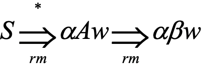

S通过多步最右推导。w是终端符号串，A是非终端符号，$\alpha$和$\beta$中可以有终端符号和非终端符号。

产生式$A\rightarrow \beta$是$\alpha \beta w$的一个句柄，方便起见将$\beta$ 称为一个句柄。

通俗的说是：最右句型$\gamma$的一个句柄是满足下述条件的产生式$A\rightarrow \beta$及串$\beta$在$\gamma$中出现的位置：将这个位置上的$\beta$替换为A之后得到的串是$\gamma$的某个最右推导序列中出现在位于$\gamma$之前的最右句型。

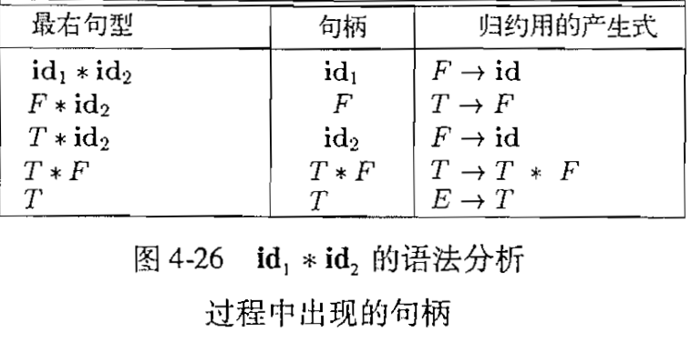

在上图中，对于最右句型$T*id_2$，虽然$T$是产生式$E\rightarrow T$的体，但符号T并不是句型$T*id_2$的一个句柄，因为如果它是句柄进行了替换后，得到的$E*id_2$不能从E推导得到。因此和某个产生式体（T）匹配的最左子串（$T*id_2$中的T）不一定是句柄。


通过**句柄剪枝**可以得到一个反向的最右推导。从被分析的终结符号串w开始，如果w是当前文法的句子，那么令$w=\gamma_n$，其中$\gamma_n$是某个未知最右推导的第n个最右句型。

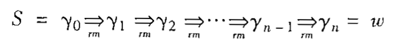

为了以相反顺序重构这个推导，我们在$\gamma_n$中寻找句柄$\beta_n$，并将它根据产生式进行替换，得到前一个最右句型$y_{n-1}$。**现在核心问题就变成了，如何去寻找句柄**。


#### 1.2 移入归约法

移入归约语法分析是自底向上语法分析的一种形式。它使用一个栈来保存文法符号，并用一个输入缓冲区来存放将要进行语法分析的其余符号，我们将看到，**句柄在被识别之前，总是出现在栈的顶部**。

一个移入归约语法分析器可以采用下面的四种动作：

1. 移入：将下一个输入符号移到栈的顶端

2. 归约：被归约的符号串的右端必然是栈顶（因为要满足他是一个最右句型，归约的时候右边一定是栈顶）。**语法分析器在栈中确定这个串的左端**（右端在栈顶，只需要确定左端到哪里就行），并决定用哪个非终结符来替换这个串

3. 接受：宣布语法分析过程成功完成

4. 报错：发现一个语法错误，并调用一个错误恢复子例程

   


### 2. LR语法分析技术

目前最流行的自底向上语法分析器都是基于所谓的LR(k)语法分析的概念。L 表示对输入进行从左到右的扫描，R 表示反向构造出一个最右的推导序列。k 表示在做出语法分析决定时向前看 k 个输入符号。


#### 2.1 LR(0)项集

一个文法G的一个LR(0) 项是G的一个产生式再加上一个位于它的体中某处的点。因此产生式子$A\rightarrow XYZ$产生了四个项：
$$
A\rightarrow \cdot XYZ\\
A\rightarrow  X\cdot YZ\\
A\rightarrow  XY\cdot Z\\
A\rightarrow  XYZ\cdot
$$
产生式$A\rightarrow \epsilon$只生成一个项$A\rightarrow \cdot$

项的含义为：

1. $A\rightarrow \cdot XYZ\\$表明我们希望在接下来的输入中看到一个从XYZ推导得到的串
2. $A\rightarrow  X\cdot YZ\\$说明我们刚刚在输入中看到了一个可以由X推导得到的串，并且我们希望接下来看到一个能从YZ推导得到的串。
3. $A\rightarrow  XYZ\cdot$表示我们已经看到了产生式体XYZ，已经是时候把XYZ归约为A了

一个称为**规范LR(0)项集族**的一组项集提供了构建一个确定有穷自动机的基础。


#### 2.2 增广文法

如果G是一个以S为开始符号的文法，那么G的增广文法$G'$就是在G中加上新开始符号$S'$和产生式$S'\rightarrow S$而得到的文法。增广文法的目的是让开始符$S'$不出现在任何产生式的右边。


#### 2.3 项集闭包

如果$I$是文法G的一个项集，那么$CLOSURE(I)$就是根据下面的两个规则从$I$构造得到的项集：

1. 将$I$中每个项都加入到$CLOUSURE(I)$中
2. 如果$A\rightarrow \alpha \cdot B \beta$在$CLOSURE(I)$中，$B\rightarrow\gamma$是一个产生式，并且项$B\rightarrow \cdot \gamma$不在$CLOSURE(I)$中，就将这个项加入其中。

对于增广文法：
$$
E'\rightarrow E\\
E\rightarrow E+T|T\\
T\rightarrow T*F|F\\
F\rightarrow (E)|id
$$
求$CLOSURE({[E'\rightarrow\cdot E]})$
$$
E'\rightarrow \cdot E\\
E\rightarrow \cdot E + T\\
E \rightarrow \cdot T\\
T \rightarrow \cdot T*F\\
T \rightarrow \cdot F\\
F \rightarrow\cdot(E)\\
F \rightarrow \cdot id
$$


有了上面几个概念，我们对下面的文法构造一个自动机：
$$
S'\rightarrow S\\
S\rightarrow aA|bB\\
A\rightarrow cA|d\\
B\rightarrow cB|d
$$


通俗的理解就是点号前面的是输入流已经入栈的，点号后面的是期待从输入流中获取的。当输入流的东西入栈后，判断栈顶是否是句柄，如果是句柄就可以进行归约。


#### 2.4 GOTO函数


**举例说明：**


#### 2.5 构造规范LR(0)项集族

现在可以给出一个构造增广文法$G'$的规范LR(0)项集族C的算法：


对于上面提到的文法，我们构造对应的规范LR(0)项集族，也就是自动机：

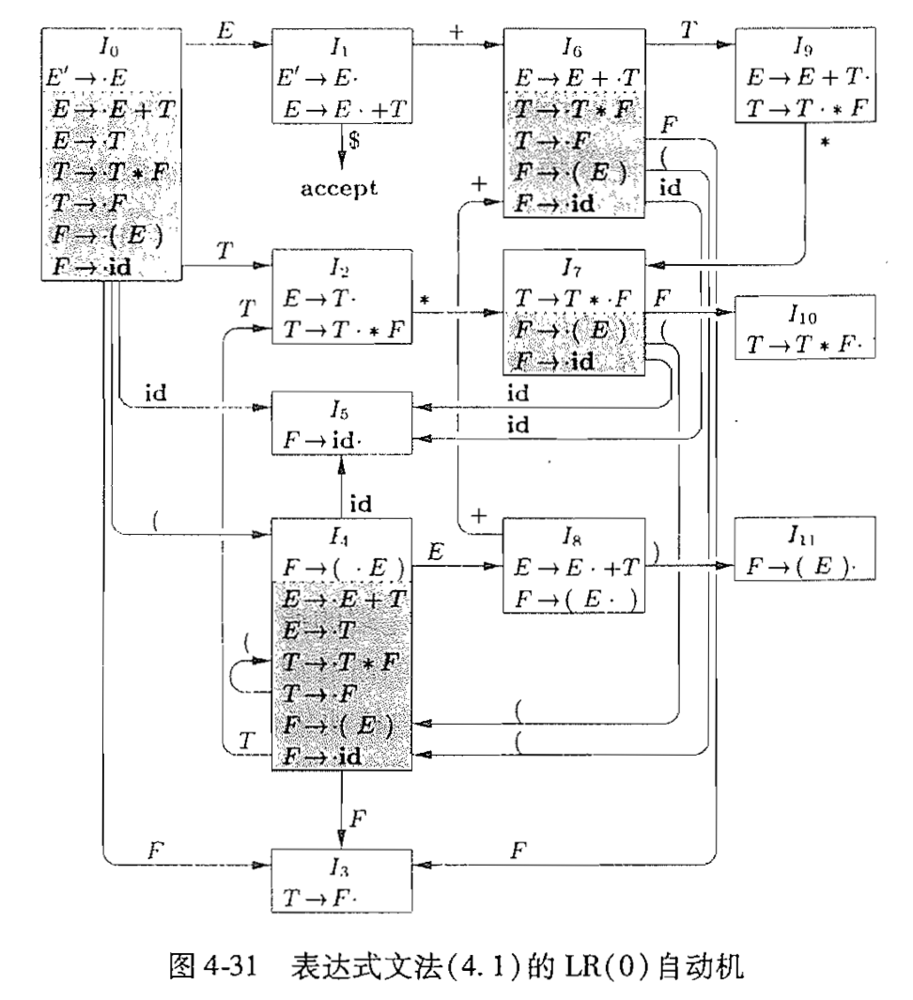

如何判断一个文法是否是LR(0)文法：

1. 画出文法对应的LR(0)自动机
2. 不存在移入归约冲突，则它满足LR(0)文法。比如上图中，状态$I_2$就出现了移入归约冲突。
3. 如果满足LR(0)文法，则它也同时满足SLR, LR(1), LALR文法。


#### 2.6 构造SLR语法分析表

> 这里龙书上会先讲LR(0)的语法分析表构造方法。但其实两者差别不大，并且SLR语法分析方法更完善，因此没有详细记录LR(0)语法分析表的构建方法。

构造语法分析表的SLR构造方法是研究LR语法分析技术的很好的起点。我们把使用这种方法构造得到的语法分析表称为SLR语法分析表，并把使用SLR语法分析表的LR语法分析器称为SLR语法分析器。

**SLR方法以LR(0)项和LR(0)自动机为基础**。也就是说，给定一个文法G，我们通过添加新的开始符号$S'$得到增广文法$G'$，构造出它的规范集族以及GOTO函数。

最后使用下面的算法，我们就可以构造出语法分析表中的ACTION和GOTO条目。它要求我们知道输入文法的**每个非终结符号A的FOLLOW(A)**。

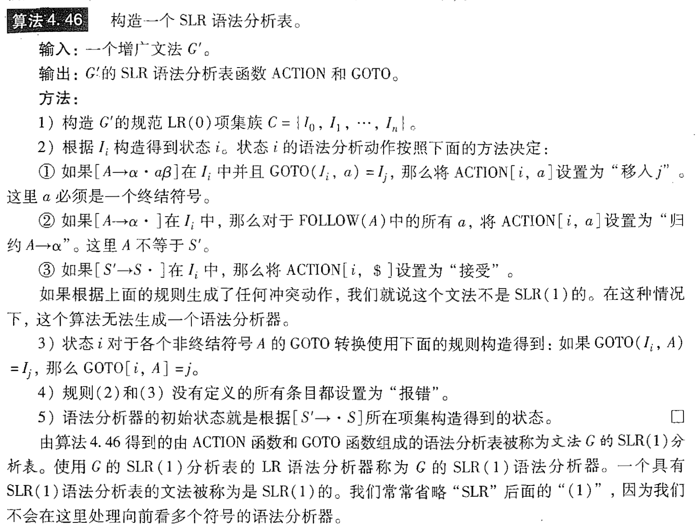

我们为2.5中的自动机构建Action和Goto表：


**LR(0)语法分析表和SLR语法分析表区别：**

1. 错误定位比较晚：LR(0)语法分析表中，对于可以归约的时候，不管下一个输入符号是什么，都进行归约。而SLR对此进行了改进，只允许下一个输入符号是归约后的符号的FOLLOW集中的元素才进行归约，这样就可以提早发现错误，减少错误回溯。
2. 构建的语法分析表可能存在shift-reduce冲突，也就是对应的语法分析表同一项中既可以移进也可以归约。不过在下一节中可以看到，SLR也可能存在sr冲突。
3. SLR和LR(0)分析法基本步骤相同，仅区别于对归约的处理：对于状态i上的项目$X \rightarrow \alpha\cdot$，仅对$y \in FOLLOW(X)$添加$ACTION[i, y]$


**判断是否为SLR文法：**

1. DFA中若存在冲突项（移进归约冲突、归约归约冲突）：

   若$I_n=\{A_1\rightarrow \alpha \cdot a_1 \beta, A_2\rightarrow \alpha\cdot a_2\beta...,B_1\rightarrow \alpha \cdot, B_2\rightarrow \alpha\cdot   \}$

   当$\{a_1, a_2,...,a_m\},Follow(B_1),Follow(B_2)...$不相交时（这种情况归约操作是不会被写入SLR的语法分析表的，这也是SLR和LR(0)的核心区别）

   为SLR文法

举例说明：

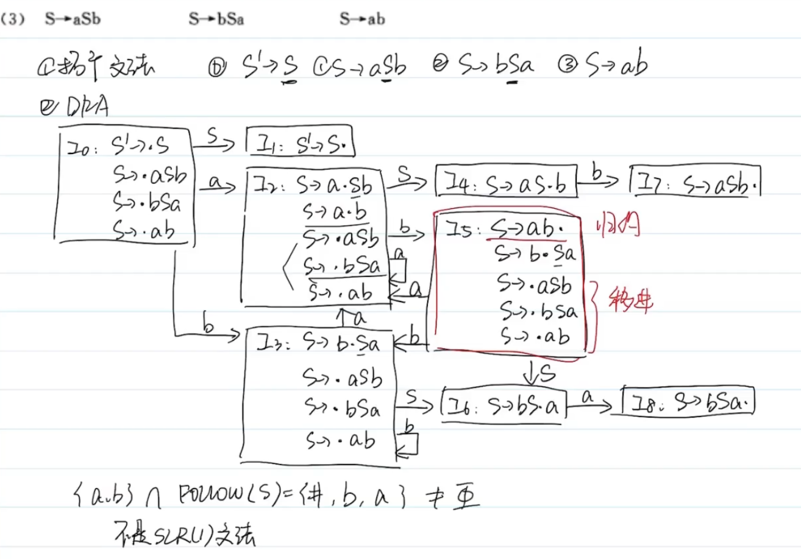


### 3. 更强大的LR语法分析器

对于SLR文法，仍然有可能存在移进-归约冲突，比如下面这种情况：

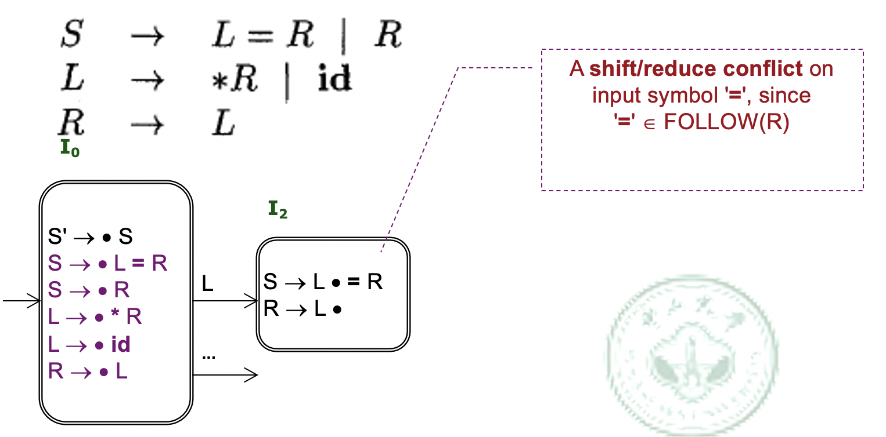

当输入为等号的时候，按照上一节中描述的算法，既可以移入，又可以归约，此时一个位置就会存在两项结果，这样就会出现冲突。事实上，如果进行了归约，文法中没有以$R = \cdot \cdot \cdot$开头的最右句型，因此实际上不应该执行归约。**如果在状态中包含更多的信息，我们就可以排除掉一些这样不正确的归约**。

因此为了解决这个冲突，我们引入LR(1)分析法


#### 3.1 LR(1)项

LR(1)项目为：$[x\rightarrow \alpha \cdot \beta, a]$，它的含义是：

1. $\alpha$在栈顶
2. $\beta$是期待识别的符号
3. 剩余的输入能够匹配$\beta a$
4. a是终端符号或者$\$$的集合，可以理解是可能跟在x后面的输入，一般是$FOLLOW(x)$的子集。这个思想和SLR很相似，SLR也考虑了follow(x)，但LR(1)的目的是让这个follow(x)集合比他更小更精确。

当归约$X\rightarrow \alpha \beta$的时候，a是向前看符号。把$reduce\ X\rightarrow \alpha\beta$填入$ACTION[s,a]$中


#### 3.2 构造LR(1)项集

大部分部分和LR(0)相同，但计算闭包的时候不同：

- 对项$[X\rightarrow \alpha \cdot Y\beta,a]$， 添加$[Y \rightarrow \cdot \gamma, b]$到项目集。其中$b\in FIRST(\beta a)$

举个例子来说，对于下面这个文法：
$$
S' \rightarrow S\\
S \rightarrow L=R\\
S \rightarrow R\\
L\rightarrow *R\\
L\rightarrow id\\\
R\rightarrow L
$$
我们尝试构造0状态的LR(1)项集。下面为构造顺序：
$$
S'\rightarrow \cdot S\ ,\$ \\
S \rightarrow \cdot L=R\ ,\$ \\
S \rightarrow \cdot R\ , \$ \\
L \rightarrow \cdot *R\ ,=\\
L \rightarrow \cdot id\ ,=\\
R \rightarrow \cdot L \ ,\$ \\
L \rightarrow \cdot *R\ ,\$\\
L \rightarrow \cdot id\ ,\$
$$
拿第四条举例，因为第二条中有$\cdot L$，因此需要引入L的闭包，将L在左部的产生式引入。接着因为第二条式子L后面有 $=R\$$ 我们需要求的 $FIRST(=R\$)$ ，因此得到$=$

注意在倒数第三行的时候因为又引入了新的点号后的$L$，因此还需要重新计算一次$L$。

更多的DFA图如下：

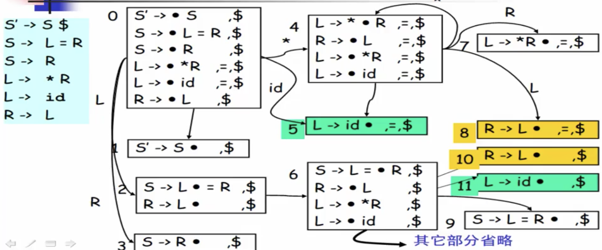


**如何判断一个文法是不是满足LR(1)文法：**

- 构造带向前搜索符的DFA，无归约归约冲突。
- LR(1)文法是不存在移进归约冲突的，只需要判断归约归约冲突。
- 归约归约冲突判断方式是：
  - 一个项目中有两个不同的归约式，并且这两个归约对应的产生式的左部的FOLLOW集合相交，则它们就会出现归约冲突。通俗的说就是对于相交部分的符号，两者都可以归约。


**构造LR(1)分析表**：

类似SLR的方法，但是归约项不是按照FOLLOW(A)填写，而是按照向前搜索符填写。


**例题说明：**

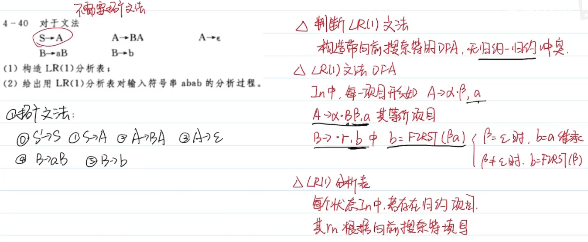


画出DFA可以发现不存在归约归约冲突，因此是LR(1)文法。下面绘制LR(1)分析表：


#### 3.3 LALR分析算法

观察上面构造的自动机我们可以发现，状态5和状态11，状态8和状态10其实是很接近的，我们可以通过合并类似的项目集来简化表的大小。这就是LALR的分析方法。

不过这也可能出现副作用，比如导致出现一些sr的冲突。合并需要把ACTION、GOTO表进行调整，自动机上的连边也需要改变。


**判断LALR(1)文法：**

- 合并同心集（产生式相同，向前搜索符不同）后无归约归约冲突


**对于这么多的LR分析，它们的语法分析能力有以下的排序：**

$LR(0) \lt SLR \lt LALR(1) \lt LR(1)\lt$无二义性

